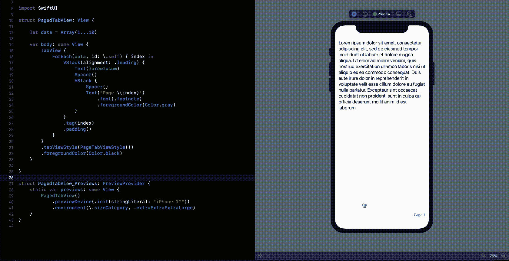
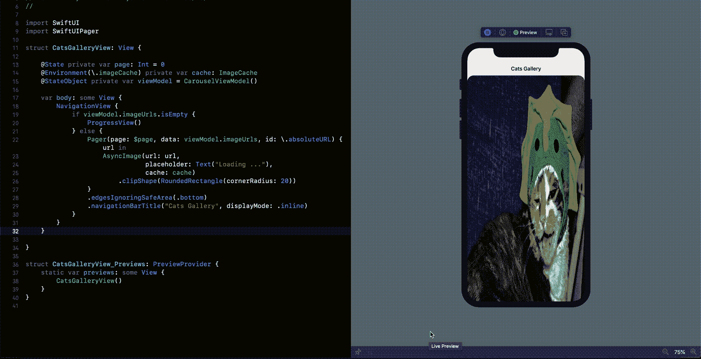
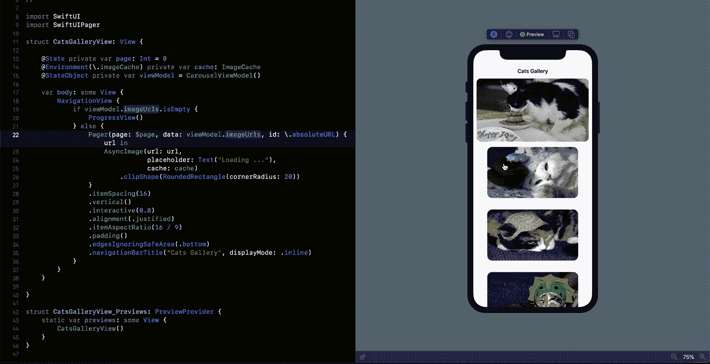
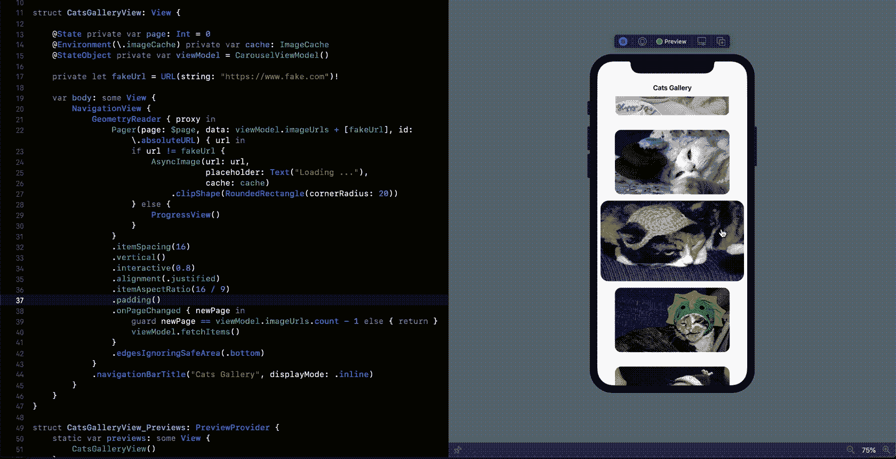
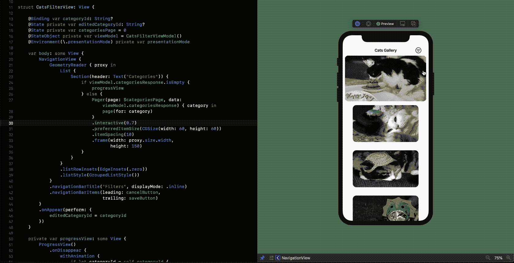
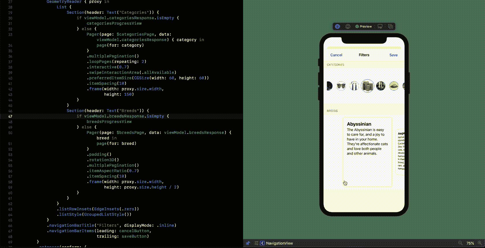
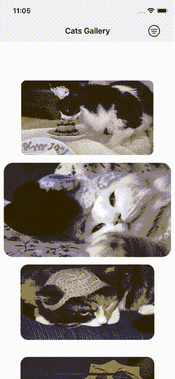

# SwiftUI 中的分页滚动—领先一步

> 原文：<https://betterprogramming.pub/paged-scroll-in-swiftui-a-step-ahead-c6a5f74f9924>

## 100%用 SwiftUI 代码编写的寻呼机:从垂直寻呼机和多页分页到传送带

# 介绍

SwiftUI 2.0 来了！继 WWDC20 之后，iOS 14 中宣布了大量新的 API 和功能。在仅仅存在一年后，苹果已经押注于这个框架来支持其新的 iOS 版本的主要功能，如小部件和应用程序剪辑。这给了开发人员我们一直在寻找的机会:在我们的生产代码中开始实现 SwiftUI 视图的借口。

在 iOS 14 中，`TabView`新增了一个新的修改器`tabViewStyle`和一个`PageTabViewStyle`。这是 SwiftUI 中最接近原生分页器的。分页是水平的、单页的，并且元素占据其容器框架的 100%:

[https://gist . github . com/fermoya/9 BDB 04117 BC 88863 c 273 bb 7645 f 69636](https://gist.github.com/fermoya/9bdb04117bc88863c273bb7645f69636)

这在某些情况下很好，但是对于更高级的行为呢？如果我们在第三页出现时执行某种操作呢？我们可以部分显示侧元素吗？有了 [SwiftUIPager](https://github.com/fermoya/SwiftUIPager) ，所有这一切都成为可能。

在接下来的几节中，我将向您介绍 [SwiftUIPager](https://github.com/fermoya/SwiftUIPager) 并利用它的一些潜力。我们将建立一个应用程序来帮助我选择一只猫。我已经创建了一个存储库来存储最终结果。此外，我将分享图片标题中的要点链接。

# 基本页面:猫图片库

让我们用 SwiftUIPager 创建一个简单的分页滚动。你只需要使用你最喜欢的软件包管理器，并按照安装说明。也支持手动安装。

 [## fermoya/SwiftUIPager

### SwiftUIPager 提供了一个用 SwiftUI 本机组件构建的 Pager 组件。寻呼机是一个视图，它呈现一个可滚动的…

github.com](https://github.com/fermoya/SwiftUIPager) 

***注:*** *虽然本教程是用 Xcode 12b3 编写的，但是 SwiftUIPager 支持 iOS 13+。如果您的应用支持较低的 iOS 版本，请参见* [*旧版安装指南*](https://github.com/fermoya/SwiftUIPager/blob/master/Documentation/Legacy.md) *。*

我正在使用`Pager`包装一个`AsynImage`集合，以显示来自[cata pi](https://thecatapi.com/)的猫图像:

[https://gist . github . com/fermoya/68 D5 E4 bb 8889802 fa 16 FD 4a 293 F3 F3 e 8](https://gist.github.com/fermoya/68d5e4bb8889802fa16fd4a293f3f3e8)

就这样，我们成功地实现了与使用`TabView`相同的行为。然而，SwiftUIPager 提供了更多。

# 定制`Pager`

让我们稍微定制一下图库:

[https://gist . github . com/fermoya/11d 417209 e 5413 b 17 Fe 505 c 67d 426 b 08](https://gist.github.com/fermoya/11d417209e5413b17fe505c67d426b08)

这里发生了什么事？：

*   `vertical`将`Pager`改造成垂直寻呼机。
*   `interactive`给没有聚焦的页面添加漂亮的缩放效果。
*   `itemSpacing`在元素之间添加一些空间，`itemAspectRatio`修改页面的大小。
*   `padding`在不可滚动轴上插入内容。
*   `alignment(.justified)`保持页面在可滚动区内居中。

# OnPageChanged

你注意到这个图片库只有五页吗？这并不能帮助我下定决心，我不能仅仅通过看五张图片来选择合适的猫！这是因为 CatAPI 搜索端点是分页的，我的`ViewModel`每页只请求五个元素。我们如何得到页面转换的通知？幸运的是，`Pager`带有一个修饰符`onPageChanged`，当一个新页面获得焦点时执行一个动作:

[https://gist . github . com/fermoya/abb ca 6 A8 b 6 fa 08d 58 FD 5 Fe 049468 D1 C1](https://gist.github.com/fermoya/abbca6a8b6fa08d58fd5fe049468d1c1)

我在这里使用`onPageChanged`请求我的`ViewModel`在最后一个项目被聚焦时获取更多的项目。

# CatsFilters:多重分页

我的画廊展示了太多的猫，我似乎不能决定去哪一个。我需要能够以某种方式过滤它们。CatAPI 提供了品种和类别查询参数来过滤结果，所以我将创建一个新的`View`来过滤我的猫，首先是图片类别。正如您所料，SwiftUIPager 在这里也会有很大的帮助。

[https://gist . github . com/fermoya/be 3037208219 ee 997 AEA 61 ef 961052 F5](https://gist.github.com/fermoya/be3037208219ee997aea61ef961052f5)

太棒了。修改器类似于我们之前看到的，但是在这里我使用`preferredItemSize`来设置页面的固定大小。我的新寻呼机显示很漂亮，但我发现了一些问题。让这么小的元素滚动很难，单分页看起来也不怎么样。此外，类别的数量非常有限，以缩略图的形式显示并不像人们预期的那样好。如果我们把`Pager`变成一个旋转木马会怎么样？

这是我们要做的:

*   `multiplePagination`会让`Pager`一次滚动多个元素。
*   `swipeInteractionArea(.allAvailable)`会让`Pager`知道不仅仅是页面，整个可滚动区都是可点击的。
*   将给我们带来我们正在寻找的旋转木马效果。在这里，我选择重复元素两次。这意味着`Pager`将把第二批条目连接到初始化时传递的原始数组，从而允许进行分页。

[https://gist . github . com/fermoya/2b 41301 da 393 D4 e68 e 715 b 4320 ce 16 e 4](https://gist.github.com/fermoya/2b41301da393d4e68e715b4320ce16e4)

# 过滤品种:旋转 3D

最后，我想更具体地搜索正确的图像，所以我们将添加一个新的过滤器——品种。在这种情况下，我将介绍 SwiftUIPager 中的另一个内置动画:`rotation3D`。使用类似的代码和这个修饰符，我们可以显示一个新的`Pager`来包装可用的选项:

[https://gist . github . com/fermoya/845 ca 38 ad 7 cc 276 DD 7c 223 a9d 86469 ff](https://gist.github.com/fermoya/845ca38ad7cc276dd7c223a9d86469ff)

# 最终测试

让我们在一个设备上运行这个程序，看看`Pager`的运行情况:

对设备的最终测试

# 结论

[SwiftUIPager](https://github.com/fermoya/SwiftUIPager) 为 SwiftUI 提供了一个可靠的分页器，它附带了一些修饰符，使它更加吸引人。我们已经在本教程中介绍了其中的一些:

*   垂直寻呼机
*   按需请求更多项目
*   互动元素
*   多重分页
*   旋转木马
*   旋转 3D 效果

但是还有很多。剩下的就看你的了。