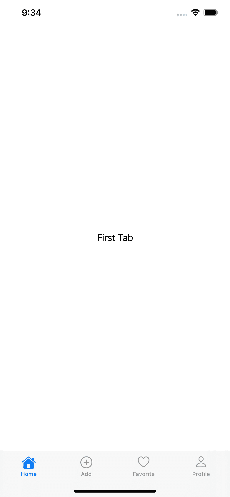
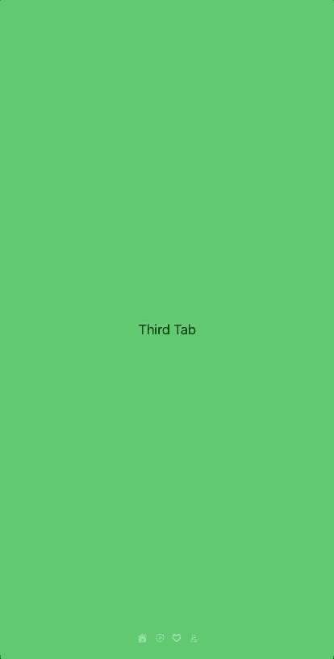
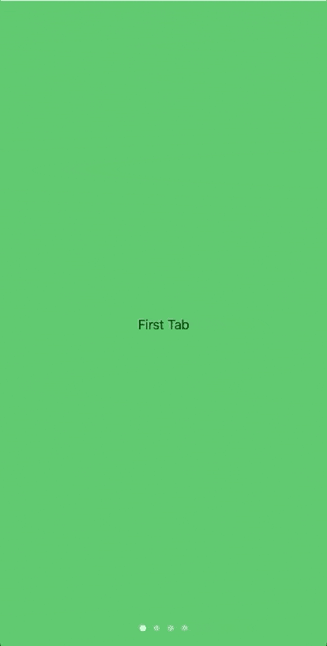
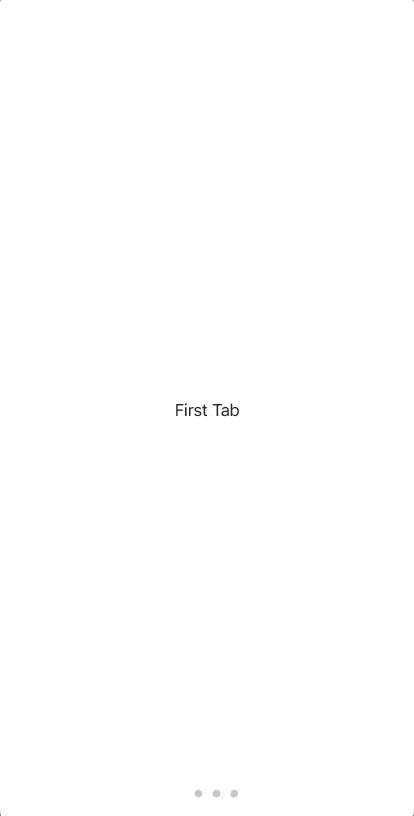

# SwiftUI 中的 PageTabViewStyle

> 原文：<https://betterprogramming.pub/pagetabviewstyle-in-swiftui-7a2aba16e439>

## 改变你的应用中的标签


查尔斯·德鲁维奥在 [Unsplash](https://unsplash.com?utm_source=medium&utm_medium=referral) 上拍摄的照片。

在最近的 WWDC 2020 上，苹果为`TabView`引入了一种叫做`PageTabViewStyle`的新风格。这相当于水平分页滚动，通常用于 onboarding 屏幕。

> *`*TabViewStyle*`*实现了分页滚动* `*TabView*` *—* [*苹果文档*](https://developer.apple.com/documentation/swiftui/pagetabviewstyle)*

# *先决条件*

*要学习本教程，您需要了解以下方面的一些基本知识:*

*   *迅速发生的*
*   *至少 Xcode 12+*

**注意:这只支持 iOS 14+。**

# *PageTabViewStyle 入门*

*让我们在`TabView`上快速设置四个标签，当选择时显示填充图像，当未选择时显示未填充图像。*

*为此，您需要有一个状态来知道选择了什么:*

```
*@State private var selected = 0*
```

*这样，默认选择的选项卡总是`0`，您可以根据自己的喜好进行更改:*

**

*一旦你设置好了所有这些，你就可以用一个简单的附加修饰符来实现水平页面滚动了。在`TabView`的末尾增加`.tabViewStyle(PageTabViewStyle())`:*

```
*TabView() {
..
..
}.tabViewStyle(PageTabViewStyle())*
```

*您的选项卡现在应该可以水平滚动了。*

**

*没有页面指示器，水平页面滚动是不完整的。事实上，页面指示器是可见的，但它是白色的。因为背景色也是白色，所以看不到。*

*有多种方法可以解决这个问题，要么设置不同的背景颜色，要么使用附加参数。*

*通过将背景颜色设置为绿色，您现在可以看到选项卡图像作为页面指示器。*

**

*您可以选择默认页面指示器。只需注释掉标签的图像，它就会显示一个默认的页面指示器:*

**

*另一种方法是为`TabView`使用额外的修改器。这样，你仍然可以使用白色背景:*

```
*.indexViewStyle(PageIndexViewStyle(backgroundDisplayMode: .always))*
```

**

*谁会想到 SwiftUI 会让这个过程变得更加容易和简单呢？这绝对值得庆祝。*