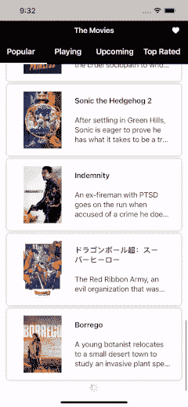

# Kotlin 多平台移动设备中的分页

> 原文：<https://betterprogramming.pub/pagination-in-kotlin-multiplatform-mobile-a96f21e71668>

## 使用这些策略创建加载速度更快的页面

照片由[弗朗西斯科](https://unsplash.com/@detpho?utm_source=medium&utm_medium=referral)在 [Unsplash](https://unsplash.com?utm_source=medium&utm_medium=referral) 拍摄

在一个性能良好的应用程序中，分页总是不可避免的，这不仅是为了高效的数据加载，也是为了产生更好的用户体验。通过将数据分成独立的页面，应用程序将加载得更快，用户也将更快地获得数据。这将比需要加载所有数据的非分页应用程序有更好的转化率。

当谈到一个问题时，

> 为 Kotlin 多平台移动(KMM)项目的声明式构造的 UI 进行分页的简单方法是什么？

可能有各种各样的答案，但我们没有关于实用性和可靠性的确切答案。阅读这篇文章会让你探索你可能期待的答案。

# 要求

建议您了解 KMM 项目结构。如果你还不熟悉，请先阅读这里的。还希望熟悉 Android (Jetpack Compose)和 iOS (SwiftUI)平台的声明式 UI。现在让我们从共享模块开始。

# 共享的

由于 KMM 项目是模块化的，我们将从[共享](https://kotlinlang.org/docs/multiplatform-mobile-understand-project-structure.html#root-project)模块开始。首先，我们需要一个由 API 响应组成的数据类。分页 API 响应通常包含当前显示的页面、总页数和消息。下面是一个例子:

API 响应

在上面的数据类中，`page`是当前显示的页面。同时，`message`是仅在发生错误时才存在的服务器状态消息。此外，我们也有`totalPages`显示我们应该加载的页数。

为了更好地使用 API 获取结果，建议我们将结果包装在一个状态中。以下是该州的例子:

列表状态

上面的状态将 API 响应和错误封装在一个共享模块中，因此我们只需要在我们的共享视图模型中创建一个函数，它可以返回两种可能的结果(API 响应或错误发生)。现在，让我们看看共享视图模型如何调用 API。代码如下:

共享视图模型类

在上面的`MovieListSharedViewModel`中，我们没有应用 try-catch 函数，因为它已经在存储库中进行了处理，所以上面的`loadMovie`函数将只调用结果。这是为了让我们在 iOS 工作区中更高效地调用函数。参考[此处](https://github.com/annasta13/The-Movies/blob/f45a651604d3104a42b8bbabaf7f18f59ecc99e1/shared/src/commonMain/kotlin/com/habileducation/themovie/util/FlowHelper.kt)了解更多信息。

我们现在已经完成了共享模块的工作，而不考虑用例以及存储库。我们现在可以进入我们的 Android 模块，开始为 Android 平台实现分页。

# 机器人

Android 平台的声明式 UI 可以使用 [Jetpack Compose](https://developer.android.com/jetpack/compose?gclid=CjwKCAjwo_KXBhAaEiwA2RZ8hPj3kxONiuQB6FMLzKwiwXVzaO7JVpumr2TsraYs3hDvcVx4wKOLzxoCUdQQAvD_BwE&gclsrc=aw.ds) 来实现。在 Jetpack Compose 中建立分页非常简单。我们可以用它的[分页库](https://developer.android.com/jetpack/androidx/releases/paging\)，很容易实现。首先，向 Android 应用程序 Gradle 添加以下依赖项。

`implementation(“androidx.paging:paging-compose:1.0.0-alpha10”)`

现在让我们制作一个数据分页源，在我们的`view`模型中调用:

数据分页源

在`load`中，上面的函数调用了我们之前在共享`view`模型中制作的函数。为了收集`sharedViewModel.loadMovie`的返回结果，我们使用`.last()`，因为`loadMovie`函数被流包装。最后，为了创建可重用的结果条件，返回逻辑在下面的`PagingHelper`类中处理:

寻呼助手

实际上，上面的`PagingHelper`类被创建来拥有一个可重用的分页源加载结果的返回函数，这样一旦我们有了多个分页源，我们就不需要重新创建返回条件。

下一步是创建我们的列表视图模型，它将保存我们的分页数据列表，以便它知道应用程序的生命周期。

Android 列表视图模型

在上面的例子中，列表是直接初始化的。但是，如果我们希望在视图模型初始化时让它为空，我们可以将其设置为`var list: Flow<PagingData<Movie>> = flowOf(PagingData.empty())`。这种初始化也使我们能够根据需要修改列表。

最后，在我们的可组合函数中，我们可以通过用`viewModel.list.collectAsLazyPagingItems()`收集视图模型中的列表来调用列表。要了解它是如何实现的，请查看下面的代码:

但是，列表中有`[CombinedLoadStates](https://developer.android.com/reference/kotlin/androidx/paging/CombinedLoadStates)` 可以被调用来处理错误。同样，为了拥有一个可重用的分页视图来保存它的错误状态，我创建了一个定制的分页视图容器，如下所示:

最后，我们现在可以尝试我们的 Android 应用程序。下面是我们运行代码的截图:

Android 分页预览

# ios

我们已经在 Android 中实现了分页，现在是时候将它转换为 Xcode 以在 iOS 中实现它了。让我们从创建视图模型或可观察类开始，它将在视图配置中用作状态。与 Android 类似，视图模型至少应该有一个数据列表、一个当前显示页面和一个 throwable 对象，在本例中，我直接将其设置为错误消息。视图模型应该如下所示:

iOS 列表视图模型

在上面的例子中，我们有一个名为`loadingPage`的加载状态，一旦我们需要在 UI 配置中使用它，就可以使用它。此外，一旦我们从服务器收到 IOException 或 status 消息，也会有一个错误消息集。作为一条附加信息，`sharedViewModel`在 KMM 项目的 iOS main 中配置的`MovieModule`中初始化。参考[此处](https://github.com/annasta13/The-Movies/blob/main/shared/src/iosMain/kotlin/com/habileducation/themovie/di/MovieModule.kt)了解更多信息。

最后，这里最重要的事情是我们初始化列表的方式不同于 Android 视图模型，因为我们需要使用`append`函数来添加列表。这就是我们需要的所有视图模型配置。我们现在可以开始创建我们的 UI 函数了。

在 SwiftUI 中显示分页数据列表时，我们必须使用 LazyVStack 才能有更好的性能。此外，我们需要显示一个基于视图模型中的`isLastPage`状态的加载视图。这用于指示滚动状态已经到达最后一项。

从上面的代码中，我们可以对视图模型在列表加载视图出现时如何调用`loadPage`函数做一个简单的假设。但是，一旦我们到达了最后一页，加载视图就不会出现，视图模型也不会调用`loadPage`函数。

接下来呢？是的，一切都完成了，我们现在可以运行应用程序。我们应该让我们的应用程序显示如下分页数据:

iOS 分页预览

# 结论

当然，当在多平台项目上工作时，我们期望的是有一个二合一的代码来提高效率。在这个项目中，我们在共享电影列表视图模型中应用了加载页面功能，我们可以在 Android 视图模型和 iOS 视图模型中初始化的 Android 分页数据源中使用该功能。然而，我们只讨论分页实现所需的核心功能。

要有更完整的实现，请参考下面的真实项目:

 [## GitHub - annasta13/The-Movies:干净的架构 Kotlin 多平台移动(KMM)与 Android…

### 里面有什么？-Jetpack Compose-Hilt-Ktor-Android 仪器测试-分页-单元测试- SQLDelight…

github.com](https://github.com/annasta13/The-Movies.git)