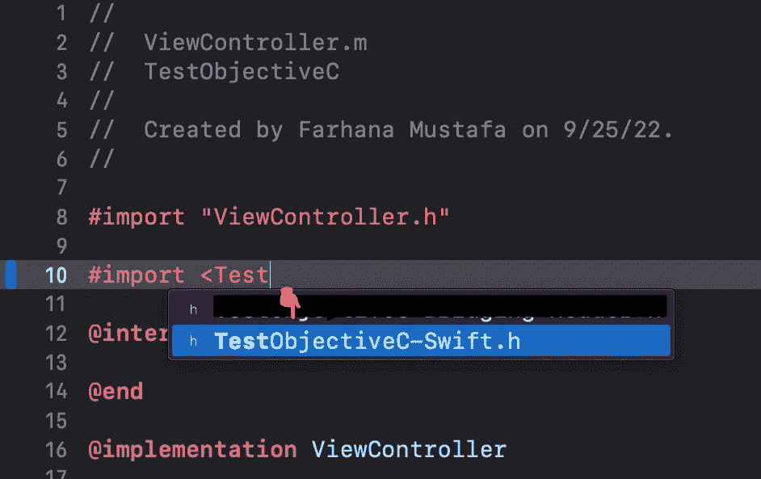
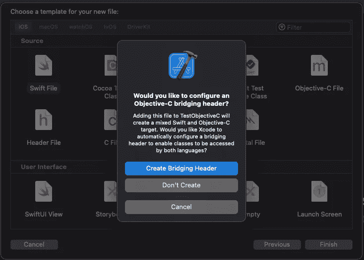
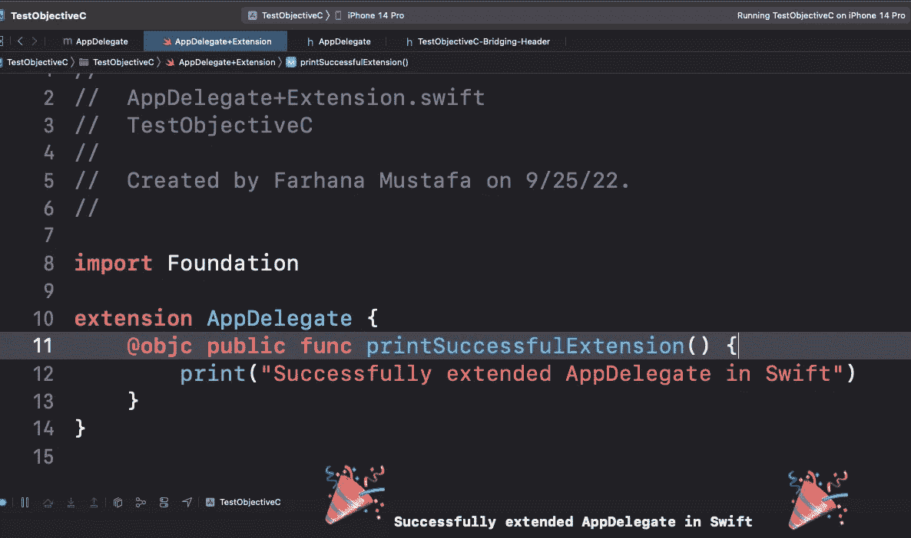

# 轻松的 Objective-C 和 Swift 互操作性

> 原文：<https://betterprogramming.pub/painless-objective-c-and-swift-interoperability-d60318ef0d2e>

## 了解向 Objective-C 公开 Swift 代码的最佳实践


[Med Badr Chemmaoui](https://unsplash.com/es/@medbadrc?utm_source=medium&utm_medium=referral) 在 [Unsplash](https://unsplash.com?utm_source=medium&utm_medium=referral) 上拍摄的照片

目标 C 活得好好的。许多科技公司的 iOS 产品中仍然有很大一部分是 Objective-C。老实说，这让我不再去这些地方采访，纯粹是因为固执。在我的 iOS 职业生涯中，90%的时间都在与 Swift 合作，我为什么要倒退呢？

但是，在你的 iOS 之路中碰到 Objective-C 是不可避免的。在本帖中，我们将介绍一些如何尽可能简单地将 Swift 功能集成到 Objective-C 中的最佳实践。

# 什么是目标 Swift 互操作性

这意味着让 Swift 和 Objective-C 无缝地协同工作。本帖将重点关注向 Objective-C 公开 Swift 代码。

# 为什么还有人用 Objective-C？

人们有理由解释为什么他们的应用程序仍然使用 Objective-C:

*   没有足够的理由将应用程序迁移到 Swift
*   这个应用依赖于一个 C++库，你需要 Objective-C 来使用这个库
*   遗留项目需要继续下去，等等。

基本上，Objective-C 将仍然存在，直到它被弃用。事实上，苹果至今仍在使用 Objective-C。

# 成功实现目标 C 和 Swift 互操作性的最佳实践

我用 Objective-C 语言创建了一个示例 iOS 应用程序。要通过控制台查看这些最佳实践，您可以在这里查看[我的 GitHub repo】。](https://github.com/fmustafa17/TestObjectiveC)

## 导入 Swift 桥接文件

如果您尝试在您的实现文件中使用 Swift 函数而不导入，那么 Xcode 将生成一个构建错误，如下所示:

```
❌ Receiver ‘ViewModel’ for instance message is a forward declaration
```

这个错误消息一点帮助都没有。因此，如果我们需要在 Objective-C 类中调用 Swift 函数，导入 Swift 桥接文件是绝对必要的。没有这个，Obj-C 不会承认你的 Swift 函数的存在。您可以从您的实现文件内部的类或结构中使用 Swift 函数。导入 Swift 桥接文件的格式如下:

```
#import <YourProjectTarget-Swift.h>
```

幸运的是，XCode 使用 Objective-C 生成自动完成。当您开始键入导入时，Swift 桥接文件应该会显示为一个选项。



自动完成为我的目标生成 Swift 桥接文件

请确保使用右尖括号关闭此导入。

要使用用 Swift 编写的第三方库，您可以遵循相同的模式在您的实现中导入 Swift 代码(假设他们已经将 Objective-C 支持添加到他们的公共类中)。

```
#import <ThirdPartyTarget/ThirdPartyTarget-Swift.h>
```

## 为您的函数添加 Objective-C 支持

如果您想向 Objective-C 公开一个或多个特定的函数，请在这些函数前面加上属性`@objc`。

Swift 类应该继承自`NSObject`。不幸的是，如果不遵守这个协议，您将会看到我们前面讨论过的同样无用的错误消息。

下面是我们如何在实现文件中使用这个函数:

如果`ViewModel`类有没有`@objc`属性的附加函数，我将不能在`ViewController.m`内部使用它们。

## 向您的类添加 Objective-C 支持

如果您需要使用的函数数量很少，那么`@objc`属性非常适合。但是随着需求的变化和业务逻辑的增长，不断重复这个属性可能会很麻烦。为了向 Objective-C 公开一个类中的所有函数，在声明你的类之前加上前缀`@objcMembers`。

你的类也应该继承自`NSObject`。

## 用 Swift 扩展 Objective-C 文件

将 Swift 添加到您的项目中的一个好方法是扩展现有的 Objective-C 类。这样做的缺点是不能在扩展文件中添加全局属性。所以这个做法就看你自己的判断了。如果您的用例很简单，请使用扩展。

为了成功地扩展您的实现文件，在您的`Bridging-Header`文件中导入类头文件。

要实现这一点，在 Swift 中创建一个新文件，并适当命名。然后开始实现扩展。

如果您还没有一个桥接头，如果它不能自动生成，请创建一个。



然后，导入类头文件。如果没有这一步，您的扩展文件将无法被识别。

构建并运行您的应用程序，您已经成功地在 Swift 中扩展了您的实施文件！



感谢阅读！更多 iOS 开发内容，一定要关注我的 Medium。

# 参考

*   [苹果文档:将 Swift 导入 Objective-C](https://developer.apple.com/documentation/swift/importing-swift-into-objective-c)
*   [利用 Swift 进行黑客攻击:针对 Swift 开发人员的 Objective-C](https://www.hackingwithswift.com/store/objective-c-for-swift-developers)