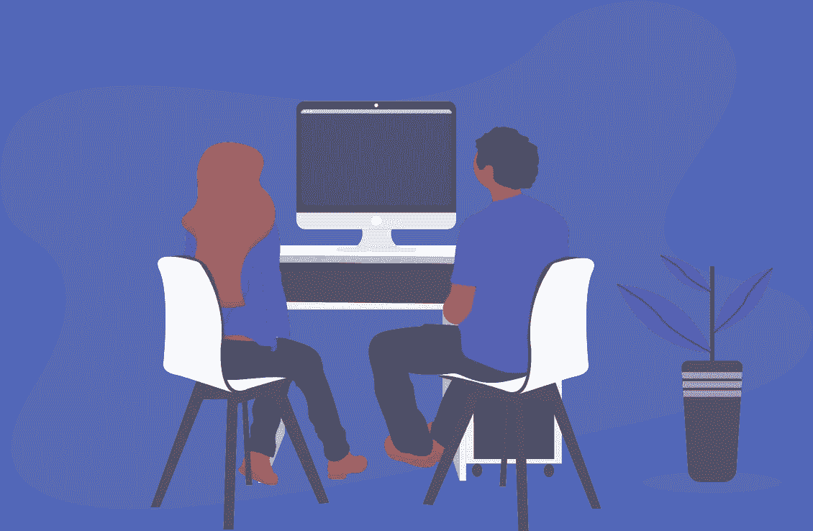
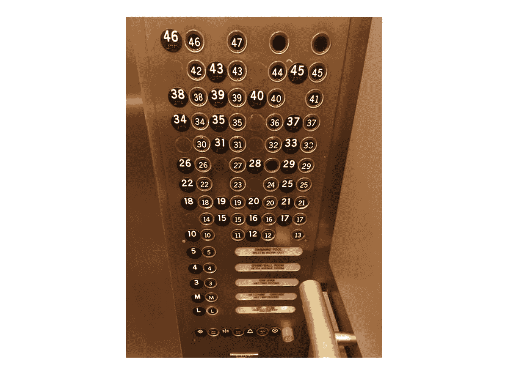

# 为什么结对编程如此神奇

> 原文：<https://betterprogramming.pub/pair-programming-392eece7d341>

## 结对编写代码的角色

Geran de Klerk 在 [Unsplash](https://unsplash.com/s/photos/pair?utm_source=unsplash&utm_medium=referral&utm_content=creditCopyText) 上拍摄的照片

如果你在工程领域工作，你一定听说过这个术语。尤其是在程序员中。如果你是一个程序员，以前从未听说过这个术语，没什么好担心的。但是你越早熟悉这个概念越好。在这篇文章中，我将回答这个问题，*“什么是结对编程？”*、所涉及的常见步骤以及两人一组的角色。

我们先来了解一下“结对编程”这个术语是什么意思。

# **什么是结对编程？**

简单地说，结对编程是一种敏捷技术，两个程序员在一个工作站上处理一个问题。

## 工作站要求:

1.  一台电脑
2.  两个键盘
3.  两只老鼠
4.  一台显示器或两台镜像显示器

写代码不是一切，理解问题才是。

## 解决问题的艺术

正如理查德·费曼的技巧所指出的，大声思考并向某人解释问题或解决方案是解决问题最简单的方法。解释越简单，理解越好。

一次解决一个个小问题，然后实现一个个更小的里程碑，这是解决问题的关键。因此，问题首先被分解成微小的可实现的任务。

一般来说，软件工程过程鼓励程序员问尽可能多的问题。何时、为何、如何、何地等。有些事情是可以假设的——比如需要设置的限制，最终解决方案需要能够通过大多数边缘情况的充分证明。解决方案应该确保易于理解、可扩展性和长期可维护性。为了编写成功、失败和重要边缘案例的测试，人们应该知道这些案例是什么，这些案例可以通过提出好的问题来发现。

程序员最常犯的错误是匆忙解决问题。创作过程需要时间和反复。尽量避免这种错误，花足够的时间去理解手头的问题，这样你就不会以错误的方式解决错误的问题。

结对编程技术涉及两个人在一个代码块上工作，一个人驱动流程并提供步骤的高级鸟瞰图，称为*导航器*。对方打出代码并负责语义，称为 D *河*。

## 涉及的步骤:

1.  一旦完全理解了问题，两人会把它分解成更小的独立任务，这些任务可以在相对较短的时间内完成。
2.  这两个人应该对代码库中采用的标准实践和惯例有一个基本的了解，这些必须写在一个文档中。我遵循的标准实践列表在这里列出[。](https://medium.com/@badrobot/android-developer-good-practices-kotlin-5efa6f54fb38)
3.  两人应该就何时休息达成一致。如果可能，在开始任务之前设置一个计时器。最受欢迎的方法是番茄工作法，这是确保一双鞋不会因为长时间的高强度工作而磨损的理想方法。
4.  如果测试驱动开发在你的工作场所是一种常见的实践，角色可以在每次 Pomodoro 会议后使用[乒乓](https://martinfowler.com/articles/on-pair-programming.html#PingPong)方法来交换角色。

现在，让我们了解这对搭档的角色。

## 导航员的角色:

领航员负责“战术”思维模式。导航员构思并分享想法和意见，就驾驶员的思维过程和代码背后的推理提出好的问题。

导航员是一个旁观者，他能立即发现并指出任何语法错误和拼写错误。领航员也必须让彼此保持在正确的轨道上。以确保司机不会迷失在兔子洞里，因为他正全神贯注地担心细节。多一双眼睛来检查现实总是有帮助的。

作为实时审核者，导航员有助于降低流程中同行审核所需的复杂性和工作量。任何潜在的 bug 都可以更快地被发现，代码可以立即被修改，从而提高代码的质量。

导航员做笔记，并通过大声说出和构思所涉及的算法来参与高层次的问题解决。

## 驾驶员的角色:

驱动程序的角色听起来很简单，但是编码不仅仅是在键盘上敲东西。编写代码需要深入的、不可分割的、专注的思维模式。更不用说这份工作要求很高，需要强大的脑力来解决代码形式的复杂问题。因此，该过程涉及多个步骤，但驾驶员的工作是专注于手头的微小任务。

驾驶员只需要首先大声思考他们在完成这项任务时的思维过程。一旦就解决方案达成一致，最后一步就是写出代码。当遇到障碍或故障时，双方决定如何前进。

有时当你陷入僵局时，最好在重新考虑问题之前休息一下，沉思，去跑步，小睡一会儿，或者玩一会儿游戏。

我想对你们说:

*说到编程，一对大于两对。*