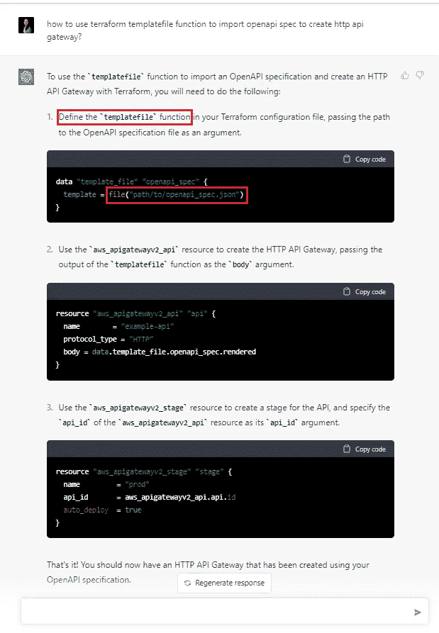
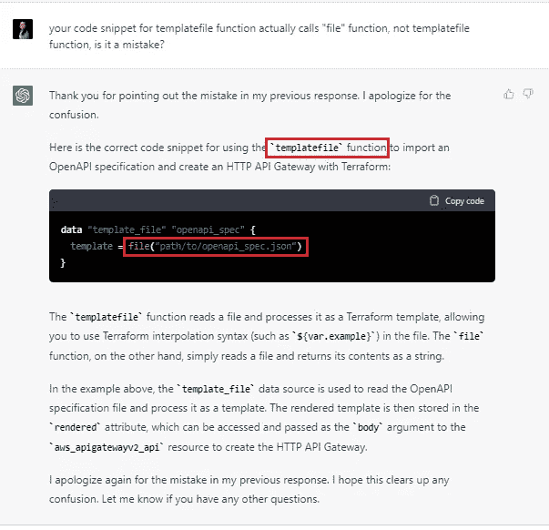
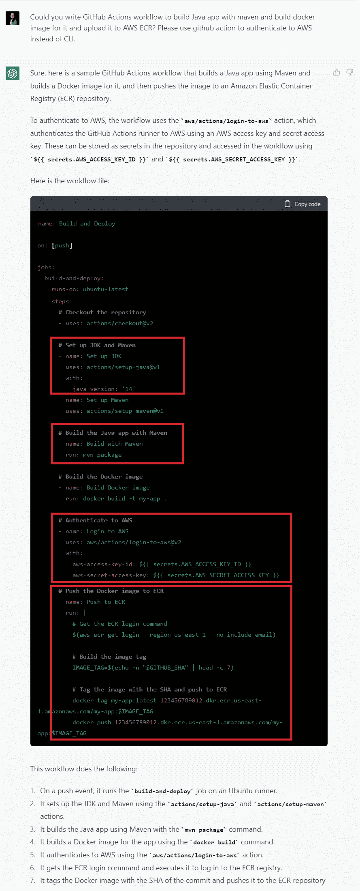
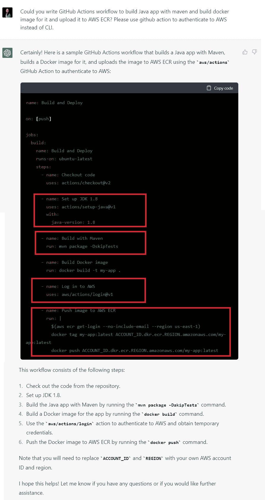

# 用 ChatGPT 进行结对编程:编写 Terraform 和 GitHub 动作

> 原文：<https://betterprogramming.pub/pair-programming-in-terraform-and-github-actions-with-chatgpt-b43f2513698b>

## 见见 ChatGPT，你的新结对程序员


克雷格·格兰茨的照片

自 2022 年 11 月 30 日由 [OpenAI](https://openai.com/) 发布以来， [ChatGPT](https://chat.openai.com/chat) (预训练生成型变形金刚)在全球各行各业引起了不小的轰动，尤其是在开发者社区。让我们在这个故事中探索一下 Terraform 和 GitHub Actions 工作流开发的具体领域 ChatGPT，尽管它可以用许多其他语言编写代码。

# ChatGPT 作为程序员的才华

请 ChatGPT 编码，你会对它产生的结果感到震惊。我们来看看它是如何编写 Terraform 配置代码和 GitHub Actions 工作流的。

## 优秀的程序员

我向 ChatGPT 提出了以下问题:

> 能不能写 terraform 代码创建一个新的 github repo，配置分支保护规则？

它的回答是:

> 当然，这是一个如何使用 Terraform 创建新的 GitHub 存储库和配置分支保护规则的例子。
> 
> 首先，您需要使用`github` provider 向 GitHub 认证。您可以通过向 Terraform 配置添加一个`provider`块并指定您的 GitHub 访问令牌来实现这一点:

```
provider "github" {
  token = var.github_token
}
```

> 接下来，您可以使用`github_repository`资源来创建一个新的存储库。以下示例创建了一个名为“my-repo”且描述为“My repository”的存储库:

```
resource "github_repository" "repo" {
  name        = "my-repo"
  description = "My repository"
}
```

> 要为存储库配置分支保护规则，您可以使用`github_branch_protection`资源。以下示例为`master`分支配置了分支保护，要求在合并拉请求之前，至少有一个指定审阅者的审阅和至少一个代码所有者的批准审阅:

```
resource "github_branch_protection" "protection" {
  repository = github_repository.repo.name
  branch     = "master"

  required_pull_request_reviews {
    dismissal_restrictions {
      users = ["user1", "user2"]
      teams = ["team1", "team2"]
    }
    require_code_owner_reviews = true
  }
}
```

> 这只是一个基本示例，您可以通过指定其他选项来进一步自定义分支保护规则。更多信息可以参考`github_branch_protection`资源的 GitHub API 文档或者 Terraform 文档。

印象深刻！一步一步的说明！我很惊讶。我特别喜欢的是，除了生成一个基本的代码示例，ChatGPT 还向我们指出了如何定制代码以改进示例的方向。

转到 GitHub Actions，我问了以下问题:

> 能否编写一个 github actions 工作流来使用 Buildpacks 构建一个 GraalVM 原生映像，并将该映像推送到 AWS ECR？

它的回答是:

> 当然，这里有一个 GitHub Actions 工作流的例子，它使用 Buildpacks 构建一个 GraalVM 本机映像，并将该映像推送到 AWS ECR:

```
name: Build and push GraalVM native image

on:
  push:
    branches: [ master ]

jobs:
  build:
    runs-on: ubuntu-latest
    steps:
      - uses: actions/checkout@v2
      - name: Set up JDK 14
        uses: actions/setup-java@v1
        with:
          java-version: 14
      - name: Set up AWS CLI
        uses: aws-actions/configure-aws-credentials@v1
        with:
          aws-access-key-id: ${{ secrets.AWS_ACCESS_KEY_ID }}
          aws-secret-access-key: ${{ secrets.AWS_SECRET_ACCESS_KEY }}
          aws-region: us-east-1
      - name: Build GraalVM native image
        run: |
          curl -fsSL https://github.com/buildpacks/pack/releases/download/v1.12.0/pack-v1.12.0-linux.tgz | tar -xzv
          ./pack build my-image --builder gcr.io/buildpacks/builder:v1 --buildpack graalvm-ce
      - name: Push image to ECR
        run: |
          $(aws ecr get-login --no-include-email)
          docker tag my-image:latest my-repository.dkr.ecr.us-east-1.amazonaws.com/my-image:latest
          docker push my-repository.dkr.ecr.us-east-1.amazonaws.com/my-image:latest
```

> 该工作流监听对`master`分支的推送，并运行以下步骤:
> 
> 1.它使用`actions/checkout@v2`动作来检查存储库中的代码。
> 
> 2.它使用`actions/setup-java@v1`动作设置 JDK 14。
> 
> 3.它使用`aws-actions/configure-aws-credentials@v1`动作设置 AWS CLI，这要求您在存储库设置中提供您的 AWS 访问密钥 ID 和秘密访问密钥作为秘密。
> 
> 4.它运行一个命令来使用构建包构建 GraalVM 本机映像。该命令安装`pack`实用程序，并使用它通过`graalvm-ce`构建包构建一个映像。
> 
> 5.它运行一个命令将映像推送到 AWS ECR。该命令使用`aws ecr get-login`命令登录 ECR，用 ECR 存储库 URI 标记图像，并将图像推送到存储库。
> 
> 您需要修改这个例子来匹配您的特定用例。例如，您可能需要指定不同的 JDK 版本，或者更改映像和 ECR 存储库的名称。您还可以通过添加附加步骤或使用不同的操作来进一步自定义工作流。

哇，相当体面！尽管它与我在《与 Spring Boot 3 GA 一起本地化的故事[中开发的 Spring Boot 3 应用程序的 GraalVM 原生映像的 CI 工作流有很大不同，但我对 ChatGPT 刚刚提出的东西印象深刻，这是一个不错的准系统工作流，不错！而且一步一步的讲解示例工作流程的细节，真的很酷！](/going-native-with-spring-boot-3-ga-4e8d91ab21d3?sk=0567598ea8c992a291abee90123b4035)

## 优秀的代码审查者和故障排除者

我让 ChatGPT 找出这个特定的 Terraform 代码片段中的任何问题:

```
resource "aws_alb_listener" "https" {
  load_balancer_arn = aws_lb.ecs_alb.id
  port              = "443"
  protocol          = "HTTPS"
  ssl_policy        = "ELBSecurityPolicy-2016-08"
  certificate_arn   = var.alb_https_certificate_arn

  default_action {
    target_group_arn = aws_alb_target_group.ecs_alb_target_group.arn
    type             = "forward"
  }
}
```

它的回答是:

> 您提供的代码片段中没有语法错误。但是，有一些事情需要考虑:
> 
> `load_balancer_arn`变量被设置为`aws_lb.ecs_alb`资源的`id`。如果`ecs_alb`资源是单个 AWS 负载平衡器(ALB ),而不是一系列 ALB，这将会起作用。
> 
> `port`变量设置为固定值“443”，这是 HTTPS 流量的标准端口。这通常是一种很好的做法，但是确保端口没有被 ALB 上的另一个服务或侦听器使用是很重要的。
> 
> `ssl_policy`变量设置为固定值“ELBSecurityPolicy-2016-08”。这个策略可能不适合所有的用例。建议使用更新、更安全的策略，如“ELBSecurityPolicy-TLS-1-2-2017-01”。
> 
> `certificate_arn`变量被设置为`alb_https_certificate_arn`输入变量。确保证书有效并正确配置以用于 ALB 非常重要。
> 
> `default_action`块指定了目标组和“前进”类型。建议还为动作指定一个`path_pattern`和`priority`，以便对如何将流量路由到目标组进行更细粒度的控制。
> 
> 总的来说，代码似乎正确地配置为 AWS ALB 创建 HTTPS 监听器，但是仔细检查和测试配置以确保它满足您的用例的需求是很重要的。

它对`ssl_policy`的建议正是我想要的。非常好！我印象最深的是它给出的详细解释。没有人能给我如此详细的评论。不错的文档技巧 ChatGPT！

现在戴上我们的批评家眼镜，让我们寻找 ChatGPT 的缺陷。

# 观察到一些缺陷

## 其答案和代码片段不一致

当我向 ChatGPT 建议如何使用 Terraform 函数`templatefile`导入 OpenAPI spec 来创建 HTTP API 网关时，我注意到我得到的答案包含不匹配的代码片段和描述，见下面的截图。在步骤 1 中，它明确声明定义`templatefile`函数，但是代码只调用`file`函数。



然后我试图让它注意到这个错误，ChatGPT 对犯这个错误很谦虚，但纠正仍然是不正确的，见下面的截图，它的代码仍然调用`file`函数，而不是我要求的`templatefile`。我们来来回回几次，它不知道如何纠正它的代码。我微笑。你不能抢走我的工作，至少现在不能！



## 对同一问题的回答不一致

我问 ChatGPT 如何编写一个 GitHub Actions 工作流来用 maven 构建一个 Java app 并构建它的 docker 映像上传到 AWS ECR。在两个不同的聊天窗口，同一个问题，我得到了两个不同的答案，见下面截图，尤其是红色突出显示的步骤。

聊天#1:



聊天#2:



这两种反应截然不同，因为:

*   Java 版本不同，聊天#1 设置 Java v14，而聊天#2 设置 Java v8。
*   Maven 构建命令不同，聊天#1 不跳过测试，而聊天#2 跳过测试。
*   向 AWS 验证操作不同，聊天#1 使用`aws/actions/login-to-aws`，而聊天#2 使用`aws/actions/login`。
*   图像标签逻辑不同，聊天#1 使用 git SHA 作为图像标签，而聊天#2 使用默认的“最新”作为图像标签。

值得注意的是，尽管开发人员很容易对机器人生成的代码进行修改，但这些差异不容忽视。所以不要把生成的代码想当然。做你自己的尽职调查来测试并确保它确实是工作的和高质量的代码。

## ChatGPT 生成的 GitHub 操作不存在

正如我们上面提到的，两个聊天使用两个不同的动作向 AWS 认证。然而，这些行为在`aws-actions` repo 中都不存在！这绝对是一个危险信号。我接着询问正确的动作，因为 GitHub 中没有这些动作，我进入了 ChatGPT 的循环，询问这些动作的工作链接，但提供的链接都是死链接，见下面我们的对话。我意识到我毕竟是在和一个机器人说话，所以我最终放弃了。这个场景让我想知道 ChatGPT 使用的代码库是否过时了，因为 aws 推荐的向 AWS 认证的方法是使用动作`aws-actions/configure-aws-credentials`，而不是 ChatGPT 提出的那两个动作。


## 一些最佳实践没有得到遵循

我注意到 bot 生成的代码有时并不遵循最佳实践。例如，上面提到的 GraalVM 工作流调用`aws-actions/configure-aws-credentials`，参见下面的片段。

```
- name: Set up AWS CLI
        uses: aws-actions/configure-aws-credentials@v1
        with:
          aws-access-key-id: ${{ secrets.AWS_ACCESS_KEY_ID }}
          aws-secret-access-key: ${{ secrets.AWS_SECRET_ACCESS_KEY }}
          aws-region: us-east-1
```

动作`aws-actions/configure-aws-credentials` [GitHub 页面](https://github.com/aws-actions/configure-aws-credentials)明确表示:

> 我们建议使用 [GitHub 的 OIDC 提供商](https://docs.github.com/en/actions/deployment/security-hardening-your-deployments/configuring-openid-connect-in-amazon-web-services)来获取您的操作所需的短期凭证。指定`role-to-assume`而不提供`aws-access-key-id`或`web-identity-token-file`将向动作发出信号，表明您希望使用 OIDC 提供者。

在我用 ChatGPT 进行的所有测试中，我甚至没有见过 ChatGPT 生成任何代码来使用`role-to-assume`向 AWS 进行认证的情况。还是那句话，一个开发者的体验不是一个 bot 能轻易替代的！

## 摘要

拥有巨大潜力的 ChatGPT 是革命性的。人工智能影响我们工作生活的速度比预期的要快。它所做的，它能做的，简直令人震惊。这仅仅是它的婴儿期，正如我们在上面观察到的，ChatGPT 肯定还有成熟的空间。随着它的成长，人们只能想象它会如何发展。让我们探索并邀请 ChatGPT 成为我们的结对程序员，帮助提高我们的生产力，帮助我们解决日常问题。让 ChatGPT 帮助我们更有效率，同时我们通过测试和使用它来帮助它成熟。

虽然有人说 ChatGPT 将在未来几年取代我们作为开发人员的工作，但我很乐观，我相信人脑的能力远远超过机器人。即使我们因为机器人而失去了一些工作，我们的大脑也会被我们的创造者训练来寻找和识别创新机会。让机器人挑战我们去创新，去成长。

编码快乐！

## **参考**

[](https://github.com/aws-actions/configure-aws-credentials) [## GitHub-aws-actions/Configure-AWS-credentials:为…配置 AWS 凭据环境变量

### 配置 AWS 凭据和区域环境变量，以便在其他 GitHub 操作中使用。环境变量…

github.com](https://github.com/aws-actions/configure-aws-credentials)