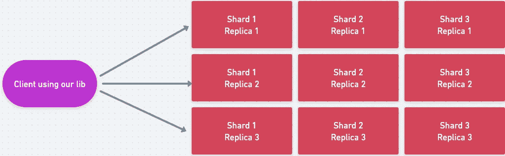

# 用 AI 进行结对编程:使用 ChatGPT 编写分布式容错 Redis 客户机

> 原文：<https://betterprogramming.pub/pair-programming-with-ai-writing-a-distributed-fault-tolerant-redis-client-using-chatgpt-239dc0a90550>

## 使用 ChatGPT 提示符构建软件


在 [Unsplash](https://unsplash.com?utm_source=medium&utm_medium=referral) 上由 [Courtney Corlew](https://unsplash.com/es/@courtneycorlew?utm_source=medium&utm_medium=referral) 拍摄的照片

[软件 2.0](https://karpathy.medium.com/software-2-0-a64152b37c35) 即将到来。我们工作、娱乐和社交方式的本质将会改变。除非你一直生活在岩石下，否则你很可能会在互联网上看到很酷的演示和截图。一个常见的主题是，它非常适合创造性的用例，如写故事、开玩笑、[解释冒泡排序如何像 1940 年代的强盗那样工作](https://twitter.com/goodside/status/1598129631609380864?s=20&t=KhcW177IQLR_JXqHMJV0UQ)等。我想看看我们是否可以用它在我的领域里做一些更有用的事情:写一些好的软件 1.0。

作为一名“参谋工程师”，你日常工作的一部分就是想办法让自己和团队更有效率。这包括实现正确的抽象，采用有用的工具/框架，与高级/初级工程师一起工作并对他们进行培训，并使他们成长到不需要动手就能工作的程度。

那么应该如何看待 ChatGPT 呢？我应该把它看作一个有用的工具/框架吗？还是一个聪明的初级工程师，他只是需要一些指导？让我们找出答案。

# 项目目标

我这个项目的目标是深入了解以下内容:

1.  我能比平时更快地做出原型吗？
2.  类似于一个初级工程师，我能教 ChatGPT 足够多的东西以至于以后不用太多手握它吗？(也就是说，我能让 ChatGPT 增长到足以让它升职吗)
3.  最后，我希望弄清楚 ChatGPT 在什么样的复杂程度上开始挣扎。

因为这是我第一次尝试让 ChatGPT 为我做一些编码，所以我想确保我承担了一个合理范围的问题:

1.  **做一些它可能已经接触过的事情:** Redis 是一个拥有大量文档、代码样本和开源客户端的系统，我相信 ChatGPT 会在这方面进行大量培训。事实上，如果你只是要求它从头实现一个 Redis 客户端，它很可能会从内存中吐出一个，这与任何在线实现都非常相似。
2.  **通过引入新的概念来增加一定的复杂性:**
    由于它可能见过许多 Redis 客户端，让我们看看是否可以从一个简单的客户端开始，然后添加 ***复制*** (用于容错)和 ***分片*** (用于可伸缩性)的概念。
    它可能已经学会了什么是复制和分片，但不是在构建我们的定制客户端的上下文中，所以我们必须指导它。

结果呢？一个完全由 ChatGPT 编写的分布式容错 Redis 客户端，可以很容易地用其他语言重新实现！

*请注意，这是一个 POC 实现，它具有很差的代码抽象和潜在的错误。这个项目的目标是看我们如何使用 ChatGPT 进行编码，而不是编写第 200 个 Redis 客户端，所以请不要推敲代码质量；可怜的人已经尽力了。*

# 我们想要建立什么？

我们试图构建一个 Redis 客户端，它具有容错和可伸缩的密钥空间，这是一个非常高的级别，类似于最初的 [DynamoDB 架构](https://www.allthingsdistributed.com/files/amazon-dynamo-sosp2007.pdf)。

这是一个 Redis 节点。


为了实现容错，我们添加了复制。


具有 3 个副本的 Redis 集群

为了实现可伸缩的地址空间，我们通过根据我们想要支持的数据集的大小选择服务器的数量来划分密钥空间。然后，我们通过某种一致的哈希算法运行每个密钥，以找到它属于哪个碎片。


具有 3 个碎片和 3 个副本的 Redis 集群

我们将支持`GET`、`SET`和`DELETE`行动。

在`SET`和`DELETE`上，我们的客户端库将为给定的密钥选择正确的碎片，并将`SET` / `DELETE`发送给所有 3 个副本。



例如:客户端向碎片 1 写入设置或删除

在 GET 中，我们的客户端库将为给定的密钥选择正确的碎片，并从该碎片的任何一个副本中读取。如果第一个副本返回错误，它将尝试下一个，直到其中任何一个返回成功值。


客户端从一个碎片中读取数据。虚线表示故障转移。

我选择 Go 是因为它在语法上不像 C++那样复杂，也不像 Python 那样简单。我想给 ChatGPT 一个足够公平的挑战。

**限制:**它是一个单线程客户端，不做任何日志记录或度量。这是纯粹的 POC。

现在我们已经了解了我们正在构建什么，让我们开始吧。

# 设置基本的单节点客户端

编写客户机的核心部分是支持客户机和服务器之间的有线协议。Redis 有一个非常好记录的简单协议，叫做 [RESP](https://redis.io/docs/reference/protocol-spec/) (Redis 序列化协议)，ChatGPT 肯定会学习这个协议。
我最初想尝试向它解释一个全新的协议，看看它是否理解它，并能为它编写一个客户端。这可能更复杂，但也是可行的。然而，为了简单起见，我使用了一个众所周知的协议。

首先，让我们确认它已经理解了 RESP。

*注意:我的问题以粗体显示。*

> **你了解 Redis 序列化协议吗？**
> 
> 是的，我熟悉 Redis 序列化协议(RESP)。它是一个协议，指定 Redis 如何对其数据结构进行编码，并通过网络将它们发送到客户端或 Redis 集群中的实例之间。RESP 用于以高效且易于解析的方式编码数据结构，如字符串、列表、集合和散列。它允许 Redis 以一致和可预测的方式与客户机和其他 Redis 实例通信。

确实如此。让我们初始化我们的客户端:

> 我想让你在 Go 中写一个简单的 Redis 客户端库。它应该首先支持以下内容:
> 
> **1。它应该采用一个 IP:Port 对并连接到服务器。
> 2。它应该能够处理整个 RESP 协议。
> 3。它应该支持 GET、SET 和 DELETE 命令，并为每个命令公开 API。
> 4。它应该适当地处理错误。**
> 
> 这里有一个简单的 Go Redis 客户端库，它支持 GET、SET 和 DELETE 命令，并使用 RESP 协议。该库接受一个 IP:Port 对，并使用它连接到指定的 Redis 服务器。它还包括错误处理。

```
package main

import (
 "bufio"
 "bytes"
 "errors"
 "fmt"
 "net"
 "strconv"
)

const (
 GET byte = iota
 SET
 DELETE
)

type RedisClient struct {
 conn net.Conn
 reader *bufio.Reader
 writer *bufio.Writer
}

func NewRedisClient(ip string, port int) (*RedisClient, error) {
 address := fmt.Sprintf("%s:%d", ip, port)
 conn, err := net.Dial("tcp", address)
 if err != nil {
  return nil, err
 }

 return &RedisClient{
  conn: conn,
  reader: bufio.NewReader(conn),
  writer: bufio.NewWriter(conn),
 }, nil
}

func (c *RedisClient) Get(key string) (string, error) {
 err := c.sendCommand(GET, key)
 if err != nil {
  return "", err
 }

 return c.readBulkString()
}

func (c *RedisClient) Set(key, value string) error {
 err := c.sendCommand(SET, key, value)
 if err != nil {
  return err
 }

 _, err = c.readSimpleString()
 return err
}

func (c *RedisClient) Delete(key string) error {
 err := c.sendCommand(DELETE, key)
 if err != nil {
  return err
 }

 _, err = c.readSimpleString()
 return err
}

func (c *RedisClient) Close() error {
 return c.conn.Close()
}

func (c *RedisClient) sendCommand(command byte, args ...string) error {
 c.writer.WriteByte('*')
 c.writer.WriteString(strconv.Itoa(len(args) + 1))
 c.writer.WriteByte('\r')
 c.writer.WriteByte('\n')

 c.writer.WriteByte('$')
 c.writer.WriteString(strconv.Itoa(1))
 c.writer.WriteByte('\r')
 c.writer.WriteByte('\n')

 c.writer.WriteByte(command)
 c.writer.WriteByte('\r')
 c.writer.WriteByte('\n')

 for _, arg := range args {
  c.writer.WriteByte('$')
  c.writer.WriteString(strconv.Itoa(len(arg)))
  c.writer.WriteByte('\r')
  c.writer.WriteByte('\n')
  c.writer.WriteString(arg)
  c.writer.WriteByte('\r')
  c.writer.WriteByte('\n')
 }
```

这是我第一次挑战 ChatGPT。如果响应太大，它会在中间划出区域—可能是由于一些字数限制。注意`sendCommand()`是如何不完整的。

> 你能完成 sendCommand()的实现吗？
> 
> 当然可以。下面是完整的 sendCommand()函数:

```
func (c *RedisClient) sendCommand(command byte, args ...string) error {
 c.writer.WriteByte('*')
 c.writer.WriteString(strconv.Itoa(len(args) + 1))
 c.writer.WriteByte('\r')
 c.writer.WriteByte('\n')

 c.writer.WriteByte('$')
 c.writer.WriteString(strconv.Itoa(1))
 c.writer.WriteByte('\r')
 c.writer.WriteByte('\n')

 c.writer.WriteByte(command)
 c.writer.WriteByte('\r')
 c.writer.WriteByte('\n')

 for _, arg := range args {
  c.writer.WriteByte('$')
  c.writer.WriteString(strconv.Itoa(len(arg)))
  c.writer.WriteByte('\r')
  c.writer.WriteByte('\n')
  c.writer.WriteString(arg)
  c.writer.WriteByte('\r')
  c.writer.WriteByte('\n')
 }

 return c.writer.Flush()
}
```

它还展示了一个关于`sendCommand()`如何工作的简介，就像我问的几乎每一个代码更改一样，但是为了避免这篇文章变得太长，我删除了多余的回复。如果你有兴趣看它到底说了什么，完整的文字记录在这里。很长但是很有趣。

接下来，我让它实现 readSimpleString()和 readBulkString()命令。它最后实现了有 bug 的 readSimpleString()，我只好要求它重新实现。它仍然返回错误，所以我必须告诉它要修复的确切错误。

> **readSimpleString()和 readBulkString()未定义。你能实现这两个功能吗？记得支持整个 RESP 协议。**
> 
> …

```
func (c *RedisClient) readSimpleString() (string, error) {
 prefix, err := c.reader.ReadByte()
 if err != nil {
  return "", err
 }

 if prefix != '+' {
  return "", errors.New("unexpected prefix")
 }

 line, err := c.reader.ReadString('\n')
 if err != nil {
  return "", err
 }

 return line[:len(line)-2], nil
}
```

`readSimpleString()`在这里其实是不完整的。

> **readSimpleString()仅支持 RESP 的“+”。你也能支持'-'吗？**
> 
> …

```
func (c *RedisClient) readSimpleString() (string, error) {
 prefix, err := c.reader.ReadByte()
 if err != nil {
  return "", err
 }

 if prefix != '+' && prefix != '-' {
  return "", errors.New("unexpected prefix")
 }

 line, err := c.reader.ReadString('\n')
 if err != nil {
  return "", err
 }

 return line[:len(line)-2], nil
}
```

它最终“支持”“-”，但不是以正确的方式。在 RESP，“-”表示错误，“+”表示响应成功。所以我不得不告诉它这样做:

> **在 readSimpleString()中，如果'前缀'是'-'，则返回剩余的一行作为错误。**
> 
> …

```
func (c *RedisClient) readSimpleString() (string, error) {
 prefix, err := c.reader.ReadByte()
 if err != nil {
  return "", err
 }

 if prefix != '+' && prefix != '-' {
  return "", errors.New("unexpected prefix")
 }

 line, err := c.reader.ReadString('\n')
 if err != nil {
  return "", err
 }

 if prefix == '-' {
  return "", errors.New(line[:len(line)-2])
 }

 return line[:len(line)-2], nil
}
```

它仍然没有得到它的权利。如果您阅读代码，它总是在`ReadString()`之后将成功字符串和错误字符串重新解释为错误。所以我让它重做整个功能，但它回来的功能完全一样。在这里，我意识到我必须更加规范，就像代码审查一样；因为它不明白。

> **移动前缀= = '--'在 ReadString()前检查。**
> 
> …

```
func (c *RedisClient) readSimpleString() (string, error) {
 prefix, err := c.reader.ReadByte()
 if err != nil {
  return "", err
 }

 if prefix == '-' {
  line, err := c.reader.ReadString('\n')
  if err != nil {
   return "", err
  }

  return "", errors.New(line[:len(line)-2])
 }

 if prefix != '+' {
  return "", errors.New("unexpected prefix")
 }

 line, err := c.reader.ReadString('\n')
 if err != nil {
  return "", err
 }

 return line[:len(line)-2], nil
}
```

这太好了，这意味着即使我必须是规定性的，我也可以像对一个人那样审查它的代码，它理解我。你可以看到代码质量很差，因为它有一些重复的代码，但它工作。在未来，我想看看我是否能教它写更干净的代码，但目前，我不想这么早就与太多的上下文混淆。

很好，现在我们有了初始客户端，但是它不能编译。问题是`sendCommand()`接受一个常量字节的命令，并把它写到网络上，而 RESP 协议期望它是一个字符串。

> **能否重新实现 sendCommand()以将“Command”作为字符串？**
> 
> …

```
func (c *RedisClient) sendCommand(command string, args ...string) error {
 c.writer.WriteByte('*')
 c.writer.WriteString(strconv.Itoa(len(args) + 1))
 c.writer.WriteByte('\r')
 c.writer.WriteByte('\n')

 c.writer.WriteByte('$')
 c.writer.WriteString(strconv.Itoa(len(command)))
 c.writer.WriteByte('\r')
 c.writer.WriteByte('\n')

 c.writer.WriteString(command)
 c.writer.WriteByte('\r')
 c.writer.WriteByte('\n')

 for _, arg := range args {
  c.writer.WriteByte('$')
  c.writer.WriteString(strconv.Itoa(len(arg)))
  c.writer.WriteByte('\r')
  c.writer.WriteByte('\n')
  c.writer.WriteString(arg)
  c.writer.WriteByte('\r')
  c.writer.WriteByte('\n')
 }

 return c.writer.Flush()
}
```

现在，我们需要更新这个函数的调用者。

> **现在重新实现 Get()、Set()和 Delete()以使用 sendCommand()的新实现**
> 
> …

```
func (c *RedisClient) Get(key string) (string, error) {
 if err := c.sendCommand("GET", key); err != nil {
  return "", err
 }

 return c.readBulkString()
}

func (c *RedisClient) Set(key, value string) error {
 if err := c.sendCommand("SET", key, value); err != nil {
  return err
 }

 _, err := c.readSimpleString()
 return err
}

func (c *RedisClient) Delete(key string) error {
 if err := c.sendCommand("DELETE", key); err != nil {
  return err
 }

 _, err := c.readSimpleString()
 return err
}
```

我希望 API 的契约总是返回 2 个值。第一个值作为结果，第二个值作为错误。`Get()`已经以这种方式定义了它的契约(尽管它的最后一行有一个小错误，我已经手动修复了)。所以在这里我不得不再次说明:

> **在 Set()和 Delete()中，readSimpleString()都返回 2 个值。第一个是成功返回值，第二个是错误字符串。如果错误字符串不为空，则返回错误字符串，否则返回成功返回值。**
> 
> …

```
func (c *RedisClient) Set(key, value string) (string, error) {
 if err := c.sendCommand("SET", key, value); err != nil {
  return "", err
 }

 res, err := c.readSimpleString()
 if err != nil {
  return "", err
 }

 return res, nil
}

func (c *RedisClient) Delete(key string) (string, error) {
 if err := c.sendCommand("DELETE", key); err != nil {
  return "", err
 }

 res, err := c.readSimpleString()
 if err != nil {
  return "", err
 }

 return res, nil
}
```

太好了！现在，在一台 Redis 服务器上运行这个程序。我们有一个支持`Get()`、`Set()`和`Delete()`的 Redis 客户端。[如果您想尝试一下，可以在这里](https://github.com/smukil/chatgptredisclient/blob/main/autoredisclient/basic_client.go)找到到目前为止的代码。

# 添加复制

这种平稳的体验让我觉得，我越是像对一个人那样对它说话，它的思维似乎就越有“结构”。

这非常令人难以置信，这就是[上下文学习](http://ai.stanford.edu/blog/understanding-incontext/)的力量，当大型语言模型在足够大的数据集上训练时，它显示了这些“涌现属性”。它令人毛骨悚然，因为我们仍然不知道它是如何展示这些特性的。到目前为止，我们只是观察到确实如此。如果我说的“结构”对你来说还没有意义，我将在后面指出几个例子来解释我的意思。

因此，我加大了赞美的力度，谈到了“高可用性”之类的东西，这个术语我还从未向 it 部门提过，希望它能强化这种“结构”。随着时间的推移，我想用更抽象的术语和它说话，少一些指令性的东西，因为如果那样的话，它会为我节省更多的时间。

> **干得好！这对我有用。现在假设有多个 Redis 服务器，我们希望这个客户端库的用户实现高可用性。我希望 NewRedisClient()获取服务器列表并连接到所有服务器。注意，一个 RedisClient 对象应该支持所有的服务器。稍后我会告诉你如何使用其他功能。**
> 
> 当然可以。下面是 NewRedisClient()的一个更新实现，它接受一个服务器列表并连接到所有服务器:

```
func NewRedisClient(servers []string) (*RedisClient, error) {
 var conns []net.Conn
 for _, server := range servers {
  conn, err := net.Dial("tcp", server)
  if err != nil {
   return nil, err
  }
  conns = append(conns, conn)
 }

 c := &RedisClient{conns: conns}
 for _, conn := range conns {
  c.readers = append(c.readers, bufio.NewReader(conn))
  c.writers = append(c.writers, bufio.NewWriter(conn))
 }

 return c, nil
}
```

> 更新后的 NewRedisClient()函数将服务器列表作为参数。对于列表中的每台服务器，它都使用网络创建一个到该服务器的新连接。Dial()函数。然后，它创建一个新的 RedisClient 对象，并将连接列表设置为 conns 字段。对于每个连接，它都会创建一个新的 bufio。阅读器和一个新的 bufio。Writer，并将它们分别添加到 RedisClient 对象的 readers 和 writers 字段中。最后，它返回 RedisClient 对象。

很酷，但是它没有重写`RedisClient`结构。我没有明确地告诉它，但我暗示它。但是，请注意，它有一些更新的`RedisClient`的概念，因为它在上述函数中的使用方式与以前不同。所以也许它知道`RedisClient`更新后的实现应该是什么样子，只是没有告诉我？我们来问一下。

> **你能展示一下 RedisClient 的最新实现吗？**
> 
> 当然可以。下面是支持多服务器的 RedisClient 结构的更新实现:
> 更新后的 RedisClient 结构有以下字段:

```
type RedisClient struct {
 conns   []net.Conn
 readers []*bufio.Reader
 writers []*bufio.Writer
}
```

> conns:Redis 服务器的一部分连接。
> 读者:一片蟾蜍。与 conns 中的每个连接相关联的读取器对象。
> 编剧:一片卜菲欧。与 conns 中的每个连接相关联的 Writer 对象。
> 
> 有了这个新的结构，RedisClient 对象可以支持到多个 Redis 服务器的多个连接。

请注意我刚才在那个问题中是如何要求更新实现的。虽然我之前已经告诉过它关于多个 Redis 服务器的事情，但是在那个问题中我没有说任何关于它的事情。我说的加“结构”就是这个意思。接下来，我们将更新`Get()`、`Set()`和`Delete()`API。

> **干得好。现在，我希望您更新 Set()的实现，以写入所有服务器。记录所有的响应和错误。在函数结束时，如果至少有一个成功的响应，就返回它。否则，返回任何一个错误。**

```
func (c *RedisClient) Set(key, value string) (string, error) {
 var res string
 var err error
 for i, conn := range c.conns {
  writer := c.writers[i]
  reader := c.readers[i]
  if err := sendCommand(conn, writer, "SET", key, value); err != nil {
   return "", err
  }

  r, e := readSimpleString(conn, reader)
  if e != nil {
   err = e
  } else {
   res = r
  }
 }

 if res != "" {
  return res, nil
 }
 return "", err
}
```

这里是 ChatGPT 优化我的各种查询的地方。我提到了*“跟踪所有的响应和错误”*，但我也提到了*“在函数的最后，如果至少有一个成功的响应，则返回它。否则，返回任何一个错误。*

请注意，它只记录了至少一个响应和至少一个错误，而不是将它们都存储在某个列表中，然后只返回一个。这太令人震惊了。

> **干得好。现在相应地更新 sendCommand()和 readSimpleString()。**
> 
> 当然可以。以下是 sendCommand()和 readSimpleString()的更新实现，它们将 connection、writer 和 reader 对象作为参数:

```
func sendCommand(conn net.Conn, writer *bufio.Writer, command string, args ...string) error {
 writer.WriteByte('*')
 writer.WriteString(strconv.Itoa(len(args) + 1))
 writer.WriteByte('\r')
 writer.WriteByte('\n')

 writer.WriteByte('$')
 writer.WriteString(strconv.Itoa(len(command)))
 writer.WriteByte('\r')
 writer.WriteByte('\n')

 writer.WriteString(command)
 writer.WriteByte('\r')
 writer.WriteByte('\n')

 for _, arg := range args {
  writer.WriteByte('$')
  writer.WriteString(strconv.Itoa(len(arg)))
  writer.WriteByte('\r')
  writer.WriteByte('\n')
  writer.WriteString(arg)
  writer.WriteByte('\r')
  writer.WriteByte('\n')
 }

 return writer.Flush()
}

func readSimpleString(conn net.Conn, reader *bufio.Reader) (string, error) {
 prefix, err := reader.ReadByte()
 if err != nil {
  return "", err
 }

 if prefix == '-' {
  line, err := reader.ReadString('\n')
  if err != nil {
   return "", err
  }

  return "", errors.New(line[:len(line)-2])
 }

 if prefix != '+' {
  return "", errors.New("unexpected prefix")
 }

 line, err := reader.ReadString('\n')
 if err != nil {
  return "", err
 }

 return line[:len(line)-2], nil
}
```

它将两个函数的契约从`RedisClient`的结构级函数更改为顶级函数。我没有质疑这一点，而是想看看它将做出的后续代码选择。

> **干得好！现在，我希望您也相应地更新 Delete()。它应该尝试从所有服务器中删除。**

`它用和 Set()完全一样的逻辑写了 delete，这就是我想要的。`

> **牛逼！让我们更新 Get()的实现，一次从任意一个服务器获取值。如果一个服务器返回一个成功的值，立即将它返回给调用者，否则，尝试一个接一个地从剩余的服务器获取值，直到其中任何一个服务器返回一个成功的值。如果它们都返回一个错误，那么就把这个错误返回给调用者。**

```
func (c *RedisClient) Get(key string) (string, error) {
 for i, conn := range c.conns {
  writer := c.writers[i]
  reader := c.readers[i]
  if err := sendCommand(conn, writer, "GET", key); err != nil {
   return "", err
  }

  res, err := readBulkString(conn, reader)
  if err != nil {
   continue
  }

  return res, nil
 }

 return "", errors.New("failed to get value from all servers")
}
```

它做出了一些创造性的选择，但第一次尝试就做对了。

我也更新了`readBulkString()`和`Close()`。`Close()`需要关闭所有的连接，它做到了:

```
func (c *RedisClient) Close() error {
 var err error
 for _, conn := range c.conns {
  if e := conn.Close(); e != nil {
   err = e
  }
 }
 return err
}
```

这时候事情进展顺利多了。我需要修改的地方更少了。带复制的代码可在这里[获得。](https://github.com/smukil/chatgptredisclient/blob/main/autoredisclient/with_replication.go)

# 添加分片

我现在开始说得更抽象了，在提到复制的好处时，我不断引入新的术语，如“容错”,它理解了我的意思。

> **好极了！我们在这里所做的基本上是通过引入多个副本来增加容错能力。然而，我们仍然受到每个副本一台服务器的限制。我们希望我们的 redis 客户机也支持每个副本有多个分片，这样我们的系统更具可伸缩性。**
> 
> **要做到这一点，首先让我们更新 RedisClient 结构，以了解副本。每个副本应该支持多个连接，每个连接到该副本中的每个服务器。**

```
type RedisClient struct {
 conns   [][]net.Conn
 readers [][]*bufio.Reader
 writers [][]*bufio.Writer
}
```

> 更新后的 RedisClient 结构具有以下字段:
> conns:到 Redis 服务器的连接的切片，由副本组织。conns 字段是一个切片，其中每个内部切片代表一个副本，并包含到该副本中的服务器的连接。
> 
> 读者:一片布菲欧。与 conns 中的每个连接相关联的读取器对象，由副本组织。readers 字段是一个切片，其中每个内部切片代表一个副本并包含 bufio。该副本中连接的读取器对象。
> 
> 编剧:一片布菲欧。与 conns 中的每个连接相关联的 Writer 对象，由副本组织。writers 字段是一个片的片，其中每个内部片代表一个副本并包含 bufio。该副本中连接的编写器对象。
> 
> 有了这个新的结构，RedisClient 对象可以支持多个副本，每个副本包含到多个 Redis 服务器的多个连接。
> 
> **太棒了，现在让我们更新 NewRedisClient()来获取多个副本并初始化到所有副本的连接。**

```
func NewRedisClient(replicas [][]string) (*RedisClient, error) {
 var conns [][]net.Conn
 var readers [][]*bufio.Reader
 var writers [][]*bufio.Writer
 for _, replica := range replicas {
  var replicaConns []net.Conn
  var replicaReaders []*bufio.Reader
  var replicaWriters []*bufio.Writer
  for _, server := range replica {
   conn, err := net.Dial("tcp", server)
   if err != nil {
    return nil, err
   }

   replicaConns = append(replicaConns, conn)
   replicaReaders = append(replicaReaders, bufio.NewReader(conn))
   replicaWriters = append(replicaWriters, bufio.NewWriter(conn))
  }
  conns = append(conns, replicaConns)
  readers = append(readers, replicaReaders)
  writers = append(writers, replicaWriters)
 }

 return &RedisClient{conns, readers, writers}, nil
}
```

> **干得好。现在，让我们介绍一个名为 FindShard()的助手函数，它接受两个参数:
> 1。作为字符串的密钥
> 2。副本中的服务器数量**
> 
> **通过 XXHash 运行 key 通过跳转 Hash 传递结果和服务器数量，并将输出返回给调用者。**

```
func FindShard(key string, numServers int) int {
 h := xxhash.New()
 if _, err := h.Write([]byte(key)); err != nil {
  return 0
 }
 hash := h.Sum64()
 return int(jump.Hash(hash, numServers))
}
```

到目前为止一切看起来都很好。

> **好，现在让我们更新 Set()的实现，首先找到密钥所属的分片，然后从每个副本中只向那个分片发送命令。**

```
func (c *RedisClient) Set(key, value string) error {
 shard := FindShard(key, int32(len(c.conns[0])))
 var err error
 for i, replicaConns := range c.conns {
  conn := replicaConns[shard]
  writer := c.writers[i][shard]
  if err = sendCommand(conn, writer, "SET", key, value); err != nil {
   break
  }
  _, err = readSimpleString(conn, c.readers[i][shard])
 }
 return err
}
```

很好，它选对了钥匙碎片。我省略了一些小的调试和 Delete()。下面是 Get()和 Close():

> **干得好！现在，让我们更新 Get()来一次一个副本地发送命令到各自的 shard。一旦我们得到一个成功的结果，返回。否则，继续尝试剩余的副本，直到我们找到一个。如果它们都返回一个错误，则返回最后看到的错误。**

```
func (c *RedisClient) Get(key string) (string, error) {
 shard := FindShard(key, int32(len(c.conns[0])))
 var result string
 var err error
 for i, replicaConns := range c.conns {
  conn := replicaConns[shard]
  writer := c.writers[i][shard]
  if err = sendCommand(conn, writer, "GET", key); err != nil {
   continue
  }
  result, err = readBulkString(conn, c.readers[i][shard])
  if err == nil {
   break
  }
 }
 return result, err
}
```

> **更新 Close()关闭每个连接。如果中途遇到错误，忽略它，继续关闭所有其他的东西。如果它们都出错了，返回最后一个。**

```
func (c *RedisClient) Close() error {
 var err error
 for _, replicaConns := range c.conns {
  for _, conn := range replicaConns {
   if err1 := conn.Close(); err1 != nil {
    err = err1
   }
  }
 }
 return err
}
```

现在，我们有了一个完整的工作分布式和容错客户端 POC。这里是 [Github 链接](https://github.com/smukil/chatgptredisclient)到整个代码和抄本。

# ChatGPT 能讲多国语言吗？

科技产品公司面临的一个常见挑战是对基础设施组件的多语言支持。通常，这意味着客户端具有相同的逻辑，但使用多种不同的语言。这当然很难维护，因此像使用通用 GRPC 协议的[特使](https://www.envoyproxy.io/)这样的服务网格是首选。

尽管如此，我还是很好奇，想看看我们到目前为止建立的所有“结构”是否能让 ChatGPT 将我们所有的工作翻译成不同的语言。

> **现在我们有了一个用 Go 编写的分布式容错 Redis 客户端。我希望您用 Python 实现具有相同逻辑的整个客户端。**

```
 import xxhash
 import jumphash
 import socket
 import struct

 class RedisClient:
     def __init__(self, replicas):
         self.conns = [[] for _ in replicas]
         self.writers = [[] for _ in replicas]
         self.readers = [[] for _ in replicas]
         for i, servers in enumerate(replicas):
             for server in servers:
                 ip, port = server.split(":")
                 conn = socket.socket()
                 conn.connect((ip, int(port)))
                 self.conns[i].append(conn)
                 self.writers[i].append(conn.makefile("w"))
                 self.readers[i].append(conn.makefile("r"))

     @staticmethod
     def find_shard(key, num_servers):
         h = xxhash.xxh64()
         h.update(key.encode("utf-8"))
         return jumphash.jump_consistent(h.intdigest(), num_servers)

     def set(self, key, value):
         shard = self.find_shard(key, len(self.conns[0]))
         result, err = None, None
         for i, replica_conns in enumerate(self.conns):
             conn = replica_conns[shard]
             writer = self.writers[i][shard]
             self.send_command(writer, "SET", key, value)
             result, err = self.read_simple_string(conn)
         return result, err

     def delete(self, key):
         shard = self.find_shard(key, len(self.conns[0]))
         result, err = None, None
         for i, replica_conns in enumerate(self.conns):
             conn = replica_conns[shard]
             writer = self.writers[i][shard]
             self.send_command(writer, "DELETE", key)
             result, err = self.read_simple_string(conn)
         return result, err
```

一点也不差。它是不完整的，但是不幸的是，在这里我点击了键盘上浏览器的“返回”快捷键，我失去了与 ChatGPT 的所有上下文:(

但是我们不需要看到代码的其余部分来得出结论。ChatGPT 可以在一个提示中无缝地用不同的语言重写它。我也上传了这个不完整的文件到 GitHub。我希望 OpenAI 很快支持在 ChatGPT 中保存聊天上下文，以便以后恢复。

# 结论

根据我的经验，我相信这可以用来加速部分软件开发；简单组件的原型，在更小的模块中构建项目的各个部分，等等。我花了两个多小时才把它修好；我花了更长的时间写这篇文章。

给它更多的背景，就像我给一个真实的人一样，似乎会有所帮助。

然而，考虑到代码质量问题和 ChatGPT 做出“创造性”选择的事实，意味着您对代码执行情况等事情的控制更少。代码维护也可能更加困难。

随着时间的推移，随着 LLM 的改进，并且是在更大的数据集上训练的结果，这些“涌现属性”可能会更加有效。然后，我们能想象这些 LLM 审查他们自己的代码，并可能写出越来越好的软件，甚至向我们解释它是如何工作的。

学习更好地提示这些类型的 LLM 也可能是一项非常有用的技能，这可能很快成为一项新的工作职能。我将在以后的文章中详细介绍我学到的技术，以便更好地推广 ChatGPT。

*   GitHub 回购:[https://github.com/smukil/chatgptredisclient](https://github.com/smukil/chatgptredisclient)
*   推特:【https://twitter.com/SaileshMukil 