# 使用熊猫分组方法的提示

> 原文：<https://betterprogramming.pub/pandas-groupby-tips-19e3646329b2>

## 更好的数据分组


[帕斯卡·米勒](https://unsplash.com/@millerthachiller?utm_source=medium&utm_medium=referral)在 [Unsplash](https://unsplash.com?utm_source=medium&utm_medium=referral) 上的照片

这篇文章是熊猫小组的一个简短教程。一如既往，我们将与例子一起工作。出于演示目的，让我们创建一个虚拟数据帧。

```
df = pd.DataFrame({'Gender':['m','m','m','f','f','f','f', 'm','f','f'],
                   'Type':['a','b','c','a','b','c','c', 'c','c','b'],
                   'ColA':[10,20,30,40,50,60,70,80,90,100],
                   'ColB':[0,5,10,15,25,30,50,10,20,30]})
df
```

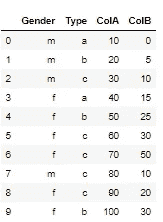

作者提供的截图。

# 提示:如何返回没有索引的结果

在许多情况下，我们不希望 group by 操作的列显示为索引。因此，我们习惯在末尾加上`reset_index()`。例如，假设我们想通过**性别**得到**可乐**组的平均值

```
df.groupby('Gender')['ColA'].mean()
```

输出:

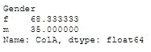

作者提供的截图。

现在，如果我们想删除性别作为索引，我们在末尾添加`reset_index()`命令:

```
df.groupby('Gender')['ColA'].mean().reset_index()
```

输出:

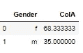

作者提供的截图。

**提示:**不要输入`rest_index()`命令，你可以在`groupby`中添加`as_index=False` ，你会得到同样的输出。例如:

```
df.groupby('Gender', as_index=False)['ColA'].mean()
```

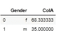

作者提供的截图。

这可以扩展到更多列。例如，假设我们按`Gender`和`Type`分组

**带索引:**

```
df.groupby(['Gender', 'Type'])['ColA'].mean()
```

输出:

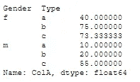

作者提供的截图。

**无索引:**

```
df.groupby(['Gender', 'Type'], as_index=False)['ColA'].mean()
```

输出:

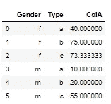

作者提供的截图。

# 提示:如何获得组

一旦我们将数据框分组，我们就可以显示和获取它们。例如，假设我们按照`Type`对数据帧进行分组

```
grouped = df.groupby('Type')
```

# 如何迭代组？

我们可以迭代组，如下所示:

```
for g in grouped: 
    print(g)
```

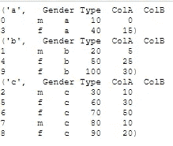

作者提供的截图。

# 如何获得一个群体？

我们可以使用命令`get_group`得到一个特定的组。例如，假设我们要获取类型为**b**的**组。**

```
grouped.get_group('b')
```

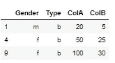

作者提供的截图。

# 提示:如何应用多种功能

假设我们想让 **ColA** 计算`mean`和`var`，让 **ColB** 计算`min`和`max`，按**性别**分组。

```
df.groupby('Gender').agg({'ColA':['mean', 'var'], 
                          'ColB':['min', 'max'] })
```

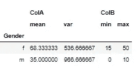

作者提供的截图。

# 提示:如何更改聚合列的名称

我们可以通过传递元组来更改名称，如下所示:

```
df.groupby('Gender').agg({'ColA':[('ColA_Mean','mean'), ('ColA_Var', 'var')], 
                          'ColB':[('ColB_Min','min'), ('ColB_Max', 'max')] })
```

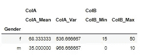

作者提供的截图。

# 提示:如何添加自定义函数

假设我们想要添加一个自定义的范围计算，即**可乐**的 max-min。

```
df.groupby('Gender').agg({'ColA':[('ColA_Mean','mean'), ('ColA_Var', 'var'), ('CustomFunction', lambda x: x.max() - x.min())], 
                          'ColB':[('ColB_Min','min'), ('ColB_Max', 'max')] })
```

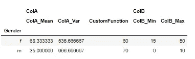

作者提供的截图。

# 提示:处理多个索引

让我们创建一个具有多个索引的分组数据帧。你可以在[熊猫文档](https://pandas.pydata.org/pandas-docs/stable/user_guide/advanced.html)找到更多细节

```
ex = df.groupby(['Gender', 'Type']).agg({'ColA':['mean'], 
                          'ColB':['min', 'max'] })ex
```

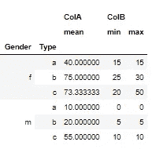

作者提供的截图。

假设我想得到`Gender==’f’`和`Type==’c’`所在的行。我们可以使用`.loc`并传递如下值:

```
ex.loc[('f','c')]
```

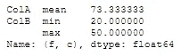

作者提供的截图。

假设我想运行相同的查询，但这次只获取**可乐**的数据:

```
ex.loc[('f','c'), 'ColA']
```

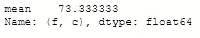

作者提供的截图。

假设现在我想获得所有索引的**列**的结果:

```
ex.loc[:, 'ColB']
```

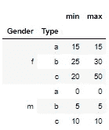

作者提供的截图。

# 提示:带有多个索引的切片器

假设我想从性别中获取所有级别，从类型中获取级别“a”和“b”。我可以按如下方式使用切片机:

```
ex.loc[(slice(None), slice('a','b')), :]
```

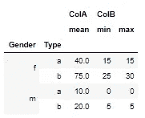

作者提供的截图。

注意:您可以使用`slice(None)`选择*中该*级的所有内容。您不需要指定所有的*更深的*级别，它们将被隐含为`slice(None)`。

# 提示:重置列的多索引级别

正如我们在示例 DataFrame】中看到的，我们甚至在列中有多个索引。让我们看看如何重置它们。

```
ex.columns = ex.columns.droplevel(0) 
ex = ex.rename_axis(None, axis=1) 
ex
```

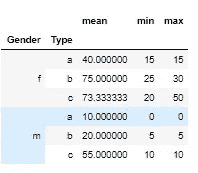

作者提供的截图。

最后，如果我们想重置行索引，我们可以使用命令`reset_index()`

```
ex.reset_index()
```

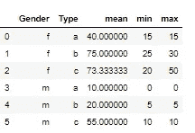

作者提供的截图。

请注意，我们只能重置一个级别的索引，如下所示:

```
ex.reset_index(level=0)
```

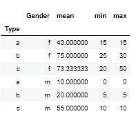

作者提供的截图。

【https://predictivehacks.com】原载于[](https://predictivehacks.com/pandas-groupby-tips/)**。**