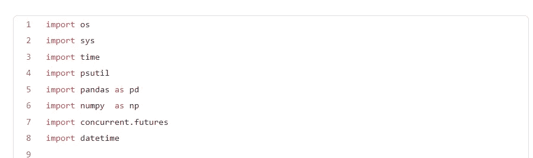
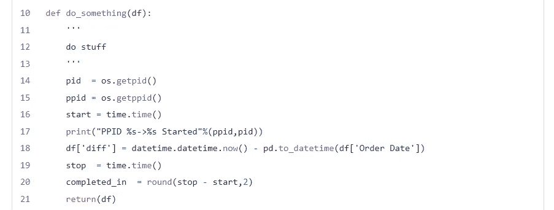
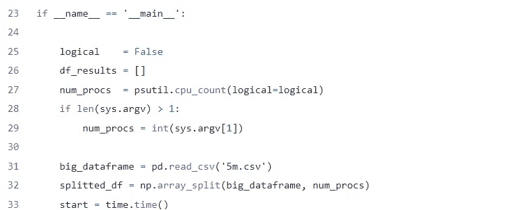
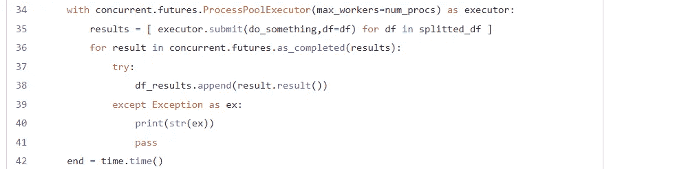
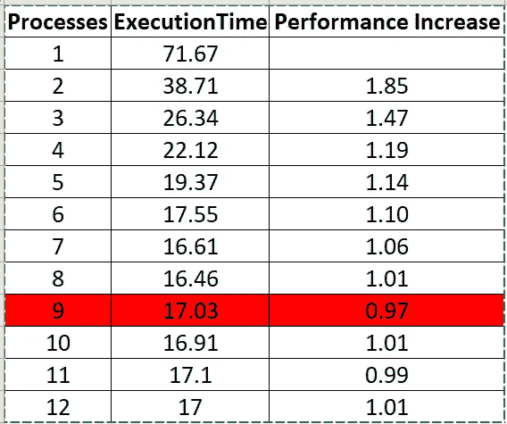

# 熊猫:如何并行处理数据帧

> 原文：<https://betterprogramming.pub/pandas-how-to-process-a-dataframe-in-parallel-make-pandas-lightning-fast-669978cf5356>

## 让熊猫快如闪电


[斯通王](https://unsplash.com/@stonewyq?utm_source=medium&utm_medium=referral)在 [Unsplash](https://unsplash.com?utm_source=medium&utm_medium=referral) 上的照片

Pandas 是用于数据分析的最广泛使用的库，但它相当慢，因为 pandas 没有利用一个以上的 CPU 核心，为了加快速度并利用所有核心，我们需要将数据帧分成更小的数据帧，理想情况下是分成与可用 CPU 核心数量相等的部分。

Python `concurrent.futures`允许 as 轻松创建流程，而不需要担心加入流程等问题，考虑下面的例子(pandas_parallel.py)

和 CSV 文件，我们将使用它来创建数据帧

[https://github.com/kpatronas/big_5m/raw/main/5m.csv](https://github.com/kpatronas/big_5m/raw/main/5m.csv)

## 解释代码

这些是我们需要的库，`concurrent.futures`提供了我们并行处理数据帧所需要的库



do_something 函数接受一个数据帧作为参数，这个函数将作为一个独立的进程并行执行

以下函数返回父 PID 和当前过程 PID

```
os.getpid()
os.getppid()
```



我们执行的 pandas 操作是创建一个名为 diff 的新列，它具有当前日期和“Order Date”列中的日期之间的时差。操作完成后，该函数返回处理后的数据帧

代码的下面部分实际上是我们脚本的开始和初始化部分



*   第 27 行根据 CPU 核心(逻辑或非逻辑)的数量定义了并行进程的数量，除非已经提供了要创建多少个进程的参数。
*   第 32 行将数据帧分割成更小的数据帧，等于第 27 行分配的`num_procs`的数量

该部分使用 ProcessPoolExecutor 创建一个 Executor 对象，该对象将创建数量等于`num_procs`的并行进程。



*   第 35 行启动进程，每个进程使用来自`splitted_df`数据帧的数据帧作为参数执行`do_something`功能
*   第 36 行等待所有进程完成，并将从`do_something`函数返回的数据帧附加到`df_results`列表中

最后但同样重要的是，第 45 行将所有 pandas 数据帧连接成一个数据帧。


## 警告

*   使用多个进程有其局限性，理想的进程数量应该等于 CPU 核心的数量。
*   创建进程意味着有大量的内存开销。
*   并行处理数据帧可能很棘手！如果行的计算需要来自并行处理的其他数据帧的数据，多重处理可能会导致错误的结果。

## 表演

让我们看看我的 8 核机器的并行处理性能

*   只要我们不超过内核数量，性能就会提高
*   性能增长不是线性的，随着我们创建更多的流程，性能增长会越来越小
*   当我们超过内核数量时，性能会变得更差



我希望这篇文章对你有用，并帮助你创建超快的熊猫应用程序:)

[](https://lovethepenguin.com/membership) [## 通过我的推荐链接加入媒体

### 作为一个媒体会员，你的会员费的一部分会给你阅读的作家，你可以完全接触到每一个故事…

lovethepenguin.com](https://lovethepenguin.com/membership)