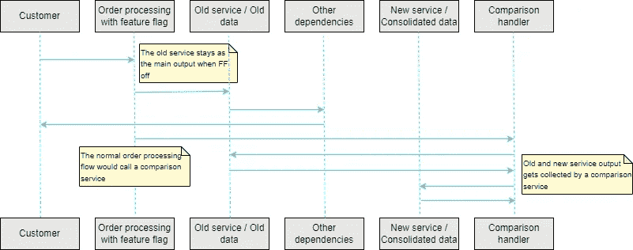

# 并行运行模式

> 原文：<https://betterprogramming.pub/parallel-run-pattern-d3973e0d474d>

## 信心十足地迁移数据和服务的技术


照片由[哈希尔·古德卡](https://unsplash.com/@hgudka97)在 [Unsplash](https://unsplash.com) 上拍摄

对我来说，2021 年是大迁徙的一年，但不要混淆:这里没有野兽参与。除了糟糕的笑话，我在本文中的目标是简要地解释我如何使用并行运行技术来增加将数据迁移到新架构的信心，并提供任何回归的可见性并最小化它们。

我将首先描述迁移项目的背景，然后是数据的外观。然后，我将解释我是如何实现该模式的，以及这种技术的优缺点。

我希望你和我一样喜欢它！

# 背景故事

我为这个迁移项目开发的平台的主要目标之一是开发市场调查问卷。简单来说，平台提供产品，每个产品都有相应的调查蓝图。蓝图由带有占位符和答案选项的静态问题组成。

例如:

```
Survey A

Question 1: In which of the following situations you <verb> <category_name>?
<situation_1>
<situation_2>
<situation ..>
Never
```

作为客户，你可以选择你的产品，你的研究类别(例如，食品，饮料，服务等。)，以及您希望进行研究的国家。产品、国家和类别的组合触发了一个服务，该服务为我们提供替换占位符和答案选项的数据。

例如，在上面的例子中，`verb`、`category_name`和`situations`应该在调用服务后被替换。

# 数据最初是如何存储的

数据作为单独的记录存储在 MySQL 的一个表中，还有一些关联和翻译。这些翻译是手动导入的，并使用名为 [Globalize](https://github.com/globalize/globalize) 的外部 Rails gem 进行管理。

在较高的层次上，该模型以如下方式定义:

```
class PredefinedData < ApplicationRecord

   belongs_to :country
   belongs_to :product
   belongs_to :category

translates :value

end
```

每当有人需要导入新数据时，服务会处理一个包含各种类型预定义数据的 Excel 文件，如`verb`、`situations`、`brands`、`retailers`等。每行代表一种产品、一个类别和一个国家的数据类型。该文件包含一个英文值，我称之为“源值”，以及它的翻译，我称之为“目标值”。导入过程将为每一行创建一条新记录。

这种架构有三个主要问题:

1.  重复数据:对于国家、产品和类别的每种组合，可能存在(并且确实存在)相同的源值。
2.  混乱的翻译:翻译是手工添加的，导致重复的源值。在分析数据时，我发现一种特定语言中的许多目标值对于同一个源值有多种写法。
3.  检索数据的服务太慢。周围有许多关联，我们的 SQL 查询正在输掉这场战斗。

# 整合之路

该项目旨在将所有重复的数据迁移到一个新的结构中，其中源值和翻译将是唯一的。不详细讨论结构(因为这超出了本文的范围)，总之，我们在一个新的表中存储了唯一的记录，并用节点将它们链接起来，所有这些都使用 [Ancestry](https://github.com/stefankroes/ancestry) gem 进行管理。此外，翻译将由我们内部的全球化服务自动生成。

对于我们平台的报告方来说，让所有语言和类别的所有问卷问题文本和答案选项保持一致的想法是一个好消息。这是因为(再次强调，不涉及太多细节)在报告端，我们以纯文本形式存储问卷中使用的问题和答案选项，然后存储它们的值(这些是回答者的分数)。

有了这个，你可以交叉比较你当前报告的值和所有过去报告的平均值，并在此基础上做出决定。如果文本发生变化，它将被视为我们平台的新问题/答案选项，从而产生新的值和分数。如果两个问题意思相同，但写法不同，它们会产生不同的分数，但合并意味着这些分数会被合并，从而使数据库更加可靠。有了更可靠的数据，客户可以做出更好的决策，这对公司的声誉有好处。

从技术角度来看，整合将简化技术，并让我们消除多年的技术债务。然而，在业务方面，由于分数的潜在变化以及受项目影响的市场和产品的数量，人们很关心并需要可见性。

因此，为了成功迁移，我们需要以下内容:

*   没有停机时间。
*   UX 没有变化。
*   修复所有过去的调查，以获得整合的调查蓝图。
*   检查分数变化并与客户沟通。
*   检查使用新架构创建的调查是否会产生与旧架构相同的输出。

我们有大约五种产品在大约十个国家和 60 个类别中使用这项服务。我们有八种预定义的数据条目(如`verb`、`situation`、`retailer`等)。).这相当于需要整合大约 24，000 个条目和大约 6，000 个过去的研究。

那么，我们如何测试和检测迁移前和迁移后调查之间的所有差异，并确保在迁移后正确创建新的调查呢？这就是并行运行模式发挥作用的地方。

# 实现并行运行模式

有人可以用不同的方式来实现这个模式。我是这样做的。



作者图片

当客户下新订单时，系统会检查一个特征标志。将根据特定产品的标志值来使用新的或旧的服务。

在后台，订单处理还会触发一个比较处理程序，该程序会将打开的服务输出与关闭的输出进行比较。(这将允许在需要时轻松反转。)当输出不同时，将通过 Slack bot 通知发送报告。

整个项目的步骤如下:

*   整合所有数据。
*   激活新服务以导入数据。该服务将以新的格式导入数据，但也会以旧的格式更新旧的数据库。
*   对所有过去的订单运行比较处理程序。这里是我们发现翻译中所有不一致的地方。在我们修复它们之后，我们设法对调查应该是什么样子有了一个很好的规范。
*   让平行运行几周/几个月。当我们高兴地看到我们的 Slackbot 没有发送任何不一致警报时，打开产品的特性标志。

这个过程如此顺利，以至于我想在周五下午激活最后一个产品。

# 该方法的优势

*   **使用生产数据进行测试:**我们可以看到新的数据结构和服务如何与来自客户的真实数据一起工作。这有助于我们在上线之前识别 bug 和回归。
*   **分阶段推出**:由于功能标志和导入系统更新了两种数据结构，我们可以激活某些产品的功能，这给了我们很大的控制力，减轻了客户的挫折感。
*   **轻松回滚**:新架构与旧架构隔离。如果我们发现产品在激活新服务后表现不正常，我们可以很容易地停用它并继续使用旧服务。
*   基于主干的开发(Trunk-based development):我们可以使用 TBD 方法，合并许多小的拉式请求来修复我们的新架构，并让我们的开发人员在一天结束时感到愉快和高效。
*   **基准测试:**我们可以很容易地比较新旧架构，看看哪一个更快。

# 限制/注意事项

*   **定制解决方案:**构建一个比较服务并不简单，可能需要很长时间才能做好。此外，您需要考虑到，有时可以允许一些数据有所不同。
*   **代码会变得混乱:**现在你将有两个服务在运行，对你的比较处理器的新调用，一个监控工具，和特性标志。这将使你的代码库有点难看，直到你可以清理一切。
*   **平台加载时间的增加** e:你增加了额外的处理工作量，你应该考虑到这一点。

# 结论

并行运行是一种强大的技术，它在迁移服务及其数据时提供了良好的可见性和信心。这可能不是一个快速的解决方案，但在数据或服务过时、规格不明确或风险太高的项目中，这可能是一个救命稻草。

关于并行运行模式的更多信息，可以参考 Sam Newman 的书“Monolith to Microservices”。