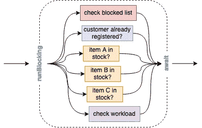

# Kotlin 中使用协程的并发性

> 原文：<https://betterprogramming.pub/parallelization-in-kotlin-with-coroutines-91f0c77c5a8>

## 如何轻松暂停任何任务并更快完成工作


马丁·桑切斯在 [Unsplash](https://unsplash.com?utm_source=medium&utm_medium=referral) 上的照片

每个人都知道每两年计算速度翻一番的摩尔定律，但现在它即将结束。剩下的可以显著提高处理时间的方法是利用我们的计算机由几个计算单元组成的体系结构。

Kotlin 的协同程序使您能够以顺序的方式轻松地编写并行代码，而不用担心在 Java 中使用线程所带来的上下文开销。

在这篇文章中，我想介绍一下如何快速入门，这样你就可以在你的项目中实际使用它。

概述:

*   *阻塞代码*——说明并行化的原因。
*   *什么是协程？* —关于概念的小介绍。
*   *入门* —编写我们的第一个协程来增强我们的介绍示例。
*   *范围* —构建我们的并发性。
*   *通道* —协程之间基于消息传递的信息共享。
*   *取消和异常处理* —如何停止协程&处理异常。
*   *关键要点*

# 阻止代码

让我们定义一个假想的业务案例场景:我们有一个微服务架构，在接受客户订单之前，我们需要在接受订单之前确保以下事项:

*   客户的联系方式是有效的，不在我们的黑名单上。
*   检查客户是否已经注册。
*   所有物品的可用性检查:它们有库存吗？
*   我们运输团队目前的工作量是多少？

所有的检查都是通过 API 调用来完成的，所以按顺序运行它们需要大量的时间。


您会明白:所有的请求都是独立的，不需要互相等待。让我们跳到协程中来简单而彻底地改进这一点。

# 什么是协程？

Kotlin 的文档把它描述为一个可暂停计算的实例。“考虑一下用一个新线程分离 Java 中的一个进程:你将得到一个异步运行的作业，它独立于你的主线程进行处理。

主要的优势是:协程**没有绑定到一个单独的线程**。它们可能在一个线程中开始执行，然后在另一个线程中继续执行——这应该被视为一个"*轻量级线程。*“这就是为什么你可以轻松地启动 100K 个协程，而不会经历严重的性能影响，或者更糟的是得到一个`OutOfMemoryException`。

# 入门指南

让我们直接回到引言中的例子，用协程重写它(你也可以在 [Kotlin 的操场](https://play.kotlinlang.org/#eyJ2ZXJzaW9uIjoiMS41LjEwIiwicGxhdGZvcm0iOiJqYXZhIiwiYXJncyI6IiIsImpzQ29kZSI6IiIsIm5vbmVNYXJrZXJzIjp0cnVlLCJ0aGVtZSI6ImlkZWEiLCJjb2RlIjoiaW1wb3J0IGtvdGxpbnguY29yb3V0aW5lcy5hc3luY1xuaW1wb3J0IGtvdGxpbnguY29yb3V0aW5lcy5kZWxheVxuaW1wb3J0IGtvdGxpbnguY29yb3V0aW5lcy5ydW5CbG9ja2luZ1xuaW1wb3J0IGtvdGxpbi5yYW5kb20uUmFuZG9tLkRlZmF1bHQubmV4dEJvb2xlYW5cbmltcG9ydCBrb3RsaW4ucmFuZG9tLlJhbmRvbS5EZWZhdWx0Lm5leHREb3VibGVcbmltcG9ydCBrb3RsaW4uc3lzdGVtLm1lYXN1cmVUaW1lTWlsbGlzXG5cbmZ1biBtYWluKCkge1xuICAgIHZhbCB0aW1lU3BlbmQgPSBtZWFzdXJlVGltZU1pbGxpcyB7XG4gICAgICAgIHJ1bkJsb2NraW5nIHtcbiAgICAgICAgICAgIHZhbCBjYW5BY2NlcHRPcmRlciA9IChcbiAgICAgICAgICAgICAgICAgICAgbGlzdE9mKFxuICAgICAgICAgICAgICAgICAgICAgICAgICAgIGFzeW5jIHsgaXNPbkJsb2NrZWRMaXN0KFwibWF4QG11c3Rlcm1hbm4uZGVcIikgfSxcbiAgICAgICAgICAgICAgICAgICAgICAgICAgICBhc3luYyB7IGlzQWxyZWFkeVJlZ2lzdGVyZWQoXCJtYXhAbXVzdGVybWFubi5kZVwiKSB9LFxuICAgICAgICAgICAgICAgICAgICAgICAgICAgIGFzeW5jIHsgY2hlY2tXb3JrbG9hZCgpIDwgMC43NSB9XG4gICAgICAgICAgICAgICAgICAgICkgK1xuICAgICAgICAgICAgICAgICAgICBsaXN0T2YoXCJBXCIsIFwiQlwiLCBcIkNcIikubWFwIHsgYXN5bmMgeyBpc0l0ZW1JblN0b2NrKGl0KSB9IH1cbiAgICAgICAgICAgICAgICApLm1hcCB7IGl0LmF3YWl0KCkgfS5ub25lIHsgIWl0IH1cbiAgICAgICAgICAgIHByaW50bG4oXCJPcmRlciBpcyBhY2NlcHRhYmxlPyAtPiAkY2FuQWNjZXB0T3JkZXJcIilcbiAgICAgICAgfVxuICAgIH1cbiAgICBwcmludGxuKFwiVGltZSBzcGVuZDogJHt0aW1lU3BlbmR9bXNcIilcbn1cblxuc3VzcGVuZCBmdW4gaXNPbkJsb2NrZWRMaXN0KGVtYWlsOiBTdHJpbmcpOiBCb29sZWFuIHtcbiAgICBkZWxheSg4MDBMKVxuICAgIHZhbCBpc0Jsb2NrZWQgPSBuZXh0Qm9vbGVhbigpXG4gICAgcHJpbnRsbihcIklzQmxvY2tlZD8gLT4gJGlzQmxvY2tlZFwiKVxuICAgIHJldHVybiBpc0Jsb2NrZWRcbn1cblxuc3VzcGVuZCBmdW4gaXNBbHJlYWR5UmVnaXN0ZXJlZChlbWFpbDogU3RyaW5nKTogQm9vbGVhbiB7XG4gICAgZGVsYXkoNzUwTClcbiAgICB2YWwgaXNBbHJlYWR5UmVnaXN0ZXJlZCA9IG5leHRCb29sZWFuKClcbiAgICBwcmludGxuKFwiaXNBbHJlYWR5UmVnaXN0ZXJlZD8gLT4gJGlzQWxyZWFkeVJlZ2lzdGVyZWRcIilcbiAgICByZXR1cm4gaXNBbHJlYWR5UmVnaXN0ZXJlZFxufVxuXG5zdXNwZW5kIGZ1biBpc0l0ZW1JblN0b2NrKGlkOiBTdHJpbmcpOiBCb29sZWFuIHtcbiAgICBkZWxheSgyNTBMKVxuICAgIHZhbCBpc0l0ZW1JblN0b2NrID0gbmV4dEJvb2xlYW4oKVxuICAgIHByaW50bG4oXCJpc0l0ZW1JblN0b2NrPyAtPiAkaXNJdGVtSW5TdG9ja1wiKVxuICAgIHJldHVybiBpc0l0ZW1JblN0b2NrXG59XG5cbnN1c3BlbmQgZnVuIGNoZWNrV29ya2xvYWQoKTogRG91YmxlIHtcbiAgICBkZWxheSgxMDAwTClcbiAgICB2YWwgd29ya0xvYWQgPSBuZXh0RG91YmxlKClcbiAgICBwcmludGxuKFwiV29ya2xvYWQ/IC0+ICR3b3JrTG9hZFwiKVxuICAgIHJldHVybiB3b3JrTG9hZFxufSJ9)上执行代码)。

让我们讨论一下代码实际上做了什么——这里不涉及火箭科学。

*   `runBlocking`—定义我们希望使用协程构建器来运行异步任务的块。这是从我们的顺序代码到我们的并行代码的桥梁。它像`async`和`launch`一样是协程构建，但是作为一个顶级函数，可以在协程范围之外使用。
*   `async`—启动一个新的并发协程，它在我们的`runBlocking`范围内独立于其余代码工作。它返回一个延迟对象，类似于 Java 中的 Future 或 Node.js 中的 Promises，表示将在过去某个时间实现的值。如果不需要返回值，可以使用`launch`。
*   `delay` —阻止协程执行的特殊函数。这不会**而不是**阻塞底层线程。它可以被其他协程重用。
*   `suspend` —所有的函数都可以在协程范围内使用，但是如果它们还需要运行其他的挂起函数(就像我们的例子中的 *delay* ，我们需要明确地定义这一点。
*   `await` —我们产生了许多协程，现在想要等待所有执行完成来收集我们的组合结果。

除了在所有挂起的任务上调用`await`之外，我们还可以在接收到的类型为`Deferred<Boolean>`的对象列表上调用`awaitAll`。

基本上就是这样。现在让我们再看一下我们的执行时间栏。



我们设法用十行代码并行化了我们的过程，而没有增加可读性方面的任何复杂性。

如果您正在本地使用协程，那么您可以设置`-Dkotlinx.coroutines.debug`来获得关于在哪个协程上执行了什么代码的额外日志信息。

# 领域

启动协程总是在相应的作用域内完成。这个范围包含关于协程的附加上下文，比如关于要使用的线程的规范。

在`runBlocking`中使用`launch`(或`this.launch`)将在其父协程的范围内启动一个新的子协程，该父协程是由`runBlocking`创建的——产生父子关系。也可以通过`GlobalScope.launch`或`GlobalScope.async`从全局范围启动协程。此外，您可以通过使用`coroutineScope`函数创建一个专用的新作用域，而无需启动新的协程。

为什么范围很重要:

*   作用域的生存期总是绑定到较高的作用域。
*   父作用域可以取消子作用域。
*   父作用域自动等待所有子作用域的完成。

有了这些信息，我们可以轻松地构建结构化并发。如果我们用`scope.cancel()`取消一个作用域，我们将取消这个作用域内的所有协程。

让我们深入一个例子，你也可以找到一个[科特林游乐场](https://play.kotlinlang.org/#eyJ2ZXJzaW9uIjoiMS41LjEwIiwicGxhdGZvcm0iOiJqYXZhIiwiYXJncyI6IiIsImpzQ29kZSI6IiIsIm5vbmVNYXJrZXJzIjp0cnVlLCJ0aGVtZSI6ImlkZWEiLCJjb2RlIjoiaW1wb3J0IGtvdGxpbnguY29yb3V0aW5lcy5kZWxheVxuaW1wb3J0IGtvdGxpbnguY29yb3V0aW5lcy5sYXVuY2hcbmltcG9ydCBrb3RsaW54LmNvcm91dGluZXMucnVuQmxvY2tpbmdcbmltcG9ydCBrb3RsaW54LmNvcm91dGluZXMuR2xvYmFsU2NvcGVcbmltcG9ydCBrb3RsaW54LmNvcm91dGluZXMuY29yb3V0aW5lU2NvcGVcbmltcG9ydCBrb3RsaW4uc3lzdGVtLm1lYXN1cmVUaW1lTWlsbGlzXG5cbnZhbCBzdGFydCA9IFN5c3RlbS5jdXJyZW50VGltZU1pbGxpcygpXG5cbmZ1biBtYWluKCkge1xuICAgIHJ1bkJsb2NraW5nIHtcbiAgICAgICAgdmFsIGpvYk9uZSA9IHJ1bkpvYk9uZSgpXG4gICAgICAgIHZhbCBqb2JUd28gPSBydW5Kb2JUd28oKVxuICAgICAgICBwcmludFdpdGhUaW1lKFwicnVuQmxvY2tpbmc6IGZpbmlzaGVkXCIpXG4gICAgfVxuICAgIHByaW50V2l0aFRpbWUoXCJtYWluOiBmaW5pc2hlZFwiKVxufVxuXG5zdXNwZW5kIGZ1biBydW5Kb2JPbmUoKSB7XG4gICAgcHJpbnRXaXRoVGltZShcIjE6IEpvYiBzdGFydGVkXCIpXG4gICAgR2xvYmFsU2NvcGUubGF1bmNoIHtcbiAgICAgICAgcHJpbnRXaXRoVGltZShcIjE6IENvcm91dGluZSBzdGFydGVkXCIpXG4gICAgICAgIGRlbGF5KDcwMEwpXG4gICAgICAgIHByaW50V2l0aFRpbWUoXCIxOiBDb3JvdXRpbmUgZmluaXNoZWRcIilcbiAgICB9XG4gICAgcHJpbnRXaXRoVGltZShcIjE6IGVuZFwiKVxufVxuXG5zdXNwZW5kIGZ1biBydW5Kb2JUd28oKSA9IGNvcm91dGluZVNjb3BlIHtcbiAgICBwcmludFdpdGhUaW1lKFwiMjogSm9iIHN0YXJ0ZWRcIilcbiAgICBsYXVuY2gge1xuICAgICAgICBwcmludFdpdGhUaW1lKFwiMjogQ29yb3V0aW5lIHN0YXJ0ZWRcIilcbiAgICAgICAgZGVsYXkoMzUwTClcbiAgICAgICAgcHJpbnRXaXRoVGltZShcIjI6IENvcm91dGluZSBmaW5pc2hlZFwiKVxuICAgIH1cbiAgICBwcmludFdpdGhUaW1lKFwiMjogZW5kXCIpXG59XG5cbmZ1biBwcmludFdpdGhUaW1lKG1lc3NhZ2U6IFN0cmluZykge1xuICAgIHByaW50bG4oXCJbJHtTeXN0ZW0uY3VycmVudFRpbWVNaWxsaXMoKSAtIHN0YXJ0fW1zXSAke21lc3NhZ2V9XCIpXG59In0=)。

这给我们留下了输出:

```
[110ms] 1: Job started
[123ms] 1: **Coroutine** started
[126ms] 1: end
[137ms] 2: Job started
[138ms] 2: end
[142ms] 2: **Coroutine** started
[493ms] 2: **Coroutine** finished
[495ms] runBlocking: finished
[495ms] main: finished
```

发生了什么:

*   这两个作业及其嵌套的协程几乎是立即启动的。
*   这两个作业的 *end* 日志也会立即打印出来，因为它们不必等待以`launch`开始的子协程的延迟。
*   我们的第二个协程被绑定到我们的父作用域，用我们的构建器`runBlocking`隐式创建——这就是为什么在这个协程结束之前`runBlocking`不能完成。
*   我们在全局范围内启动了第二个作业的内部协程，所以它不会阻塞我们的`runBlocking`范围的结尾。之后，我们的主线程也结束。
*   我们没有看到第二个内部协程的结束，因为主线程已经结束了。

# *频道*

如果我们需要在并发的协程之间共享一些公共的、可变的状态，我们该怎么办？通常，这是一项重要的任务。这就是为什么*频道*被创建的原因。

通道用于通过生产者/消费者模式在协同程序之间传递数据。创建一个新的`Channel`实例，并将其传递给协同程序——如果目标协同程序只需要发送或接收，而不是两者都需要，最好是作为`SendChannel`或`ReceiveChannel`。

有不同类型的渠道。

*   *无限制* —类似于无限制队列(除了内存限制)，没有任何暂停。
*   *缓冲* —有限通道。如果没有剩余空间，下一个`send`将暂停，直到有可用空间。
*   *会合* —需要两端同时会合，例如，如果有`receive`没有`send`呼叫，接收将暂停。没有缓冲。
*   *合并后的*—总是覆盖最后一项，这样接收者将总是获得最新版本。

# *取消和异常处理*

被取消的协同程序正在接收一个`CancellationException`，它可以被捕获以添加额外的调试信息。所有其他处理程序都会忽略异常本身。此外，被取消的协程不会取消其父级。

[如果我们执行这个](https://play.kotlinlang.org/#eyJ2ZXJzaW9uIjoiMS41LjEwIiwicGxhdGZvcm0iOiJqYXZhIiwiYXJncyI6IiIsImpzQ29kZSI6IiIsIm5vbmVNYXJrZXJzIjp0cnVlLCJ0aGVtZSI6ImlkZWEiLCJjb2RlIjoiaW1wb3J0IGtvdGxpbnguY29yb3V0aW5lcy5kZWxheVxuaW1wb3J0IGtvdGxpbnguY29yb3V0aW5lcy5sYXVuY2hcbmltcG9ydCBrb3RsaW54LmNvcm91dGluZXMueWllbGRcbmltcG9ydCBrb3RsaW54LmNvcm91dGluZXMucnVuQmxvY2tpbmdcbmltcG9ydCBrb3RsaW54LmNvcm91dGluZXMuQ2FuY2VsbGF0aW9uRXhjZXB0aW9uXG5cblxuZnVuIG1haW4oKSA9IHJ1bkJsb2NraW5nIHtcbiAgICB2YWwgam9iID0gbGF1bmNoIHtcbiAgICAgICAgdmFsIGNoaWxkID0gbGF1bmNoIHtcbiAgICAgICAgICAgIHRyeSB7XG4gICAgICAgICAgICAgICAgZGVsYXkoMTAwMEwpXG4gICAgICAgICAgICB9IGNhdGNoIChlOiBDYW5jZWxsYXRpb25FeGNlcHRpb24pIHtcbiAgICAgICAgICAgICAgICBwcmludGxuKFwiQ2hpbGQgcmVjZWl2ZWQ6ICR7ZS5tZXNzYWdlfVwiKVxuICAgICAgICAgICAgfVxuICAgICAgICB9XG4gICAgICAgIHlpZWxkKClcbiAgICAgICAgY2hpbGQuY2FuY2VsKClcbiAgICAgICAgY2hpbGQuam9pbigpXG4gICAgICAgIHlpZWxkKClcbiAgICAgICAgcHJpbnRsbihcIlBhcmVudCBmaW5pc2hlZFwiKVxuICAgIH1cbn0ifQ==)，我们将看到子进程将被正确取消，异常将被捕获，而父进程仍然完成。

```
Child received: StandaloneCoroutine was cancelled
Parent finished
```

正在经历除了`CancellationException`之外的任何其他异常的协同程序将取消它们的父进程。这就是为什么您可以将您的定制`CoroutineExceptionHandler`传递给协程构建器，然后协程构建器可以处理不同的情况。

[执行](https://play.kotlinlang.org/#eyJ2ZXJzaW9uIjoiMS41LjEwIiwicGxhdGZvcm0iOiJqYXZhIiwiYXJncyI6IiIsImpzQ29kZSI6IiIsIm5vbmVNYXJrZXJzIjp0cnVlLCJ0aGVtZSI6ImlkZWEiLCJjb2RlIjoiaW1wb3J0IGtvdGxpbnguY29yb3V0aW5lcy4qXG5pbXBvcnQgamF2YS5pby5JT0V4Y2VwdGlvblxuXG5cbmZ1biBtYWluKCkgPSBydW5CbG9ja2luZyB7XG4gICAgdmFsIGhhbmRsZXIgPSBDb3JvdXRpbmVFeGNlcHRpb25IYW5kbGVyIHsgXywgZXhjZXB0aW9uIC0+XG4gICAgICAgIHByaW50bG4oXCJDYXVnaHQgJyRleGNlcHRpb24nXCIpXG4gICAgICAgIHByaW50bG4oXCJTdXBwcmVzc2VkOiAnJHtleGNlcHRpb24uc3VwcHJlc3NlZC5jb250ZW50VG9TdHJpbmcoKX0nXCIpXG4gICAgfVxuICAgIHZhbCBqb2IgPSBHbG9iYWxTY29wZS5sYXVuY2goaGFuZGxlcikge1xuICAgICAgICBsYXVuY2gge1xuICAgICAgICAgICAgdHJ5IHtcbiAgICAgICAgICAgICAgICBkZWxheShMb25nLk1BWF9WQUxVRSlcbiAgICAgICAgICAgIH0gY2F0Y2ggKGU6IENhbmNlbGxhdGlvbkV4Y2VwdGlvbikge1xuICAgICAgICAgICAgICAgIHRocm93IEFycmF5SW5kZXhPdXRPZkJvdW5kc0V4Y2VwdGlvbigpXG4gICAgICAgICAgICB9XG4gICAgICAgIH1cbiAgICAgICAgbGF1bmNoIHtcbiAgICAgICAgICAgIHRocm93IElPRXhjZXB0aW9uKClcbiAgICAgICAgfVxuICAgIH1cbiAgICBqb2Iuam9pbigpXG59In0=)向我们展示了一个`IOException`被捕获，其中还包含一个被抑制的`ArrayIndexOutOfBoundsException`。

# 关键要点

并行化提供了加速执行的无限可能性，Kotlin 的协同程序为您的工具箱提供了必要的瑞士军刀，让您快速轻松地开始。

一如既往，你不需要从网上听取陌生人的意见，而是通过在你选择的项目中或只是在绿地上尝试来说服自己。

感谢您的阅读。

## 资源

[kotlinlang.org](https://kotlinlang.org)用真实的动手例子提供了优秀的文档。

*   [科特林关于协程的文档](https://kotlinlang.org/docs/coroutines-basics.html)
*   [动手操作:协程和通道介绍](https://play.kotlinlang.org/hands-on/Introduction%20to%20Coroutines%20and%20Channels/01_Introduction)