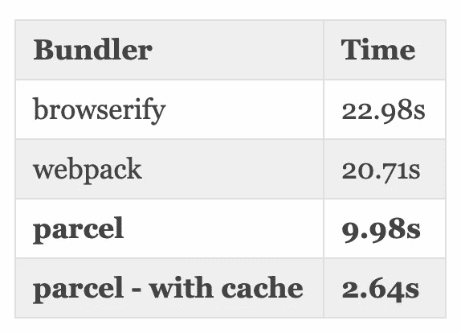
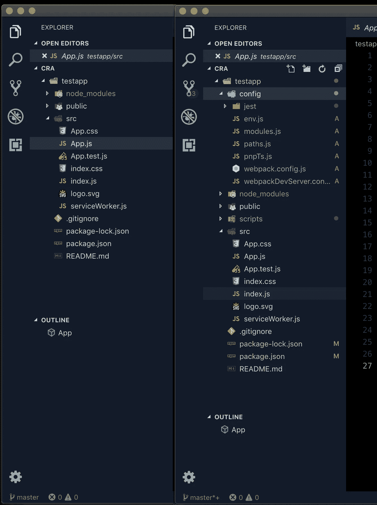
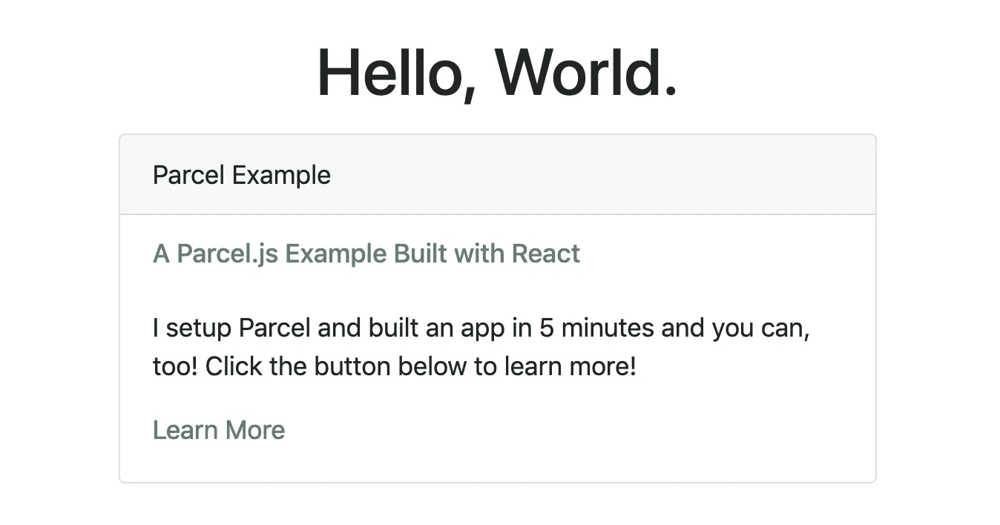

# Parcel.js —简单的 JavaScript 捆绑

> 原文：<https://betterprogramming.pub/parcel-js-easy-javascript-bundling-ecddac0783f7>

## 如何开始零配置 JavaScript 捆绑



现在是 JavaScript 开发人员的大好时机。有成千上万的工具供我们使用，而且工具的质量从来没有这么好过。

我们有 create-react-app、Angular CLI 和 Vue CLI，它们都旨在解决 JavaScript web 应用开发新手需要清除的最大障碍——配置他们的开发环境以真正开始编码。

如今，开发环境的一个主要部分涉及到我们如何在编码时将我们的应用程序提供给浏览器(如果你没有使用提供热模块重载的东西，那你就做错了)，正确配置这一功能以与所有移动部件一起工作可能是一件痛苦的事情，**，但它不一定是这样的。**

我们将使用 Parcel 设置一个基本的 React 应用程序，并亲自体验它的神奇之处。

我想向您介绍 Parcel.js，但首先让我们谈谈什么是 bundler，以及作为一名 JavaScript 开发人员，它为什么对您如此重要。

# 捆绑器是什么？

这是一个有效的问题，即使您已经使用 JavaScript 有一段时间了。在当今的开发工具世界中，捆绑器通常在幕后工作，您可能甚至不知道您正在使用它。Angular、Vue 和 React 工具都依赖于 webpack，如果您使用的是它们用户友好的推荐配置。

Webpack 和其他打包程序将我们的代码和*打包成更小、更少、更高效的文件，这些文件包含我们的代码，但通常是以缩小的形式。这减少了我们应用程序的交付规模，有助于减少代码执行的延迟，并有助于为 web 优化我们的应用程序。*

# 配置蓝调

当 webpack 到来时，它带来了比以前的 bundlers 多得多的好处，但也带来了配置 webpack 的头痛问题。

大多数捆扎机需要一些配置才能使用最基本的功能。对于新用户来说，这可能是一个巨大的进入壁垒，有时这太难了，以至于用户只能放弃。

幸运的是，我上面提到的许多 CLI 工具为我们处理了这种配置，甚至在我们的编辑器中完全隐藏了它，比如在 VS 代码中。这在下图中显而易见，显示了弹出前后的 create-react-app 项目，该项目显示了捆绑器等。



弹出前后 create-react-app 项目中文件的比较。

不幸的是，这仍然没有想象中那么简单，这也意味着我们的应用程序可能没有想象中那么小。这也意味着，在许多情况下，当我们试图合并额外的模块时，我们必须“弹出”或显示模糊的配置，然后弄脏我们的手，试图让捆绑器与我们的新模块玩得更好。

如果您想用最少的配置建立一个新项目，只需要热重新加载(保存文件时自动刷新)、缩小捆绑和您最喜欢的前端库，而不需要配置任何东西，该怎么办？

包裹来救援了。

# 什么是 Parcel.js？

根据他们主页上的标语，[package](https://parceljs.org/)是一个“速度极快、零配置的网络应用捆绑器”。

我承认，当我第一次读到这个的时候，我是怀疑的。不是速度——web pack 也很快——而是“零配置”。

当我第一次开始使用 webpack 时，我一直在奋斗，强迫自己反复阅读文档，直到我真正明白自己在做什么。我做了一个样板文件，除非万不得已，否则我从不碰它。编写 webpack 配置代码并不有趣。

当有人告诉我“就装这个吧，太神奇了！”我扬起一边眉毛走近它。然而，我可以诚实地说，这个包裹是真货。

包将捆绑你的 HTML，CSS，JavaScript 和我的最爱， [TypeScript](https://typescriptlang.org) 没有问题。例如，使用 React，除了基本的`package.json`和`tsconfig.json`之外，无需任何配置，您就可以开始使用`.tsx`文件。您可以轻松地添加第三方库，如 [Bootstrap](https://getbootstrap.com) ，而不会有任何麻烦。

让我们来复习一下如何通过简单的几个步骤带着包裹跑步。

# 创建我们的项目

虽然 Parcel 不需要任何实际的配置，但是如果我们想要一个项目，我们需要创建文件。它不会为你做所有的事情！

我们将创建一个简单的 React 应用程序，这意味着我们需要一些非常基本的文件，以及我们的`package.json`和`.babelrc`。虽然现在我通常用 TypeScript 写所有的东西，但是为了简单起见，我们将使用 JavaScript，但是 Parcel 也支持 TypeScript。继续创建一个新的项目目录，并在该目录中创建以下文件:

```
new-project/
  src/
    index.html
    index.js
.bablerc
.gitignore
```

接下来，我们想用`npm init`初始化我们的新项目。这也将创建我们的`package.json`文件。如果您以前没有这样做过，将会提示您回答一系列问题。您可以接受所有默认设置，也可以提供自己的答案。确保将`entry point`作为默认的`index.js`。

```
**➜** npm init
This utility will walk you through creating a package.json file.
It only covers the most common items, and tries to guess sensible defaults.See `npm help json` for definitive documentation on these fields
and exactly what they do.Use `npm install <pkg>` afterwards to install a package and
save it as a dependency in the package.json file.Press ^C at any time to quit.
package name: (parcel-example)
version: (1.0.0)
description: An React app using Parcel
**entry point: (index.js)** test command:
git repository:
keywords:
author: Christopher Shaffer
license: (ISC)
About to write to /Users/username/code/parcel-example/package.json:{
  "name": "parcel-example",
  "version": "1.0.0",
  "description": "An React app using Parcel",
  "main": "index.js",
  "scripts": {
    "test": "echo \"Error: no test specified\" && exit 1"
},
  "author": "Christopher Shaffer",
  "license": "ISC"
}Is this OK? (yes) yes
```

# 安装包裹

我们现在可以安装包，以及我们的其他依赖项。运行以下命令来安装 package、React 和 Babel 依赖项。

```
npm install --save-dev parcel-bundlernpm install --save react react-domnpm install --save-dev @babel/core @babel/preset-env @babel/preset-react
```

一旦完成，我们可以继续添加一些基本代码来启动我们的应用程序。

# 该编码了！

我们需要向我们的项目添加一些最少的代码，以使一切准备就绪，可以由 package 运行。让我们从将一些 HTML 放到我们的`index.html`文件中开始。

将以下内容添加到`index.html`。

我们还需要为我们的应用程序设置最基本的要素。让我们创建我们的`App`类来开始这个聚会。将以下代码放入您的`index.js`中:

为了启动应用程序，类似于您之前使用 create-react-app 所做的，让我们向`package.json`添加几个管理命令。您可以删除运行`npm init`时创建的`test`命令，或者在那里添加您自己的测试。

在`package.json`中的`scripts`键下进行以下更改:

```
"scripts": {
  **"start": "parcel src/index.html --open",
  "build": "parcel build src/index.html",
  "clean": "rm -rf dist/*"**
},
```

这些命令将允许我们启动应用程序，并在浏览器中自动打开它，为生产构建应用程序，并在我们准备好创建新版本时清除`dist`文件夹。

确保将`.cache`和`dist`添加到您的`.gitignore`文件中，以防止将这些文件夹提交给 Git。为开发和生产构建应用程序时，Parcel 会将`.cache`文件夹用作临时缓存目录。

# 发射

考验我们工作的时候到了。等等……就这样？是啊！包裹真的就这么简单。要启动您的应用程序，请运行`npm start`。这几分钟的编码是如此简单，令人难以置信，但你现在有一个运行的，热重装的，捆绑的 React 应用程序。

不过，我们还没完。让我们通过添加 Bootstrap 来添加一些样式，以查看更多的包裹魔术。

# 变得时尚

我们将向我们的`index.js`添加几个项目，只是为了展示添加样式是多么容易。我将添加 Bootstrap 和 [React Bootstrap](https://react-bootstrap.netlify.com/) ，这将让我们轻松地使用导入组件的 Bootstrap 样式。如果你愿意，你可以添加另一个样式库。

```
npm install --save react-bootstrap bootstrap
```

让我们导入 Bootstrap 和反应 Bootstrap。我们还将向我们的`index.js`添加一些组件和类。

我已经在下面的要点中添加了注释，以指出你应该在哪里进行修改。

# 观看奇迹的发生

让我们在浏览器中快速浏览一下我们的应用程序。我们将会看到我们所有的风格和我们新的`Card`组件已经被添加。



这个添加样式模块的练习的目的是展示您不需要配置任何东西— *它就可以工作。*您的捆绑器不需要任何配置；包裹只是看到你已经添加了 CSS，它自动捆绑到你的应用程序！

# 真的，*真的*轻松道

很简单，对吧？如果我告诉你使用 React、Vue 和/或 TypeScript 有一种更简单的方法，你会相信吗？

一个叫做 [Jakob Lind](https://twitter.com/karljakoblind) 的了不起的家伙在 [createapp.dev](https://createapp.dev) 上创造了一个伟大的工具，它将为你设置好一切，压缩它，并让你下载它来开始你的项目。你只需点击几个你想包含的东西的方框，它就会为你编写代码。该网站也使用 webpack。

当然，我一开始并没有直接跳到这一步，因为至少对如何自己做这件事有一个基本的了解是很重要的。

# 结论

与类似的选择相比，Parcel 无疑使开始一个新项目变得更快更容易，并大大降低了进入的障碍。我希望这篇文章能在你下次需要开始一个新项目时有所帮助。

请在下面的回复中留下您的反馈和意见，我会尽快回答您的问题。

感谢阅读！