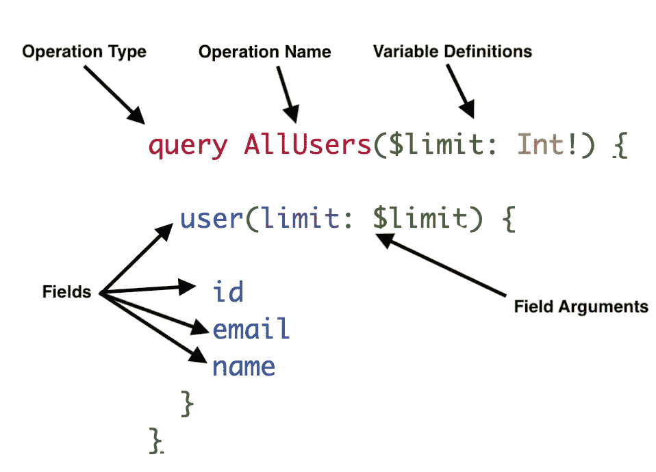

# 如何从 GraphQL 响应中解析 JSON

> 原文：<https://betterprogramming.pub/parsing-json-from-a-graphql-response-854e8a29afef>

## 查询、变异的剖析，以及如何得到你所需要的

由[丹尼斯·库默](https://unsplash.com/@dekubaum?utm_source=unsplash&utm_medium=referral&utm_content=creditCopyText)在 [Unsplash](https://unsplash.com/s/photos/data?utm_source=unsplash&utm_medium=referral&utm_content=creditCopyText) 上拍摄

GraphQL 是一个令人惊奇和激动的新数据服务协议。

我最近很喜欢阅读 Apollo 团队的一篇文章，这篇文章剖析了 GraphQL 请求的结构。围绕 GraphQL 有一个术语是进一步讨论的一个很好的促进因素。

由于 GraphQL 查询的结构具有解剖学，我们可以预期 JSON 会以定义的方式从请求中返回。本文将围绕返回的 JSON 列出一些易于记忆的规则。

# **GraphQL 解剖复习器**

首先，让我们回顾一下 GraphQL 请求的各个部分。

最后一个重要的定义在上面没有显现出来。选择集:GraphQL 上花括号之间的东西`{ }`。选择集存在于每个嵌套级别中。

## 规则

*   所有 GraphQL 请求都返回一个关键字为`data`的字典。关键数据的值是另一个字典。

*   GraphQL 请求中的每个顶级字段都由字典中的一个键表示。
*   顶层关键字的值取决于请求。如果请求是寻找一个唯一的或者主键，那么这个值就是一个字典。如果请求不是针对某个独特的东西，那么它就是一个数组。

下面是一个 GraphQL 请求，它以两种不同的方式请求相同的信息:

这些是结果。请注意，使用筛选器的查询返回一个数组，使用唯一键的查询返回一个字典:

*   在顶级请求被解析之后，字段可以包含标量以及符合规则三的 JSON 对象。
*   变异返回表示该变异元信息的字段。

这是突变的定义:

注意，突变选择集中的字段是关于该突变的元信息。在这种情况下，一些元信息(返回字段)表示您刚刚创建的记录的值。这是对这种突变的反应。

# 结论

最终，确切的 JSON 形式取决于 GraphQL API 开发人员。这些例子是从 PostgreSQL 产品上的令人惊叹和生产力提升的 [Hasura 实时 GraphQL API 中获得的。](https://hasura.io/)

如果这篇文章有错误，请留下反馈！