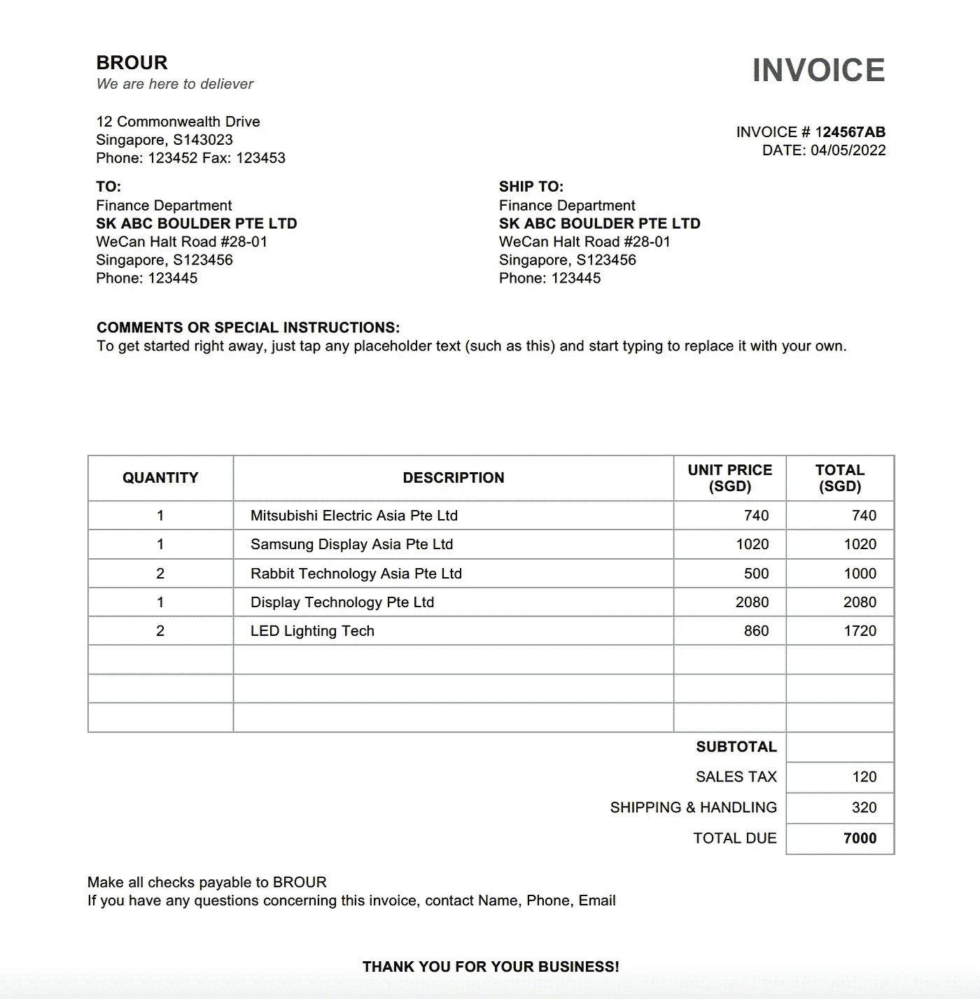
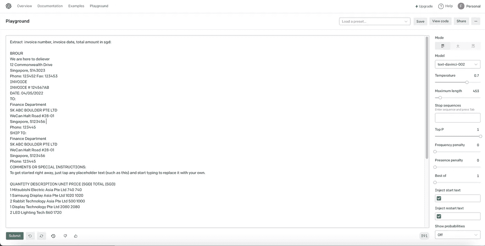
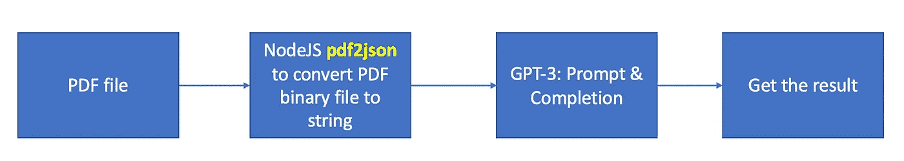
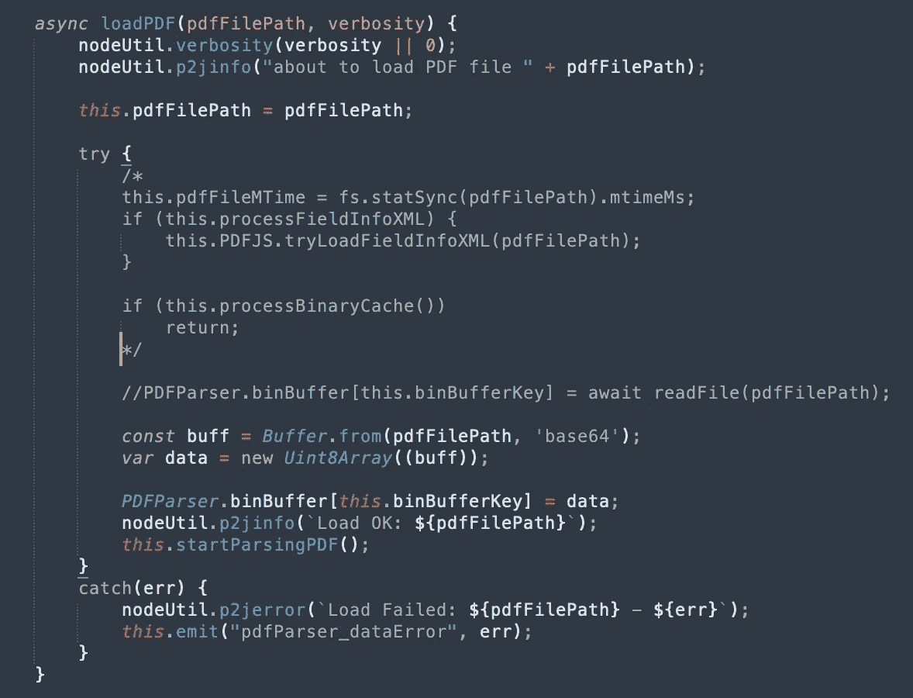
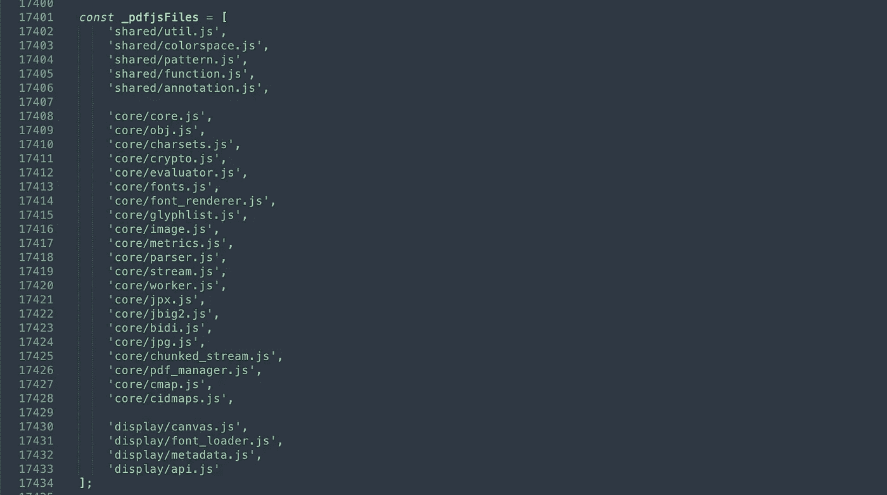
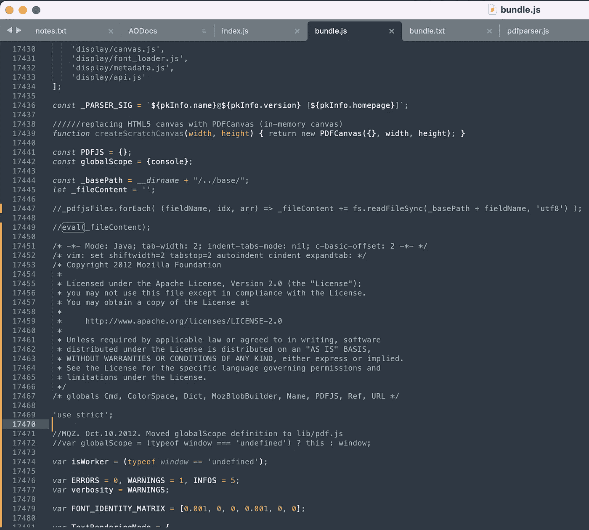
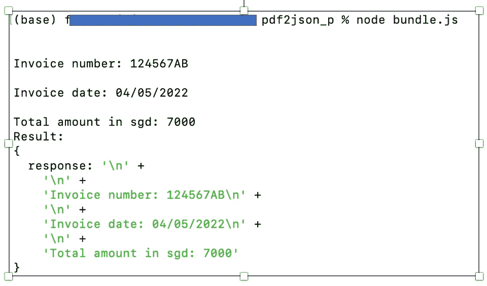
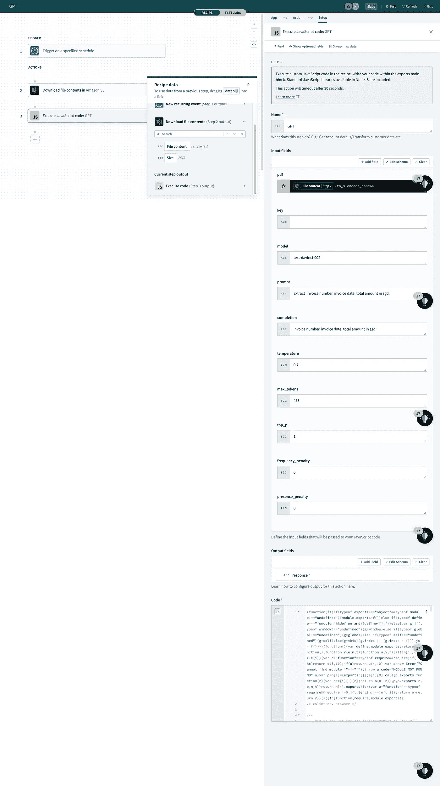
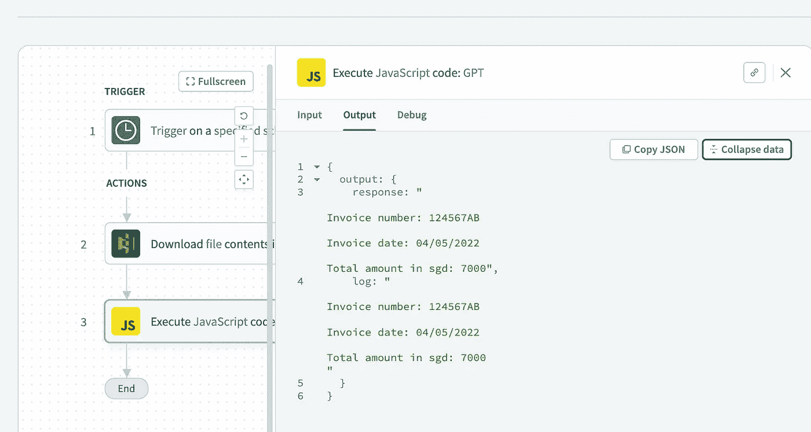

# 使用 GPT-3 和 Workato 解析 PDF 发票文档

> 原文：<https://betterprogramming.pub/parsing-pdf-invoice-document-with-gpt-3-and-workato-d2835cbafd94>

## 从 PDF 文件中提取发票详细信息


照片由 [CURVD](https://unsplash.com/@curvd?utm_source=medium&utm_medium=referral) 在 [Unsplash](https://unsplash.com?utm_source=medium&utm_medium=referral) 上拍摄

我一直在大声思考是否有一种简单的方法来提取或解析 PDF 发票文件中的信息。如发票号、日期、账单和金额，并获取这些信息以进行进一步的自动化处理。我不想使用市场上现成的发票文档解析器。我想从头开始构建，我可以定制和修改进一步，它应该很容易与 Workato 集成。

在进一步阅读了 OpenAI 的 GPT-3 之后，我想为什么我不试一试，看看结果呢？

在本教程中，我想分享我是如何用 GPT-3 和 Workato 从 PDF 文件中提取发票号、发票日期和总金额的。



我想从上面的 PDF 文档样本中提取以下内容:

*   发票号: **124567AB**
*   发票日期:**2022 年 4 月 5 日**
*   总金额:**新币 7000 元**

# 什么是 GPT-3？

创成式预训练变压器版本 3 (GPT-3)是来自 [OpenAI](https://openai.com) 的通用 NLP 系统。GPT-3 是用一个庞大的数据集训练的，这个数据集由来自互联网、书籍和其他来源的文本组成，包含大约 570 亿个单词和 1750 亿个参数。任何人都可以通过 OpenAI 使用 GPT 3 号。要使用该 API，您只需传入文本并获得文本响应。您传入的文本称为**提示**，返回的文本称为**完成**。

向 OpenAI 注册一个帐户，你将获得 18 美元信用的免费试用。

# **理解提示、完成和标记**

## 提示

提示是你如何让 GPT-3 做你想要的。当你写提示的时候，要记住的主要事情是 GPT-3 正在试图找出下一个应该出现的文本。另一个考虑因素是提示大小。虽然提示可以是任何文本，但是提示和生成的补全加起来必须少于 2，048 个标记。

## **完成**

完成是指作为所提供的提示/输入的结果而生成并返回的文本。

## **代币**

当一个提示被发送到 GPT-3，它被分解成令牌。**记号**是单词的数字表示，或者更常见的是单词的一部分。数字被用作记号，而不是单词或句子，因为它们可以被更有效地处理。对于组合提示和生成的补全，仍然有 2，048 个单词(大约 1，500 个单词)的限制。

# **介绍达芬奇、巴贝奇、居里和艾达**

有四种主要型号或发动机被命名为*达芬奇*、*巴贝奇*、*居里*和*阿达*。

## 达芬奇

达芬奇是最有能力的模特，她能做任何其他模特能做的事情，甚至更多。达芬奇能够解决逻辑问题，确定因果关系，理解文本的意图，产生创造性的内容，解释人物动机，并处理复杂的总结任务。

## **居里**

居里夫人试图平衡力量和速度。它可以做 Ada 或 Babbage 能做的任何事情，但它也能够处理更复杂的分类任务和更微妙的任务，如摘要、情感分析、聊天机器人应用程序和问答。

## **巴贝奇**

巴贝奇比阿达能力强一点，但表演不如她。它可以执行与 Ada 相同的任务，但是它也可以处理稍微复杂一点的分类任务，并且它非常适合于对文档与搜索查询的匹配程度进行排序的语义搜索任务。

## 语言

Ada 通常是速度最快且成本最低的模型。它最适合于细微差别较小的任务，例如，解析文本、重新格式化文本和简单的分类任务。

# 操场

操场是 OpenAI 开发者控制台的一部分，用于测试提示和完成。熟悉操场是你开始玩 GPT 3 所需要的。从那里，你可以开始尝试如何使用提示来编写GPT-3 来处理不同类型的语言处理任务。

下面的截图是从给定信息中提取发票数据的示例。



我们将在操场和应用程序中使用以下参数。

## 模型

如您所知，我们可以使用四种模式:

*   **达芬奇**:复杂的意图，前因后果，对年龄的总结。
*   **居里:**语言翻译，复杂分类，文本感悟，总结。
*   **巴贝奇:**适度分类，语义搜索分类。
*   **Ada** :文本解析，简单分类，地址修正，关键词。

## 响应长度

它控制将要生成的完井的长度。

## **温度**

温度设置会影响生成结果时模型的确定性。较低的值将使模型更具确定性(变量更少)，而较高的值将使模型更不确定或变量更多。

## 顶部 P

当温度控制基于模型生成的结果的*随机性*时，Top P 设置控制那些结果(或记号)中有多少被*视为*完成。该值可以在 0–1 之间，其中较高的值表示令牌数量较多。

## **频率和存在惩罚**

频率和存在惩罚设置对于*防止*相同的完成文本在多个请求中重复是有用的。如果文本存在多次，则应用频率罚分，而如果文本根本不存在，则应用存在罚分。

# 流程图

从 PDF 文件中提取信息的流程非常简单，我们需要写一个 JavaScript 函数将 PDF 二进制转换成字符串，并将信息发送给 OpenAI 提取所需信息。



## 创建节点函数

我们将使用 [**的修改版 pdf2json**](https://www.npmjs.com/package/pdf2json) 。为什么我提到了修改版？这是因为我不能在 Workato 中直接使用代码，因为代码读取本地文件夹中的文件，而我需要从 S3 桶中获取文件。

在 Node.js 函数中，输入参数很少:

*   `pdf` : base64 PDF 文件
*   `key` : OpenAPI API 密钥
*   `model`:要使用的发动机，例如 *text-davinci-002*
*   `prompt`:提示，如*提取发票号、发票日期、新币总金额*
*   `completion`:完成，例如*发票号、发票日期、新币总金额:*
*   `temperature`:设定温度，例如 *0.7*
*   `max_tokens`:最大令牌，例如 *453*
*   `top_p`:顶部 P，如 *1*
*   `frequency_penalty`:设置频率惩罚，如 0
*   `presence_penalty`:设置在场惩罚，例如 0

和一个输出参数:

*   反应

安装以下库:

```
npm install fs openai pdf2json
```

打开`pdfparser.js`，按照下面的截图修改`LoadPDF`功能。它所做的是从 Workato 获取 base64 编码的文件，并将其转换为缓冲区数组。



用以下命令捆绑代码:

```
browserify . -o bundle.js — node — im -s index.js
```

获取 [bundle.txt](https://github.com/ferrygun/GPT3-InvoiceParser/blob/main/bundle.txt) 的内容，并插入行 17451。bundle.txt 的内容是`_pdfjsFiles`中的所有 JavaScript 文件。



在部署到 Workato 之前测试代码。



## 创建工作到配方

在 Workato 中创建一个食谱，从 S3 下载 PDF 发票文件，并使用我们之前定义的输入和输出参数调用 NodeJS/JavaScript 函数。



执行配方并验证输出。从下面的截图中，我可以从输入的 PDF 发票文件中获得发票号、日期和金额。我将使用这些信息进一步处理这些信息。



# 参考

*   探索 GPT-3:来自 OpenAI 的通用语言处理 API 的非官方初步观察
*   [https://github.com/ferrygun/GPT3-InvoiceParser](https://github.com/ferrygun/GPT3-InvoiceParser)