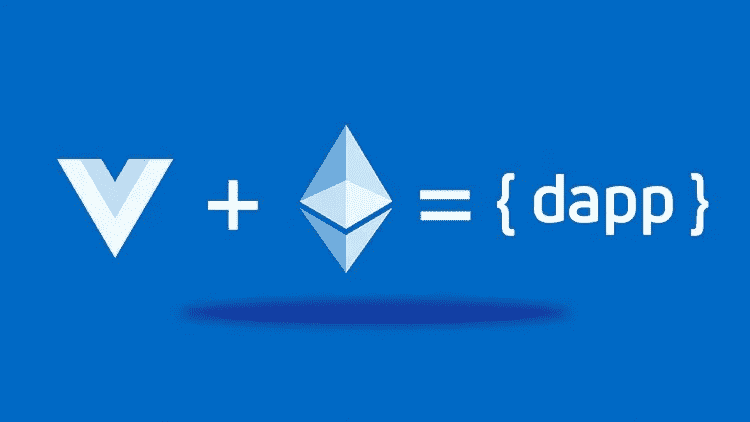
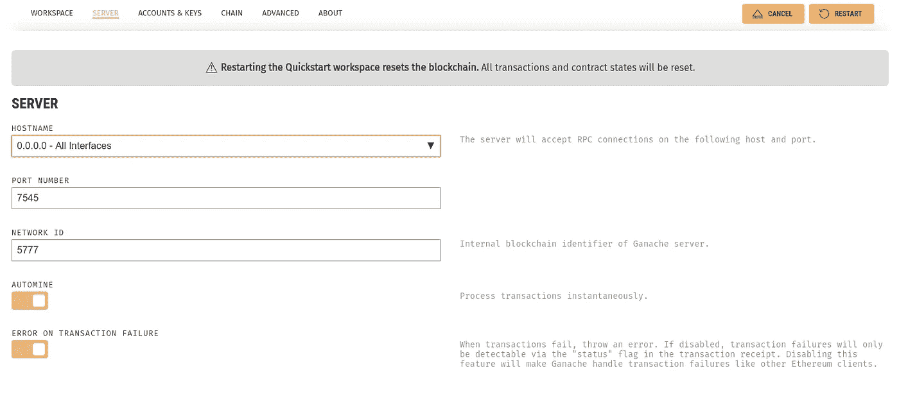

# 学习核仁巧克力饼的基本知识

> 原文：<https://betterprogramming.pub/part-1-brownie-smart-contracts-framework-for-ethereum-basics-5efc80205413>

## 以太坊的智能合约框架



[Brownie](https://github.com/iamdefinitelyahuman/brownie) 是一个健壮、易用的框架，用于开发以太坊智能合约。使用案例包括:

*   **部署**:自动将许多合同部署到区块链上，以及初始化或集成它们所需的任何事务。
*   **交互**:编写脚本或使用控制台在 mainnet 上与您的合同进行交互，或者在本地环境中进行快速测试。
*   **调试**:当事务恢复时获取详细信息，帮助您快速查明问题。
*   **测试**:用 Python 编写单元测试，基于栈跟踪分析评估测试覆盖率。我们不做任何承诺。

让我们在 Solidity 中创建一个非常简单的智能契约，只暴露两个外部函数，`getValue`和`setValue`。将此智能合同保存在文件中，`smart_contract.sol`。

```
pragma solidity ^0.5.11;contract SimpleContract {
     uint value;
     function setValue(uint _value) external {value = _value;}
     function getValue() external view returns(uint){return value;}       
}
```

让我们试着用 Brownie 部署这个智能契约并与之交互。

# 设置

我们将使用 Python 3.7 和 virtualenv 来隔离我们的环境。如果您没有安装 Python 3.7，请按照以下步骤操作。

```
sudo add-apt-repository ppa:deadsnakes/ppa          
sudo add-apt-repository ppa:ethereum/ethereum
sudo apt-get update
sudo apt install -y python3.7
sudo apt-get install -y python3.7-dev python3-pip virtualenv python-dev solc
```

我们将使用 [Ganache](https://www.codeooze.com/blockchain/ethereum-dev-environment-2019/) (以太坊开发的个人区块链)。你可以安装`ethereum-testrpc`，但是这样我们就不能运行图形界面了。请按照这里提到的步骤安装 Ganache。

为你的 Solidity 项目创建一个虚拟环境。我把它命名为`TestBrownie`。安装布朗尼。

```
pip install eth-brownie
```

要初始化一个空项目，首先创建一个新文件夹。在该文件夹中，键入:

```
brownie init
```

# 项目的结构

每个布朗尼项目都包括以下文件夹:

*   `contracts/`:合同来源
*   `interfaces/`:接口来源
*   `scripts/`:部署和交互脚本
*   `tests/`:测试项目的脚本
*   `brownie-config.yaml`:项目配置文件

Brownie 内部也创建并使用以下文件夹来管理项目。您不应编辑或删除这些文件夹中的文件。

*   `build/`:项目数据，例如编译器工件和单元测试结果
*   `reports/`:在 GUI 中使用的 JSON 报告文件

# **编译**

在`contracts`目录中复制您的智能合同`smart_contract.sol`。要编译项目的`contracts/`子文件夹中的所有合同源:

```
$ brownie compile
```

每次编译器运行时，Brownie 都会将每个合同源的散列与现有编译版本的散列进行比较。如果契约没有改变，它就不会被重新编译。如果您希望强制重新编译整个项目，请使用`brownie compile --all`。

如果你想编译一个不同版本的 Solidity 契约，只需在你的`.sol`文件的编译指示中提到它。如果没有，它将自动安装。这里要注意一件事:

编译器的设置可在`brownie-config.yaml`中找到。

```
**evm_version**: null
**minify_source**: false
**solc**:
    **version**: 0.6.0
    **optimize**: true
    **runs**: 200
```

修改任何编译器设置都将导致项目的完全重新编译。

如果在配置文件中设置了编译器版本，则项目中的所有协定都将使用该版本进行编译。版本应该以字符串的形式给出`0.x.x`。

如果版本设置为`null`，Brownie 会查看每个契约的[版本杂注](https://solidity.readthedocs.io/en/latest/layout-of-source-files.html#version-pragma)，并使用已安装的最新匹配编译器版本。

关于`evm_version`，Brownie 根据编译器设置规则集。

*   **拜占庭**:坚固度< =0.5.4
*   **彼得斯堡**:坚固度> =0.5.5 < =0.5.12
*   **伊斯坦布尔**:坚实度> =0.5.13，Vyper

您也可以手动设置 EVM 版本。有效选项有`byzantium`、`constantinople`、`petersburg`和`istanbul`。您也可以使用以太坊经典规则集`atlantis`和`agharta`，它们在被传递给编译器之前会被转换成它们的以太坊等价规则。

**注:** Brownie 支持 Solidity 版本> =0.4.22 和 Vyper 版本 0.1.0-b16。

成功编译后，Brownie 将在 builds/contract 文件夹中创建一个`SimpleContract.json`文件。

## **展开**

如果你打开`brownie-config.yaml`，它有一个网络部分。您可以自定义现有网络，也可以在“网络”下创建新的块。我使用的是 Ganache GUI，它运行在端口 7545 上。



我在网络下创建了一个私有块。

```
network:
    default: development # the default network that brownie connects to
    settings:
        gas_limit: "auto"
        gas_price: "auto"
        persist: true
        reverting_tx_gas_limit: false  # if false, reverting tx's will raise without broadcasting
    networks:
        # any settings given here will replace the defaults
        private:
            host: [http://127.0.0.1:7545/](http://172.28.128.1:7545/)
            gas_price: 0
            persist: false
```

保存此文件。现在，为了部署我们编译的智能契约，我们将使用 Brownie 控制台。当您希望直接与部署在非本地链上的契约进行交互，或者在开发过程中进行快速测试时，控制台非常有用。这也是熟悉 Brownie 功能的一个很好的起点。

控制台感觉非常类似于常规的 Python 解释器。在项目文件夹中，通过键入以下命令来加载它:

```
$ brownie console
##if you want to use a specific network entioned in your config file, use
$ brownie console --network private
##this will connect your brownie console with your ganache private ##network.
Brownie v1.5.1 - Python development framework for EthereumProject is the active project.
Brownie environment is ready.
```

让我们探索。

您可以将输出中的帐户与 Ganache GUI 上显示的帐户进行交叉检查。

```
>>> from brownie import accounts
>>> accounts
[<Account '0xd5373B59FDF14e9F1f5cc858eCAE0e6662FfedC1'>, <Account '0x533D7aa17435Ee227FdC30BA94fF8a509532D776'>, <Account '0x40E29Ca2269785f2F53d7E41006FC83eb3df4D0a'>, <Account '0x537f82751024Ed22F9f943e32A30e47B5A1Da6Df'>, <Account '0x28556574cfE7331738FadEE2fb6eC2630A9C142b'>, <Account '0xfe96534827B237951d4Ab4018Ff8c014B8918521'>, <Account '0xF32D5DfeCf6e1F6Fb2b29DF29Aba8fBd6bCB9D9E'>, <Account '0x88fdA9f0938A1fB5C5C902aeA8Bf28dE76d5467f'>, <Account '0xf6FAdCF3e805E61B1051A610a38365c74310ecCc'>, <Account '0x42904B9429E8d0599b90d6E24dF578684c0E03d3'>]
```

每个帐户都由一个可以执行操作的`[Account](https://eth-brownie.readthedocs.io/en/stable/api-network.html#api-network-account)`对象表示，比如查询余额或发送 ETH。

```
**>>>** accounts[0]
<Account '0xd5373B59FDF14e9F1f5cc858eCAE0e6662FfedC1'>
**>>>** dir(accounts[0])
[address, balance, deploy, estimate_gas, nonce, transfer]
**>>>** accounts[1].balance()
100000000000000000000
**>>>** accounts[0].transfer(accounts[1], "10 ether")Transaction sent: 0xb9738009af0a8b721bca854572ce21622ebfeb2aca5d89eccfc55dfd42a5d202
  Gas price: 0.0 gwei   Gas limit: 21000
  Transaction confirmed - Block: 1   Gas used: 21000 (100.00%)<Transaction '0xb9738009af0a8b721bca854572ce21622ebfeb2aca5d89eccfc55dfd42a5d202'>
**>>>** accounts[1].balance()
110000000000000000000
```

每个可部署的契约和库都有一个用于部署新契约和访问现有契约的`[ContractContainer](https://eth-brownie.readthedocs.io/en/stable/api-network.html#api-network-contractcontainer)`类。所有被编译的契约将作为同名的变量可用。

```
>>> type(SimpleContract)
<class 'brownie.network.contract.ContractContainer'>
>>> SimpleContract
[]
>>> SimpleContract.abi
[
    {
        'constant': True,
        'inputs': [],
        'name': "getValue",
        'outputs': [
            {
                'internalType': "uint256",
                'name': "",
                'type': "uint256"
            }
        ],
        'payable': False,
        'stateMutability': "view",
        'type': "function"
    },
    {
        'constant': False,
        'inputs': [
            {
                'internalType': "uint256",
                'name': "_value",
                'type': "uint256"
            }
        ],
        'name': "setValue",
        'outputs': [],
        'payable': False,
        'stateMutability': "nonpayable",
        'type': "function"
    }
]
>>> accounts[0]
<Account '0xd5373B59FDF14e9F1f5cc858eCAE0e6662FfedC1'>
```

使用帐户`0`部署合同:

```
>>> accounts[0].deploy(SimpleContract)
Transaction sent: 0xf0681bafbeae7e36de5a944fe247b6a8e08289906b602e986a5a8ca2c39d0df3
  Gas price: 0.0 gwei   Gas limit: 100127
  SimpleContract.constructor confirmed - Block: 2   Gas used: 100127 (100.00%)
  SimpleContract deployed at: 0x531afb27345047755741513b4dC70AD35e6F986b<SimpleContract Contract '0x531afb27345047755741513b4dC70AD35e6F986b'>
```

如果您键入`SimpleContract`，您可以看到一个已部署的`SmartContract`实例的列表，它是一个`ContractContainer`对象。

```
>>> SimpleContract
[<SimpleContract Contract '0x531afb27345047755741513b4dC70AD35e6F986b'>]
```

# **互动**

参见本合同上的可用方法:

```
>>> SimpleContract.signatures
{
    'getValue': "0x20965255",
    'setValue': "0x55241077"
}
```

让我们从在智能契约中设置一个变量开始。

```
>>> tx = SimpleContract[0].setValue(10000)
Transaction sent: 0x8efb92f53c3995294597b13b81c2b067e1cece2c29333accde7e9e7f61ee1acc
  Gas price: 0.0 gwei   Gas limit: 41717
  SimpleContract.setValue confirmed - Block: 4   Gas used: 41717 (100.00%)
```

每个事务返回一个`[TransactionReceipt](https://eth-brownie.readthedocs.io/en/stable/api-network.html#api-network-tx)`对象。该对象包含关于事务的所有相关信息，以及在事务被恢复时帮助调试的各种方法。

要获得交易的可读信息，请使用`TransactionReceipt.info()`。

```
>>> tx.info()
Transaction was Mined 
---------------------
Tx Hash: 0x8efb92f53c3995294597b13b81c2b067e1cece2c29333accde7e9e7f61ee1acc
From: 0xd5373B59FDF14e9F1f5cc858eCAE0e6662FfedC1
To: 0x531afb27345047755741513b4dC70AD35e6F986b
Value: 0
Function: SimpleContract.setValue
Block: 4
Gas Used: 41717 / 41717 (100.0%)
```

要进行检查，请使用:

```
>>> SimpleContract[0].getValue()
10000
```

在下一节中，我将尝试探索 Brownie 中的测试。布朗尼有很多好吃的。

我的 Eth 地址:0x 01445 b 7d 9d 63381d 0e 7a 6d 8556 f 62 a 24197 bea 1f

我的比特币地址:BC 1 qhdzydl 7 kwjk 8 rez nvj 3 yd 6s 0cg 7 e 7 r 2 SAS gfxc