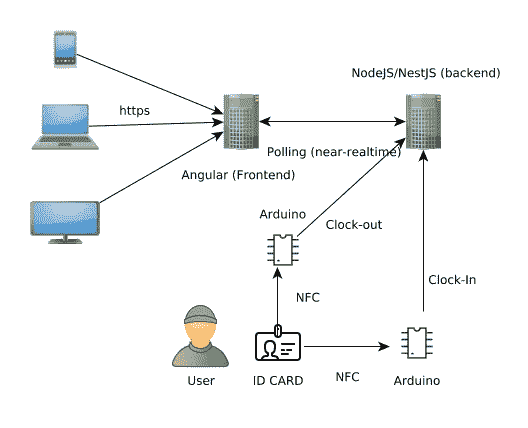
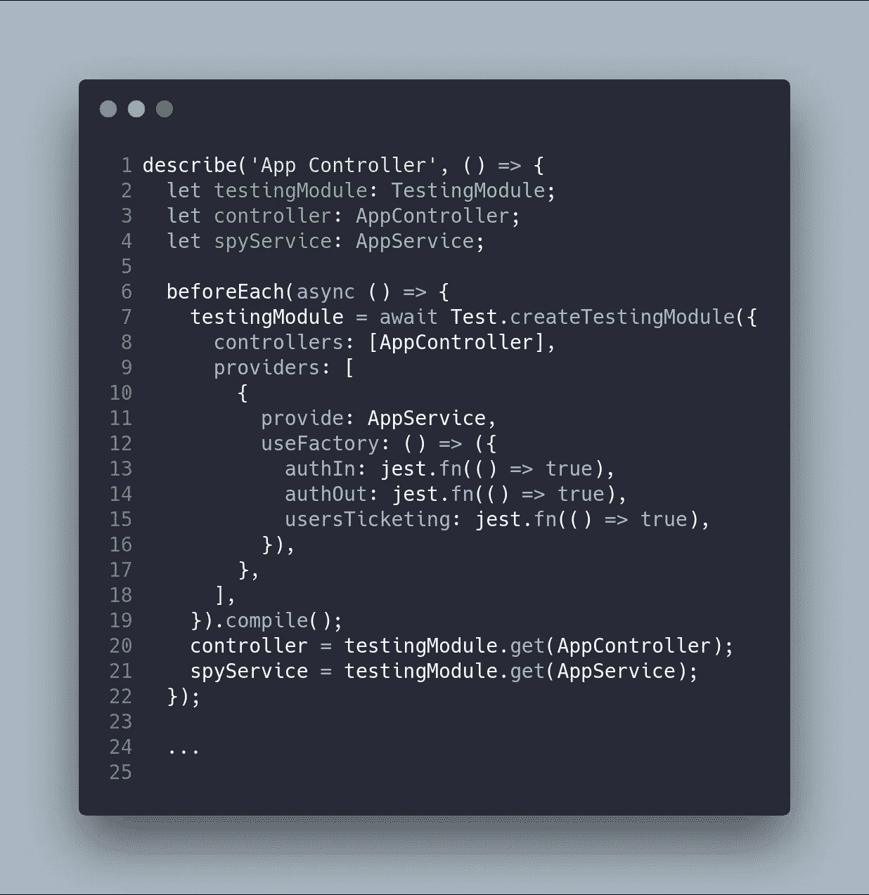
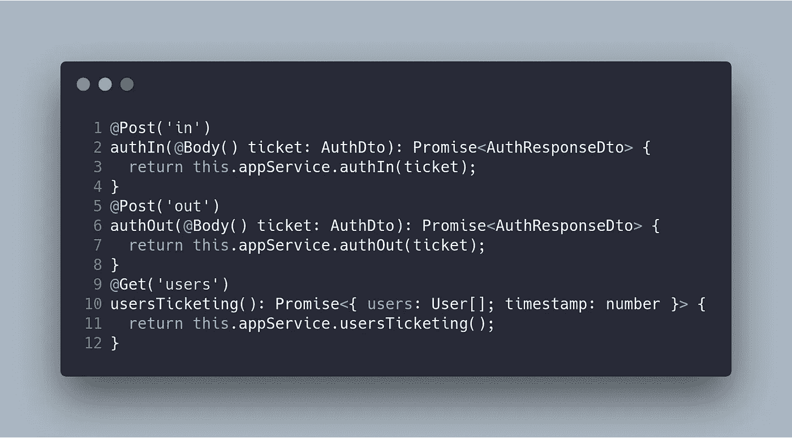
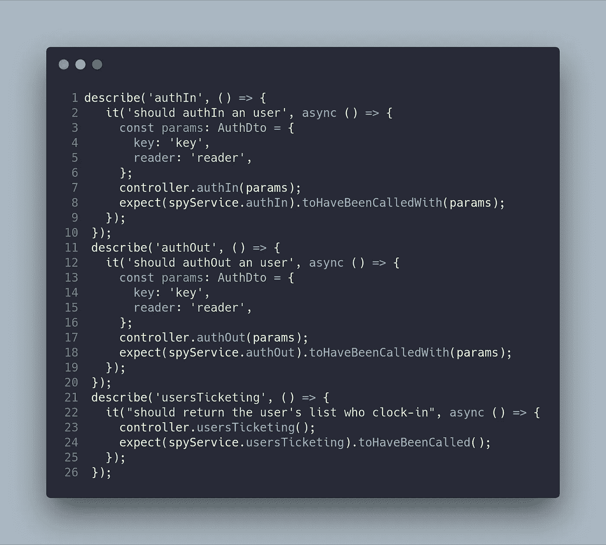
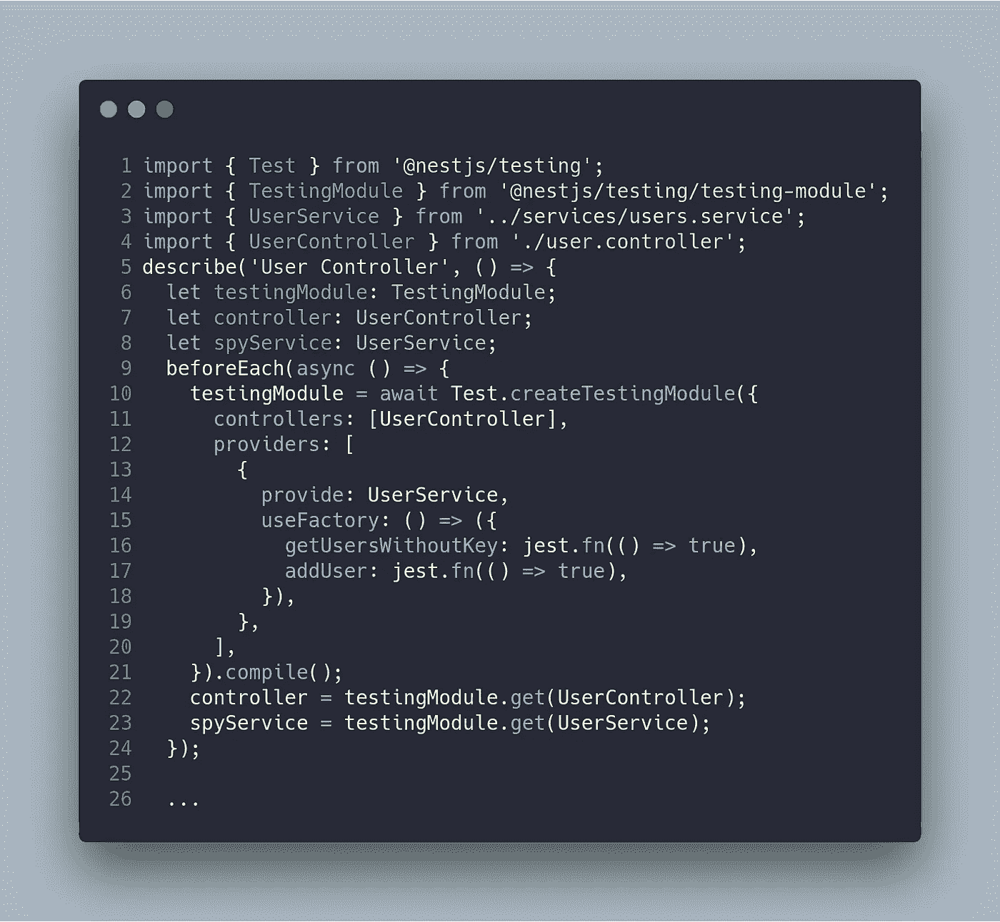
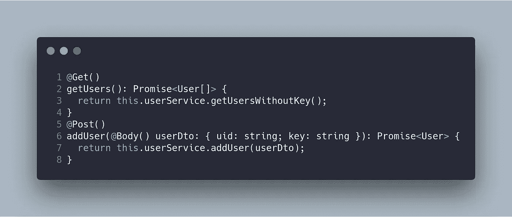
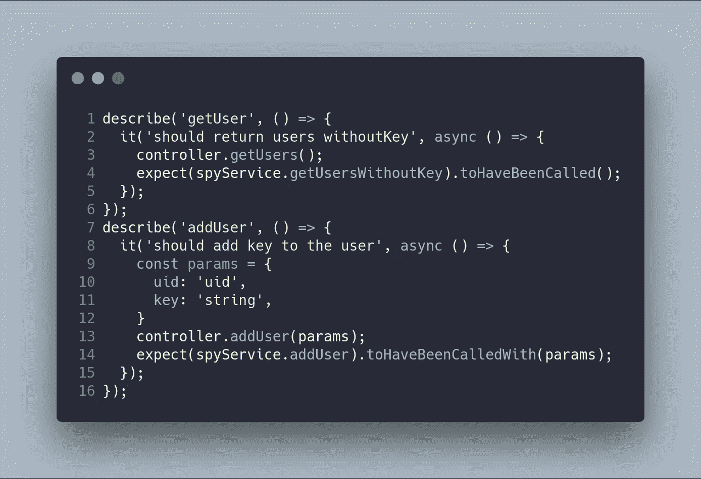

# 上下班打卡系统第 10 部分:后端测试控制器的单元测试

> 原文：<https://betterprogramming.pub/part-10-testing-backend-testing-unit-testing-controllers-4177370ef581>

## NestJS + Angular 教程

这篇文章是我描述上下班打卡系统的系列文章的一部分。如果你想了解更多，你可以阅读以下内容:

*   [上下班打卡系统第 1 部分:图](https://medium.com/@ccaballero/part-1-clock-in-out-system-diagram-a0a51bab02a7?source=post_page---------------------------)
*   [上下班打卡系统第二部分:基础后端— AuthModule](https://medium.com/better-programming/part-2-clock-in-out-system-basic-backend-i-authmodule-66d4a5c56122?source=post_page---------------------------)
*   [上下班打卡系统第 3 部分:基本后端——用户模块](https://medium.com/better-programming/part-3-clock-in-out-system-basic-backend-ii-usersmodule-a56f42b20f62?source=post_page---------------------------)
*   [上下班打卡系统第 4 部分:基础后端— AppModule](https://medium.com/better-programming/part-4-clock-in-out-system-basic-backend-iii-appmodule-850dd17883e?source=post_page---------------------------)
*   [上下班打卡系统第 5 部分:种子数据库和迁移数据](https://medium.com/better-programming/part-5-clock-in-out-system-seed-database-and-migration-data-cf037be21aac?source=post_page---------------------------)
*   [上下班打卡系统第 6 部分:基本前端](https://medium.com/@ccaballero/part-6-clock-in-out-system-basic-frontend-an-7e5f9ed08c3f?source=post_page---------------------------)
*   [上下班打卡系统第 7 部分:使用 Docker/Docker-Compose 部署后端(NestJS)](https://medium.com/@ccaballero/part-7-deploy-backend-nestjs-docker-docker-compose-2429c0b6aa9c?source=post_page---------------------------)
*   [上下班打卡系统第 8 部分:使用环境部署前端(角度 6+)](https://medium.com/@ccaballero/part-8-clock-in-out-system-deploy-frontend-angular-6-using-environments-ad267325d3b6?source=post_page---------------------------)
*   [上下班打卡系统第 9 部分:后端测试——服务的单元测试](https://medium.com/@ccaballero/part-9-testing-backend-testing-2d021f48403b?source=post_page---------------------------)
*   [上下班打卡系统第 10 部分:后端测试——控制器单元测试](https://medium.com/@ccaballero/part-10-testing-backend-testing-unit-testing-controllers-4177370ef581?source=post_page---------------------------)
*   上下班打卡系统第 11 部分:后端测试-e2e 测试
*   上下班打卡系统第 12 部分:前端测试单元测试
*   上下班打卡系统第 13 部分:前端测试集成测试

# 后端测试概述

这是关于后端测试的第二部分，也可以认为是关于质量评估(QA)的第二部分。

这个项目不是从一开始就使用测试驱动开发(TDD)开发的，但我目前正在测试阶段进行。多亏了测试阶段，我发现了很多小错误。如果这个项目已经投入生产，这可能是一个大问题。事实是，该项目将在接下来的几周内进入生产模式。这些测试对于修复目前已经发现的几个 bug 非常有用。

测试的第一步是决定你应该测试什么。人们可能会说，你必须测试整个应用程序，你必须获得接近 100%的覆盖率。事实上，你不需要测试整个应用程序——但是你必须测试软件中最关键的部分。这可能接近 90%或 70%，取决于您的应用程序。

在我们的例子中，我将建议我们应该测试服务(app.service、user.service 和 auth.service)和控制器(app.controller、user.controller)。不需要测试 d to、常量、实体或模块。那些测试很难，价值也很小。

后端使用 [NestJS](https://nestjs.com/) 框架开发，该框架使用 [Jest](https://jestjs.io/) 作为测试工具。此外，NestJS 包括一个强大的测试包，它模拟了一个类似于[角度测试包](https://angular.io/guide/testing)的环境。

# 控制器的测试

在这篇文章中，我将描述控制器单元测试。在服务单元测试之后，控制器单元测试是测试金字塔中最简单的测试。我对那些开始从事测试工作的人的建议是，从对服务进行单元测试开始。这些都是小功能，有独特的任务，很容易被隔离。控制器单元测试在服务测试之后进行，因为控制器经常调用服务方法。

# 应用控制器

我们要测试的第一个控制器是`app.controller.ts`，它使用服务`AppService`。我们的测试套件必须检查`app.service`将使用正确的参数调用方法。

第一步包括我们将要开发的每个测试的初始配置。`app.controller.ts`在其构造函数(`AppService`)中需要一个服务，这将是一个间谍。来自`@nestjs/testing`的`Test`包提供了创建测试模块进行测试的方法`createTestingModule`。在这个`testingModule`中，`providers`数组由`AppController`和一个使用工厂创建的间谍来拦截`AppService`组成。以下代码向您展示了这一初始配置:

下一步包括知道我们想要测试什么。主要思想是独立于任何其他函数/方法来测试每个函数/方法。以下方法是`app.controller.ts`的代码:

`authIn`、`authOut`和`usersTicketing` 方法应检查是否使用正确的参数调用了`appService`。在我们的例子中，测试是单元测试，因此不应该使用真正的函数/方法来调用这些方法。这就是为什么我们用间谍来做这些事。测试函数的代码如下:

在之前的测试中，您可以注意到`expect`与方法`authIn`、`authOut`和`usersTicketing`相关。它检查这些方法是否被调用，参数是否正确。方法`authIn`或`authOut`中抛出的错误是不相关的，因为在这些方法中责任被委托给了`AppService`。

# 用户控制器

测试用户控制器的程序与在`app.controller.ts`中使用的程序相同。第一步是创建测试模块，其中包含将在下面的测试中使用的 spy 和控制器。

这些方法非常容易测试，因为使用的技术与`app.controller.ts`中的相同。要测试的代码如下:

它的测试套件只检查方法`getUsersWithoutKey`和`addUser`是否是用正确的参数调用的，如下面的代码所示:

# 结论

在本文中，我解释了如何使用 Jest 和 NestJS 框架测试后端控制器。如果你知道间谍是如何工作的，这些测试是非常容易的。事实上，控制器经常调用服务的方法。

在下一篇文章中，我将向您展示如何进行后端 e2e 测试。

*   GitHub 项目是[https://github.com/Caballerog/clock-in-out](https://github.com/Caballerog/clock-in-out)。
*   这个帖子的 GitHub 分支是[https://GitHub . com/Caballerog/clock-in-out/tree/part 9-back end-unit-test](https://github.com/Caballerog/clock-in-out/tree/part9-backend-unit-test)。