# 上下班打卡系统第 2 部分:基本后端—认证模块

> 原文：<https://betterprogramming.pub/part-2-clock-in-out-system-basic-backend-i-authmodule-66d4a5c56122>

## NestJS + Angular 教程

这篇文章是我描述上下班打卡系统的系列文章的一部分。如果你想了解更多，你可以阅读以下内容:

*   [TypeORM](https://medium.com/@ccaballero/part-1-clock-in-out-system-diagram-a0a51bab02a7#/) 作为 ORM，它完美地集成在 NestJS 中。我们对`database.module`的定义如下: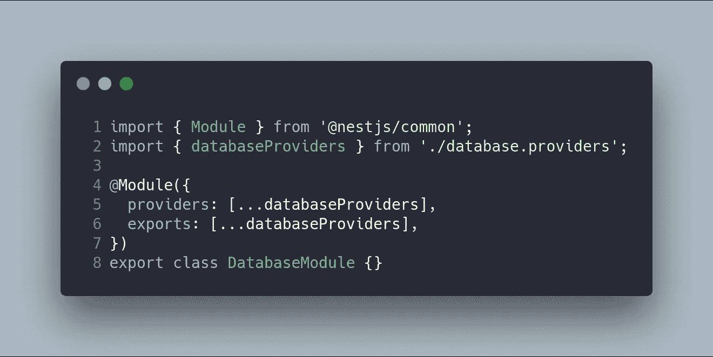

    在提供者中，我们使用工厂来定义我们的`DbConnectionToken`。在我们的例子中，我们使用 Postgres 作为数据库。最有趣的部分是实体的定义，这是在 TypeORM 中自动检测到的。尽管 NestJS 包含一个特定的模块来管理 TypeORM 连接，但我更喜欢使用 TypeORM 库中的方法`createConnection`直接配置提供者。

    此时，我们必须在节点中安装以下库:

    `npm i typeORM pg`

    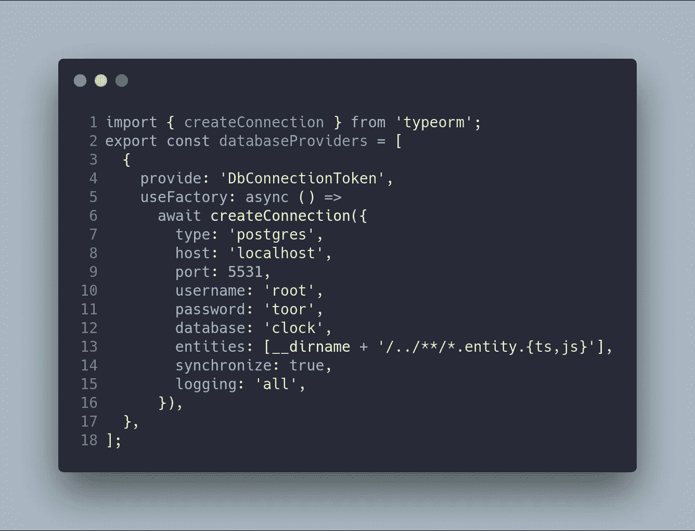

    下一步是在您的机器上安装一个数据库 Postgres。但是我认为使用 Docker 是一个更好的选择，因为你可以得到一个干净的开发环境，在你部署的时候也是一样的。

    使用端口 5531 的容器`docker-compose`如下所示:

    

    要启动系统数据库，只需运行命令`docker-compose up`。其他模块将使用此模块连接到数据库。

    # 授权模块

    我们实现的第二个模块是`AuthModule`。该模块的结构如图 3 所示。您可以注意到，有几个目录，如常量、d to 和实体，它们用于将一个模块独立地组织为一个服务。想法是将模块构建为服务，因为任何一天你都可以构建微服务。然而，在这个项目中，所有模块之间都有关系，因为这个项目的架构非常复杂。

    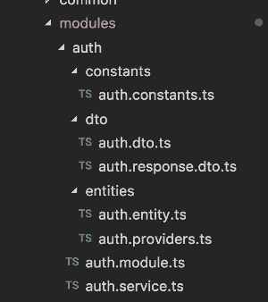

    图 3。

    在`**auth.module**`的定义中你可以看到导入`DatabaseModule`和`UsersModule`。`DatabaseModule`用于连接数据库(如前所示),`UsersModule`用于检查`AuthModule`中的用户信息。服务`AuthService`被导出，因为未来的 AppController 将使用该服务。

    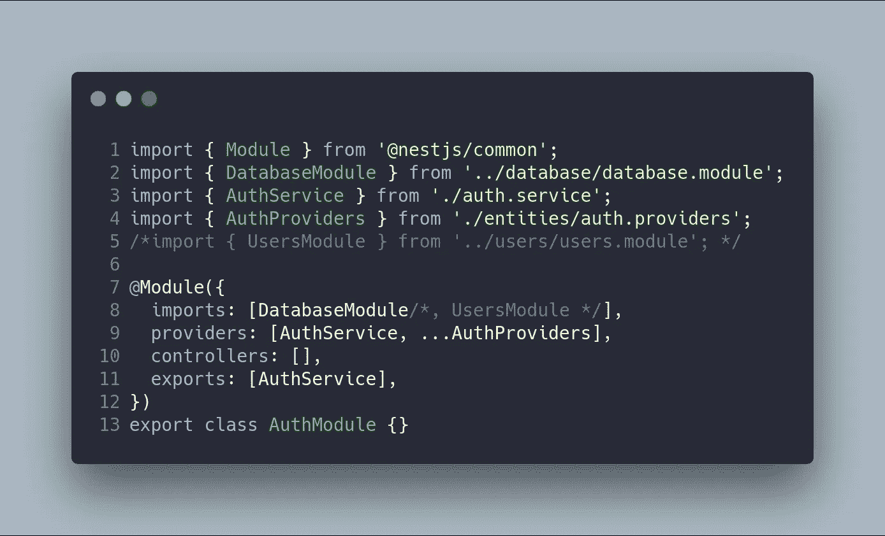

    # 实体

    下一步是知道信息保存在数据库中。这是使用文件`user.entity`定义的。

    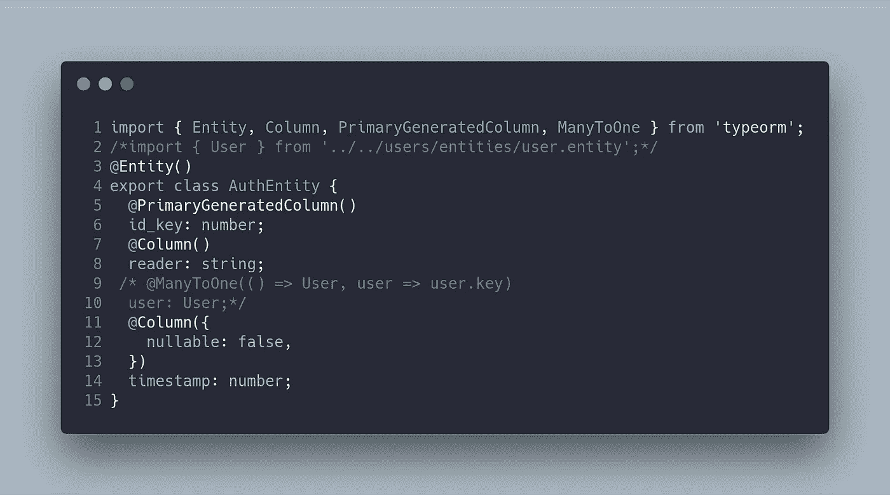

    类别`AuthEntity`中的字段如下:

    那是 UID 的表格。该字段由 TypeORM 自动生成。

    `**reader**`:发送用户密钥的设备。在这个项目中，有两个阅读器:`Input`和`Output`。

    `**user**`:这就是`Auth`和`User`的关系。在 TypeORM 中，您可以使用 decorator `@ManyToOne`为每个用户定义几个身份验证条目。该关系使用用户的字段键。在`User`实体中，需要用逆向装饰器(`@OneToMany`)定义字段键。在后面的文章中，我们将描述这个模块。

    `**timestamp**`:根据 Unix 时间戳，这是输入或输出完成的时刻。这非常重要，因为我们需要知道用户进出系统的准确时间。

    最后，提供者文件导出两个存储库，以便快速访问数据库。使用的图案是`Repository`。您可以在任何服务或控制器中使用这些提供者的令牌(`AUTH_REPOSITORY_TOKEN`和`USER_REPOSITORY_TOKEN`)来注入它们。

    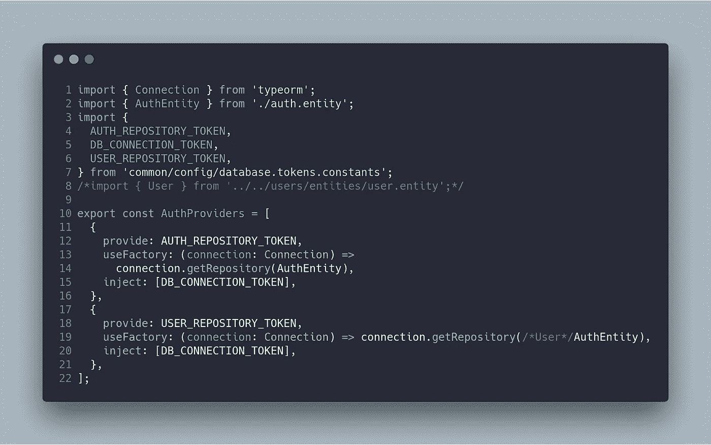

    # 常数和 dto

    现在我将展示我的代码中最简单但非常重要的部分:`constant`文件和`DTO`。当你想写干净的代码时,`constant`文件非常有用——在你的代码中不使用字符串或数字是个好习惯。`DTO`定义了客户端和服务器端之间交换的信息。‌

    `auth.constant`文件只有对 Arduino 系统的 STATUS_CODE_RESPONSE，Arduino 系统将 *0* 理解为 KO，将 *2* 理解为 OK，还有几种力矩格式。

    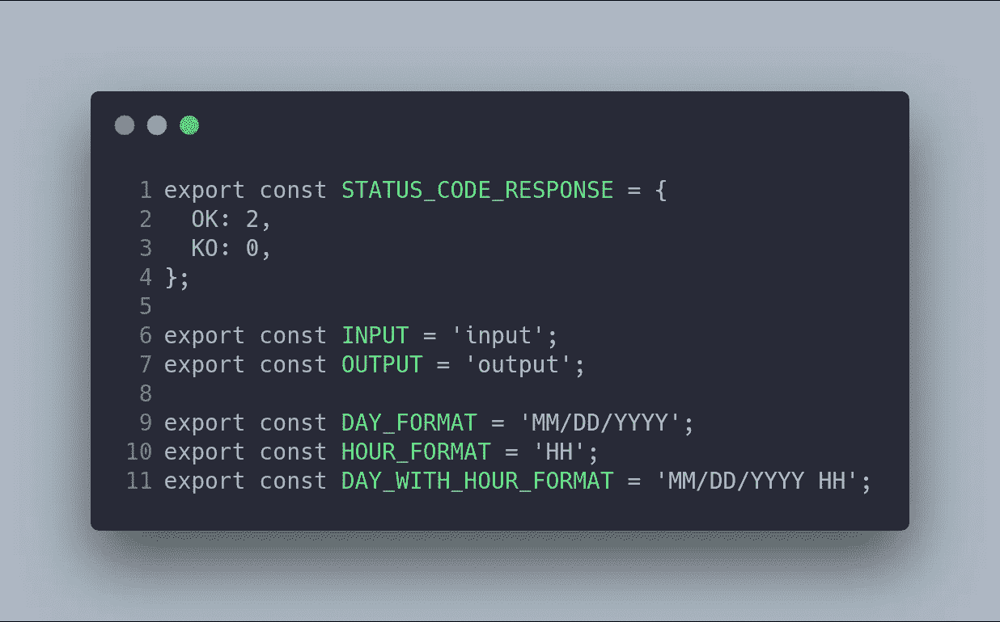

    下面的`DTO`非常简单，因为它们只显示了一个输入(`AuthDto`)和一个输出(`AuthResponseDto`)的接口。

    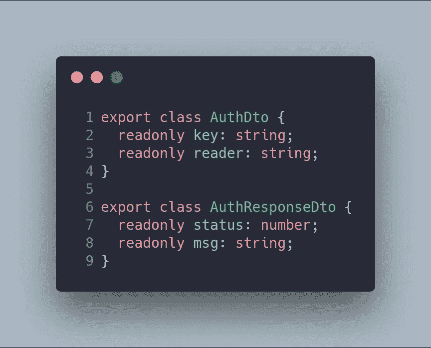

    # 服务

    `AuthService`应该有两个重要的方法，`authI**n**` 和`authOut`。

    `authinIn`当用户在系统上打卡时，接收来自 Arduino 的信号并保存信息。该服务以一条欢迎消息作为响应。

    `authOut`当用户打卡离开系统时，接收来自 Arduino 的信号并保存信息。该服务以再见消息作为响应。

    这些方法的代码如下:

    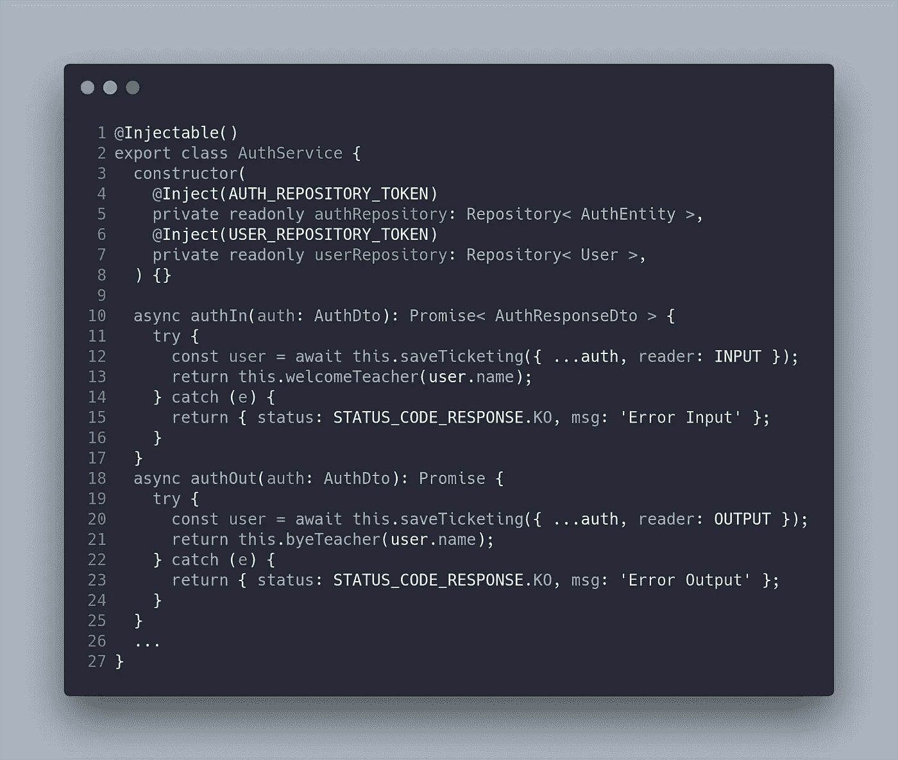

    在这个类中，我注入了两个存储库(`authRepository`和`userRepository`)，它们用于与数据库通信。代码是干净的，因为我已经使用了简单的 async/await 和 private 方法(`saveTicketing` **、** `welcomeTeacher` 和`byeTeacher`)，所以方法`authIn`和`authOut` 在将来测试起来会很简单。两种方法的响应都是一个`AuthResponseDto`。

    `saveTicketing` 的私法也很简单。第一步是获取与键相关联的用户(`auth.key`来自 Arduino)。之后，您可以保存身份验证信息:

    *   `auth`中的`key`和`reader`。
    *   `user`来自数据库(`UserEntity`)。
    *   从库`momentJS`中计算出的`timestamp`。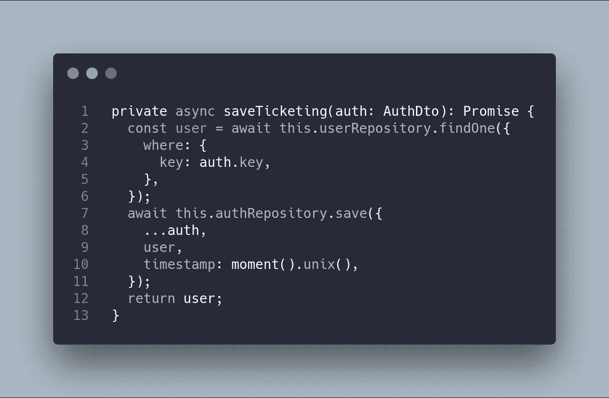

    最后，在 Arduino 屏幕上向用户显示消息的两种方法如下:

    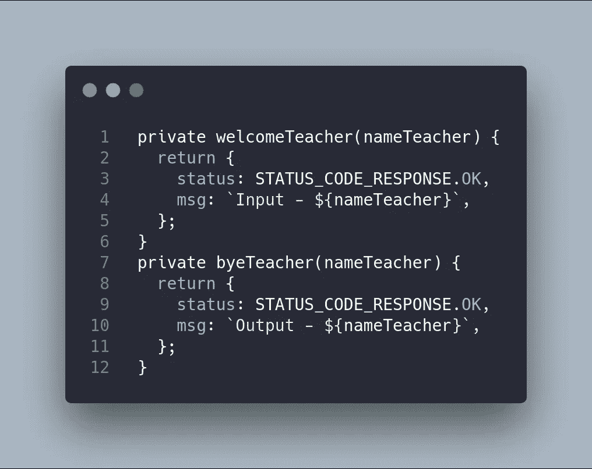

    这里是`AuthService`的完整代码:

    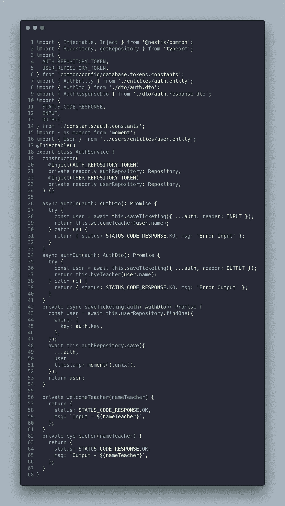

‌In 这一块，我已经解释了我的`AuthModule`，它非常简单，因为我在编码中使用了干净的代码。该模块用于保存打卡/下班信息。

在本系列的后续文章中，我将解释`UsersModule`和`AppModule`。

GitHub 项目是[https://github.com/Caballerog/clock-in-out](https://github.com/Caballerog/clock-in-out)。
GitHub 分支是[https://GitHub . com/Caballerog/clock-in-out/tree/part 2-basic-back end-auth](https://github.com/Caballerog/clock-in-out/tree/part2-basic-backend-auth)。