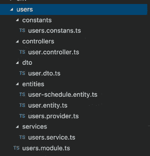
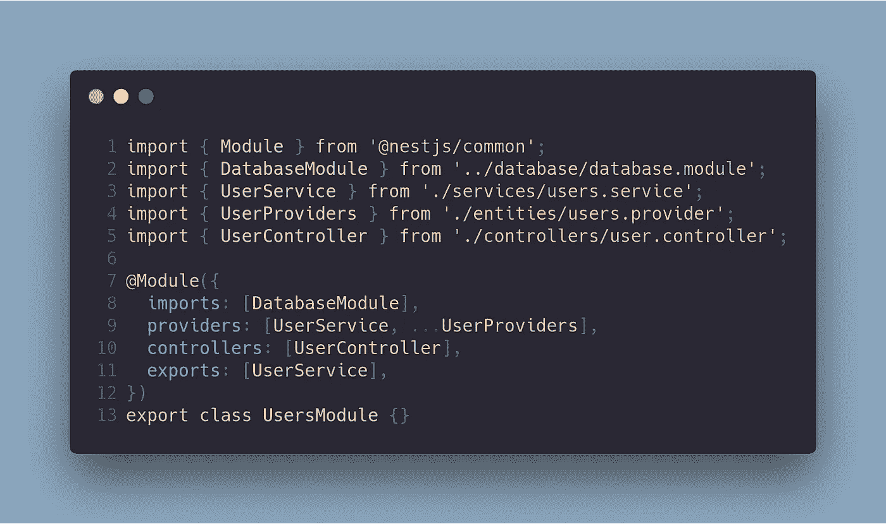
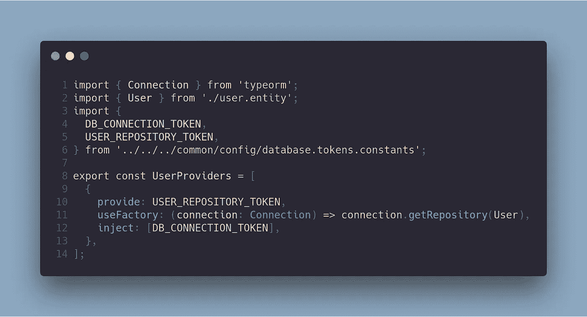
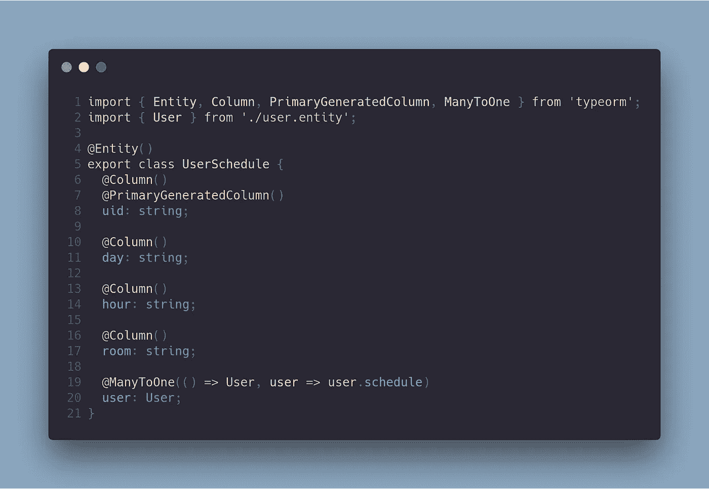
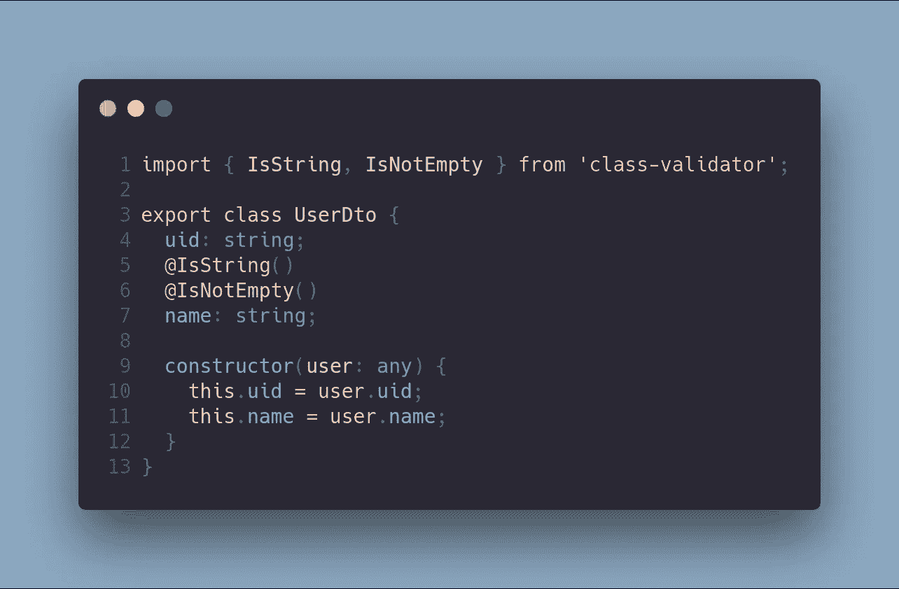
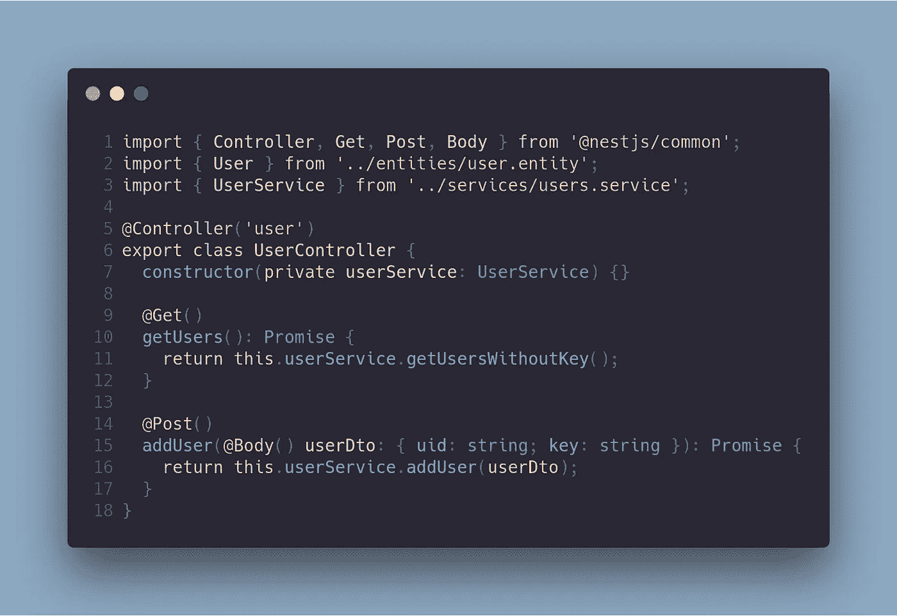
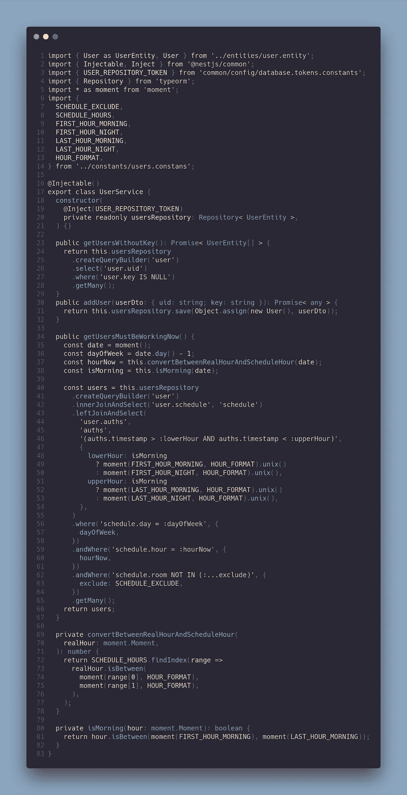

# 上下班打卡系统第 3 部分:基本后端(二)——用户模块

> 原文：<https://betterprogramming.pub/part-3-clock-in-out-system-basic-backend-ii-usersmodule-a56f42b20f62>

## NestJS + Angular 教程

这篇文章是我描述上下班打卡系统的系列文章的一部分。如果你想了解更多，你可以阅读以下内容:

*   [上下班打卡系统第 1 部分:图](https://medium.com/@ccaballero/part-1-clock-in-out-system-diagram-a0a51bab02a7?source=post_page---------------------------)
*   [上下班打卡系统第二部分:基础后端— AuthModule](https://medium.com/better-programming/part-2-clock-in-out-system-basic-backend-i-authmodule-66d4a5c56122?source=post_page---------------------------)
*   [上下班打卡系统第 3 部分:基本后端——用户模块](https://medium.com/better-programming/part-3-clock-in-out-system-basic-backend-ii-usersmodule-a56f42b20f62?source=post_page---------------------------)
*   [上下班打卡系统第 4 部分:基础后端— AppModule](https://medium.com/better-programming/part-4-clock-in-out-system-basic-backend-iii-appmodule-850dd17883e?source=post_page---------------------------)
*   [上下班打卡系统第 5 部分:种子数据库和迁移数据](https://medium.com/better-programming/part-5-clock-in-out-system-seed-database-and-migration-data-cf037be21aac?source=post_page---------------------------)
*   [上下班打卡系统第 6 部分:基本前端](https://medium.com/@ccaballero/part-6-clock-in-out-system-basic-frontend-an-7e5f9ed08c3f?source=post_page---------------------------)
*   [上下班打卡系统第 7 部分:使用 Docker/Docker-Compose 部署后端(NestJS)](https://medium.com/@ccaballero/part-7-deploy-backend-nestjs-docker-docker-compose-2429c0b6aa9c?source=post_page---------------------------)
*   [上下班打卡系统第 8 部分:使用环境部署前端(角度 6+)](https://medium.com/@ccaballero/part-8-clock-in-out-system-deploy-frontend-angular-6-using-environments-ad267325d3b6?source=post_page---------------------------)
*   [上下班打卡系统第 9 部分:后端测试——服务的单元测试](https://medium.com/@ccaballero/part-9-testing-backend-testing-2d021f48403b?source=post_page---------------------------)
*   [上下班打卡系统第 10 部分:后端测试——控制器单元测试](https://medium.com/@ccaballero/part-10-testing-backend-testing-unit-testing-controllers-4177370ef581?source=post_page---------------------------)
*   上下班打卡系统第 11 部分:后端测试-e2e 测试
*   上下班打卡系统第 12 部分:前端测试单元测试
*   上下班打卡系统第 13 部分:前端测试集成测试

在之前的帖子中，我介绍了基本的后端结构和第一个模块(`AuthModule`)。我建议您在阅读这篇文章之前先阅读那篇文章，这样您就可以了解整个系统。本帖将呈现用于管理用户信息的`UsersModule`。

# 用`UsersModule`管理用户信息

服务`UserService`提供了两个重要的方法:

1.  `getUsersWithoutKey`
2.  `addUser`

这些方法用于发现用户是否没有有效的 id 卡，并将用户添加到系统中。

第一步是展示`UsersModule`的文件结构，如图 1 所示。

图一。

在这个模块的开发中，我们使用了与`AuthModule`中相同的目录结构，但是我们有了一个名为`controllers`的新目录，它用于使用 RESTful API 将这个模块与外部进行通信。

此外，您可以看到两个实体，因为在这个模块中，我们需要两个表(`User`和`UserSchedule`)。

模块的文件如以下代码所示:

该模块只导入`DatabaseModule`用[类型表单](https://typeorm.io/)连接我们的 [Postgres](https://www.postgresql.org/) ，导出`AppController`中使用的`UserService`。

该模块定义了控制器`UserController`，该控制器将用于该模块与外部的通信。

# 实体

在本模块中，我们需要使用两个实体:

*   `User`:该实体定义用户信息。
*   `Scheduler`:该实体定义了用户的调度器(弱实体)。

因此，定义实体的第一步是通过注入来定义允许在我们的服务中使用`UserRepository` 的提供者。

第一个实体是用户，由以下字段定义:

*   `uid`:用户的 UID。在本例中，是用户的“姓，名”的字符串。
*   `name`:用户名称。该字段用于在屏幕上显示名称。
*   `auth`:这就是表格`Auth`和`Users`的关系。此字段是用户的身份认证列表。
*   `key`:分配给用户的按键。
*   `schedule`:这是最重要的领域之一，因为它是用户和他们的时间表之间的关系。用户模块的第二个实体是。

`UserSchedule`实体用于反映用户必须在建筑物中的每个会话。该表中存储的字段如下:

*   `UID``UserSchedule`的 UID。该字段由数据库自动生成。
*   `day`用户在一周中的哪一天(0 到 6 相当于周日到周六)。
*   用户在建筑物中的时间(从 0 到 11 相当于从 8:15 到 22:10，但是关系不是线性的。但是，有一个函数可以完成这项任务)。
*   `room`用户所在的空间，在那个小时。
*   `user`表格`UserSchedule`和`User`的关系。许多`UserSchedule`都与一个`User`相关。

最后，系统由三个表组成:

*   `User`系统中用户及其密钥的信息。
*   `User-Schedule`关于日程和用户所在房间的信息。
*   `Auth`上下班打卡信息(包括时间戳)。

# 常数和 dto

下一部分很简单，和上一篇文章一样。在本节中，我们定义常数和 dto 以获得更好的代码。

常量用于清理字符串或数字的代码，而 d to 用于从客户端验证用户。

在文件`user.constants.ts`、**、**中可以看到几个数组:

*   `SCHEDULE_EXCLUDE`将从列表中排除的调度程序列表(用户必须在建筑物内)。
*   `SCHEDULE_HOURS`开始和结束用户会话的不同时间。
*   几个常数导出格式的时刻，或在不同的工作班次的第一个和最后一个小时。

`user.dto`文件也很简单。在这个文件中，您可以看到一个类的定义，其中定义了两个字段(`UID`和`name`)。

# 控制器

现在是介绍用户控制器的时候了。

在这个文件中，您可以看到控制器名为`user` ，并且使用了两个动词:

*   `GET /user`该方法从服务中调用方法`getUsersWithoutKey`,以获取所有未键入系统的用户(用于填充来自客户端的信息)。
*   `POST /user`这个方法从服务中调用方法`addUser`来为用户添加密钥。实际上，`POST`的主体应该是 UID 和 key。

# 服务

最后，这个模块最重要的部分是服务，因为模块的逻辑在这个文件中。

`UserService`有三个重要的方法:

*   `getUsersWithoutKey`在这个方法中，返回值是来自 TypeORM 的`UserEntity[]`的*承诺*。因此，这个方法的目标是使用`ORM`调用正确的`SELECT`句子，这存在于具有`NULL`键值的所有用户中。
*   `addUser`在这个方法中，返回值是一个*承诺*，从 TypeORM 的方法 save 返回。所以，`addUser`是 TypeORM 的包装器，它是`INSERT/UPDATE`句子的包装器。
*   `getUsersWorkingNow`该方法不在`UsersModule`内使用，而是从`AppController`开始使用。该方法返回一个`UsersEntity[]`的*承诺*，该承诺由此刻在大楼中的所有用户组成。该方法使用库 [Moment.js](https://momentjs.com/) 。这将在“糟糕的代码”中完成，带有很多代码味道，但我更喜欢使用几个变量来清理代码。此外，我使用了一个私有函数`isMorning` ，它允许我知道系统是在上午还是下午。这是因为有几个用户早上几个小时，下午几个小时都在大楼里。返回的`Users`包含当天的认证列表(使用下限和上限)。

# 结论

‌In:这一块，我已经解释了我的`UsersModule`，它非常简单，因为我在编码中使用了干净的代码。

该模块用于保存关于用户和打卡/下班的信息。

方法`getUsersMustBeWorkingNow`是系统的主要方法，因为该方法使用几个约束返回必须在建筑物中的用户列表。这些约束很容易定制。

在本系列的后续文章中，我将解释`AppModule`，它将客户端与服务器端以及它们之间的服务器端模块进行通信。

*   该项目的 GitHub 是 https://github.com/Caballerog/clock-in-out 的
*   这一块的 GitHub 分支是[https://GitHub . com/Caballerog/clock-in-out/tree/part 3-basic-back end-users](https://github.com/Caballerog/clock-in-out/tree/part3-basic-backend-users)