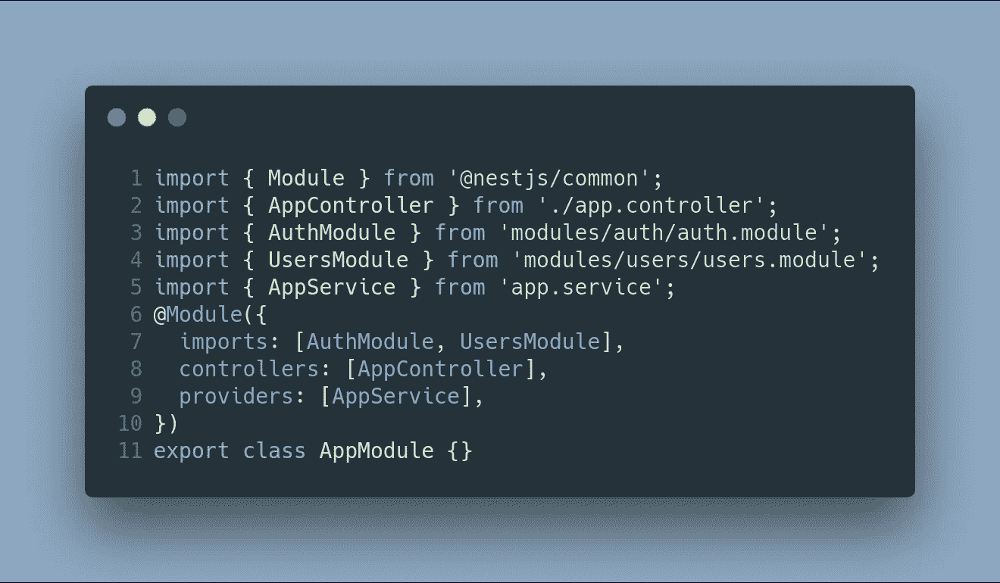
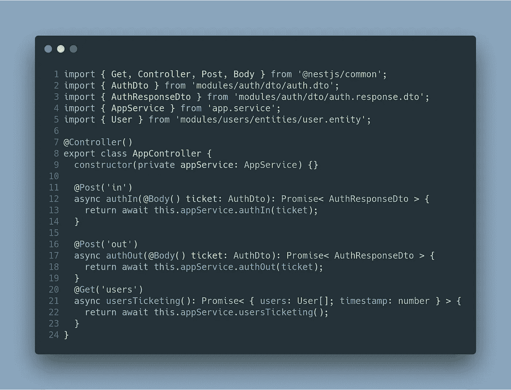
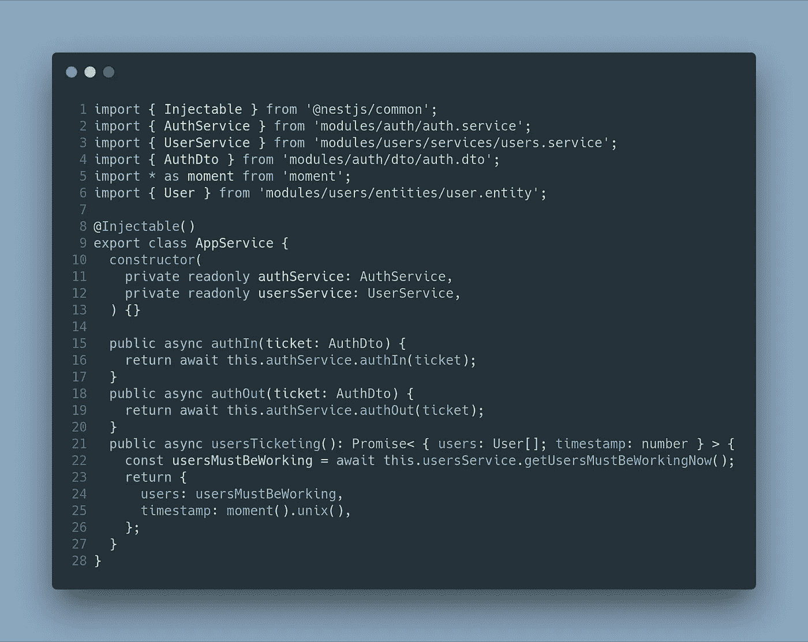

# 上下班打卡系统第 4 部分:基本后端(三)——app module

> 原文：<https://betterprogramming.pub/part-4-clock-in-out-system-basic-backend-iii-appmodule-850dd17883e>

## NestJS + Angular 教程

这篇文章是我描述上下班打卡系统的系列文章的一部分。如果你想了解更多，你可以阅读以下内容:

*   [上下班打卡系统第 1 部分:图](https://medium.com/@ccaballero/part-1-clock-in-out-system-diagram-a0a51bab02a7?source=post_page---------------------------)
*   [上下班打卡系统第二部分:基础后端— AuthModule](https://medium.com/better-programming/part-2-clock-in-out-system-basic-backend-i-authmodule-66d4a5c56122?source=post_page---------------------------)
*   [上下班打卡系统第 3 部分:基本后端——用户模块](https://medium.com/better-programming/part-3-clock-in-out-system-basic-backend-ii-usersmodule-a56f42b20f62?source=post_page---------------------------)
*   [上下班打卡系统第 4 部分:基础后端— AppModule](https://medium.com/better-programming/part-4-clock-in-out-system-basic-backend-iii-appmodule-850dd17883e?source=post_page---------------------------)
*   [上下班打卡系统第 5 部分:种子数据库和迁移数据](https://medium.com/better-programming/part-5-clock-in-out-system-seed-database-and-migration-data-cf037be21aac?source=post_page---------------------------)
*   [上下班打卡系统第 6 部分:基本前端](https://medium.com/@ccaballero/part-6-clock-in-out-system-basic-frontend-an-7e5f9ed08c3f?source=post_page---------------------------)
*   [上下班打卡系统第 7 部分:使用 Docker/Docker-Compose 部署后端(NestJS)](https://medium.com/@ccaballero/part-7-deploy-backend-nestjs-docker-docker-compose-2429c0b6aa9c?source=post_page---------------------------)
*   [上下班打卡系统第 8 部分:使用环境部署前端(角度 6+)](https://medium.com/@ccaballero/part-8-clock-in-out-system-deploy-frontend-angular-6-using-environments-ad267325d3b6?source=post_page---------------------------)
*   [上下班打卡系统第 9 部分:后端测试——服务的单元测试](https://medium.com/@ccaballero/part-9-testing-backend-testing-2d021f48403b?source=post_page---------------------------)
*   [上下班打卡系统第 10 部分:后端测试——控制器单元测试](https://medium.com/@ccaballero/part-10-testing-backend-testing-unit-testing-controllers-4177370ef581?source=post_page---------------------------)
*   上下班打卡系统第 11 部分:后端测试-e2e 测试
*   上下班打卡系统第 12 部分:前端测试单元测试
*   上下班打卡系统第 13 部分:前端测试集成测试

在前一篇文章中，我介绍了用于管理用户信息的模块`UserModule`。我建议你先读第一篇，这样你就能理解整个系统。

这个部分将呈现用于管理来自[角度](https://angular.io/)前端的用户请求的`AppModule`。这个模块只有一个服务、控制器和模块。

`AppService`从模块`UsersModule`和`AuthModule`注入两个服务`UserService`和`AuthService`。它被用作使用这两种服务的包装器。

第一步是给你看`AppModule` 代码:

可以看到这个模块导入了`AuthModule`和`UsersModule`。这很重要，因为`AppService`注入了`AuthService`和`UsersService`。

下一步是开发控制器，它包含两条与打卡上班和打卡下班相关的路线。

它们调用`AppService`(它将调用`AuthService`)和一个 route associate 来从服务器获取当前工作的用户列表和时间戳(以接近实时的方式获取，它将调用`UserService`)。

最后一步是开发`AppService`，它使用了前面提到的两个服务。

# 结论

在这篇文章中，我已经解释了我的`AppModule`。这很简单，因为我在编码中使用了干净的代码。

这个模块用于客户端(Angular)和服务器端的通信。它导入`AuthModule`和`UsersModule`并导出它们的服务。这些服务用于保存关于上班打卡/下班打卡的信息，并获取当前正在工作的所有用户。

目前，我们已经开发了一个具有三个模块和不同端点的基本后端。

在下一篇关于后端的文章中，我们将解释数据库和测试的种子。之后的文章将解释如何使用 Angular 和 [RxJS](https://www.learnrxjs.io/) 构建一个基本的前端。