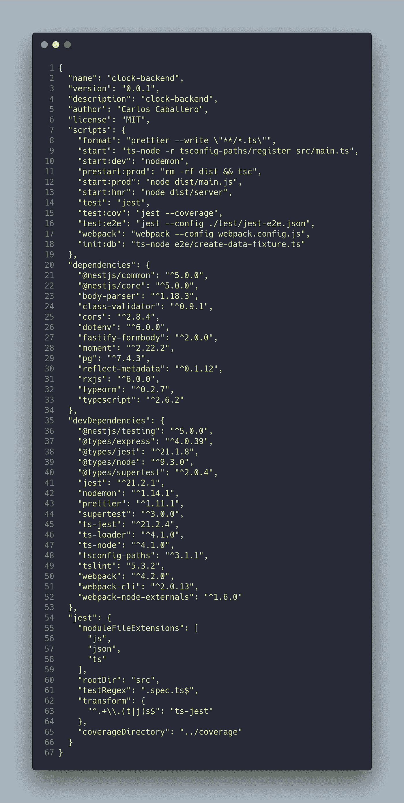
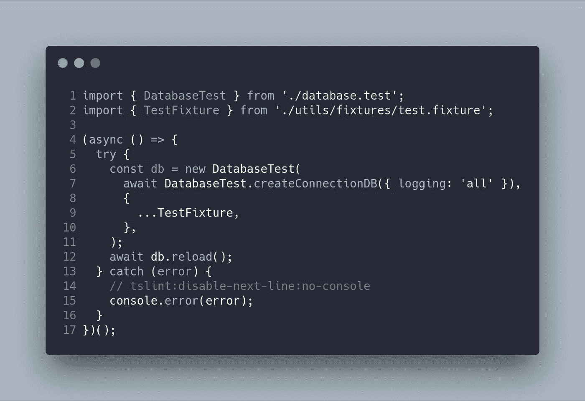
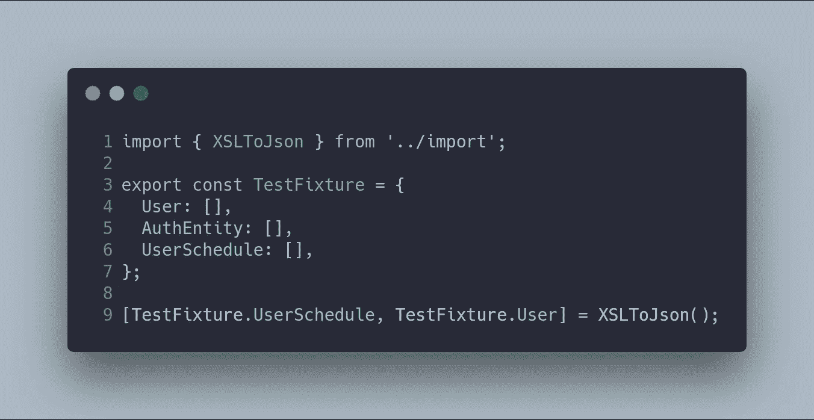
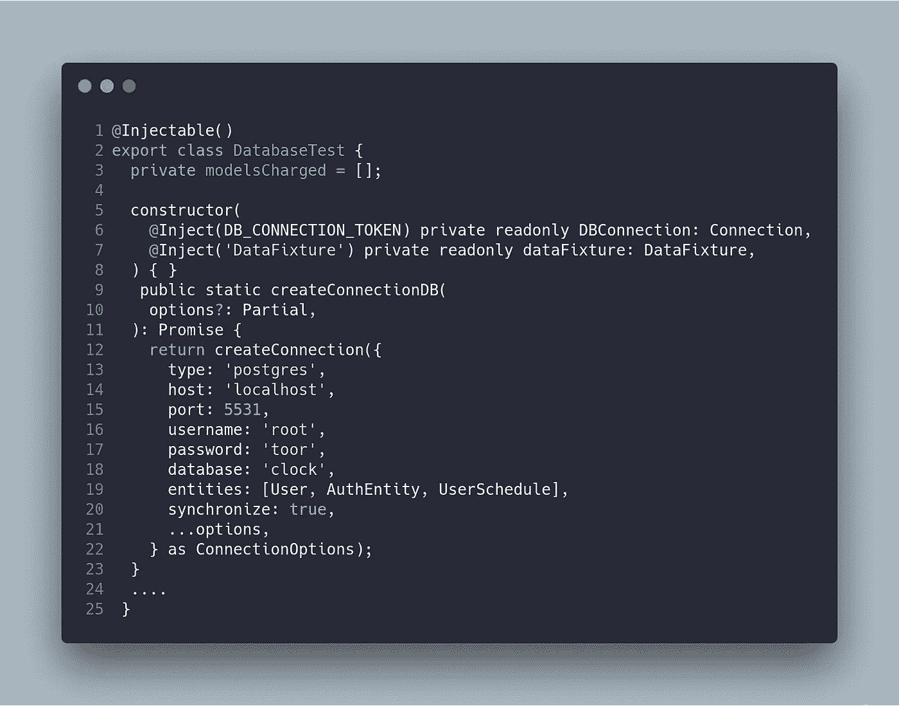
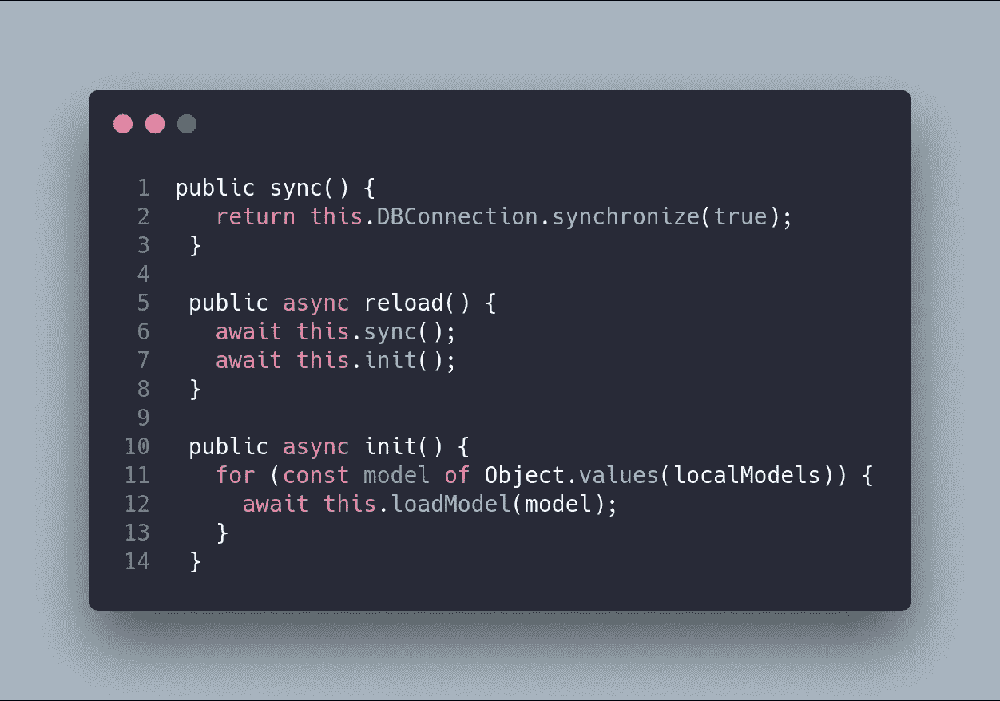
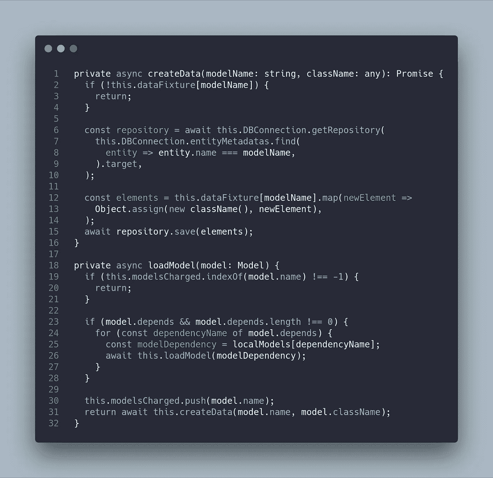
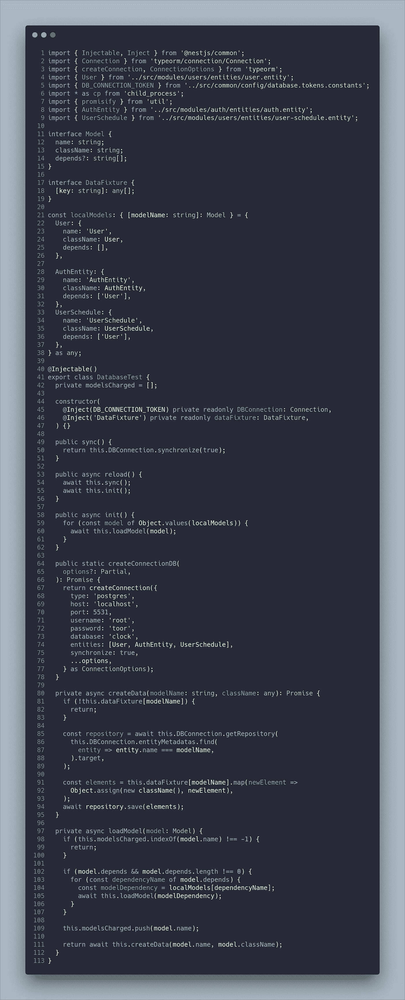
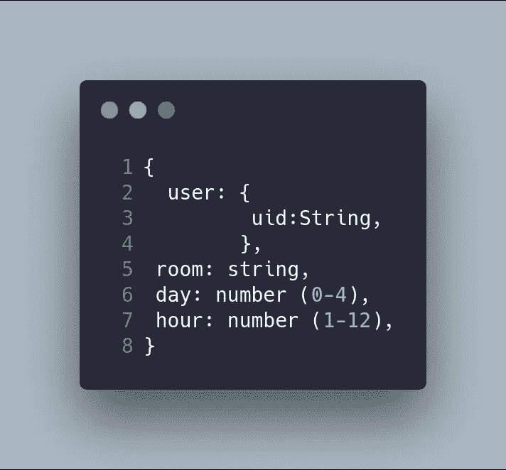

# 上下班打卡系统第 5 部分:种子数据库和迁移数据

> 原文：<https://betterprogramming.pub/part-5-clock-in-out-system-seed-database-and-migration-data-cf037be21aac>

## NestJS + Angular 教程


这篇文章是我描述上下班打卡系统的系列文章的一部分。如果你想了解更多，你可以阅读以下内容:

*   [上下班打卡系统第 1 部分:图](https://medium.com/@ccaballero/part-1-clock-in-out-system-diagram-a0a51bab02a7?source=post_page---------------------------)
*   [上下班打卡系统第二部分:基础后端— AuthModule](https://medium.com/better-programming/part-2-clock-in-out-system-basic-backend-i-authmodule-66d4a5c56122?source=post_page---------------------------)
*   [上下班打卡系统第 3 部分:基本后端——用户模块](https://medium.com/better-programming/part-3-clock-in-out-system-basic-backend-ii-usersmodule-a56f42b20f62?source=post_page---------------------------)
*   [上下班打卡系统第 4 部分:基础后端— AppModule](https://medium.com/better-programming/part-4-clock-in-out-system-basic-backend-iii-appmodule-850dd17883e?source=post_page---------------------------)
*   [上下班打卡系统第 5 部分:种子数据库和迁移数据](https://medium.com/better-programming/part-5-clock-in-out-system-seed-database-and-migration-data-cf037be21aac?source=post_page---------------------------)
*   [上下班打卡系统第 6 部分:基本前端](https://medium.com/@ccaballero/part-6-clock-in-out-system-basic-frontend-an-7e5f9ed08c3f?source=post_page---------------------------)
*   [上下班打卡系统第 7 部分:使用 Docker/Docker-Compose 部署后端(NestJS)](https://medium.com/@ccaballero/part-7-deploy-backend-nestjs-docker-docker-compose-2429c0b6aa9c?source=post_page---------------------------)
*   [上下班打卡系统第 8 部分:使用环境部署前端(角度 6+)](https://medium.com/@ccaballero/part-8-clock-in-out-system-deploy-frontend-angular-6-using-environments-ad267325d3b6?source=post_page---------------------------)
*   [上下班打卡系统第 9 部分:后端测试——服务的单元测试](https://medium.com/@ccaballero/part-9-testing-backend-testing-2d021f48403b?source=post_page---------------------------)
*   [上下班打卡系统第 10 部分:后端测试——控制器单元测试](https://medium.com/@ccaballero/part-10-testing-backend-testing-unit-testing-controllers-4177370ef581?source=post_page---------------------------)
*   上下班打卡系统第 11 部分:后端测试-e2e 测试
*   上下班打卡系统第 12 部分:前端测试单元测试
*   上下班打卡系统第 13 部分:前端测试集成测试

在之前的文章中，我描述了打卡系统后端的开发，但是没有数据证明我们的后端已经开发成功。

在这篇文章中，我将描述我如何创建一系列脚本( [TypeScript](https://www.typescriptlang.org/) )，这些脚本允许从客户从他们的旧软件(MS Excel)提供的 [Excel](https://office.live.com/start/Excel.aspx) 表中填充数据库。

第一步是在`package.json` 中添加一个 [npm](https://www.npmjs.com/) 脚本，允许在 [TypeScript](http://www.typescriptlang.org/) 中执行我们的脚本，使用 [ts-node](https://www.npmjs.com/ts-node) *。*

我们脚本的执行会执行命令`npm run init:db` *。*



脚本`create-data-fixture`是一个自执行函数，它基于`DatabaseTest`创建一个新对象，并调用方法`db.reload()`。

使用两个参数创建函数`DatabaseTest` :

*   用于存储数据的数据库连接，如果我们想要使用不同的数据库，那么每次执行的数据都是不同的。当我们想要并行运行不同的数据库，用模拟数据运行 e2e(端到端)测试时，这个事实很有趣。
*   `**DataFixture**`，它是一个对象，包含将要插入数据库的信息(`Users`和`Users-schedule`)。



最简单的文件是`TestFixture`，一旦数据从数据映射脚本(也将由我们开发)的 XLS 文件导入和加载，它就导出数据。



另一方面，`database.test.ts`文件负责将假数据加载到数据库中。即`Users`和`UsersSchedule`将从`test.fixture`文件中取出。

我们将描述这个文件，因为它非常重要:

*   `DatabaseTest`类接收数据库连接和使用 DI(依赖注入)从`test.fixture`文件模拟的数据。
*   初始化`modelsCharged`属性，它存储已经加载到数据库中的模型，并且不需要重新加载它们。
*   `createConnectionDB`方法是静态的，用于从类外部连接到数据库。这样，当注入类时，连接就已经成功建立了。



下一步是构建初始化、重新加载和同步数据库的基本方法。



接下来，模型被加载，它被递归地一个接一个地执行，获取不同模型之间的现有依赖关系的信息。



概括一下，完整的`database.test`文件如下所示:



# 奖金

接下来，我们将展示`XLSToJson`方法，它简单地将 Excel 的每一行转换成需要由 [TypeORM](https://typeorm.io/) 导入的不同的 [JSON](https://www.json.org/) 对象。

值得注意的是，每个开发者都必须从他们的 XLS 中改编`XLSToJson`函数。

首先，我们需要安装`node-xlsx` 包，它允许我们与 XLS 文件进行交互。下面是第一个版本，它使用了几个`forEach` 循环来遍历并构建类似于下面的数据结构:[schedulers，users]，其中`scheduler`是以下类型的对象:



并且`user`是以下类型的对象:

```
{ uid: string, name: string, }
```

我不认为下面的代码是最干净的版本，它不是最干净的版本，我计划在系统完成后，在未来的作品中进行很好的重构。

如果有人想开始这项任务，提出以下几点:

1.  根据执行的任务提取函数，而不是一个大的、单一的函数。
2.  用更实用、更合适的方法替换隐藏经典数据结构的`forEach`方法，比如`reduce`。

`migration.ts`:


# 结论

在本文中，我解释了我的种子数据库，它由一系列脚本组成，允许我将任何数据结构加载到数据库中。

为了从 Excel 导入，创建了一个特定的脚本，将 XLS 文件转换成 JSON。

GitHub 项目是[https://github.com/Caballerog/clock-in-out](https://github.com/Caballerog/clock-in-out)。

这一块的 GitHub 分支是[https://GitHub . com/Caballerog/clock-in-out/tree/part 5-seed-database](https://github.com/Caballerog/clock-in-out/tree/part5-seed-database)