# 上下班打卡系统第 6 部分:基本前端—角度

> 原文：<https://betterprogramming.pub/part-6-clock-in-out-system-basic-frontend-an-7e5f9ed08c3f>

## NestJS + Angular 教程


这篇文章是我描述上下班打卡系统的系列文章的一部分。如果你想了解更多，你可以阅读以下内容:

*   [上下班打卡系统第 1 部分:图](https://medium.com/@ccaballero/part-1-clock-in-out-system-diagram-a0a51bab02a7?source=post_page---------------------------)
*   [上下班打卡系统第二部分:基础后端— AuthModule](https://medium.com/better-programming/part-2-clock-in-out-system-basic-backend-i-authmodule-66d4a5c56122?source=post_page---------------------------)
*   [上下班打卡系统第 3 部分:基本后端——用户模块](https://medium.com/better-programming/part-3-clock-in-out-system-basic-backend-ii-usersmodule-a56f42b20f62?source=post_page---------------------------)
*   [上下班打卡系统第 4 部分:基础后端— AppModule](https://medium.com/better-programming/part-4-clock-in-out-system-basic-backend-iii-appmodule-850dd17883e?source=post_page---------------------------)
*   [上下班打卡系统第 5 部分:种子数据库和迁移数据](https://medium.com/better-programming/part-5-clock-in-out-system-seed-database-and-migration-data-cf037be21aac?source=post_page---------------------------)
*   [上下班打卡系统第 6 部分:基本前端](https://medium.com/@ccaballero/part-6-clock-in-out-system-basic-frontend-an-7e5f9ed08c3f?source=post_page---------------------------)
*   [上下班打卡系统第 7 部分:使用 Docker/Docker-Compose 部署后端(NestJS)](https://medium.com/@ccaballero/part-7-deploy-backend-nestjs-docker-docker-compose-2429c0b6aa9c?source=post_page---------------------------)
*   [上下班打卡系统第 8 部分:使用环境部署前端(角度 6+)](https://medium.com/@ccaballero/part-8-clock-in-out-system-deploy-frontend-angular-6-using-environments-ad267325d3b6?source=post_page---------------------------)
*   [上下班打卡系统第 9 部分:后端测试——服务的单元测试](https://medium.com/@ccaballero/part-9-testing-backend-testing-2d021f48403b?source=post_page---------------------------)
*   [上下班打卡系统第 10 部分:后端测试——控制器单元测试](https://medium.com/@ccaballero/part-10-testing-backend-testing-unit-testing-controllers-4177370ef581?source=post_page---------------------------)
*   上下班打卡系统第 11 部分:后端测试-e2e 测试
*   上下班打卡系统第 12 部分:前端测试单元测试
*   上下班打卡系统第 13 部分:前端测试集成测试

这是我们打卡上班/下班系统前端的第一部分，它已经有了一个基本的、功能性的后端。前端将使用 JS 框架 [Angular](https://www.angular.io/) 开发，因为 Angular 是软件架构意义上的最佳框架。我的意图不是引发一场关于哪个是最好或最差的 JavaScript 框架的战争。这是一篇关于我自己的系统的文章，尽管我确信有更好的解决方案来开发我的软件的这一层:-)。

结果如下所示:

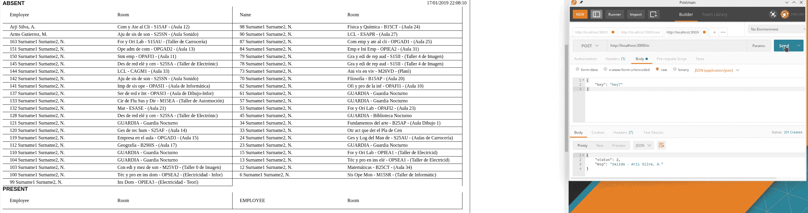

# 我们走吧！

第一步是使用 [Angular CLI](https://cli.angular.io/) 创建一个新项目:

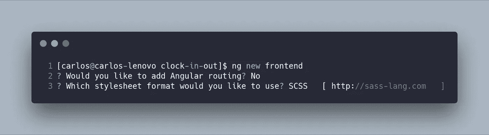

在我们的上下文中，不需要路由，因为我们的前端不是 [SPA](https://en.wikipedia.org/wiki/Single-page_application) 。(OMG！那你为什么用 Angular？因为这是一个简单的教程，展示如何整合[nestj](https://nestjs.com/)+[Angular](https://www.angular.io/)。

下一步是安装几个依赖于我们代码的库( [Angular Material](https://material.angular.io/) ):

```
npm i @angular/cdk @angular/animations @angular/material
```

我们的项目有三个要点:

1.  **AppModule** :这是主模块，负责启动其他模块。
2.  **UserComponent** :该组件用于添加新用户及其密钥。(这只是为了管理目的，虽然没有任何安全性。)
3.  **TicketingComponent** :这是最重要的组件，因为它用应该在大楼中工作的用户的信息来刷新屏幕。

现在，我将展示并解释每个模块。

# AppModule

这是用于启动其他模块的模块。在下面的代码中，我正在加载模块:

**角状材料**

MatTableModule :这个表格会显示在大楼里的用户列表。

**MatInputModule** :这提供了将用于添加用户-键对的表单输入。

**RouterModule** :该模块用于加载打卡/下班和管理页面。

**FormsModule** :在我们的项目中需要这个模块来使用模板驱动的表单。

**浏览器模块**和**浏览器模块**:这些是在浏览器中使用 Angular(和动画)所需的模块。

**HttpClientModule** :该模块将用于使用 HTTP 协议与前端和后端进行通信。

`Route[]`是加载组件的路径。在我们的例子中，这非常简单，因为默认路径将加载`TicketingComponent`，路径`/user`将加载我们的管理页面(`UserComponent`)。

最后，我们必须在`AppModule` : `AppComponent`、`UserComponent`和`TicketingComponent`中声明我们的组件。

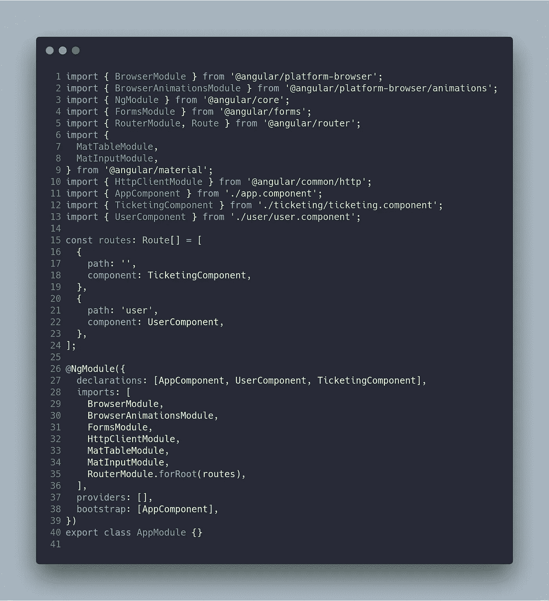

`AppComponent`是我们应用的引导程序。这个组件只运行`router-outlet`。

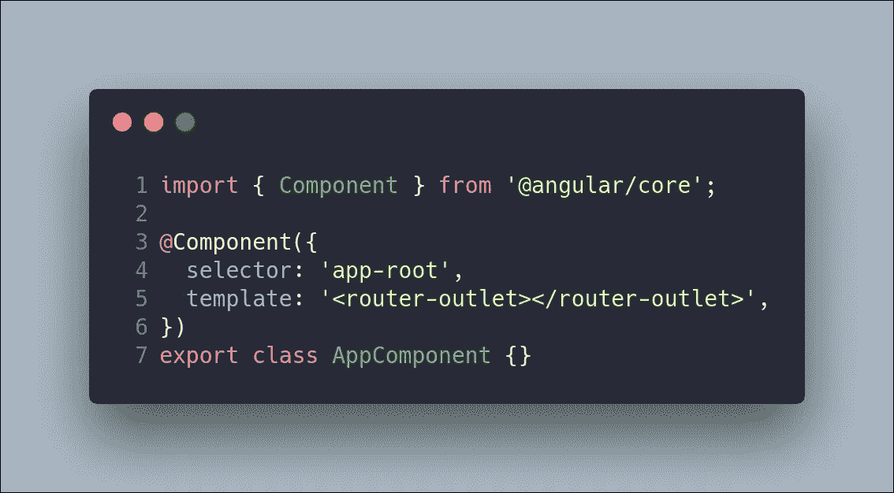

# 常数和环境

在我们开发的任何软件中，我们都需要不同的常量和环境变量。例如，http://localhost:420 **0** 是开发 Angular 应用程序的传统 URI，尽管在部署应用程序时需要更改域或端口。为此，Angular 为我们提供了在不同环境之间变化的配置。

文件`AppSettings`可以定义我们所有的常量。最重要的常量是 APIENDPOINT，它由文件`environment`提供。

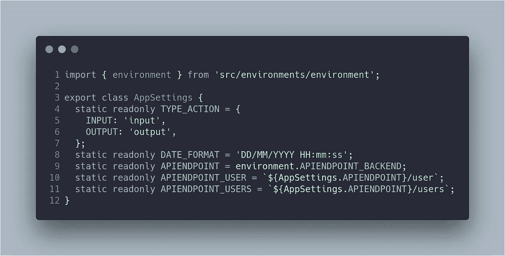

在开发 Angular 应用程序时，默认情况下会加载`environment`文件:

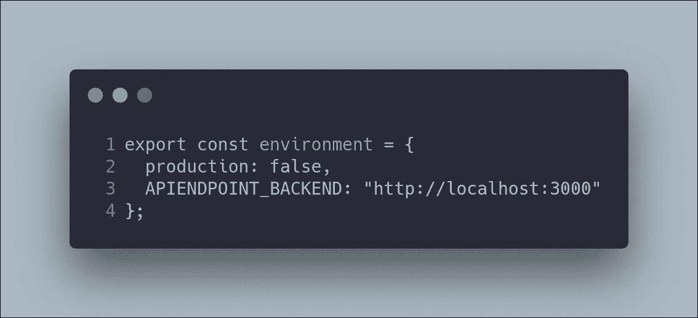

`environment.production.ts`文件中唯一的不同是`APIENDPOINT_BACKEND`常量，它包含部署我们的应用程序的机器的名称(在我们的例子中，是一个 docker 容器)。

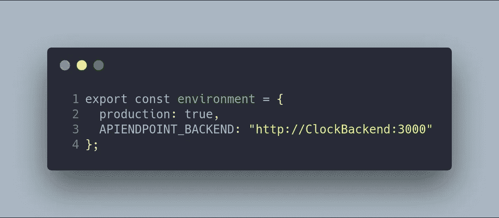

# 票务组件

票务组件是这个项目中最有趣的代码，因为它是使用 [RxJS](https://rxjs-dev.firebaseapp.com/) 开发的，使系统接近实时。这个例子没有使用 redux，所以从逻辑部分使用双重数据绑定来刷新模板。该组件的模板如下:

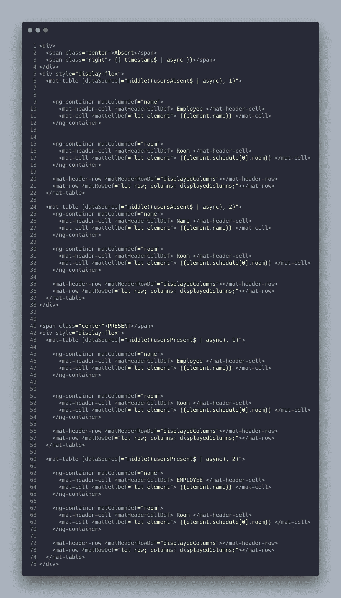

您可能注意到模板有几个`Observable$`，它们是使用管道`async`呈现的。例如，在下面的代码中，`span`标签呈现了可观察对象`timestamp$`的订阅结果。这个管道是传统的`subscribe`方法的语法糖。你可以在官方文档中读到更多关于这个管道的信息。

```
<span class="right"> {{ timestamp$ | async }}</span>
```

模板的另一个有趣的地方是组件`Material Datatable`的使用，它可以使用输入`[source]`接收一组要呈现在表格或可观察对象中的数据。然而，在我们的例子中，`Datatable`将接收一组数据(之后管道`async`完成它的工作)。此外，数据显示在两个不同的表格中。使用方法`middle`将数据分成两组。

CSS 非常简单，如以下代码所示:

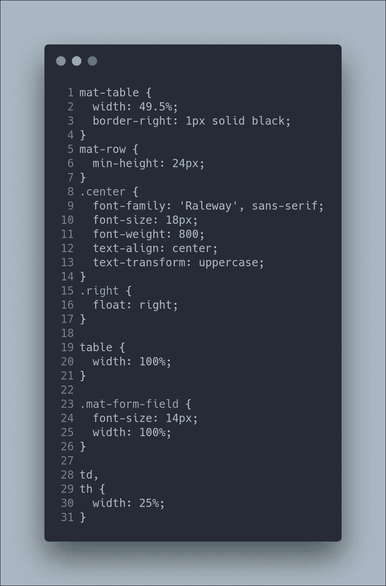

虽然这篇文章不是关于 CSS 的，但是你必须知道永远不要使用`id`来设计你的网站。你可以在[开发到](https://dev.to/claireparker/reasons-not-to-use-ids-in-css-4ni4)、 [CSSWizard](https://csswizardry.com/2011/09/when-using-ids-can-be-a-pain-in-the-class/) 和[开发设计](https://www.developingdesigns.com/stop-using-ids-in-your-css/)中了解更多相关信息。

我们的 CSS 文件很简单，因为它只是设计了我们的表格(必须有一个 49.50%的`width`和不同的字体大小调整)。

我现在将揭示这篇文章中最有趣的一段代码，即`TicketingComponent`。

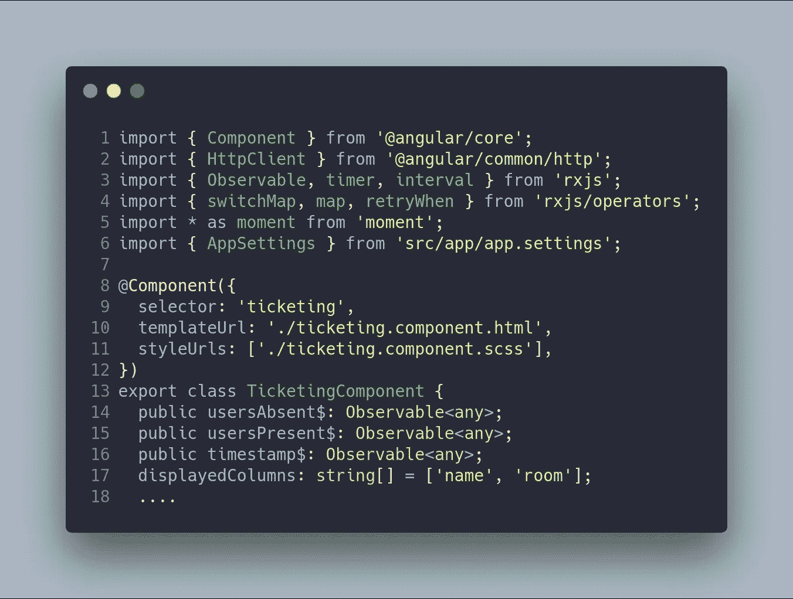

它具有以下属性:

*   `usersAbsent$`:这是包含*不在*大楼内的用户列表的可观察对象。
*   `usersPresent$`:这是包含*在大楼里的*用户列表的可观察对象。
*   `timestamp$`:这是包含来自服务器的时间戳的可观察对象。
*   `displayedColumns`:包含将在表格中显示的列数组。

非常重要的是要记住，我们在代码中使用 observables 来通过使用 [RxJS](https://rxjs-dev.firebaseapp.com/) 操作符为我们提供流操作的能力。这些观察值是使用模板中的管道`async`订阅的。

我们的下一步是组件构造函数，真正的魔力出现了！您必须理解 [RxJS](https://rxjs-dev.firebaseapp.com/) 中的流，才能理解以下代码:

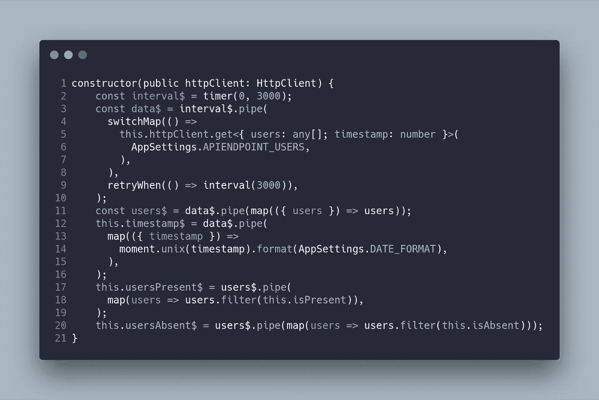

该代码执行以下操作:

使用`timer`操作符创建可观察对象`interval$`，这又会每隔 3000 毫秒触发一次调用。在接下来的代码行中，您可以看到可观察对象`data$`是如何从可观察对象`interval$`创建的，后者使用`httpClient`服务运行 http 请求。

然后，`get`请求返回一个包含用户列表和时间戳的对象(来自服务器)。这段代码的两个部分特别相关:

1.  操作符`switchMap`用于在发出新请求时取消未完成的请求(以避免同时发出几个请求)。
2.  运算符`retryWhen`用于处理服务器错误。例如，如果客户端或服务器中的连接丢失，您将需要重试请求。当代码有错误时，将在 3000 毫秒内重试请求。

好了，现在可观察的`data$`有了一个包含用户列表和时间戳信息的流。可观察对象`users$`是从可观察对象`data$`创建的，它在每个数据流中进行析构。这就是`map`操作员在那里的原因。如果你已经理解了前面的代码，你就可以想象可观测的`timestamp$`是如何产生的了。这个时间戳是 Unix 格式的。我们需要将其转换为 DATE_FORMAT (DD/MM/YYYY)。

或许你现在可以想象`usersPresent$`和`usersAbsent$`可观察量是如何从`users$`可观察量中产生的。对于这些可观测值，你必须使用[RxJS](https://rxjs-dev.firebaseapp.com/)操作符来创建一个新的可观测值，使用 Array.prototype `filter`方法。最后一步是创建私有的`isPresent`和`isAbsent`方法，如下所示:

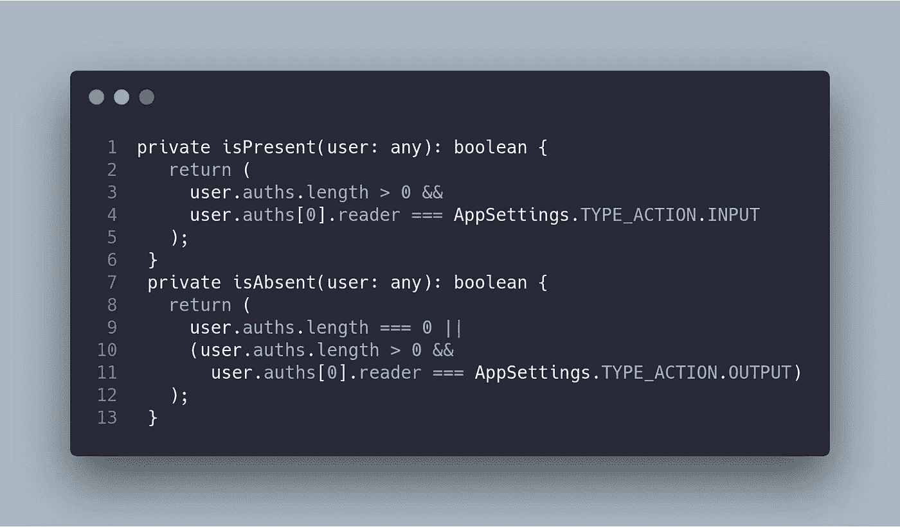

这些方法基本上都是检查用户是否得到了系统的授权，动作是`INPUT`还是`OUTPUT`。

完整的控制器代码如下:

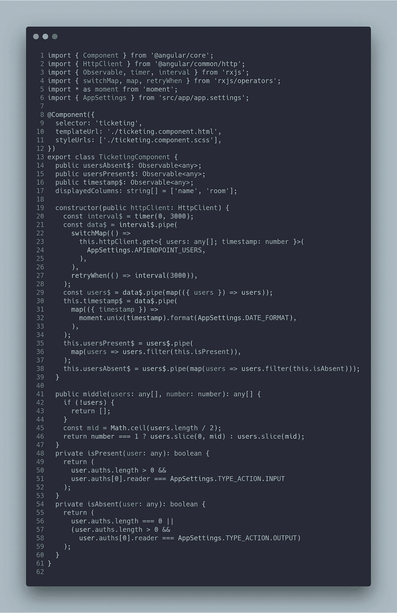

# 用户组件

我们基本前端的最后一个组件是`UserComponent`，它是一个简单的表单，用于向我们的数据库添加用户和密钥。构建这个组件的想法与在`TicketingComponent`中使用的组件相同。因此，执行操作`subscribe` s 的模板使用`async`管道。

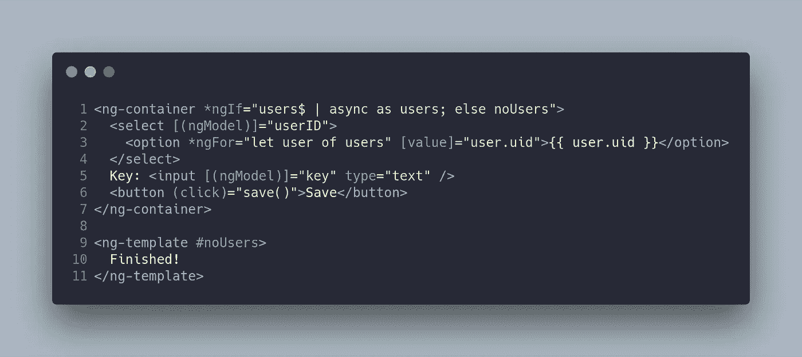

该模板使用`ng-container`的 if-else 在无人拥有密钥时显示一条消息。

`UserComponent`代码如下:

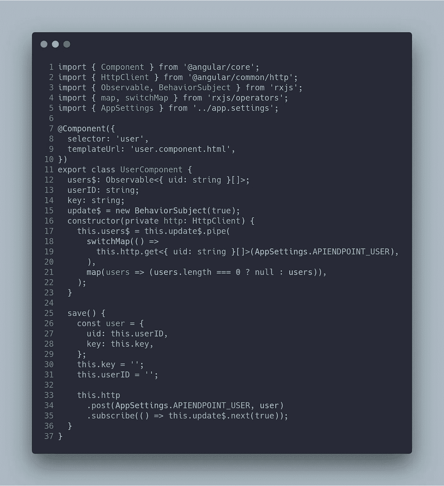

在本例中，我们定义了四个相关属性:

1.  Observable `users$`，包含用户的 uid 列表。
2.  字符串`userID`，包含从模板中选择的用户标识。
3.  字符串`key`，它是将分配给用户的键。
4.  可观察/主题`update$`，它让我们知道动作已经成功更新。

该构造函数与`TicketingComponent`中的构造函数非常相似。它通过使用`switchMap`和`map`操作符从后端恢复用户的 UID 列表。

最后，`save`方法用后端要求保存信息的对象向后端发出请求`POST`。

# 结论

‌In 这一块，我已经解释了我的基本前端**，**用 Angular 和 RxJS 开发，以确保一个接近实时的系统(使用轮询作为与服务器连接的技术)。


GitHub 项目是[https://github.com/Caballerog/clock-in-out](https://github.com/Caballerog/clock-in-out)。
这一块的 GitHub 分支是[https://GitHub . com/Caballerog/clock-in-out/tree/part 6-basic-frontend](https://github.com/Caballerog/clock-in-out/tree/part6-basic-frontend)。