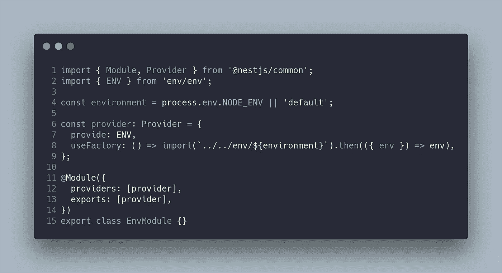
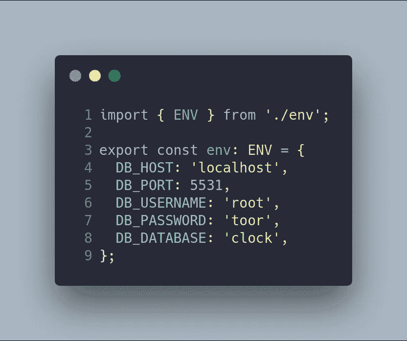
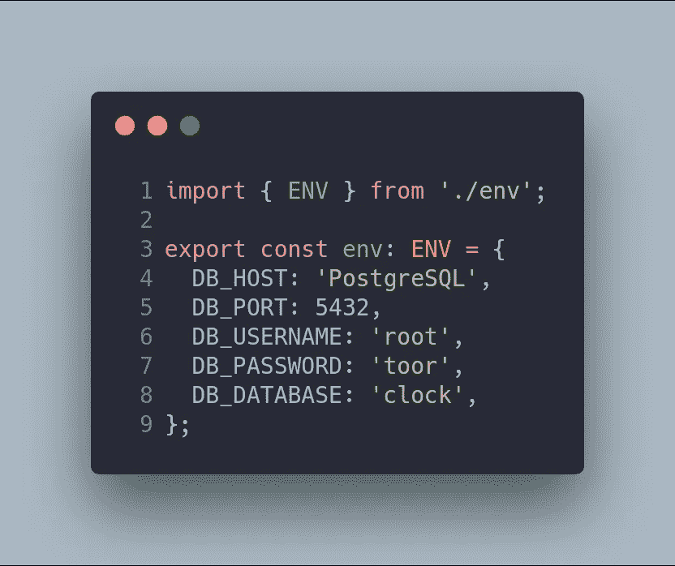
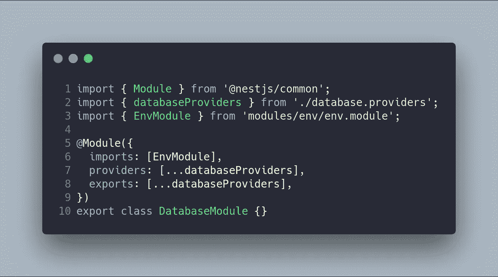
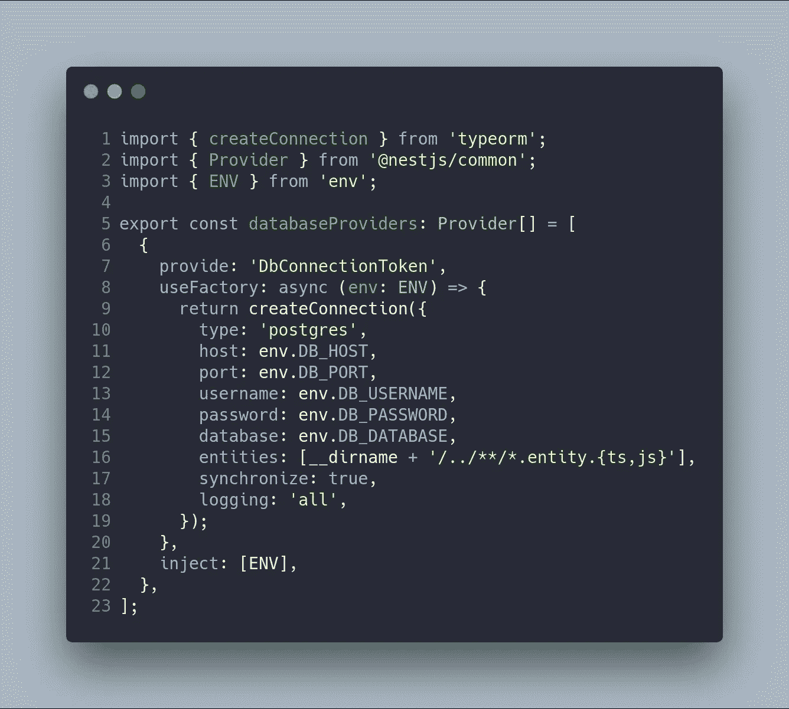
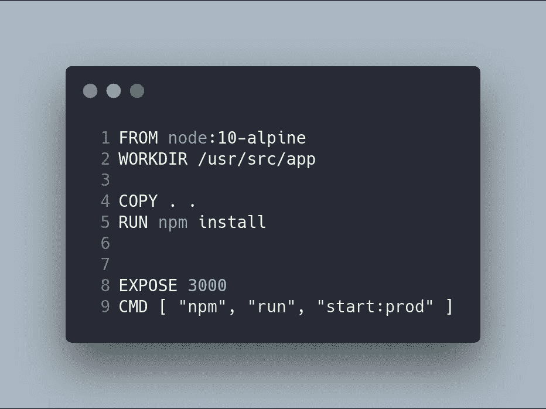
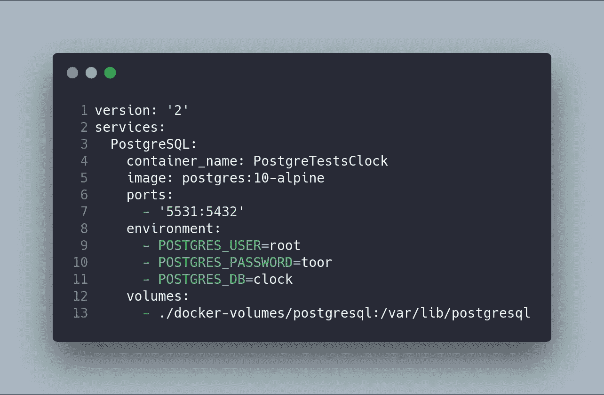
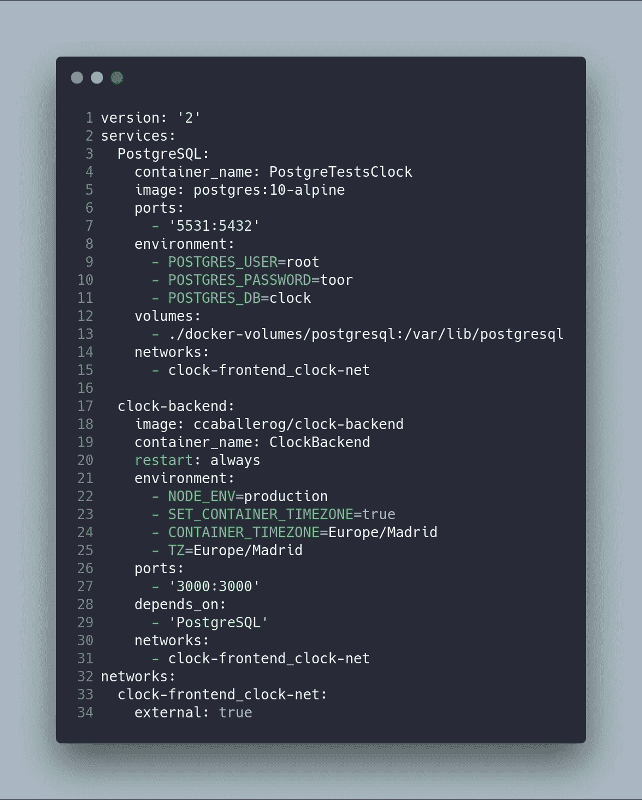
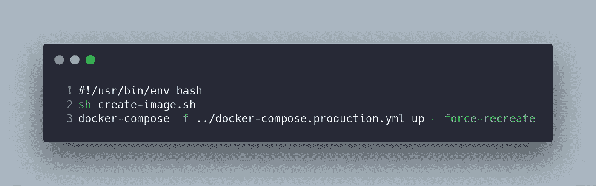
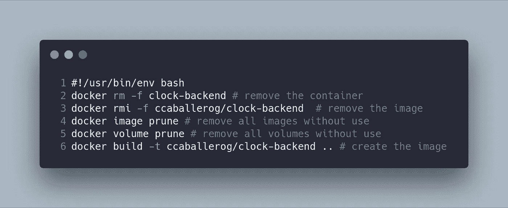

# 上下班打卡系统第 7 部分:部署后端(NestJS)-Docker/Docker-Compose

> 原文：<https://betterprogramming.pub/part-7-deploy-backend-nestjs-docker-docker-compose-2429c0b6aa9c>

## NestJS + Angular 教程


这篇文章是我描述上下班打卡系统的系列文章的一部分。如果你想了解更多，你可以阅读以下内容:

*   [上下班打卡系统第 1 部分:图](https://medium.com/@ccaballero/part-1-clock-in-out-system-diagram-a0a51bab02a7?source=post_page---------------------------)
*   [上下班打卡系统第二部分:基础后端— AuthModule](https://medium.com/better-programming/part-2-clock-in-out-system-basic-backend-i-authmodule-66d4a5c56122?source=post_page---------------------------)
*   [上下班打卡系统第 3 部分:基本后端——用户模块](https://medium.com/better-programming/part-3-clock-in-out-system-basic-backend-ii-usersmodule-a56f42b20f62?source=post_page---------------------------)
*   [上下班打卡系统第 4 部分:基础后端— AppModule](https://medium.com/better-programming/part-4-clock-in-out-system-basic-backend-iii-appmodule-850dd17883e?source=post_page---------------------------)
*   [上下班打卡系统第 5 部分:种子数据库和迁移数据](https://medium.com/better-programming/part-5-clock-in-out-system-seed-database-and-migration-data-cf037be21aac?source=post_page---------------------------)
*   [上下班打卡系统第 6 部分:基本前端](https://medium.com/@ccaballero/part-6-clock-in-out-system-basic-frontend-an-7e5f9ed08c3f?source=post_page---------------------------)
*   [上下班打卡系统第 7 部分:使用 Docker/Docker-Compose 部署后端(NestJS)](https://medium.com/@ccaballero/part-7-deploy-backend-nestjs-docker-docker-compose-2429c0b6aa9c?source=post_page---------------------------)
*   [上下班打卡系统第 8 部分:使用环境部署前端(角度 6+)](https://medium.com/@ccaballero/part-8-clock-in-out-system-deploy-frontend-angular-6-using-environments-ad267325d3b6?source=post_page---------------------------)
*   [上下班打卡系统第 9 部分:后端测试——服务的单元测试](https://medium.com/@ccaballero/part-9-testing-backend-testing-2d021f48403b?source=post_page---------------------------)
*   [上下班打卡系统第 10 部分:后端测试——控制器单元测试](https://medium.com/@ccaballero/part-10-testing-backend-testing-unit-testing-controllers-4177370ef581?source=post_page---------------------------)
*   上下班打卡系统第 11 部分:后端测试-e2e 测试
*   上下班打卡系统第 12 部分:前端测试单元测试
*   上下班打卡系统第 13 部分:前端测试集成测试

当您开发软件应用程序时，您经常在开发环境中编码。然而，迟早，你将需要在生产环境中部署你的应用，同时在你的开发环境中继续开发。

在 node.js 中有几种管理环境变量的解决方案，但是最流行的库是 [dotenv](https://www.npmjs.com/package/dotenv) (可以在 [twilio](https://www.twilio.com/blog/2017/08/working-with-environment-variables-in-node-js.html) 中阅读简单的教程)。在我们的例子中，我们使用 node.js 框架 [NestJS](https://www.nestjs.com/) 开发了我们的后端，它有一个使用 dotenv ( [NestJS-Config](https://github.com/nestjs-community/nestjs-config) )管理环境变量的模块。然而，我开发了自己的 NestJS 模块来管理`NODE`的环境变量，而不使用外部库。

最后，使用 [Docker 的容器](https://www.docker.com/)部署我们的代码。我们将从我们的代码和 [Docker Compose](https://docs.docker.com/compose/) 中创建一个图像。

# 步骤 1:开发 EnvModule

第一步是开发我们的`EnvModule`,它从一个文件中加载定制变量。知道使用`NODE_ENV`(或任何变量)可以传递什么环境的文件非常重要。

我开发了一个`EnvModule`来配置一个`environment`变量，这个变量可以是`default`或者是`NODE_ENV`内容。下一步是定义一个提供者，它使用一个工厂从环境文件返回`env`变量。此提供程序被导出以在其他模块中使用。



文件中使用的接口如`env/env.ts`文件所示。这个配置是关于数据库及其密码的。让开发中的密码不同于生产中的密码非常重要。想象一下，公司里的每个人都知道数据库的 root 密码，因为错误地使用了同一个密码！


`default`环境将是开发环境，`production`将是生产环境。



注意在默认环境中,`DB_HOST`变量是经典的`localhost`。当环境被设置为生产时，它的值是包含`PostgreSQL`数据库的机器的名称(这个名称是由容器指定的)。

# 步骤 2:修改数据库模块

第二步是修改`DatabaseModule`来加载来自`EnvModule`的信息。将使用`docker-compose`传递`NODE_ENV`变量。

`EnvModule`导出`ENV`提供者，该提供者可以由`DatabaseModule`导入，以配置`databaseProvider`。因此，第一个修改是`DatabaseModule`，它导入模块。



因为`EnvModule`正在导出提供者，所以它可以被注入到`DbConnectionToken`提供者中，后者接收`ENV`作为参数。配置不是在提供者中硬编码的，而是由服务提供的(从环境文件中读取)。



此时，如果您想要在环境之间切换，可以通过运行以下命令来实现:

```
NODE_ENV=production npm run start:watch
```

# 步骤 3:使用 Docker 和 Docker Compose 进行部署

这个想法是在开发和生产中使用相同的环境。在这种情况下，Docker 是完美的工具，因为它允许我们配置不同的容器，这些容器使用我们的`EnvModule`来切换配置。我们需要建立自己的形象，这将是一个 Docker 容器。之后，该图像将使用`docker-compose`进行编排。

## 码头工人

我们的`dockerfile`文件基于`node:10-alpine`图像，因为项目不需要系统库。这个映像只是复制源代码并安装依赖项(使用`npm install`)。



当您构建 Docker 映像时，建议使用一个`.dockerignore`文件，就像您使用`.gitignore`一样。

```
node_modules npm-debug.log docker-volumes e2e test
```

## docker-撰写

在我们的项目中，我们有两个不同的`docker-compose`文件。第一个用于我们的开发环境。这是因为`docker-compose`只管理 DBMS Postgres，因为代码是使用这个 npm 脚本在我们的平台上运行的:(`npm run start:dev`)。注意，我们的服务是基于`postgres:10-alpine`的。



第二个脚本更复杂。在本例中，我们有一个名为`clock-backend`的基于`ccaballerog/clock-backend`图像的容器，它是在最后一步中构建的。`clock-backend`容器需要知道`PostgreSQL`容器。为此，我们可能需要一个 DNS 服务器。然而，`docker-compose`通过启用`networks`关键字来简化这个任务。注意，两个容器都定义了相同的网络(`clock-frontend_clock-net`)。

`clock-backend`容器有一个环境区域，在这里我们将时区和`NODE_ENV`都定义为 production(加载我们的环境文件)。



# 步骤 4:使用 Shell 脚本执行

我们流程的最后一步是自动化容器的构造和执行。我有两个脚本来完成这项任务:第一个脚本创建图像(删除图像，如果有的话)，第二个脚本使用`docker-compose`部署代码。



# 结论

在这篇文章中，我解释了如何使用 Docker 和 Docker Compose 用 NestJS 部署后端。这段代码最有趣的特性是我们可以加载自己的环境变量，在开发和生产环境之间切换。