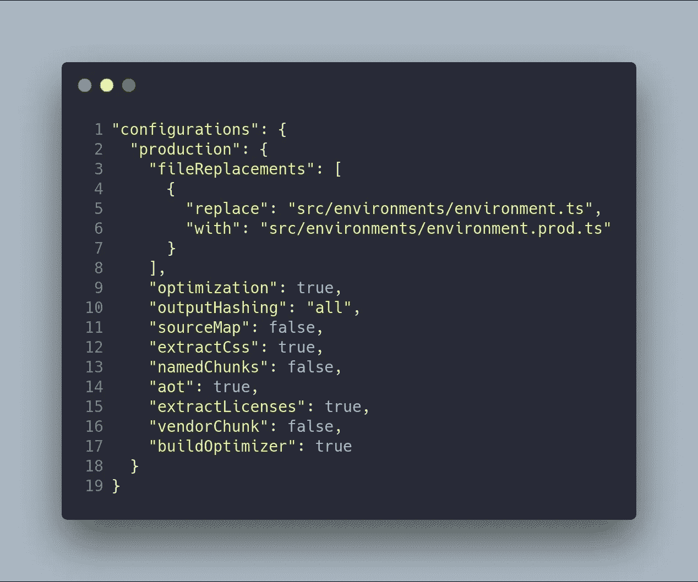
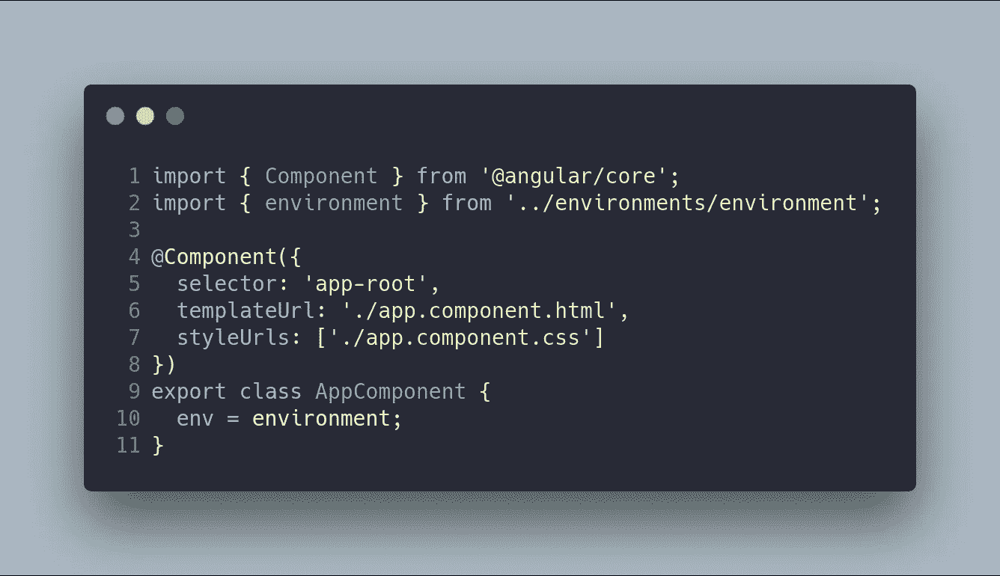
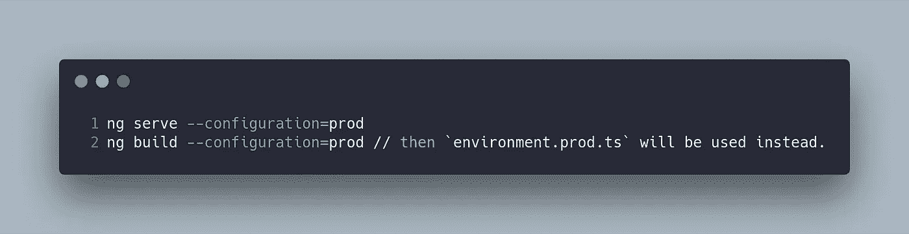
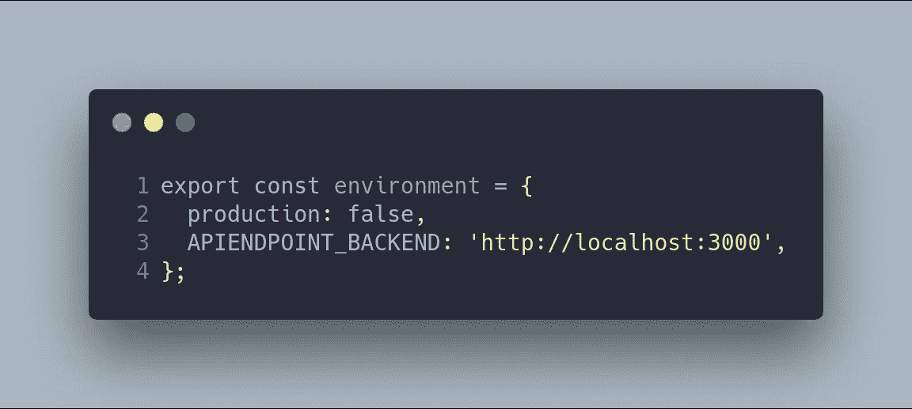
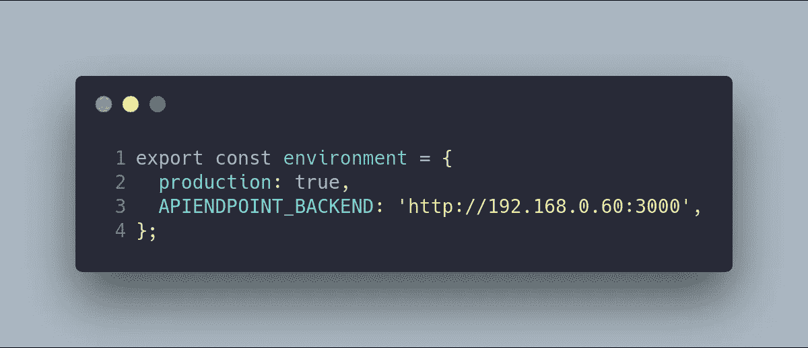
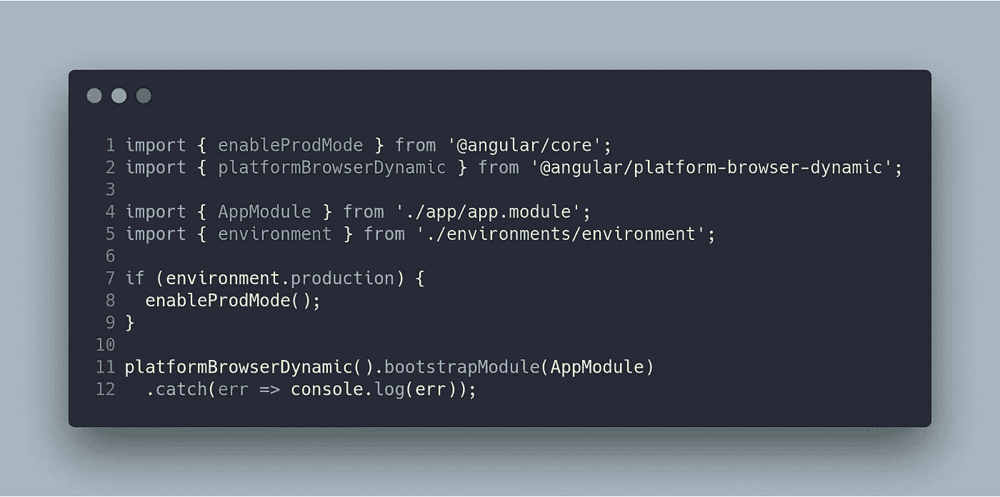
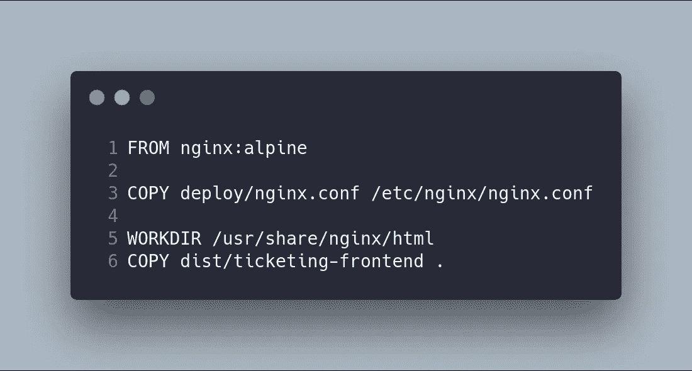
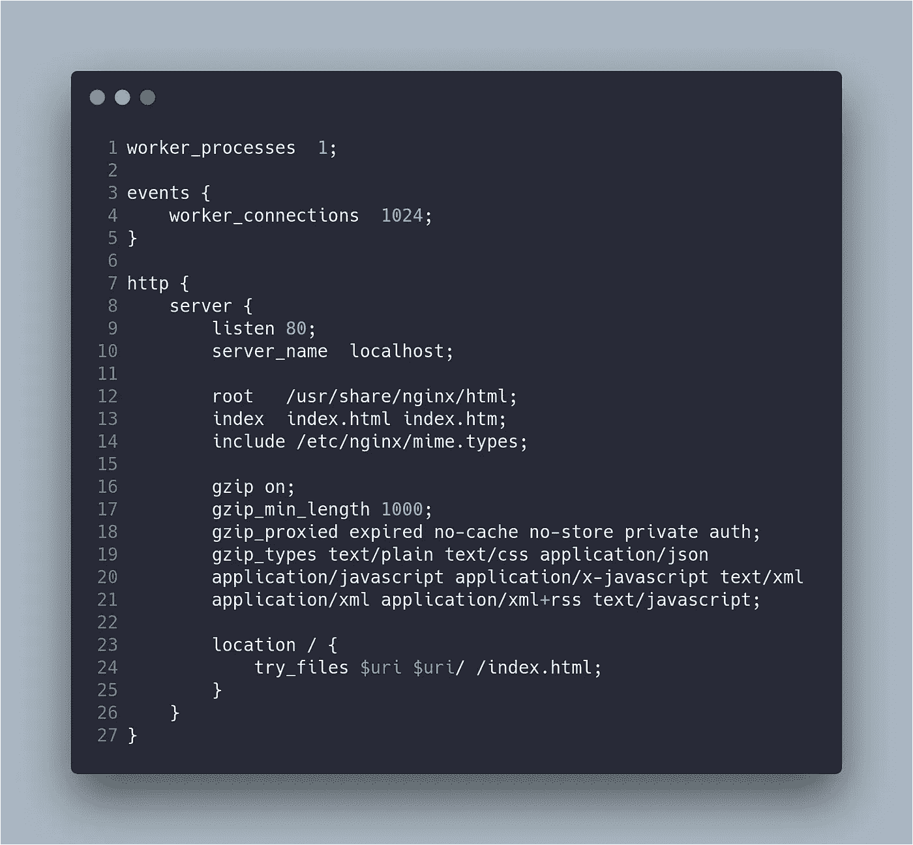
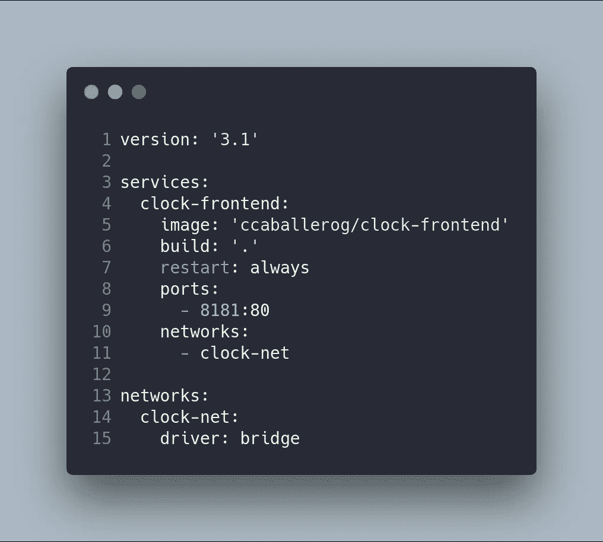

# 上下班打卡系统第 8 部分:使用环境部署前端(角度 6+)

> 原文：<https://betterprogramming.pub/part-8-clock-in-out-system-deploy-frontend-angular-6-using-environments-ad267325d3b6>

## NestJS + Angular 教程

这篇文章是我描述上下班打卡系统的系列文章的一部分。如果你想了解更多，你可以阅读以下内容:

*   [上下班打卡系统第 1 部分:图](https://medium.com/@ccaballero/part-1-clock-in-out-system-diagram-a0a51bab02a7?source=post_page---------------------------)
*   [上下班打卡系统第二部分:基础后端— AuthModule](https://medium.com/better-programming/part-2-clock-in-out-system-basic-backend-i-authmodule-66d4a5c56122?source=post_page---------------------------)
*   [上下班打卡系统第 3 部分:基本后端——用户模块](https://medium.com/better-programming/part-3-clock-in-out-system-basic-backend-ii-usersmodule-a56f42b20f62?source=post_page---------------------------)
*   [上下班打卡系统第 4 部分:基础后端— AppModule](https://medium.com/better-programming/part-4-clock-in-out-system-basic-backend-iii-appmodule-850dd17883e?source=post_page---------------------------)
*   [上下班打卡系统第 5 部分:种子数据库和迁移数据](https://medium.com/better-programming/part-5-clock-in-out-system-seed-database-and-migration-data-cf037be21aac?source=post_page---------------------------)
*   [上下班打卡系统第 6 部分:基本前端](https://medium.com/@ccaballero/part-6-clock-in-out-system-basic-frontend-an-7e5f9ed08c3f?source=post_page---------------------------)
*   [上下班打卡系统第 7 部分:使用 Docker/Docker-Compose 部署后端(NestJS)](https://medium.com/@ccaballero/part-7-deploy-backend-nestjs-docker-docker-compose-2429c0b6aa9c?source=post_page---------------------------)
*   [上下班打卡系统第 8 部分:使用环境部署前端(角度 6+)](https://medium.com/@ccaballero/part-8-clock-in-out-system-deploy-frontend-angular-6-using-environments-ad267325d3b6?source=post_page---------------------------)
*   [上下班打卡系统第 9 部分:后端测试——服务的单元测试](https://medium.com/@ccaballero/part-9-testing-backend-testing-2d021f48403b?source=post_page---------------------------)
*   [上下班打卡系统第 10 部分:后端测试——控制器单元测试](https://medium.com/@ccaballero/part-10-testing-backend-testing-unit-testing-controllers-4177370ef581?source=post_page---------------------------)
*   上下班打卡系统第 11 部分:后端测试-e2e 测试
*   上下班打卡系统第 12 部分:前端测试单元测试
*   上下班打卡系统第 13 部分:前端测试集成测试

在第 7 部分中，我们使用环境变量部署了系统的后端，并在生产服务器中使用了 [Docker/Docker Compose](https://docs.docker.com/compose/) 。在本文中，我们将部署我们的前端，使用环境变量(使用 Angular CLI 创建)和 Docker/Docker Compose 在 Angular 中开发。

这里包括一个在 Angular 中管理环境变量的通用解决方案，使用 [Angular CLI](https://cli.angular.io/) (我们很快就会用到)。另一个解决方案是使用诸如 [gulp](https://gulpjs.com/) 或 [webpack](https://webpack.js.org/) 之类的工具创建自己的部署系统。

最后，使用 [Docker 的容器](https://www.docker.com/)部署我们的代码。我们将从我们的代码和 [Docker Compose](https://docs.docker.com/compose/) 中创建一个图像。

# 步骤 1:用 Angular 管理环境变量

默认情况下，Angular CLI 会创建一个包含环境文件的`src/environments`文件夹。最初有两个文件:`environment.ts`和`environment.prod.ts`。

`environment.ts`文件用于开发环境，而`environment.prod.ts`文件用于生产环境。这些文件都在`angular.json`文件中被引用。

`fileReplacements`数组是 Angular 的环境键，因为它用于指示当使用`production`配置时哪个文件将被替换。

在我们的代码中，我们只需要从环境文件中导入对象来使用我们的环境变量。下面的代码显示了一个导入所述环境文件的组件。

在不同环境之间切换的方法是使用`--configuration`选项，该选项可在`ng serve`和`ng build`命令中使用:

我们可以拥有任意多的配置环境，例如:

*   `environment.test.ts`这个配置可以用来改变单元测试环境中的几个变量。
*   `environment.e2e-test.test`该配置可用于改变 e2e 测试环境中的几个变量。
*   `environment.qa.ts`该配置可用于改变质量保证环境中的几个变量。

因此，我们的环境文件的内容如下:

在环境文件之间变化的变量是`APIENDPOINT_BACKEND`和`production`。在`main.ts`文件中使用`production`变量来调用`enableProdMode`，T5 用于在最终的`bundle`中做一些优化。

在我们的项目中，有一个包含项目常数的文件。该文件包含端点列表，这些端点是使用`APIENDPOINT_BACKEND`的关系。这个想法是使用环境文件(`environment`)，您可能会在下面的代码中看到:

# 步骤 2:使用 Docker 和 Docker Compose 进行部署

这个想法是在开发和生产中使用相同的环境。在这种情况下，Docker 是完美的工具，因为它允许我们配置不同的容器来切换环境的配置。我们需要建立自己的形象，一个 Docker 容器。这将使用`docker-compose`进行编排。

## 码头工人

我们的`dockerfile`文件基于`nginx:alpine`图像，因为项目不需要系统库。该图像仅使用命令`ng build --configuration=prod`从构建到发布复制了`nginx.conf`配置和角度项目。

将 Angular 代码部署在 web 服务器中非常重要，例如`apache`或`nginx`服务器。

`nginx`配置如下:

## docker-撰写

在我们的项目中，我们有一个用于部署 docker 映像的`docker-compose`文件。文件非常简单。它仅仅部署了包含我们 Angular 项目的编译代码的容器。

# 步骤 3:使用 Shell 脚本执行

我们流程的最后一步是自动化容器的构造和执行。我有两个脚本来完成这项任务:第一个脚本创建图像(首先删除图像，如果有图像的话)，第二个脚本使用`docker-compose`部署代码。

# 结论

在这篇文章中，我解释了如何使用 Docker 和 Docker Compose 部署 Angular 前端。这段代码最有趣的特性是，我们可以加载自己的环境变量，使用 Angular CLI 在开发和生产环境之间切换。