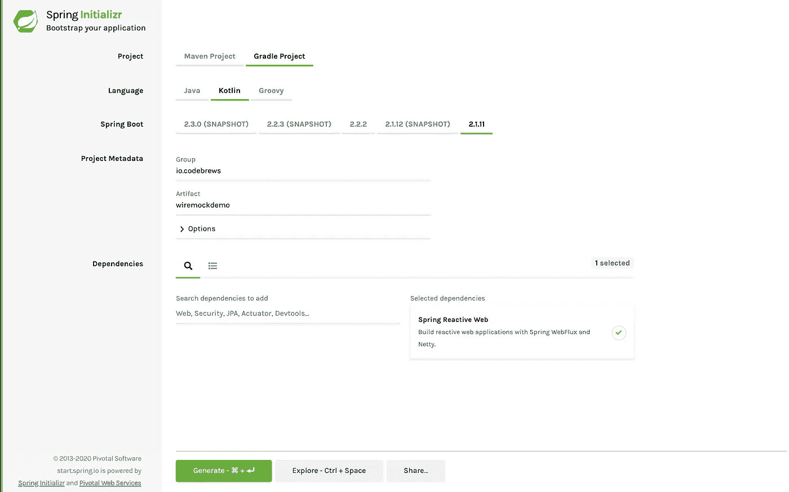
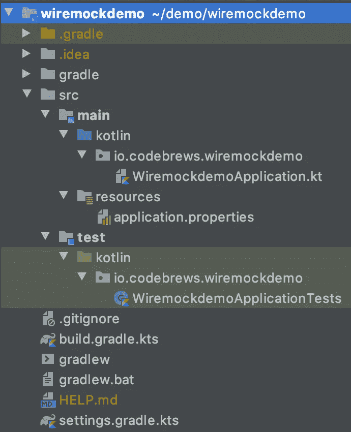
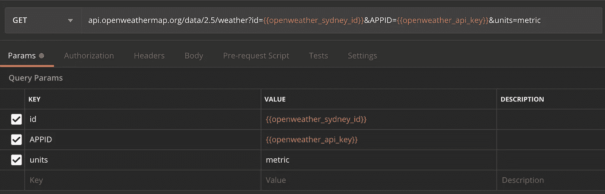

# 如何用 Spring WebFlux 和 WireMock 构建一个 Kotlin Spring Boot 应用程序

> 原文：<https://betterprogramming.pub/part-i-how-to-unit-test-your-kotlin-springboot-webflux-webclient-that-is-calling-external-api-714ccaa186c>

## 干净、现代的科特林


Spring Boot 框架下的科特林

# 介绍

[科特林](https://kotlinlang.org/)、 [Spring Boot](https://spring.io/projects/spring-boot) 和 [WireMock](http://wiremock.org/) 是构建 REST API 服务时使用的强大组合。我是 Spring Boot 的新手，但是已经喜欢上它了，因为它提供了无缝的 API，例如使用`@Configuration`、`@Component`和`@Bean`的依赖注入。

Kotlin 作为一种语言是非常好和方便的。它的语法很简单(我知道，简单是相对的)，很现代(不管这是什么意思)。WireMock 是一个非常好的单元测试工具，尤其是当您的服务调用外部 API 提供者时。

本教程将涵盖以下内容:

*   使用科特林、Spring Boot 和 Spring [WebFlux](https://docs.spring.io/spring/docs/current/spring-framework-reference/web-reactive.html#webflux) 建立一个简单的 REST API 服务。这个 API 服务将调用[开放天气](https://openweathermap.org/api) API。
*   使用 WireMock 编写单元测试来模拟 Open Weather API 服务器响应。

# 生成科特林 Spring Boot 项目

*   转到[https://start . spring . io](https://start.spring.io/)。
*   生成一个 Kotlin [Gradle](https://gradle.org/) 项目并添加 [Spring Reactive Web](https://docs.spring.io/spring-framework/docs/5.0.0.M1/spring-framework-reference/html/web-reactive.html) 作为依赖项。
*   最后，点击*生成项目*。这将下载一个包含项目结构的 ZIP 文件。



弹簧初始化 r

# 构建 API 路由和处理函数

*   解压缩文件，并使用 IDE 打开它。ZIP 文件包含以下项目结构。



初始项目结构

*   让我们构建我们的 API 路线。

注意`@Suppress("unused")`注释。这是为了摆脱 IntelliJ 的“类路径从未被使用”的代码检查，因为我们不会在任何地方直接使用 T4 类。(顺便说一句，这不是必须的，只有当您看到 IntelliJ 的代码检查突出显示未使用的类时，才会感到恼火。)

这样做的原因是 Spring Boot 实际上通过`@Configuration`和`@Bean`注释来管理路由的注册。

Spring WebFlux 还提供了路由 DSL，你可以在`route`函数中看到。这里，我们指定我们的 API 基本路由以`/api`为前缀，并接受一个内容类型`application/json`。

我们使用`nest`，它基本上是块内定义的任何路线的前缀；这种情况下是`/current-weather`。

所以，如果你将来想增加更多的路线，你可以把它们放在这个街区。它们将自动继承`/api`前缀和`application/json`内容类型。

我们的 route 的方法是`POST`，任何点击这个 route 的请求的处理函数是`getCurrentWeather`，由实现`WeatherService`的类提供。稍后将详细介绍。

Route.kt

*   让我们定义我们的接口、实现类和数据模型。

## **界面**

这个接口定义了 API 契约，并将由真正的`WeatherService`类实现，该类传递给上面的`Route`类。

WeatherService.kt

## **实现类**

`@Component`标注是我很喜欢的另一个 Spring“魔术”。它基本上在应用程序上下文中注册了这个类，这样我们上面的`Route`类就知道它应该使用这个实现类。

注意`Route`类需要`WeatherService`，而`OpenWeatherImpl`是实现`WeatherService`的类。

OpenWeatherImpl.kt

让我们通过添加调用外部 API 的功能来继续我们的实现类。

Spring WebFlux 提供了一个`WebClient`，我们可以用它来进行 HTTP 调用。我们需要把这个传给我们的`OpenWeatherImpl`班。

具有工作实现的 OpenWeatherImpl.kt

我们需要另一个类来处理实现类中所需的`WebClient`的创建。这样做的目的是使我们的单元测试更容易，因为我们可以模仿`WebClient`或者配置它。

注意`createWebClient`函数上的`@Bean`注释。这就是我们的`OpenWeatherImpl`如何获得对`WebClient`对象的依赖。

OpenWeatherConfig.kt

此外，我们需要在我们的`application.properties`文件中添加开放天气 API 基础 URL。

我们通过`@Value`注释将这个值传递给上面的`OpenWeatherConfig`类。对于本教程，我们的 API 密匙将存储为一个环境变量`OPENWEATHER_API_KEY`。

应用程序.属性

## **数据模型**

这个文件定义了我们发送给 Open Weather API 的对象的模型，以及我们期望从 Open Weather API 接收的对象的模型。(请注意，我们只捕获了一个字段`main`，真实响应有更多字段。)

Model.kt

# 运行应用程序并调用 API 端点

*   我们的 API 端点已经准备就绪，让我们运行应用程序。转到`WiremockdemoApplication.kt`并运行`main`功能。
*   您可以通过像`[Postman](https://www.getpostman.com/)`这样的工具或者只是简单地从命令行调用这个端点。如果你想从命令行进入，这里是`curl`命令。

```
curl -X POST \
  [http://localhost:8080/api/current-weather](http://localhost:8080/api/current-weather) \
  -H 'Content-Type: application/json' \
  -d '{"cityId": "6619279"}'# The cityId in this example is for Sydney, Australia, for other cities, please go to openweathermap.org
```

你应该会得到这样的回应。

```
STATUS - 200 OKResponse body
{
  "main": {
    "temp": 284.35,
    "pressure": 1019,
    "humidity": 62,
    "temp_min": 282,
    "temp_max": 287
  }
}
```

瞧啊。您已经完成了 API 路由及其处理函数的设置。

# 编写单元测试

在教程的这一部分，我们将添加单元测试依赖，并为我们的应用程序编写测试用例。

## 将 WireMock 添加到项目依赖项中

首先，我们需要将 WireMock 包包含在我们的项目依赖项中，以便 Gradle 可以下载并将其导入到我们的项目中。

在您的`build.gradle.kts`中，将下面的包`com.github.tomakehurst:wiremock-jre8:2.25.1`添加到`dependencies`中。

概括一下，你的`build.gradle.kts`现在应该是这样的。

带有 WireMock 包的 build.gradle.kts

完成后，点击编辑器中的 Gradle 工具，并点击*重新导入所有 Gradle 项目*以确保 WireMock 包被添加到项目中，这样我们就可以开始在我们的测试类中使用它了。

## 准备来自开放天气 API 的模拟响应

为了模拟实际的开放天气 API，我们需要知道响应是什么样子的。因此，让我们通过 Postman 发出请求并保存响应。



邮递员要求打开天气预报

来自 Open Weather API 的成功响应是`200 OK`,其响应体如下所示。

开放天气 API 响应主体

让我们把它保存在`src/test/kotlin/resources`文件夹中的一个名为`openweather-api-response.json`的文件中。我们稍后将使用这个文件来模拟测试用例中开放天气下的 API 响应。

## 创建一个 application.properties 文件来指定本地开放天气端点

因为我们将使用一个`WireMock`服务器来模拟真实的开放天气端点，我们需要配置我们的测试应用程序来指向`localhost`而不是真实的端点。

为此，我们只需要在`src/test/kotlin/resources`文件夹中创建一个`application.properties`文件，并像这样指定本地端点。

指向本地开放天气

## 为测试类设置初始结构

让我们继续到测试类。首先，在`src/test/kotlin/io/codebrews/wiremockdemo`文件夹中创建一个新的 Kotlin 文件/类，并将其命名为`RouteTest.kt`。

我们将用下面的内容来注释我们的`RouteTest`类:

*   `@SpringBootTest`:它创建了 Spring 的`ApplicationContext`，并引导我们应用程序的整个容器进行测试。
*   `@RunWith(SpringRunner.class)`:它允许我们在 [JUnit](https://junit.org/junit5/) 测试中使用 Spring Boot 特性。它支持加载 Spring 的`ApplicationContext`和通过`@Autowired`注释注入 beans。

RouteTest.kt —初始结构

## 设置 WebTestClient 和 WireMock 服务器

我们需要能够测试我们的应用程序的组件是:

*   `WebTestClient`:它是 Spring 提供的一个 HTTP 客户端，用来测试我们的反应式 HTTP 端点。注意`@Autowired`注释。这是因为我们希望 Spring 注入我们的`WebTestClient`，而不是自己初始化。我们的`client`的`private lateinit var`访问修饰符是必需的，否则`@Autowired`将无法工作。
*   `WireMockRule`:这个组件将在任何测试用例执行之前启动我们的 WireMock 服务器，并在所有测试用例完成之后关闭服务器(在`@ClassRule`上做一些谷歌搜索)。它被放在`companion object`中，并由`@JvmField`进行注释，因为我们希望它的行为像一个 Java 静态对象(作为一个类级变量)。(当然，还有另一种方法。)
*   `fun stubResponse`:这是一个告诉 WireMock 服务器如何运行的函数，例如，它应该尝试匹配哪个 URL，它是否应该返回一个响应，如果是，响应应该是什么。这个函数应该在测试用例开始的时候被调用。

RouteTest.kt —具有 Wiremock 规则和存根函数

## 测试是否加载了开放天气 API 响应

为此，我们将把`openweather-api-response.json`文件内容的`String`表示记录到控制台，并断言它的 Kotlin 对象不是`null`。

将文件内容加载到 Kotlin `String`对象的代码行是`private val openWeatherApiResponse: String? = this::class.*java*.*classLoader*.getResource(apiResponseFileName)?.*readText*()`。

如果您运行这个测试，您应该看到控制台中记录了`openweather-api-response.json`的内容，并且您的测试成功执行。

加载了 API 响应和 AutoConfigureWebTestClient 注释的 RouteTest.kt

请注意，有一个注释被添加到我们的`RouteTest`类中，即`@AutoConfigureWebTestClient`。这个注释为我们的测试类提供了对`WebTestClient`对象的自动配置，这样我们就可以在以后使用它来运行我们的测试用例。

我们需要注释，因为我们使用`@SpringBootTest`来运行我们的测试。作为替代，您可以尝试使用`@WebFluxTest`注释(本教程不涉及)。

仅供参考，如果您在没有添加`@AutoConfigureWebTestClient`的情况下运行测试类，您将会得到以下异常:

```
org.springframework.beans.factory.UnsatisfiedDependencyException: Error creating bean with name 'io.codebrews.wiremockdemo.RouteTest': Unsatisfied dependency expressed through field 'client'; nested exception is org.springframework.beans.factory.NoSuchBeanDefinitionException: No qualifying bean of type 'org.springframework.test.web.reactive.server.WebTestClient' available: expected at least 1 bean which qualifies as autowire candidate. Dependency annotations: {[@org](http://twitter.com/org).springframework.beans.factory.annotation.Autowired(required=true)}
```

## 为我们的应用程序的 API 端点编写测试用例

是时候为我们的应用程序的端点编写测试用例了。

我们将通过 WireMock 服务器实例模拟来自真实 Open Weather 端点的 API 响应，该实例将返回响应，就像它是真实的 Open Weather 端点一样。

我想强调一下 Spring Boot 框架的一些优点:

*   `@SpringBootTest`注释将启动我们的 Spring Boot 应用程序进行测试，这包括 Spring 的应用程序上下文管理，即我们的应用程序运行所需的所有组件和 beans 的依赖注入。
*   `@AutoConfigureWebTestClient`将绑定`WebTestClient`实例，这样它就知道要访问我们的测试 Spring Boot 应用程序，也就是说，它将配置应用程序端口并将其绑定到`WebTestClient`。另外，请注意，`WebTestClient`实例是由 Spring 通过`@Autowired`设置的。

带有测试用例的 RouteTest.kt

我们配置由`WireMockRule`提供的 WireMock 服务器，以返回我们设置为`openWeatherApiResponse`的 JSON 响应。

在通过我们的`WebTestClient`对象发出任何 HTTP 请求之前做`stubResponse(url, openWeatherApiResponse!!)`是很重要的，否则 WireMock 服务器不知道如何响应我们的 HTTP 请求。

然后，这是我们通过`WebTestClient`对象向测试应用程序的端点发出 HTTP 请求的部分。

```
client.post()
    .uri("/api/current-weather")
    .body(Mono.just(requestBody), CityId::class.*java*)
    .exchange()
    .expectStatus().*isOk* .expectBody().json(responseBody)
```

注意，我们不需要在`.uri(“/api/current-weather”)`上指定基本 URL，因为 Spring 通过`@AutoConfigureWebTestClient`为我们管理它。

我们的单元测试断言我们的应用程序将返回一个状态`200 OK`，并带有一个对应于`openweather-api-response.json`中内容的响应体。(请记住，我们的应用程序只从 Open Weather API 响应中提取了几个字段。)

最后，我们的单元测试还验证了我们的应用程序通过`verify(getRequestedFor(urlEqualTo(url)))`发出 HTTP 请求的 URL。

注意，我们也没有为此指定基本路径，原因是基本路径取自我们的`application.properties`文件。这个验证是为了确保我们真正的`WebClient`正在向正确的资源 URL 发出 HTTP 请求。

继续运行测试类。您应该看到两个测试用例都成功运行了。万岁！

# 最后的话

如果您已经做到了这一步，您将会学到以下内容:

*   设置一个具有 API 端点的 Kotlin Spring Boot 应用程序，该应用程序调用外部 API。
*   利用 Spring WebFlux 提供的`WebClient`来管理外部 API 调用。
*   通过 WireMock 编写单元测试的测试用例。

太棒了。


杰森·霍根在 [Unsplash](https://unsplash.com?utm_source=medium&utm_medium=referral) 上的照片

# 参考

该项目的 GitHub repo 可从 [GitHub](https://github.com/billydh/wiremockdemo) 获得。