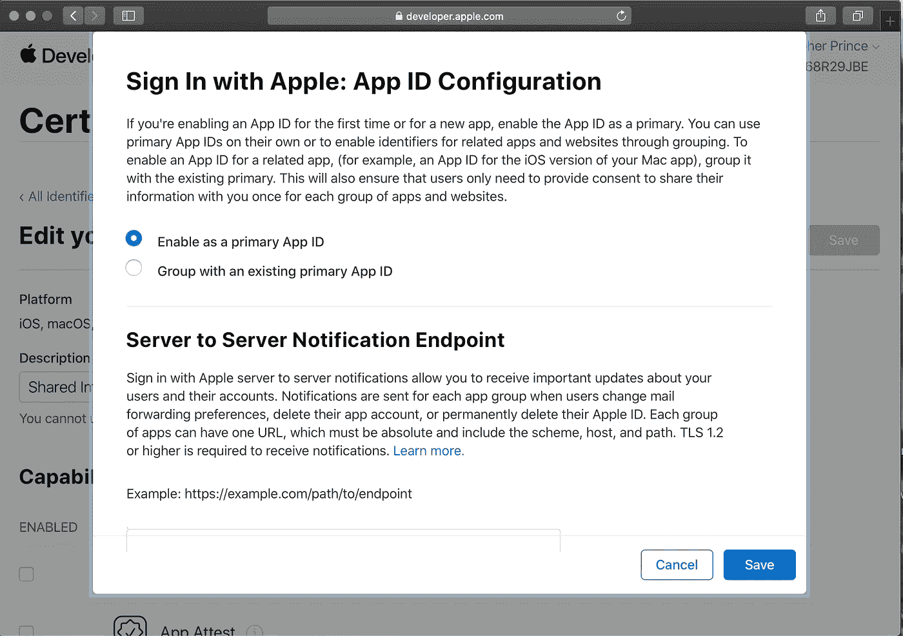

# 苹果登录:定制服务器和到期难题(第二部分)

> 原文：<https://betterprogramming.pub/part-ii-apple-sign-in-custom-servers-and-an-expiry-conundrum-b3e9735dc079>

## 苹果正在解决我之前担心的潜在安全问题

由 [Unsplash](https://unsplash.com?utm_source=medium&utm_medium=referral) 上的[美元吉尔](https://unsplash.com/@dollargill?utm_source=medium&utm_medium=referral)拍摄的照片

正如我在之前的媒体文章和 Stackoverflow 帖子上的[中描述的](https://stackoverflow.com/questions/58178187/apple-sign-in-how-to-use-it-for-custom-server-endpoint-authentication/62604213#62604213)[，苹果之前没有为苹果登录提供任何机制来更新定制服务器，如果苹果登录用户在一天内的某个时间撤销了他们的帐户权限。只有最初在定制服务器上验证 Apple 登录身份令牌的方法，以及随后每 24 小时检查一次用户帐户状态的方法。当使用 Apple sign-in 进行服务器端点鉴定时，这可能是一个安全问题。欺诈性攻击者可能会以某种方式获得认证令牌，并获得对我们定制服务器上的用户帐户长达 24 小时的访问权限。](https://medium.com/better-programming/apple-sign-in-custom-servers-and-an-expiry-conundrum-d1ad63223870)

在 [*充分利用 2020 年在 WWDC 登录苹果*](https://developer.apple.com/videos/play/wwdc2020/10173/) 中，在演示开始 11 分 30 秒时，他们引入了服务器到服务器通知，使您的服务器能够实时监控苹果登录用户帐户状态的变化。看起来在我们的服务器上将会有几个苹果登录帐户事件我们可以得到通知:电子邮件启用，电子邮件禁用，同意撤销，和帐户删除。

到目前为止细节还很少:[没有明显的在线文档说明如何使用这些服务器到服务器的通知](https://developer.apple.com/documentation/technologies?tags=Sign%20in%20with%20Apple) ( [见我关于这个主题的问题](https://developer.apple.com/forums/thread/651336))。[不过，请看下面我 8/8/20 的更新]。

当关于这些服务器到服务器通知的更多发布的细节可用时，我看到了以下前进的方向:

在我的[苹果登录 Kitura 凭证插件](https://github.com/crspybits/CredentialsAppleSignIn.git)中，我将有三个有效的结果状态:

1)插件无法认证用户——例如，如果插件被给予无效的身份令牌；

2)插件对用户进行身份验证，令牌中的到期日期仍然有效。这是我将寻找的状态，以便在插件的下游创建一个新用户——在我的定制服务器上。

3)插件对用户进行身份验证，令牌中的到期日期不再有效。这是一种持续的典型状态，因为当颁发 ID 令牌时，它有一个仅在一小段时间(五分钟)内有效的到期日期。并且因为身份令牌通常不能被刷新。在这种典型情况下，我将依靠两种机制来进一步验证用户，如下所述。

**机制 1:** 正如苹果之前提供的(截至 WWDC 2019)，我们可以[轮询他们的服务器，每天最多检查一次账户有效性](https://developer.apple.com/documentation/sign_in_with_apple/sign_in_with_apple_rest_api/verifying_a_user)。如果用户的凭证令牌通过这种方法变得无效，我们可以通过端点调用将这一情况报告给我们的客户端，并要求用户重新登录。我计划在我的定制服务器中对特定端点的使用情况进行 24 小时的检查。这种检查依赖于苹果的“刷新令牌”(我引用这一点是因为它没有提供我通常期望 OAuth 刷新令牌提供的功能，即创建有用的更新令牌)。

下面是来自我的 ServerAppleSignInAccount 库的 [generateRefreshToken 和 validateRefreshToken 方法。最重要的上下文方面是用于 REST 调用的基本 URL:`appleid.apple.com`。为了简洁起见，删除了其他上下文、注释和日志语句，](https://github.com/SyncServerII/ServerAppleSignInAccount.git)[参见库](https://github.com/SyncServerII/ServerAppleSignInAccount.git)。

**机制 2:** 使用他们的服务器到服务器通知，以及 Apple 尚未发布的文档。这(显然)将要求我向我的服务器添加一个新的端点，其唯一的目的是允许 Apple 连接到我的服务器，以更新与 Apple Sign In 连接的用户的更改。与上面类似，如果用户通过这种方法变得无效，我们可以在下一次端点调用时将这一情况报告给我们的客户端，并要求用户重新登录。

# **总结思路:**

1)我现在可能只进行上述计划的部分版本:我将只实现上述机制 1，并在 Apple 提供文档时添加机制 2。在我的情况下，我的特定服务器/应用程序的用户群是有限的，所以我认为安全问题会很小。

2)我也考虑过在上面增加第三个机制。这将通知服务器客户机已知的 ID 令牌被撤销或者已经变坏。这在用户经常使用 iOS 客户端应用程序的情况下可能很有用。iOS 上苹果登录会话的推荐程序是调用 [getCredentialState](https://developer.apple.com/documentation/authenticationservices/asauthorizationappleidprovider/3175423-getcredentialstate) ，这可以让客户端知道用户不再有效——例如，[撤销状态](https://developer.apple.com/documentation/authenticationservices/asauthorizationappleidprovider/credentialstate)。然而，这使我们处于一种不寻常的情况。iOS 客户端应用程序上有一个无效用户。我们真的希望一个无效用户对我们的服务器进行端点调用吗？如果服务器到服务器的通知如我们所期望的那样运行(机制 2)，那么我们的服务器应该已经收到一个调用，告诉它用户不再有效。

3)我一直在使用 [Kitura 凭证](https://github.com/IBM-Swift/Kitura-Credentials)插件为用户对我的服务器进行初始凭证验证。在我使用或开发的所有其他 Kitura 凭证插件中，我能够完全确定地检查凭证是否有效。也就是说，插件处理的结果是二进制的:是，凭证有效，或者否，凭证无效。使用我的[苹果登录 Kitura 凭证插件](https://github.com/crspybits/CredentialsAppleSignIn.git)，我不得不如上所述削弱它的操作——并且有第三种不确定状态。ID 令牌已过期，您需要进一步检查凭据是否有效。这增加了使用这个插件的定制服务器的复杂性，包括这些额外的有效性检查步骤。

# 更新(2010 年 8 月 8 日)

@Merricat 向我介绍了苹果开发者网站上的一些设置，允许我配置服务器到服务器的端点。转到[https://developer.apple.com](https://developer.apple.com)，然后:

1)点击*账户*，用你的苹果开发者凭证登录。
2)点击*证书，id&个人资料*
3)点击*标识符*
4)点击你的应用程序的标识符
5)滚动到*用苹果登录*，点击*编辑*。

你会看到:

Apple 登录的服务器到服务器通知端点

然而,[了解更多链接](https://help.apple.com/developer-account/#/devde676e696)似乎并没有给出 TLS 1.2 要求的更多信息。我还找不到任何关于苹果将如何调用你的定制服务器端点的协议的文档。

# 更新(2010 年 12 月 31 日)

我现在在一个测试服务器上运行这些服务器到服务器的通知。详情请见[https://stack overflow . com/questions/58178187/apple-sign-in-how-to-use-it-for-custom-server-endpoint-authentic ation/62604213 # 62604213](https://stackoverflow.com/questions/58178187/apple-sign-in-how-to-use-it-for-custom-server-endpoint-authentication/62604213#62604213)