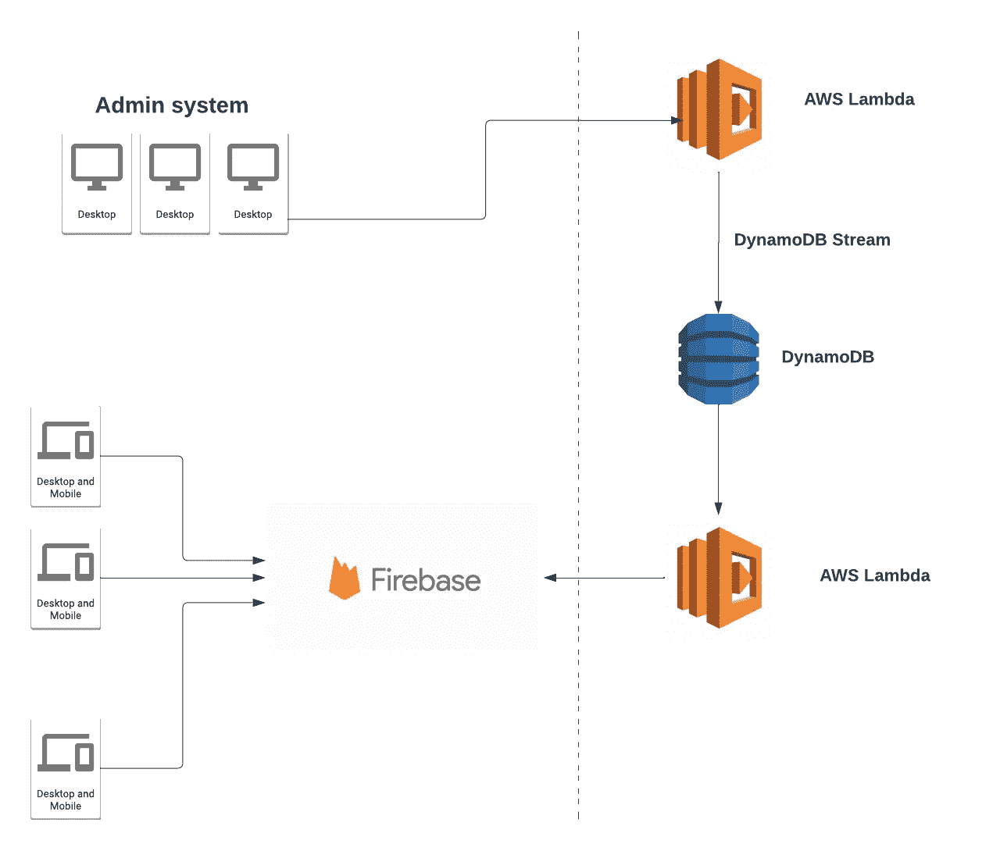
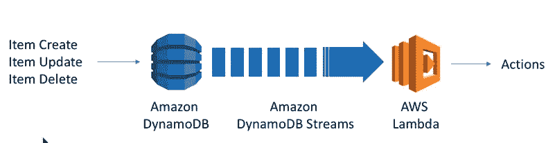

# 部分同步 DynamoDB 到 Firestore 数据库

> 原文：<https://betterprogramming.pub/partial-sync-dynamodb-to-firestore-database-2dcb54a3f9ae>

## 但是为什么呢？嗯，这是很酷的 AF，解决了一个非常常见的用例！

设置

这不会是两种数据库产品之间的直接比较。主要是因为它们不能直接比较。尽管它们都是 NoSQL 文档商店，但许多东西是不同的。以下内容不会帮助您决定使用哪个数据库，因为这完全取决于您的需求。

首先，Firestore 数据库是 Google 云服务，而 DynamoDB 是 AWS 服务。这本身对服务的细节没有什么影响。但是，如果您的许多其他服务已经托管在其中一个提供商处，您可以获得一些优势。整合和协同将变得更加容易。

这让我想到了手边的用例！

我发现这两个服务(Firestore 和 DynamoDB)都很有用，并希望使用它们来提供一些很酷的工作流和数据结构。这意味着我们可以利用两种服务的力量，而不会“滥用”其中任何一种。

# 介绍

我们有一个 DynamoDB 表，包含大约 1000 条记录。预计这一数字今后还会增加。每个文档都很大，包含一个嵌套的 JSON 结构。每个对象的大小可以不同，但是理论上，这些对象的大小没有限制(除了 DynamoDB 所允许的)。

让我们想象 DynamoDB 中的一个文档是这样的:

虚拟测功机项目

DynamoDB 非常擅长保存这些嵌套文档。

我可以添加和删除任意多的对象(只要不超过 400kb)。在许多情况下，规范化您的模式(使结构更扁平)会更好，这样您可以将数据分布在多个表中，但是现在，让我们假设这不是一个选项。

这里不详细描述访问模式和模式策略，而是非常简单地描述如何从 DynamoDB 中获取数据。

DynamoDB 有两个获取数据的 API:`scan`和`query`。

`Scan`将遍历整个表(直到达到 1 MB 的限制)，而 Query 将使用表的索引来获取更多特定的项。如果你有`Partition`键，你可以更快地取回你的物品。所以，如果可能的话，你会想做一个`query`。

## 问题

从上面可以看出，如果我们想从数据库中的所有项目中检索所有的`lastUpdatedBy`属性，我们会很快遇到一些非常慢的`scans`和大量的过度获取，因为我们不想将整个对象发送给客户端。

然后，下个月，我们需要呈现应用程序中所有项目的字段`name`。这就是 DynamoDB 和 Firebase 的结合可以让我们变得非常容易的地方。

我们需要以下物品:

*   DynamoDB 流
*   AWS 函数
*   谷歌 Firebase

## DynamoDB 流

流使得这一切以一种分离的方式成为可能。

基本上，这是一个 AWS 将记录从 DynamoDB 发送到 Lambda 函数的特性。除了记录之外，还会告诉您什么操作会触发 lambda(记录更改、创建或删除)。你怎么处理那张唱片取决于你自己。

快速概述

在我们的例子中，我们使用记录来选择一个特定的属性，将其“同步”到另一个数据库。在其他情况下，您可以简单地通知 Slack 已经插入了一条记录，或者做您想象中允许的任何事情。

# 自动气象站λ

当从 DynamoDB 流发送一条记录时，我们需要一个`Lambda`处理程序(一个函数)。

下面是一个处理程序的简单例子，它将处理流发送的每个记录。对于每条记录，`lastUpdatedBy`作为唯一的字段保存在 Firebase 中(和一个键一起)。如果您想让另一个字段从 DynamoDB 同步到 Firebase，这使得修改这个函数变得非常容易。

AWS lambda DynamoDB 插入处理程序

## 重火力点

Firebase 是迄今为止最容易连接的数据库。最流行的框架都有自己的库。这个数据库的美妙之处在于 firebase 库将创建一个与大多数集成的 WebSocket 连接。这意味着您可以轻松地连接到您的数据，而且还可以即时获得更新。

# 结案陈词

流的特性使得分离我们的两个数据库变得非常容易。这意味着，如果您不要求始终同步 100%的数据，同步数据的过程会变得相对简单。

Firebase 带来了一些特性，使得它非常适合前端使用，DynamoDB 在安全性、数据存储、与 AWS 的集成和定价方面有更多的特性。

使用这种设置，如果需求需要，可以很容易地向 Firebase 添加更多的字段。更换`lambda`手柄很简单——然后嘣！—你完了。

有许多方法可以实现这种部分同步，但是我发现这种方法非常划算，易于维护和设置。

> 保持同步！