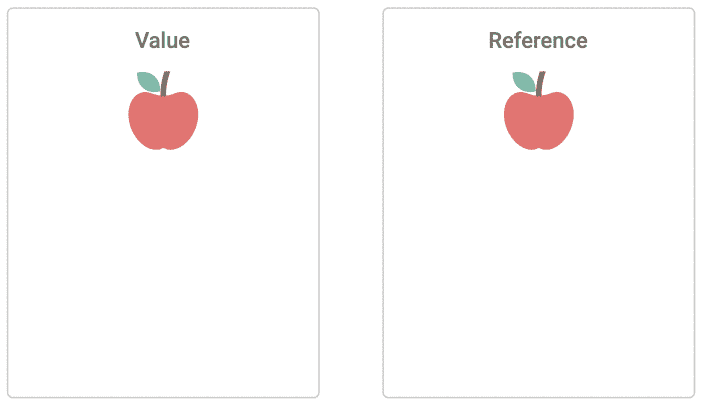

# 在 JavaScript 中将变量作为值和引用传递

> 原文：<https://betterprogramming.pub/pass-variables-as-a-value-vs-as-a-reference-in-javascript-6956f5d93f7e>

## 有什么区别？

照片由[卡斯帕·卡米尔·鲁宾](https://unsplash.com/@casparrubin?utm_source=unsplash&utm_medium=referral&utm_content=creditCopyText)在 [Unsplash](https://unsplash.com/s/photos/javascript?utm_source=unsplash&utm_medium=referral&utm_content=creditCopyText) 上拍摄

嘿，极客们！

如果你学过一些低级语言，比如 C/C++，就像我在大学学的那样，你可能已经知道变量既可以作为值传递，也可以作为引用传递(当然，也可以作为指针传递，但我们不要深究这些细节)。

在 C++中，您需要显式地定义它，而在 JavaScript 中，这种逻辑是内置的。这就是为什么不是所有开始使用 JavaScript 的开发人员都知道这一关键的差异，这可能会导致许多意想不到的错误。

# 首先，让我们弄清楚这一切意味着什么

*   *传值*表示新变量只采用初始变量的实际值。即变量不相互依赖，一个变量的变化不会影响另一个变量。
*   *引用传递*表示新变量采用初始变量的内存地址。因为两个变量都指向同一个内存地址，所以一个变量的变化会影响另一个变量。

我喜欢苹果🍎 🍏

在 JavaScript 中，所有原始数据类型(字符串、数字、布尔值)都由*值*传递，复杂数据类型如数组和对象由*引用*传递。

# 现在我们将使用一些简单的例子来研究它

这里我们使用另一个`foo`变量初始化`bar`变量。因为原始数据类型(在我们的例子中是字符串)是通过值传递的，所以新变量的变化不会影响初始变量。

在将变量传递给函数参数时也是如此。

但是当我们试图传递一个复杂的变量(例如 Object)时，它的行为会完全不同。

下面我们可以看到，当我们将一个对象传递给另一个变量或函数时，它是作为一个引用来传递的，一个变量的变化会影响到引用同一个内存地址的所有其他变量。

# 但是怎么才能克服默认行为呢？

JavaScript 不允许显式选择如何传递变量，所以我们需要制定变通办法来改变默认行为。

## 将原始变量作为引用传递

除了把原始变量包装成一个对象或数组，然后析构之外，我没有找到其他方法来传递原始变量作为引用。

但是从性能的角度来看，这没有任何意义，因为我们需要创建和析构一个复杂的变量。

如果你找到了更好的解决方案，请分享给我们。

## 将复杂变量作为值传递

为了将一个复杂变量作为一个值传递，我们只需要复制它。有多种方法可以做到这一点。

对于对象:

*   `[Object.create()](https://developer.mozilla.org/en-US/docs/Web/JavaScript/Reference/Global_Objects/Object/create)` —使用现有对象创建新对象。
*   `[Object.assign()](https://developer.mozilla.org/en-US/docs/Web/JavaScript/Reference/Global_Objects/Object/assign)` —将所有属性从源对象复制到目标对象，并返回结果对象。
*   `[Object.entries()](https://developer.mozilla.org/en-US/docs/Web/JavaScript/Reference/Global_Objects/Object/entries)`+`[Object.fromEntries()](https://developer.mozilla.org/en-US/docs/Web/JavaScript/Reference/Global_Objects/Object/fromEntries)`—`entries`方法将一个对象转换成一个[键，值]对的数组，`fromEntries`方法将它转换回一个新的对象。
*   [扩展操作符](https://developer.mozilla.org/en-US/docs/Web/JavaScript/Reference/Operators/Spread_syntax) —创建一个对象的副本。

对于数组:

*   `[Array.map()](https://developer.mozilla.org/en-US/docs/Web/JavaScript/Reference/Global_Objects/Array/map)`-创建包含已定义修改(或不包含已定义修改)的副本。
*   `[Array.slice()](https://developer.mozilla.org/en-US/docs/Web/JavaScript/Reference/Global_Objects/Array/slice)` —创建数组一部分的副本(如果调用时不带参数，则创建整个数组的副本)。
*   `[Array.from()](https://developer.mozilla.org/en-US/docs/Web/JavaScript/Reference/Global_Objects/Array/from)` —创建数组的副本。
*   [扩展运算符](https://developer.mozilla.org/en-US/docs/Web/JavaScript/Reference/Operators/Spread_syntax) —创建数组的副本。

我必须警告你，所有这些方法都有一个重要的细节——它们只创建了一个初始变量的浅表副本。这意味着如果在你的数组或对象中有嵌套的复杂变量，它们仍然会被引用复制。

只有几种方法可以生成深层副本:

*   `[JSON.stringify()](https://developer.mozilla.org/en-US/docs/Web/JavaScript/Reference/Global_Objects/JSON/stringify)`+`[JSON.parse()](https://developer.mozilla.org/en-US/docs/Web/JavaScript/Reference/Global_Objects/JSON/parse)`—`stringify`方法将变量转换成字符串，然后`parse`方法将字符串转换回变量。
*   创建您自己的深度复制方法或使用库方法。如[洛达什的](https://lodash.com/docs/4.17.15#cloneDeep) `[cloneDeep()](https://lodash.com/docs/4.17.15#cloneDeep)`。

# 结论

还有最后一个重要通知。使用处理数组和对象的内置方法或库方法时要小心，总是要检查它们是改变了初始变量还是产生了新的变量。

例如，`[Array.pop()](https://developer.mozilla.org/en-US/docs/Web/JavaScript/Reference/Global_Objects/Array/pop)`方法将从初始数组中移除最后一个元素，而`[Array.filter()](https://developer.mozilla.org/en-US/docs/Web/JavaScript/Reference/Global_Objects/Array/filter)`将产生新的元素。