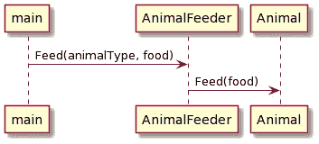
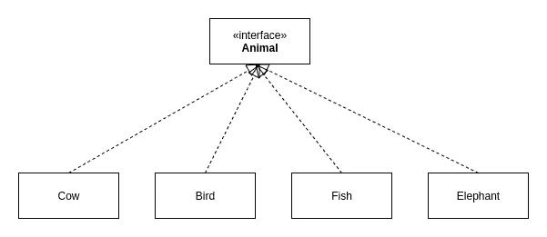
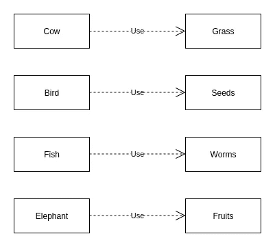
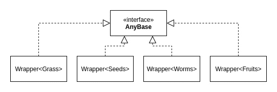

# 像 Python 一样传递 C++中的任何类型来简化我们的代码

> 原文：<https://betterprogramming.pub/passing-any-type-in-c-like-in-python-to-simplify-our-code-3af72347282d>

## 理解像 std::any 这样的类型如何帮助我们简化代码，以及它是如何工作的，这样我们就可以在开发应用程序时确定它是否满足我们的需求


詹姆斯·哈里森在 [Unsplash](https://unsplash.com?utm_source=medium&utm_medium=referral) 上的照片

我们首先讨论为什么我们需要使用任何类型，并举例说明，然后讨论如何使用类型擦除技术实现它，最后讨论它如何分配内存，看看它是否适合我们用 C++编写应用程序的需要。

# 传递任何类型—为什么我们需要它

## 动态类型语言

在像 Python 这样的动态类型编程语言中，我们可以将任何类型传递给函数，并在运行时检查它是否具有函数需要的属性。例如，函数有一个名为 input 的参数。

如果我们传递了一个错误的参数类型，比如一个 int，`function(3)`，将会引发一个异常 AttributeError。

```
AttributeError: 'int' object has no attribute 'x'
```

当我们传递一个具有“x”属性的类型时，我们的函数就成功执行了。方法也是如此，如果存在同名的方法，就会执行，否则就会引发异常。

## 静态类型语言

在像 C++这样的静态类型编程语言中，我们严格地需要参数的类型。与 Python 不同，类型检查是在编译时执行的，这就是为什么我们需要知道类型。

如果我们传递了一个错误的参数类型，比如一个 int，`function(3)`，我们会得到下面的编译错误。

```
error: invalid initialization of reference of type ‘const Input&’ from expression of type ‘int’
```

> 我们可以看到，不同之处在于执行类型检查的时间，在运行时与在编译时。

## 在什么场景下我们需要在 C++中传递任何类型？

在某些情况下，当使用像 C++这样的静态类型语言时，我们会希望将任何类型传递给我们的函数。让我们通过一个例子来演示这个场景。

我们希望有一个名为`AnimalFeeder`的类，它将`Animal`对象存储在一个容器中，比如`std::map`，我们希望在这个类中实现一个名为`Feed(animalType, food)`的统一函数。



序列图(图片由作者提供)

举个例子，我们有四种不同类型的动物，它们吃不同类型的食物:

*   牛吃草
*   鸟吃种子
*   鱼吃虫子
*   大象吃水果

要将它们存储在容器中，它们需要从同一个名为 Animal 的类中继承。



类图(图片由作者提供)



动物与食物的关系(图片由作者提供)

如果没有传递任何类型的能力，我们可以实现函数重载，如下所示。

我们实现`AnimalFeeder`类如下:

> 这只是针对 4 种类型，想象一下，如果我们有 100 种或更多类型，我们需要添加许多看起来非常相似的代码。

## std::任何救援

请记住，我们的目标是有一个单一的接口，以避免重复，并使我们的代码更容易阅读。为此，我们可以使用从 C++17 开始添加的`std::any`。

`std::any`是单个对象/值的类型安全容器。我们可以用`std::any`包装任何类型。

现在让我们看看使用`std::any`时的代码。

我们现在可以有一个单一的界面，`void Feed(const std::any&)`用于所有类型的动物。而下面是用`std::any`实现的`AnimalFeeder`类。

现在比过载版本简单多了。`Animal`类的具体实现如`Cow`可以通过使用`std::any_cast<Grass>(food)`来取回类型。

既然我们已经看到了任何类型类如何帮助我们简化代码，让我们看看它是如何工作的。通过了解它在幕后是如何工作的，我们可以确定它是否可以用于我们的应用程序。

# 擦除文字以覆盖任何文字—概述

对于包装任何类型的类，我们可以使用 C++中称为类型擦除的技术。这种技术通过结合编译时 Duck 类型化(模板和面向对象编程)来删除所包含对象的类型。我写了一篇文章，讨论了下面的类型擦除技术的细节，请阅读它以了解更多关于类型擦除的信息。

[](https://towardsdatascience.com/c-type-erasure-wrapping-any-type-7f8511634849) [## C++类型擦除:包装任何类型

### 了解如何用 C++编写类中任何类型的包装器，以提高代码的抽象层次。

towardsdatascience.com](https://towardsdatascience.com/c-type-erasure-wrapping-any-type-7f8511634849) 

为了正确地管理被包含对象的生存期，包装器必须制作一个副本，并可能从自由存储中为它分配内存。为了形象化，下面是我们上面例子的类图——包装不同类型动物食品的任何类型。



任何类型包装的类图(图片由作者提供)

当我们将我们的对象包装在一个`std::any`中时，发生的事情是它被包装在一个名为`Wrapper<>`的类模板中，并存储在 free-store 中，可能在一个智能指针中。

当我们调用`std::any food = Grass()` 来包装我们的对象时，发生的情况如下。

构造一个类型为`Wrapper<Grass>` 的唯一指针。这只是为了说明内部发生了什么，省略了一些细节。

# 正确恢复类型

我们的类型现在被包装和复制，但是我们如何把它转换回原来的类型呢？这是使用`std::any`的好处之一，否则，如果它不能把原来的类型还给我们，就和使用 void 指针`(void *)`一样，多了一些额外的成本。

在我们的包装类中，我们必须实现一个返回所包含对象类型的接口。为此，我们可以在 C++中使用`typeid`操作符，返回一个`std::type_info`类型的对象。实现类型擦除技术的包装器的完整代码如下。

如果被查询的类型与包含的对象类型匹配，我们可以实现一个非成员函数，通过强制转换来获取原始类型。

有了这个实现，我们可以用它来包装一个整数，并将其转换回整数，如下面的代码片段所示。

当我们调用`cast<int>(any)`时，您可以看到发生了什么，我们进行了一些函数调用以及动态分派(通过虚拟表的函数调用)。这是我们为这个抽象付出的额外成本。

# 它是如何处理小物体的？

任何类型的实现都有另一个与性能相关的方面，那就是小对象优化。

在上面的最后一段代码中，我们可以包装小对象，比如基本类型(int、float 等)。)如果我们不小心，因为我们从自由存储/堆中分配内存，我们的实现可能会导致内存分段。

要了解内存分段如何发生的细节，请参阅我关于内存分配/释放的文章。

[](https://towardsdatascience.com/c-memory-allocation-deallocation-for-data-processing-1b204fb8a9c) [## 用于数据处理的 C++内存分配/释放

### 理解如何管理内存将有助于我们更明智地分配/释放内存。

towardsdatascience.com](https://towardsdatascience.com/c-memory-allocation-deallocation-for-data-processing-1b204fb8a9c) 

根据 C++标准， **std::任何**实现都应该避免从自由存储/堆中为小对象动态分配内存。但是，它是特定于实现的，不能保证。

概括地说，有两种不同的方法来处理小对象:

*   对小对象使用内存池
*   就地存放小物件

## 小对象的内存池

“小”的含义没有标准，一些编译器使用两个指针*的大小，而另一些使用更大的大小。使用这种方法，我们可以预先分配一大块内存，并通过重写 new 和 delete 操作符来管理内部的内存分配/释放请求，这样我们就可以控制从哪里分配内存。在以后的另一篇文章中会有更多的介绍。*

可以想象，我们想要预分配的内存大小是特定于实现的。

## 就地存放小物件

使用这种方法，在编译时，我们需要确定所包含对象的大小是否“小”。如果它很小，我们就地存储包含的对象，否则，我们让 C++运行时为它动态分配内存。

细节相当复杂，我们可以在以后的帖子中再讨论。但是，这个想法是有一个有两个成员的工会。

在以下情况下选择就地存储:

*   类型满足[is _ not row _ move _ constructive](https://en.cppreference.com/w/cpp/types/is_move_constructible)
*   包含的对象类型的大小≤`static_alloc`的大小

否则，将选择动态存储。

# 关键要点

总而言之，

*   在 C++中，我们可以像在 Python 中一样将任何类型传递给函数
*   从 C++17 开始支持`std::any`
*   在某些情况下，简化我们的代码并使其更具可读性是很有用的
*   任何类型的实现都使用类型擦除技术，这是模板+ OOP 的组合
*   包装器实现了一个统一的接口`std::type_info (*behavior)()` ，这样我们就可以恢复原来的类型
*   C++标准鼓励对小对象的内存分配进行优化，但这并不保证
*   如果您的应用程序关心内存分段，您可能希望编写自己的 Any 类型，它使用内存池，而不是大多数库中实现的简单的就地/动态存储方法