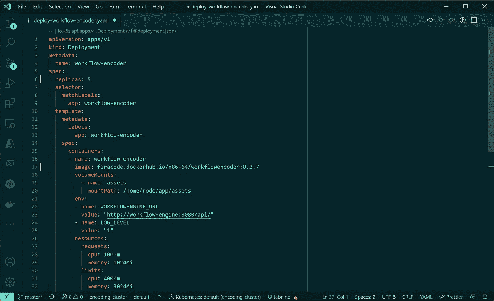

# 通过认证 Kubernetes 应用程序开发人员(CKAD)考试

> 原文：<https://betterprogramming.pub/passing-the-certified-kubernetes-application-developer-ckad-exam-f1b4ea47884b>

## 我学习和参加 CKAD 考试的经历



使用 Visual Studio 代码更改 Kubernetes 部署的 yaml 文件，图片由作者提供

上周五我考了认证 Kubernetes 应用开发者(CKAD)，通过了。CKAD 考试证明你可以为 Kubernetes 设计、构建和部署云原生应用。Linux 基金会提供考试。

我在 2021 年 9 月 28 日 Linux 基金会更新考试时参加了新版本的考试。目前考试使用 Kubernetes v1.22。

这篇文章描述了我的经历和我用来准备和学习考试的策略。

# **CKAD 2021 领域&能力**

**要通过考试，你必须表明你理解以下主题。科目后面有一个百分比，表示考试中的权重。**

*   **应用程序设计和构建(20%)**
*   **应用程序部署(20%)**
*   **应用可观察性和维护(15%)**
*   **应用环境、配置和安全性(25%)**
*   **服务和网络(20%)**

**九月份，Linux 基金会在应用程序部署类别中增加了一些额外的主题。它包括使用 Kubernetes 安装蓝/绿或金丝雀部署策略。另一个附加功能是使用 Helm 来安装和升级软件包。更多细节，请参见 [Linux 基金会](https://training.linuxfoundation.org/certification/certified-kubernetes-application-developer-ckad/)网站。**

# **我的备考**

**一些在线资源可以帮助你准备(CKAD)考试。可以用付费课程，但是也有很多自由练习题。**

**这些是我用过的资源。**

## **Udemy 认证 Kubernetes 应用程序开发人员课程**

**我使用最多的课程是来自 Mumshad Mannambeth 的 Udemy [认证的 Kubernetes 应用程序开发人员课程](https://www.udemy.com/course/certified-kubernetes-application-developer/)。课程非常棒，Mumshad 非常详细地解释了每个主题。它还有一个部分是 9 月更新的新主题。**

**对我来说，真正的价值在于包含了与 KodeKloud 相结合的模拟考试。通过在线培训，您可以访问 KodeKloud。KodeKloud 是一个虚拟培训环境，在 Kubernetes 中提供实践培训。**

## **Dimitris-Ilias Gkanatsios 的训练练习**

**Dimitris-Ilias Gkanatsios 创造了几个训练练习，你可以在 [Github](https://github.com/dgkanatsios/CKAD-exercises) 上找到。我将这些问题与当地的 Kubernetes 装置结合使用。你不会发现 9 月更新的新主题，但它们仍然非常相关。**

## **Bhargav Bachina 的另一套练习**

**[Bhargav Bachina](https://medium.com/u/c4c28b790cfe?source=post_page-----f1b4ea47884b--------------------------------) 创造了另一套练习，你可以在 [Github](https://github.com/bbachi/CKAD-Practice-Questions) 上找到。我还结合我的本地 Minikube 环境使用了这些问题。**

## **Killer.sh 考试模拟**

**当您在 Linux 基金会注册参加考试时，您可以获得两次免费的 Killer.sh 模拟器会话。每节课包括 36 个小时对 Kubernetes 集群的访问，包括 22 个考试问题。**

**Killer.sh 表示，他们的考试比实际考试更具挑战性。恐怕我不能同意。我认为他们是一样的。不同的是，killer.sh 考试考了 22 题，而实际考试上，我只考了 17 题。**

# **我的学习时间表**

**我从 Udemy 课程开始，从头到尾看了一遍，做了所有的练习实验。当我完成课程后，我在 KodeKloud 上练习了几次附带的模拟考试。我练习它们，直到我能够 100%按时完成。**

**课程结束后，我开始了第一个杀手。sh 模拟并回答了所有问题。第一次，我不能回答所有的问题，需要的时间超过了规定的两个小时。**

**我研究了 Killer.sh 的解决方案，并重申了 Udemy 课程中的主题。我继续练习在线 Github 问题。**

**考试前几天，我开始了第二次 killer.sh 模拟。两次会议都给你同样的问题。我练习它，直到我能够在两个小时内解决所有的问题。**

**然后我参加了考试，通过了。**

# **考试**

**您需要回答一些关于在几个 Kubernetes 集群上运行的场景的问题。你使用一个在 Chrome 内部运行的网络终端。你有大约 17 个场景和几个你必须在两个小时内完成的子任务。**

**考试难吗？我不这么认为。任何对 Kubernetes 有一些经验的人都可以回答所有的问题。你可以使用 Kubernetes 文档。**

**真正的问题是时间。你有两个小时。这看起来时间很长，但事实并非如此。要通过这个考试，您必须能够快速使用 kubectl 的命令行。您没有足够的时间来搜索文档中的每个问题。**

**这篇文章的其余部分集中在如何提高你的速度。**

# **通过设置终端提高速度**

**你可以通过运行在 Chrome 上的网络终端完成考试。所以，在开始答题之前设置好终端是明智的。以下是我使用的设置。**

**`alias k=kubectl`**

**我用 k 作为`kubectl`的别名。这为您节省了几次击键。考试的终端已经有了这个别名。**

**我使用 Vim 作为文本编辑器。我的`.vimrc`长这样。**

```
set tabstop=2
set expandtab
set shiftwidth=2
set nu
syntax on 
```

**它确保语法高亮和行号被启用。它将制表符的大小设置为两个空格，并确保使用空格而不是制表符。**

**我还在考试中使用了以下两个环境变量。我将在本文后面展示如何使用它们的例子。**

```
export do="--dry-run=client -o yaml"
export now="--grace-period 0 --force"
```

# **使用命令式命令提高速度**

**通常，在您的生产 Kubernetes 环境中，您使用声明性命令。您通过一个 yaml 文件描述 Kubernetes 对象的期望状态，并使用 kubectl 将该文件发送给 Kubernetes API。集群负责创建对象并达到所需的状态。**

**现在，你可以通过使用**命令**来获得**显著的考试速度提升**。让我给你看一个例子。**

***假设我们想要在名称空间 fire 中创建一个名为 MyConfigMap 的 Kubernetes 配置映射，其中包含一个值为 192.168.16.1 的 database_host 键。***

**使用声明性语法，首先必须创建以下 yaml 文件，并将其应用到集群。在这种情况下，您必须记住使用哪个 apiVersion 并以正确的方式格式化文件。**

**使用声明性语法创建 Kubernetes 配置映射**

**更快的方法是使用命令式语法构建配置映射。见下文。打字更少，更容易记住。**

```
k -n fire create cm MyConfigMap --from-literal=database_host=192.168.16.1
```

**您不能通过 kubectl 构建所有的 Kubernetes 对象。例如，您不能创建永久卷和永久卷声明。看一下 kubectl `kubectl create —-help`的帮助，看看可以使用命令式语法构建哪些对象。**

## **组合命令式和声明式命令**

**有时，您会遇到一个无法使用单一命令完成的任务，例如，这个问题。**

***使用 nginx:alpine 图像在名称空间 fire 中创建一个名为 MyPod 的 pod。将 pod 中的容器命名为 MyPod-container。***

**我们可以使用以下命令创建 pod。**

```
k -n fire run MyPod --image=nginx:alpine
```

**现在，这将工作，但有一件事，我们不能指定的是容器的名称。**

**解决这个问题的方法是使用命令创建一个 yaml 文件。请参见下面的示例。通过添加`--dry-run=client`参数，kubectl 实际上并不对 Kubernetes 集群运行命令，而是验证命令。`-o yaml`参数声明我们想要使用 yaml 语法导出命令。**

```
k -n fire run MyPod --image=nginx:alpine --dry-run=client -o yaml > pod.yaml
```

**这会生成一个文件 pod.yaml，如下所示。现在，还记得容器应该被命名为“MyPod-container”的要求吗？在这个文件中，我们可以更改容器的名称并使用`k apply -f pod.yaml`创建 pod。**

**使用模拟运行参数创建 yaml 文件并对其进行更改**

**我在几乎所有的考试题目中都使用了这个技巧。首先使用命令性命令生成一个 yaml 文件，根据需求修改文件，并使用`apply`创建资源。**

**我在终端部分展示了我创建的两个环境变量`do`和`now`。第一个，`do`包含`--dry-run=client -o yaml`。如果我们将此与创建 pod 的命令性命令结合起来，我们会得到以下结果。这又节省了几次击键。**

```
k -n fire run MyPod --image=nginx:alpine $do > pod.yaml
```

## **删除 Kubernetes 资源**

**有时您需要在更新 Kubernetes 资源之前删除它。删除对象可能需要一些时间。添加参数`--force —- grace-period 0`将直接删除对象。**

**结合我们之前讨论过的新环境变量`now`，我们得到了下面的命令，它又节省了几次击键。**

```
k -n fire delete podMyPod $now
```

# **跳过评分较低的难题**

**有些考试问题比其他的更复杂。每个问题都有一个百分比形式的权重，表示该问题对考试分数的贡献大小。**

**尽可能多地回答问题。这意味着跳过一个花费时间太多的问题。例如，当 kubectl 不断抱怨 yaml 中的语法错误时，标记这个问题并继续下一个问题。**

**考试结束还有时间的话可以随时圈回来。**

# **结论**

**我对考试和课程很感兴趣。我从课程中学到了一些有趣的关于 Kubernetes 的新东西。如果您有开发在 Kubernetes 集群中运行的应用程序的经验，我相信您也能通过考试。**

**最重要的是在使用`kubectl`时练习在命令行上变得快速。有很多资源可以帮助你练习。我确信，如果你投入时间，充分练习，你也会通过考试的。**