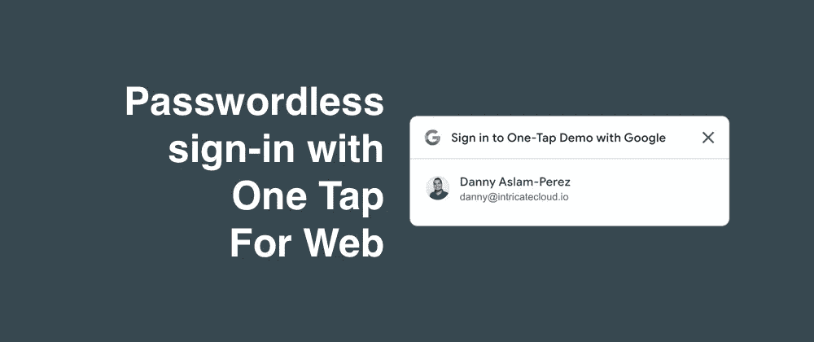
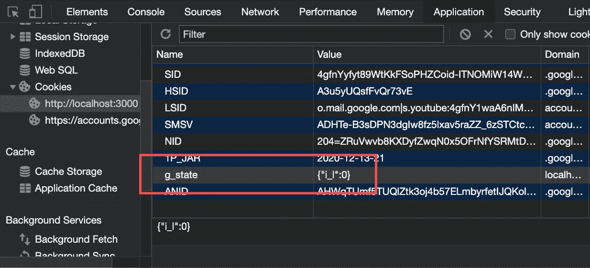

# 谷歌网络一键式无密码登录

> 原文：<https://betterprogramming.pub/passwordless-sign-in-with-googles-one-tap-for-web-9437d8c3c5d>

## 超越 OAuth



作者照片。

我尽可能地用我的谷歌账户登录，以避免在另一个随机的网站上有另一个密码。我在一些网站上看到了升级的体验(也许我现在才注意到)，比如 Trello/Medium，你可以在页面上点击一下就可以登录谷歌，而不会被重定向。原来这叫做网络一键通——谷歌的无密码登录选项——你可以在自己的网站上使用它。

我带着它转了一圈，并在 hello world React 示例上设置了它。这是我的发现，包括所有的缺点。

# 创建一个新的 React 应用程序并添加一个登录状态

从一个简单的 React 应用开始:

```
npx create-react-app one-tap-demo
```

对于这个示例应用程序，我将使用 JS 库来初始化一键提示。参考指南告诉你如何主要使用 HTML 来添加它[，但是如果你使用前端框架，只使用 JS 来配置它会更容易。](https://developers.google.com/identity/one-tap/web/guides/load-one-tap-client-library)

添加一些状态来跟踪用户何时登录:

# 添加 GSI

当您的应用程序启动时，动态添加 Google 登录库(也称为 GSI ):

有两个 API 调用:一个用于配置库，另一个用于向用户显示提示(在配置完库之后)。要查看所有可能的配置选项，[检查参考](https://developers.google.com/identity/one-tap/web/reference/js-reference#IdConfiguration)。

我添加了后者作为一个`useEffect`钩子，用`[]`作为一个参数，这样它只在第一次渲染后运行一次([见参考](https://reactjs.org/docs/hooks-reference.html#conditionally-firing-an-effect))。

当你刷新页面时，如果你第一次做对了，你会看到提示。

# 从您的 Google 开发者控制台获取一个客户端 ID

遵循本指南添加您的 [Google API 客户端 ID](https://developers.google.com/identity/one-tap/web/guides/get-google-api-clientid) 。

当我按照步骤将我的客户端 ID 添加到应用程序后刷新页面时，我收到了以下错误消息:

```
[GSI] Origin is not an authorized javascript origin
```

对我来说，这意味着我的 Google OAuth 客户端 ID 配置错误。我错过了官方演练中的“关键点”，这仅适用于我们使用 localhost 作为我们的域的情况。

*   确认您的网站 URL(即`http://localhost:3000`)在 Google OAuth 客户端控制台中被添加为授权的 JavaScript 源和有效的重定向 URI。
*   还需要添加`http://localhost`作为授权的 JavaScript 源。只有在开发过程中，当您可能在 URL 中使用不同的端口(我们就是这样)时，这似乎才是必要的。

# 使用登录按钮

现在，当您刷新页面时，它应该可以工作了，您应该会看到提示。如果看不到提示，请检查您的开发人员控制台是否有错误。如果这没有帮助，请参阅下面的调试部分。

如果这是您第一次这样做，*在阅读此警告之前，不要*单击提示上的 X 按钮！

## **警告#1**

单击一次点击提示上的 X 按钮可关闭提示。如果在此之后刷新页面，您将看不到按钮返回。为什么？

One Tap 库在消除提示方面有一些额外的副作用。如果你点击了 X 按钮，一个名为`g_state`的 cookie 就会被添加到你的域中。这里有一个你可以找到它的截图。如果您清除 cookie 值，您将会看到提示返回。



## **警告#2**

多次点击 X 按钮*将进入指数冷却模式([参见参考文献](https://developers.google.com/identity/one-tap/web/guides/features#exponential_cool_down))。那是什么意思？*

*   *你不能清除 cookies 或者使用匿名窗口来绕过它(至少我不能)。好像是基于你的浏览器和网站(可能是 IP？).不清楚。如果你不小心碰到这种情况，是时候休息一下或者尝试不同的浏览器/网站 URL 了。*
*   *在我拒绝它之后，我有 10-15 分钟看不到它，尽管开发人员指南上的表格表明我在两个小时内不会看到它。无论如何，在开发过程中不得不碰到这种事情是很烦人的。*

# *一键登录的调试问题*

*《开发人员指南》建议将此作为提示的示例代码。但是它忽略了一个重要的细节:您的提示没有显示、被跳过或被忽略的原因也在`notification`对象中:*

*有三种类型的通知“时刻”:`display`、`skipped`和`dismissed`，每一种都有自己的可能原因列表，并有自己的 API 调用来找出原因([参见完整列表](https://developers.google.com/identity/one-tap/web/reference/js-reference#PromptMomentNotification))。如果您在使用按钮时遇到问题并且不知道原因，使用下面的代码片段来查看这些原因可能会有所帮助:*

*你可能看到的原因之一是`opt_out_or_no_session`。这可能意味着:*

*   *您的用户已经通过取消提示“选择退出”。如果您不小心忽略了可能在您的域中的`g_state` cookie，您可以尝试清除它。*
*   *您的用户在您当前的浏览器会话中没有当前的 Google 会话。*

*虽然这是一个通过谷歌的无密码登录，但它确实需要你在某个较早的时间登录谷歌(大概是用密码)。如果你使用的是匿名窗口，请确保在该窗口内登录谷歌。*

# *现在您的用户已经登录*

*一旦您选择了您的帐户并登录无误，就该将它连接到 React 应用程序了。如果你以前使用过谷歌网站登录库([参见我的设置指南](https://www.intricatecloud.io/2019/07/adding-google-sign-in-to-your-webapp-pt-1/))，有一个 API 可以让你获取用户信息。但是对于 Web library 的一键登录，你只能获得用户的 ID 令牌(也就是他们的 JWT 令牌)。*

*这意味着您需要解码 ID 令牌来获取用户的信息。我们可以通过添加带有`npm install --save jwt-decode`的 jwt-decode 库来做到这一点。*

*要做到这一切，请向初始化块添加一个回调:*

*要查看所有可用的用户信息，[请参见开发指南](https://developers.google.com/identity/one-tap/web/reference/js-reference#credential)。*

# *注销*

*文档建议在你的页面上添加一个`<div id="g_id_signout"></div>`，但是不清楚这个库是否应该为你创建一个退出按钮。我想答案是否定的，因为我试过了，什么也没发生。*

*我目前的理论是退出意味着留给你自己的应用程序，可以像刷新页面一样简单。*

*   *在本文中，我只使用前端的 One Tap 按钮，因为我自己没有登录系统。每当您刷新页面时，即使您刚刚完成登录，也会看到提示。*
*   *如果我想将它与现有的登录系统集成，“退出”意味着退出我自己的应用程序(而不是退出我的 Google 帐户)。*
*   *只要您没有启用自动登录选项，这个流程就可以工作。*

# *一键登录按钮的限制*

*   *One Tap 登录按钮只适用于 Android、iOS、macOS、Linux 和 Windows 10 上的 Chrome 和 Firefox。如果您的用户使用 Safari 或 Edge，他们将看不到提示。当我尝试时，我得到一个“未显示”错误，原因是`opt_out_or_no_session`。*
*   *如果您的用户不小心忽略了提示(如果您第一次没有看到，请参阅上面的警告)，他们也会将`opt_out_or_no_session`视为“未显示”的原因，并且他们将无法登录。*
*   *这个库(和界面本身)不同于 Google 登录网络库。一个 Tap 库用`google.accounts.id.initialize()`初始化 app，另一个用`gapi.auth2.init()`。这似乎错过了将两个登录系统放在同一个界面后面的机会。*
*   *没有登出按钮。文档中提到的片段似乎没有任何作用。我猜，注销按钮可能意味着刷新页面，这将导致提示再次出现，实际上是将您注销。*

*它在开发文档的主页上被突出显示，但是你不能单独使用这个库。我在这里这样做的目的是为了一个 hello world 示例，但它意味着对您的登录体验的升级。*

# *尝试一下*

*我已经把这个样本代码推送到 [GitHub](https://github.com/intricatecloud/google-one-tap-web-demo) 了。自述文件中有运行演示的说明。*

*值得看看其他一些网站是如何实现登录工作流的。在您当前的浏览器会话中登录 Google，然后访问 Medium 以查看运行中的提示。*

**最初发布于*[*https://www . intrinciate cloud . io*](https://www.intricatecloud.io/2020/12/passwordless-sign-in-with-google-one-tap-for-web/)*。**