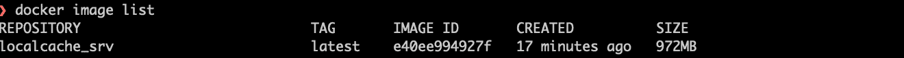
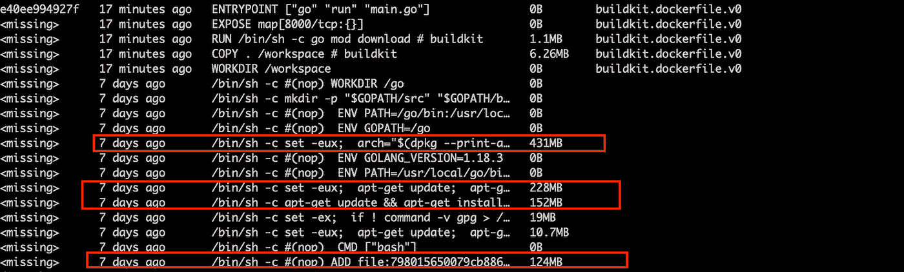
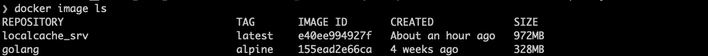
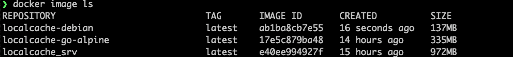
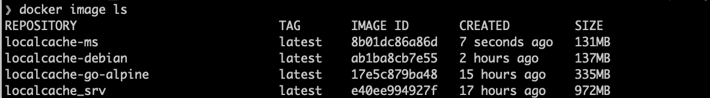
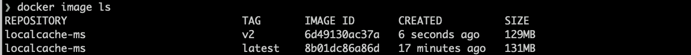
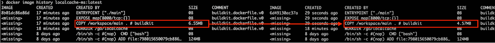
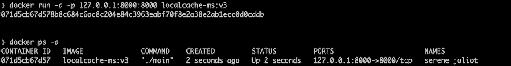
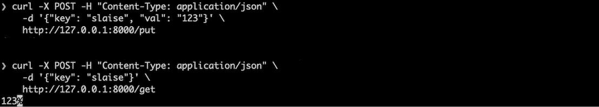
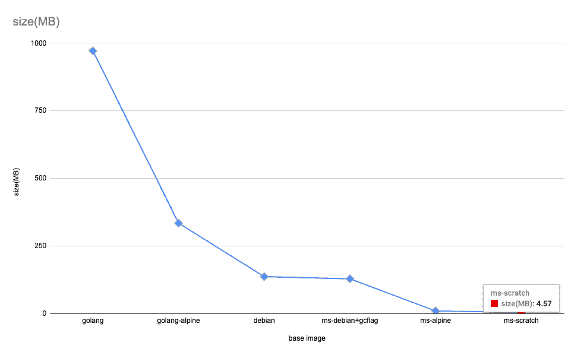

# 通往完美 Go Dockerfile 文件的路径

> 原文：<https://betterprogramming.pub/path-to-a-perfect-go-dockerfile-f7fe54b5c78c>

## 建立一个小而安全的 Go docker 形象


贾斯汀·考夫曼在 [Unsplash](https://unsplash.com?utm_source=medium&utm_medium=referral) 上拍摄的照片

为了完成在云环境中部署代码，最后一步是配置和部署 pod 的容器映像。目的地就在眼前，但是仍然有一个问题需要考虑:不是每个映像都适合部署，但是需要满足两个标准。

*   **足够小**。图像大小在一定程度上决定了我们的云开销，当一个 pod 是几 MB 甚至几十 MB 的时候是无法注意到的。然而，当它扩展到数千或数万个 pod 时，额外的内存成本将飙升至数百万，最终导致额外的实例成本(以 GKE E2 为例，最高为 128GB)。所以，越小越好。
*   **安全**。为了将损害映像安全性的可能性降至最低，我们在构建映像时应该注意，例如**不要直接复制`Dockerfile`中的**密钥，尤其是如果服务部署在公共云上。

开门见山。先从建立 Go 镜像(Go 1.18)开始，然后一步一步优化。


来自 unsplash， [@anniespratt](https://unsplash.com/photos/Rv-O5fmUKbU)

# 构建 Go 图像

在我之前的文章中，我用 Go 构建了一个[缓存包](https://github.com/slaise/localcache)，只能作为第三方被其他 Go 代码引用。为了使它成为一个独立的缓存服务，你只需要

*   创建`Put/Get`接口。这一点并不是我们要展开的地方，不过有兴趣的可以抢一下[代码](https://gist.github.com/slaise/c515bbc3d47dc48aaec1f593615c29a8)。​
*   创建一个`Dockerfile`并将其部署到云中，这是我们今天的主要关注点。

在写一个`Dockerfile`之前，我们应该始终明白它是什么:

***容器的一组命令，可以独立构建和运行代码*** 。

一部`Dockerfile`由什么组成？答案就在运行 Go 程序所需的两个步骤中。

*   编译，运行`go build main.go`。
*   执行，运行`go run main.go`。

这两步都需要一些先决条件，比如 Go 包和当前目录下的所有文件，像`go.mod`，都需要编译代码；web 程序要求暴露端口 8000。我们应该在 Dockerfile 文件中包含的内容似乎更清楚，如下 6 行。

```
*# Base image, golang 1.18* FROM golang:1.18.3WORKDIR /workspace
*# Copy all files into the image* COPY . .
*# Run go mod* RUN go mod download
*# Expose ports* EXPOSE 8000
*# Run Go program, just like locally* ENTRYPOINT ["go","run","main.go"]
```

现在，运行`docker build . -t localcache_srv`来查看图像。



哎呀，图像大小几乎达到 1GB！一定是哪里出了问题。

让我们看看图像中有什么，并找出原因。运行`docker image history localcache_srv`，查看建筑历史。



可以看到，复制的 Dockfile 相关内容和本地文件仅占 7M 左右，而大部分内容来自基础镜像`golang:1.18.3`，是 Go 官方为了编译 Go 代码而在 [Dockerhub](https://hub.docker.com/_/golang) 中发布的，包括一个完整的`gcc`、`g++`、`make`等工具的 Go 安装包。

如果我们放弃这个版本的 Golang 基础图像，还有其他选择吗？是的，当然。

*   使用较小的 Go 基础图像。

在 [Dockerhub](https://hub.docker.com/_/golang) 中搜索，找到 Golang [alpine](https://github.com/docker-library/golang/blob/a212f660f30646927c1a10ecdc7b579df2d28155/1.18/alpine3.16/Dockerfile) 版本，其图像总是被简化，尺寸可以用`docker pull golang:alpine`查看。



用它替换先前的`golang:1.18.3`并重新运行`docker build`，我们得到一个小得多的图像。

```
localcache-go-alpine   latest    17e5c879ba48   3 seconds ago  335MB
```

这样我们可以把图像缩小到 330 MB。

*   不再有 Go 基础图像。

有了本地编译的`main`文件，我们就可以直接把文件复制到镜像中来运行容器中的代码。参见下面的`Dockerfile`。

```
FROM debian:latest
WORKDIR /workspace
COPY main /workspace
EXPOSE 8000
ENTRYPOINT ["./main"]
```

图像大小进一步缩小到 130MB。



然而，上述两种方法都可以缩小图像的大小，但都不是有效的和可持续的，每次打包前都需要手动编译。

可以寻求其他优化吗？是的，我们继续吧。

# 优化 Go 图像

## 多阶段

如上所述，Dockerfile 应该包含编译和运行两个步骤，只有运行步骤需要部署到容器中。这里可以应用 Docker 的多阶段构建，将 Dockerfile 分成两个阶段，`compile`和`run`，后者实际上启动容器。

> 对于那些努力优化 docker 文件同时保持它们易于阅读和维护的人来说，多级构建非常有用。
> 
> —来自[https://docs . docker . com/develop/develop-images/stage-build/](https://docs.docker.com/develop/develop-images/multistage-build/)

这也是为 Go 构建 Docker 映像的推荐方式。更多信息见本官方[帖子](https://docs.docker.com/language/golang/build-images/#multi-stage-builds)。

要将 Dockerfile 文件转换成多阶段文件，我们需要

*   在构建阶段使用`golang:alpine`作为基础图像。
*   只复制编译阶段需要的文件，忽略`main`文件。在某些情况下，当编译后的文件达到数百 MB 时，这是一个很好的做法。
*   使用`debian`作为跑步者阶段的基础图像。

新的 Dockerfile 文件是

重复`docker build`，我们可以看到新的图像只有 131 MB，在`builder`阶段的图像被忽略。目标达成！



此时，`Dockerfile`优化已经初步完成，生成了一个尺寸比原始版本减小到 1/8 的版本，并被认为可以投入生产。

但是不要就此打住，尽量把图像做得更小。

## 去做旗子

在构建阶段，我们使用`GOOS=linux GOARCH=amd64 CGO_ENABLED=0 go build main.go`命令，使用`CGO_ENABLED` [环境变量](https://pkg.go.dev/cmd/cgo#:~:text=The%20cgo%20tool%20is%20enabled,to%200%20to%20disable%20it.)来避免构建可能的 C 文件，因为库的这一部分可能在`golang:alpine`中缺失。但是如果使用了 CGO 特征，那么就需要其他标志。

此外，我们可以添加`-w -s`构建标志来删除二进制文件中的调试信息。

`docker build . -t localcache:v2`再次，我们可以发现新图像又缩小了 2MB。



通过检查`image history`，我们可以确认减少是由于编译的文件。



## Debian 或 Alpine 或 Scratch

我们使用`debian`作为 runner 阶段的基础映像，但不使用它的一些内置工具，如 bash。作为一个纯粹的围棋图像，我们可以用[阿尔卑斯](https://hub.docker.com/_/alpine) (5.53MB)替换，将图像大小缩小到 **10.1 MB** 。

更夸张的是，如果我们使用 [scratch](https://hub.docker.com/_/scratch) base image，一个明确为空的图像，特别是用于“从零开始”构建图像，来替换 alpine，图像大小将降至 4.5 MB。


这个图像非常适合这个缓存服务，既简单又高效！我们可以做个测试来验证。

*   在 8000 开始一个容器。



*   使用 curl 访问`put`和`get`API，放入`slaise: 123`，获取`123`。



从 972MB -> 4.57MB，完美吧？



我们在上面的例子中使用了`scratch`，但情况并不总是如此，这只是由需要的图像内容决定的。

例如，如果您使用`scratch`，并且需要任何额外的库或工具，比如 CA 和时区，那么您必须手动安装它们。这听起来非常复杂并且容易出错，这也解释了为什么`debian`在许多公司被设定为标准配置。

我们可以在 Go 中使用`scratch`，这是一种静态编译的语言。那么 Rust 和 C 呢，不是完全静态编译的？而在 Java 和 Python 中呢？我们根据语言做出选择。以下是最常用的基本图像，您可以从中选择最合适的图像。

*   `scratch`，一个完全空洞的基地形象。
*   `[distroless/static-debian](https://github.com/GoogleContainerTools/distroless)`，搭建于 scratch 之上，大小约 2MB，包括`CA`、`root user`等。它只有`alpine`的一半大小，并且被许多人用作 Go 基础图像。
*   `[alpine](https://wiki.alpinelinux.org/wiki/Release_Notes_for_Alpine_3.16.0)`，通用基础镜像，支持多种场景。尽管为用户提供了更少的工具选择，但足以支持常规用例，并且被认为比`debian`更安全。
*   `debian`，包含大部分工具，如`ssh`、`curl`等。

# 其他提示

还有一些关于缩小体型的小技巧。

*   尽量减少层数。

像`COPY` 和`ADD`这样的命令会在复制之前的图像之前建立一个新的图层，导致图像尺寸不断膨胀。解决方案是合并命令行，比如将我们示例中的 4 行`COPY`命令合并成一行。

`COPY go.mod go.sum localcache/ main.go /workspace`

如果有很多 bash 命令，用`pipe`将它们组合起来。

*   用`COPY`代替`ADD`。

`COPY` 可以通过 Docker 的缓存加快构建过程。当然，`ADD`有一些额外的功能，查看[这里](https://docs.docker.com/develop/develop-images/dockerfile_best-practices/#add-or-copy)了解更多。

# 安全性

我不是安全解决方案方面的专家，不同的部署环境中的安全策略也不同。但是下面的 7 个技巧适用于所有的图片。

*   与`noroot`用户一起运行。我们可以手动添加一个用户`useradd`，或者使用`gcr.io/distroless/static:nonroot`基础映像自动包含一个`noroot`用户。
*   公开大于 1024 的端口。一般来说，小于 1024 的端口只能由 root 用户操作。
*   检查您的 Docker 文件，参考 Docker 官员提供的[最佳实践](https://docs.docker.com/develop/develop-images/dockerfile_best-practices)。
*   选择最小的基本图像。一般认为图像越小越安全，因为内容越少，漏洞越少。
*   用 Dockerhub 最新的基础镜像，不要用第三方的，不要用 Github 上不可信的。
*   不要放任何明文密钥，比如`GITHUB_KEY`、`GKE ServiceAccountKey`等。，在 Dockerfile 文件中。选择另一种认证方法，如`workloadidentity`。
*   用第三方工具扫描你的 docker 文件，比如 snyk 。但这是 CI/CD 中的公司级实现。

# 结束了

过大的图像有时会触发集群中的自动缩放，并影响用户。因此，我们必须具备 Dockerfile 知识来构建一个合理大小的图像或对其进行优化以避免自动缩放。希望这篇文章能有所帮助。

感谢阅读！

# 参考

[https://docs . docker . com/language/golang/build-images/#多阶段构建](https://docs.docker.com/language/golang/build-images/#multi-stage-builds)

[https://docs . docker . com/develop/develop-images/stage-build/](https://docs.docker.com/develop/develop-images/multistage-build/)

[https://docs . docker . com/develop/develop-images/docker file _ best-practices](https://docs.docker.com/develop/develop-images/dockerfile_best-practices/#add-or-copy)