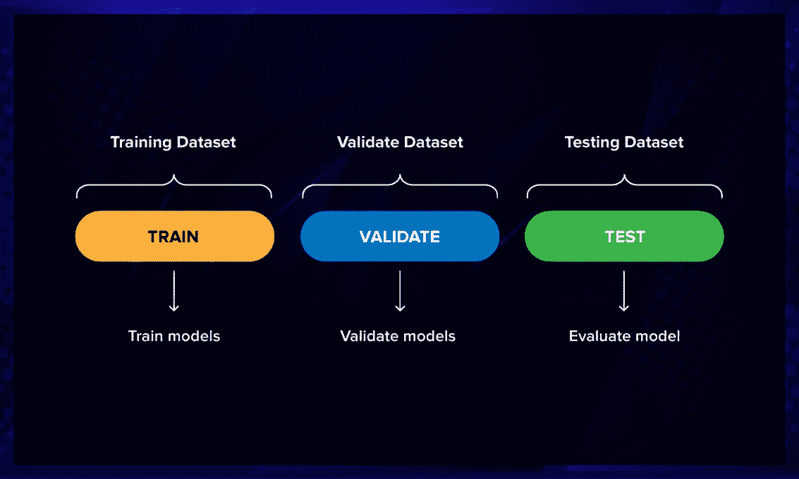
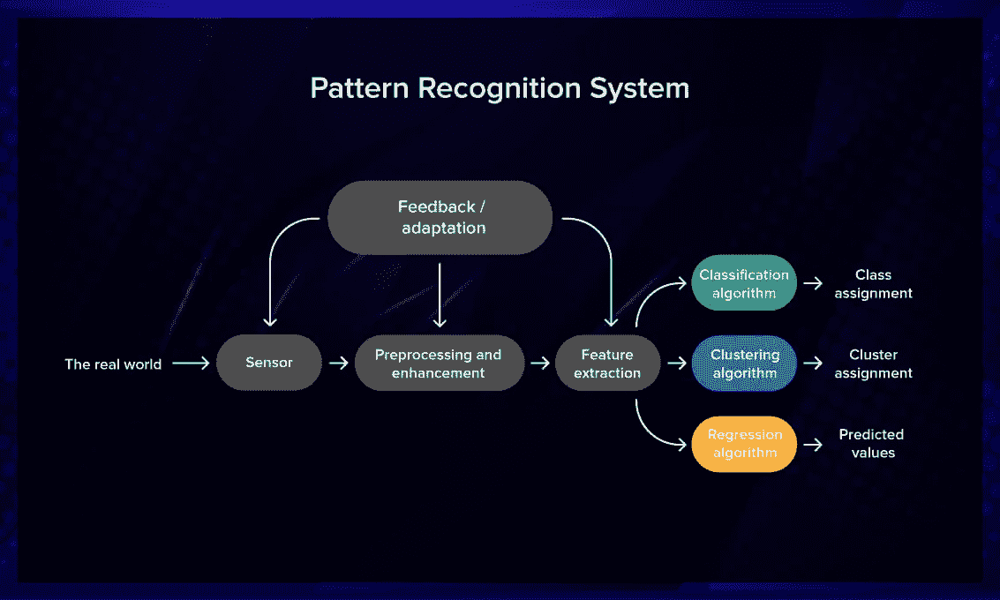
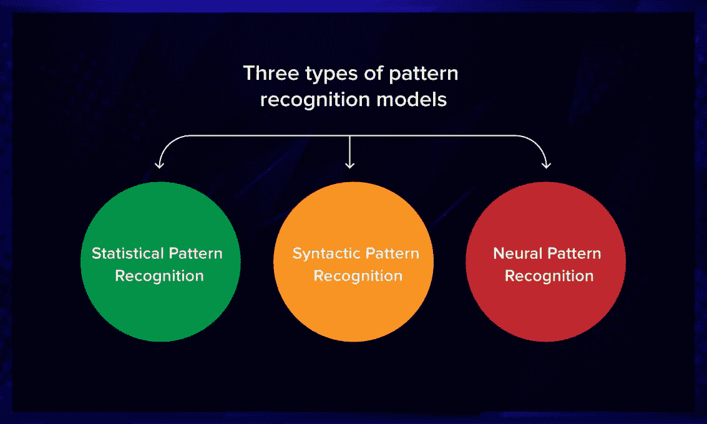
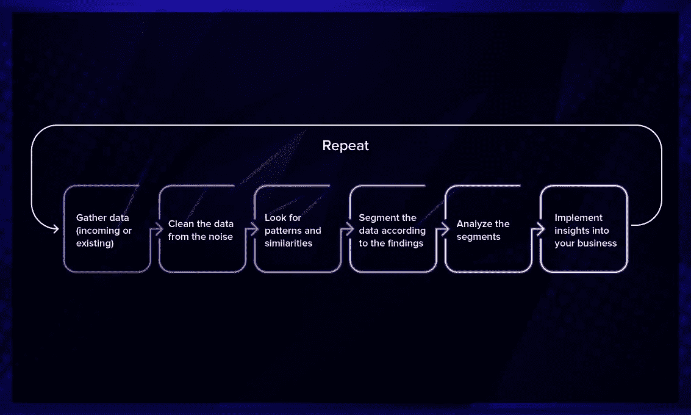

# 机器学习模式识别

> 原文：<https://betterprogramming.pub/pattern-recognition-with-machine-learning-49de621426b6>

## 计算机是如何识别模式的？

Joanna Nix-Walkup 在 [Unsplash](https://unsplash.com/s/photos/hidden?utm_source=unsplash&utm_medium=referral&utm_content=creditCopyText) 拍摄的照片

机器学习最常见的应用之一是模式识别。使用训练有素的算法的计算机比人类更好地识别照片中的动物、股票波动的异常以及乳房 x 光照片中的癌症迹象。让我们找出这个复杂过程背后的原因。

# 什么是模式识别？

模式识别是由使用机器学习算法的机器识别数据中的规律性的过程。该过程的核心是基于统计信息、历史数据或机器记忆的事件分类。

模式是世界或抽象概念中的规律性。如果我们谈论书籍或电影，对类型的描述就是一种模式。如果一个人一直看黑色喜剧，网飞不会推荐他们看令人心碎的情节剧。

为了让机器在数据中搜索模式，应该对数据进行预处理，并将其转换为计算机可以理解的形式。然后，研究人员可以根据有关问题的可用信息，使用分类、回归或聚类算法来获得有价值的结果:

*   **分类。**在分类中，算法根据预定义的特征为数据分配标签。这是监督学习的一个例子。
*   **聚类。**一种算法根据特征的相似性将数据分割成多个聚类。这是无监督学习的一个例子。
*   **回归。**回归算法试图找到变量之间的关系，根据已知数据预测未知因变量。它基于监督学习。

# 模式识别系统应该能够做什么？

如果你想评估一个模式识别系统的好坏，你需要注意它能做什么:

*   快速准确地识别熟悉的模式
*   将不熟悉的物体分类
*   从不同角度识别形状和物体
*   揭示模式和对象，即使部分隐藏
*   自动识别模式

# 训练模式识别系统

要建立一个模式识别系统，你需要选择一个模型，准备好数据。对于模式识别，通常使用神经网络、分类算法(朴素贝叶斯、决策树、支持向量机)或聚类算法(k-means、Mean Shift、DBSCAN)。

接下来，您将处理数据。将其分为三组:

*   **训练集。**我们使用训练集来训练模型。您需要选择有代表性的样本，并让程序使用训练规则对其进行处理。例如，如果您正在构建一个基于人脸识别的安全系统，您将需要员工的各种照片。所有相关信息都将从这些数据中提取出来。通常，所有数据的 80%构成一个训练数据集。
*   **验证集。**该设置用于微调模型。您可以使用它来验证训练数据集上的任何准确性增加也将显示以前未向网络显示的数据集上的准确性增加。因为如果训练数据集的精度提高了，但验证数据集的精度保持不变或降低了，那么您就过度拟合了您的模型，您应该停止训练它。
*   **测试集。**测试数据用于测试系统给出的输出是否准确。大约 20%的数据用于测试。

**注意:**不要混淆验证集和测试集。验证集用于调整模型的参数，而测试集从整体上评估模型的性能。

# 模式识别系统的组件

模式识别系统需要来自真实世界的一些输入，它通过传感器感知这些输入。这种系统可以处理任何类型的数据:图像、视频、数字或文本。

接收到一些信息作为输入后，算法执行**预处理**。也就是从背景中分割出一些有趣的东西。比如给你一张合影，一张熟悉的脸吸引了你的注意力，这就是预处理。

预处理与**增强**紧密相连。通过这个术语，研究人员理解了人类或系统识别模式能力的提高，即使模式是模糊的。想象你还在看同一张合影，但它已经是 20 年前的了。为了确定照片中熟悉的面孔确实是你认识的人，你开始比较他们的头发、眼睛和嘴巴。这是增强功能进入游戏的时候。

下一个组件是**特征提取**。该算法揭示了与多个数据样本相似的一些特征。

模式识别系统的结果将是类分配(如果我们使用分类)，或聚类分配(在聚类的情况下)，或预测值(如果你应用回归)。

# 模式识别是如何工作的？

有三种类型的模式识别模型:

## 统计模式识别

这种类型的模式识别在从示例中学习时会参考统计历史数据:它收集观察值，对它们进行处理，并学习将这些规则归纳和应用到新的观察值中。

## 句法模式识别

这也被称为*结构模式识别*，因为它依赖于称为*原语*的更简单的子模式(例如，单词)。模式是根据原语之间的联系来描述的，例如，单词构成句子和文本。

## 神经模式识别

在神经模式识别中，使用人工神经网络。它们可以学习复杂的非线性输入输出关系，并使自己适应数据。

# 模式识别过程

模式识别分两个阶段进行。

*   首先是探索部分。该算法通常搜索模式。
*   接下来是描述部分，算法开始对找到的模式进行分类。

这两者的结合用于提取洞察力。

流程本身看起来是这样的:

*   首先你需要收集数据。
*   然后你对它进行预处理，把它从噪音中清理出来。
*   该算法检查数据并寻找相关特征或共同元素。
*   然后对这些元素进行分类或聚类。
*   对每个部分进行分析，以获得真知灼见。
*   最后，将提取的见解应用于实践。

# 在哪里使用模式识别

模式识别技术对于解决分类问题、揭露欺诈、预测火山爆发或以比人类更高的准确度诊断危险疾病非常有用。模式识别的例子是什么？

## 图像处理、分割和分析

模式识别用于图像处理。例如，一种机器学习算法可以比人类更好地识别[数百种鸟类](https://ieeexplore.ieee.org/stamp/stamp.jsp?arnumber=8719894)，即使图像是黑暗或嘈杂的。

## 计算机视觉

将模式识别用于计算机视觉的人工神经网络之一是 Neural Talk，它可以实时生成对环境的描述。

## 语音识别

Alexa 或 Siri 等虚拟助手使用语音识别系统来处理整块的语音，而不是处理音素的单独单词。

## 指纹识别

许多识别方法已经被用于执行指纹匹配。模式识别方法被广泛用于刑事侦查和你自己的智能手机。如果你的手机上有一个指纹锁，那就是每次解锁时都会进入游戏的模式识别。

## 股票市场分析

股票市场很难预测。然而，即使在那里，也有可以识别和使用的模式。面向投资者的现代应用程序使用人工智能为用户提供咨询服务。一些例子是 Blumberg，Tinkoff，Kosho 和 SofiWealth。

## 医疗诊断

在真实数据上训练的模式识别算法可以用于癌症诊断。[这些研究人员](https://www.sciencedirect.com/science/article/pii/S2352914819301133)提出了一种自动乳腺癌检测技术，预测准确率达到 99.86%。他们使用活检的组织病理学图像进行特征提取，并应用人工神经网络产生结果。

# 最后的想法

模式识别算法分析数据并做出准确的预测，帮助企业和拥有企业的人做出正确的决策。如果需要，模式识别可以完全自动解决复杂的分析任务。