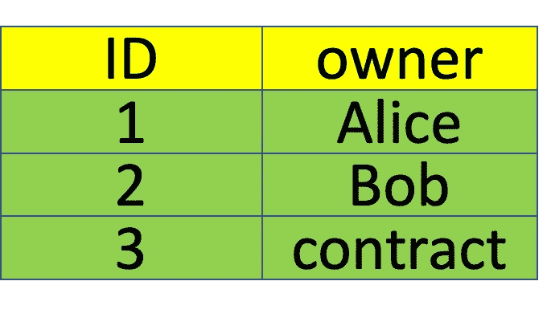
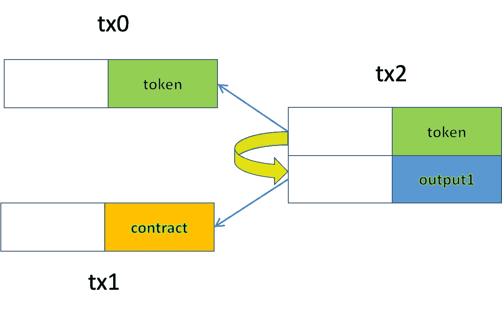

# 支付给合同哈希

> 原文：<https://betterprogramming.pub/pay-to-contract-hash-ef89074c830a>

## 可扩展且高效的比特币智能合约

由[舒巴姆·达奇](https://unsplash.com/@theshubhamdhage?utm_source=unsplash&utm_medium=referral&utm_content=creditCopyText)在 [Unsplash](https://unsplash.com/@theshubhamdhage?utm_source=unsplash&utm_medium=referral&utm_content=creditCopyText) 拍摄的照片

事实证明，比特币智能合约比之前想象的更强大、更灵活。然而，仍然有两个严重的限制:

1.  一旦部署，合同就不能支持新功能。例如，我们可以部署一个令牌契约，但后来发现由于缺乏某些功能，它不能集成到一些新的交换或投票应用程序中。这极大地阻碍了它与第三方应用程序的互操作性，从而阻碍了它的广泛应用。
2.  所有受支持的功能都必须包含在令牌协定中，由 1 表示。即使我们在最初构思时就预见到了令牌需要支持的所有特性，但只有少数特性是经常使用的，而大多数特性即使不是从未使用过，也是极少使用的。这导致合同规模膨胀。

# 支付给合同哈希

我们提出了一种新的方法来同时解决这两个限制，称为 ***支付契约哈希(P2CH)*** 。我们以 NFT 为例来说明它是如何运作的。它也适用于其他加密资产，如本地比特币和可替代令牌。

在我们之前的 NFT 契约中，我们维护了一个表，将每个令牌映射到其所有者的地址。所有者拥有可以授权令牌转移的私钥。

图 1: NFT 3 号被一份合同所拥有

在 ***P2CH*** 下，所有者也可以是一个契约的地址，定义为其脚本的散列。哈希充当合同的唯一 ID，并用于引用合同。

具体来说，使用了 [*hash160*](https://learnmeabitcoin.com/technical/public-key-hash) ，与用于将比特币公钥散列成地址的散列算法相同。合约散列看起来与常规比特币地址相同，因为它们都是 20 个字节。新的 NFT 合同如下所示:

[合同支付 2 合同哈希](https://github.com/sCrypt-Inc/boilerplate/blob/master/contracts/pay2ContractHash.scrypt)

这是和以前一样的 NFT 合同，除了`else`分支。当令牌由合同而不是用户的私钥控制时，它处理传输。

我们需要确保合同在同一事务的另一个输入中被解锁，正如我们在[合同间调用](https://xiaohuiliu.medium.com/inter-contract-call-on-bitcoin-f51869c08be)中所做的那样。

在图 2 所示的例子中，输入 0 中引用的令牌需要验证输入 1 是否引用了同一个事务 *tx2* 中的预期契约。

第 20-22 行获取包含契约的事务的 id(图中的 *tx1* )和包含它的输出(tx1 中的输出 *0)。*

第 24 行验证完整的事务与 txid 匹配。

第 26 行解析合同事务以获得合同的完整脚本，对其进行哈希处理，并将其与第 27 行的所有者“*地址*进行匹配。

图 2:由契约控制的传输令牌

## 象征性销售合同示例

下面是一个合同示例:

[令牌销售示例](https://github.com/sensible-contract/token_sensible/blob/master/contracts/tokenSell.scrypt)

当且仅当给定的地址被支付了特定的金额时，它才可以被花费。使用这个契约，我们可以分三步以给定的价格自动出售令牌:

1.  部署一份`TokenSale`合同。
2.  将一个令牌传递给上述契约的 hash，即其锁定脚本的 *hash160* 。现在令牌受合同控制，而不是受用户的私钥控制。这类似于以太坊中的合约账户，它没有相应的私钥，不像[外部拥有的账户(EOA)](https://www.zastrin.com/courses/ethereum-primer/lessons/2-4) 。
3.  在单个事务中解锁令牌和`TokenSale`契约，如图 2 所示。买方将把合同中的令牌转让给自己。

完整的代码示例可以在[这里](https://github.com/sensible-contract/token_sensible)找到。

# 摘要

值得注意的是，合同可以是任意的，可以由第三方独立开发。合同不一定要提前知道。这意味着令牌是无限可扩展的(限制 1)。此外，它是紧凑的，只处理适用于任何契约的 P2CH(限制 2)。

此外，它们是模式匹配合同的替代方法。我们使用完整合同脚本的散列。也可以使用脚本的一部分，例如有状态契约的[代码部分](https://medium.com/coinmonks/stateful-smart-contracts-on-bitcoin-sv-c24f83a0f783)。

# 感谢

这个想法来自于[的](https://sensiblecontract.org/)[陈诚](https://zhuanlan.zhihu.com/p/335212771)明智的契约。