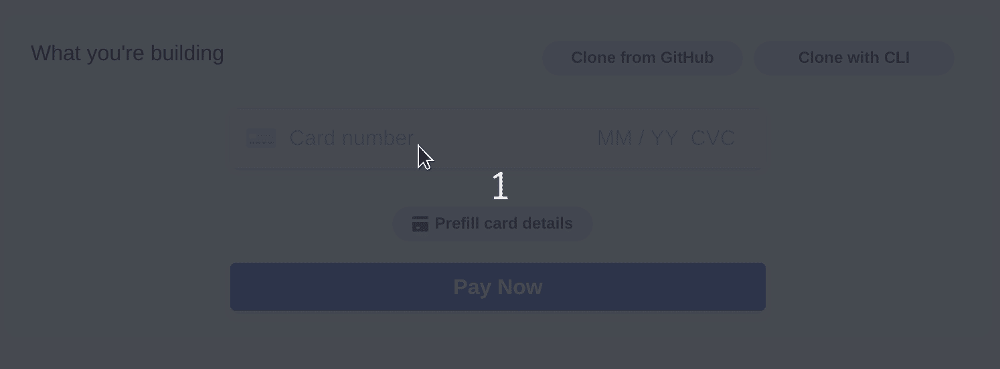
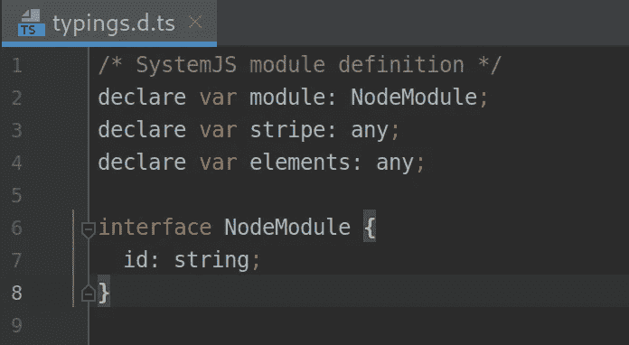
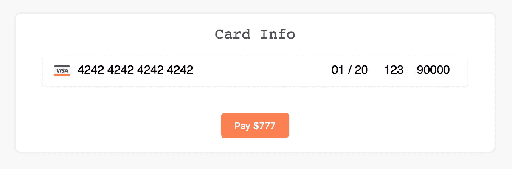

# 如何在你的应用中使用 Stripe、Angular 和 Express 设置付款

> 原文：<https://betterprogramming.pub/payments-simplified-stripe-angular-express-4a88bf69f82e>

## 现在就把你的用户变成顾客


在本文中，我们将使用 Angular 在前端和 Node.js 后端实现一个带有 [Stripe](https://stripe.com/) 的完整结账流程。

Stripe 是一种支付处理器，这意味着它支持从客户银行(发卡银行)向商户银行(收款银行)进行电子转账，以支付用信用卡购买的商品或服务。

我将跳过项目创建和 Stripe 帐户创建，我想专注于 [Stripe.js](https://stripe.com/docs/js) 和 Stripe API。

我们将在本帖中构建的流程遵循以下步骤。只有第一步和第二步在前端。

1.  收集卡信息。
2.  将信息标记化并将其发送到后端。
3.  对卡进行保留(授权)。
4.  一些自定义业务逻辑。
5.  授权资金的清算流程。

# 我们将建造什么



从条纹文档

# 前端

让我们从实现第一步开始。为此，我们可以从 Stripe.js 获得一些支持，这是 Stripe 为前端构建的一个库。
我们需要做的第一件事是将这个库包含在`index.html`中。

在项目中包含 Stripe.js:

我们已经包括了 stripe.js 的 v3，并且我们已经告诉 stripe 我们使用谁作为 Stripe 可发布密钥，该密钥可以在 Stripe 仪表板上找到。

现在，要使用`elements`和`stripe`常量，我们需要在`typings.d.ts`中声明它们，因为当试图访问`stripe`或`elements`时，TypeScript 通常会报错。



现在我们已经在项目中包含了 Stripe.js，所以下一步是初始化 Stripe 元素。

Stripe 元素是可定制的 UI 组件，用于收集支付表单中的敏感信息。

让我们编写一个从客户那里获取卡信息的表单。我们的表单将如下所示:



不要忘记在你的`app.module`或者第一个父模块的导入数组中包含`FormsModule`。

现在，模板的打字稿。

我们在这里做的是创建一个 card 元素，并将其安装到模板中的`#cardInfo`元素。

`createStripeToken()`方法将尝试使用`card`元素创建一个条带令牌，并将根据情况调用`onSuccess()`或`onError()`。我已经在一个`MatDialog`上实现了这个表单，这只是一个偏好。

对话框关闭后，我获取结果并调用服务，该服务带有一个已经从客户处获取的订单和一个令牌，该令牌将获取该订单所需的资金。

对于成功的令牌创建，来自 Stripe 的响应将是:

我们将只使用这个响应的 ID 属性。下面的方法是打开支付对话框的方法，它正在等待对话框的结果对象。

此时，我们需要做的就是用订单数据和请求负载中的条带令牌调用所需的服务。这是由助手方法`createOrder(token: string)`完成的。

现在，退房流程的前端已经结束。我们创建了一个 Stripe 元素来获取卡信息，使用 stripe.js 对该信息进行令牌化，以避免将任何敏感数据传递到我们的后端，并将该一次性令牌发送到后端。

让我们转到后端，看看这里会发生什么。

# 移动到后端

首先，让我们安装软件包。我们有一个名为 Stripe for npm 的很棒的库，它在使用 Stripe API 方面帮了我们很多。

```
npm install stripe
```

安装完成后，我们需要在将要处理的文件中包含`stripe`，在本例中是`controller.js`或`helper.js`。将以下内容和您的密钥添加到文件的开头。

包含在项目中:

```
const stripe = require('stripe')('*change this to your secret key*');
```

# 条纹集成

我们在后端要做的是获取订单数据和条带令牌并实现我们的自定义逻辑。因此，我们将分三个主要步骤来完成。

1.  我们将立即创建一个条纹电荷，但不捕获它(`capture: false`)。
2.  操作订单的创建。
3.  订单创建后，如果成功，我们将收取授权资金，否则，我们将退还给客户。

假设我们有这样一个 API 端点:

```
// index.js
router.post('order',
token({ required: true }),
controller.create)
```

在`create()`控制器中，我们需要获取该订单的定价，然后使用`request.body`中的 Stripe 令牌在 Stripe 上创建该价格的费用。

让我们在这里注意两件关键的事情。

1.我们用一个辅助函数来定价。
2。我们把它兑换成便士。

您可能已经在`request.body`中有了定价，现在您可能认为:“哦，是的，他正在通过助手获得价格，因为他还没有在订单数据中获得价格”，但这是错误的。

即使你有一个类似`req.body.order.price`的属性，也不要用它在条纹上创建一个电荷对象。很容易操纵来自前端的请求有效负载，并且`req.body`中的价格可能不是该订单的真实价格。

总是在后端侧重新计算，相比前端是更安全的环境。

“这个转换呢？”你可能会问。这是因为 Stripe 只接受便士价格，而且必须是整数，而不是小数。所以，如果你要收 1 美元，金额就是 1 x 100 美元= 100 便士。如果你要收 100 美元，金额必须是 10000 便士。

这是一件需要注意的重要事情。如果电荷创建将在许多控制器上发生，我强烈建议编写`createCharge()`和`getChargeData()`助手函数，在我们必须创建电荷的任何地方使用。

这就是我在日常工作中处理实现的方式，以减少出错的可能性。因此，助手看起来会像这样:

让我们回到我们制造电荷的那一点。这里需要注意的一件重要事情是`capture: false`属性。

默认情况下，Stripe 将立即创建并向客户端收取给定的金额。我们想要的是搁置，因为我们想授权这些资金。这是因为我们不确定订单是否会成功创建。

如果可以成功创建收费，Stripe 的响应将如下所示:

此时，我们已经为与令牌相关的客户端和我们指定的金额创建了一个收费对象，但*未在条带端捕获* 。

我们创建了一个电荷对象，这意味着什么？这意味着我们已经将客户订单所需的资金从客户的银行转移到 Stripe，并且我们已经对该卡进行了暂挂。

我们不会把这些资金转移到我们这边。他们只是被 Stripe 屏蔽了，会被搁置七天。这是另一个重要的部分。这个授权过程最多可以持续。七天。

之后会发生什么？在此之后，Stripe 将自动退还该费用从客户处扣留的所有资金。

因此，如果您的流程需要一些时间来了解您提供的服务或商品是否可以发送到客户端，请确保这个时间不超过七天，或者选择另一个结账流程。

好了，现在，让我们创建客户的订单，然后获取这些资金。

`makeOrderCreation()`内部发生了什么？

因此，我们使用了另一个助手函数在数据库中创建订单，然后在订单创建后，我们将成功响应返回给前端。之后，我们将获得授权资金。

要捕获以前创建的费用，我们需要执行一个捕获操作，我们需要的只是费用的 ID。

让我们执行捕获操作，它就像下面这样简单。

> *“获取费用总是成功的，除非费用已经被退款、过期、获取，或者指定了无效的获取金额
> ，在这种情况下，此方法将抛出错误。”—条带文档*

现在，默认情况下，如果您不指定要捕获的数量，Stripe 将捕获该电荷对象中的全部数量，这正是我们想要的。

# 退款流程

如果订单无法创建会发生什么？我们已经授权了所需的资金，但我们无法创建订单。那么，现在该怎么办呢？

虽然 Stripe 将在七天后自动退还这笔费用，但作为一个失败订单的客户，在您的对账单上看到一笔费用并不是一件好事。因此，我们可以做的是为该费用创建退款。

我们在`createOrder().catch()`方法中创建退款。

我们在这里做的是创建费用的全额退款，因为我们无法创建订单，所以我们不想无缘无故地扣留我们客户的资金。

# 结论

我们使用 Stripe、Angular 和 Express 实现了完整的结账流程。有了 Stripe，结账流程可高度定制，让您能够满足自己的需求。

我们在本文中遵循的流程是:

1.  使用 Stripe.js 收集信息
2.  使用 Stripe.js 对信息进行标记化。
3.  将令牌与订单数据一起发送到后端。
4.  使用该令牌在条带上创建费用。
5.  订单的创建。
6.  获取或退还 Stripe 上的费用。

请随时问我任何问题或给我任何建议。

感谢阅读和快乐编码！