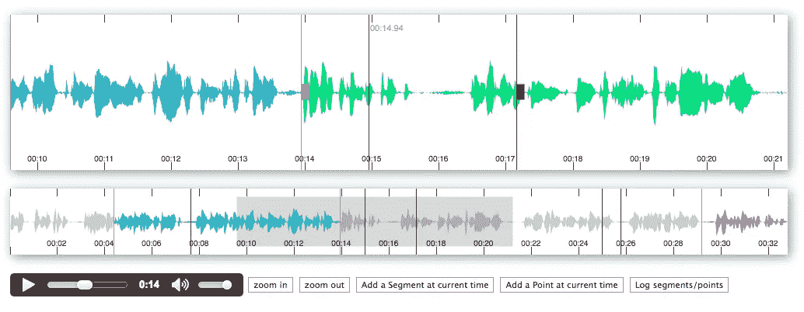
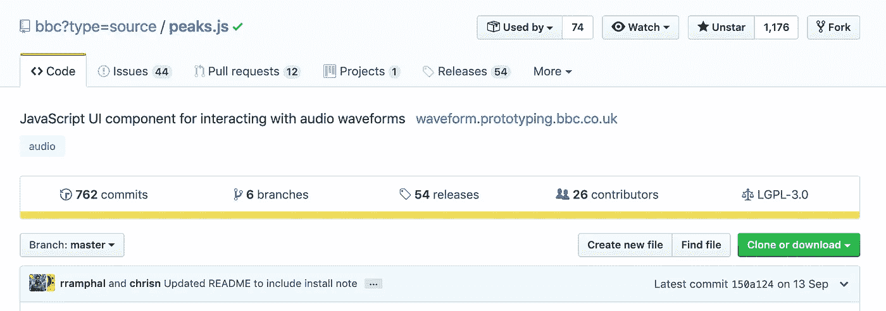
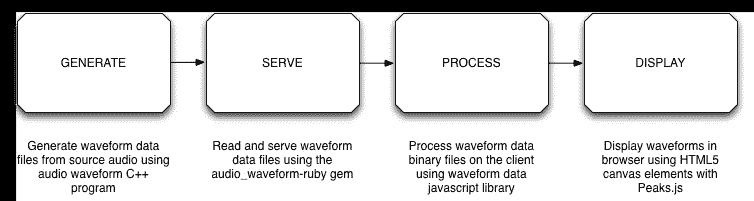
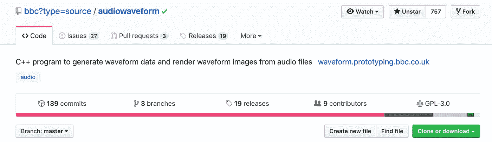

# Peaks.js —与音频波形交互

> 原文：<https://betterprogramming.pub/peaks-js-interact-with-audio-waveforms-b7cb5bd3939a>

## Peaks.js 是一个客户端 JavaScript 组件，用于在浏览器中显示音频波形并与之交互



Peak.js 演示

Peaks.js 由 [BBC R & D](https://www.bbc.co.uk/rd) 开发，允许用户在浏览器中使用后端 API 提供波形数据，对音频内容进行精确剪辑。



Peak.js [Github](https://github.com/bbc/peaks.js) 页面

Peaks.js 使用 HTML canvas 元素以不同的缩放级别显示波形，并且它具有允许您定制波形视图的配置选项。Peaks.js 允许用户与波形视图进行交互，包括缩放和滚动。用户还可以创建一个点或段标记，表示要剪切或参考的内容；例如区分音乐和语音或者识别不同的音乐轨道。



Peaks.js 工作流

# Peak.js 功能

*   可缩放和滚动的波形视图
*   固定宽度波形视图
*   鼠标、触摸、滚轮和键盘交互
*   客户端波形计算，为方便起见，使用 Web 音频 API
*   服务器端波形计算，提高效率
*   单声道、立体声或多声道波形视图
*   创建点或线段标记注释
*   可定制的波形视图

你可以在 BBC R & D 的网站上阅读更多关于这个项目的内容并观看演示。

 [## 英国广播公司的研究和发展:音频波形

### Peaks.js 是一个 JavaScript 组件，允许用户在浏览器中查看音频波形并与之交互。Peaks.js…

waveform.prototyping.bbc.co.uk](https://waveform.prototyping.bbc.co.uk/) 

# 装置

*   npm: `npm install --save peaks.js`
*   鲍尔:`bower install --save peaks.js`
*   [浏览 CDN](https://wzrd.in/) : `[http://wzrd.in/standalone/peaks.js](http://wzrd.in/standalone/peaks.js)`
*   [cdnjs](https://cdnjs.com/) : `[https://cdnjs.com/libraries/peaks.js](https://cdnjs.com/libraries/peaks.js)`

# 在自己的项目中使用 Peaks.js

按照以下步骤，Peaks.js 可以包含在任何网页中:

## 捆绑式(网袋、包裹、卷装)方法

这与诸如 [Meteor](https://www.meteor.com/) 、 [webpack](https://webpack.github.io/) 和 [browserify](http://browserify.org/) (与 [babelify transform](https://github.com/babel/babelify) )的系统配合得很好。

```
import Peaks from '[peaks.js](https://github.com/bbc/peaks.js)';const options = { ... };Peaks.init(options, function(err, peaks) {
  // ...
});
```

# 普通 JavaScript

```
<script src="node_modules/peaks.js/peaks.js"></script>
<script>
(function(Peaks) {
  const options = { ... }; Peaks.init(options, function(err, peaks) {
    // ...
  });
})(peaks);
</script>
```

# 生成波形数据

Peaks.js 使用由[音频波形](https://github.com/bbc/audiowaveform)产生的波形数据文件。这些可以用二进制(.dat)或 JSON 格式。二进制格式是首选的，因为它的文件更小，但是它只与支持类型化数组的浏览器兼容。

当生成波形数据文件时，您还应该使用`-b 8`选项，因为 Peaks.js 目前不支持 16 位波形数据文件。这也有助于最小化文件大小。

要生成二进制波形数据文件:

```
audiowaveform -i sample.mp3 -o sample.dat -b 8
```

要生成 JSON 格式的波形数据文件:

```
audiowaveform -i sample.mp3 -o sample.json -b 8
```

请参考 [audiowaveform 的](https://github.com/bbc/audiowaveform)主页，了解可用命令行选项的详细信息。



音频波形 [GitHub](https://github.com/bbc/audiowaveform) 页面

# 网络音频波形

Peaks.js 可以使用 [Web Audio API](https://www.w3.org/TR/webaudio/) 来生成波形，这意味着你不必预先生成一个`dat`或`json`文件。但是，请注意，这需要浏览器在显示波形之前下载整个音频文件，并且此过程可能会占用大量 CPU 资源，因此不建议用于长音频文件。

[](https://medium.com/better-programming/all-you-need-to-know-about-the-web-audio-api-3df170559378) [## 关于网络音频 API 你需要知道的

### 使用 JavaScript 的 API 来处理和合成音频

medium.com](https://medium.com/better-programming/all-you-need-to-know-about-the-web-audio-api-3df170559378) 

要使用网络音频，省略`dataUri`选项，转而传递一个包含`AudioContext`实例的`webAudio`对象。你的浏览器必须支持网络音频 API。

```
const AudioContext = window.AudioContext || window.webkitAudioContext;
const audioContext = new AudioContext();const options = {
  containers: {
    overview: document.getElementById('overview-waveform'),
    zoomview: document.getElementById('zoomview-waveform')
  },
  mediaElement: document.querySelector('audio'),
  webAudio: {
    audioContext: audioContext
  }
};Peaks.init(options, function(err, peaks) {
  // Do something when the waveform is displayed and ready
});
```

在 Peak.js 的 [GitHub 页面](https://github.com/bbc/peaks.js#api)上查看完整的 API 文档和所有可用选项。

[](https://github.com/bbc/peaks.js#api) [## bbc/peaks.js

### 用于与音频波形交互的 JavaScript UI 组件- bbc/peaks.js

github.com](https://github.com/bbc/peaks.js#api) 

# 贡献的

如果你想给 Peaks.js 投稿，请看看[投稿指南](https://github.com/bbc/peaks.js/blob/master/CONTRIBUTING.md)。

[](https://github.com/bbc/peaks.js/blob/master/CONTRIBUTING.md) [## bbc/peaks.js

### 感谢您对 Peaks.js 的关注！我们喜欢听到使用我们软件的人的反馈，所以如果你建立…

github.com](https://github.com/bbc/peaks.js/blob/master/CONTRIBUTING.md) 

**感谢阅读，编码快乐！**