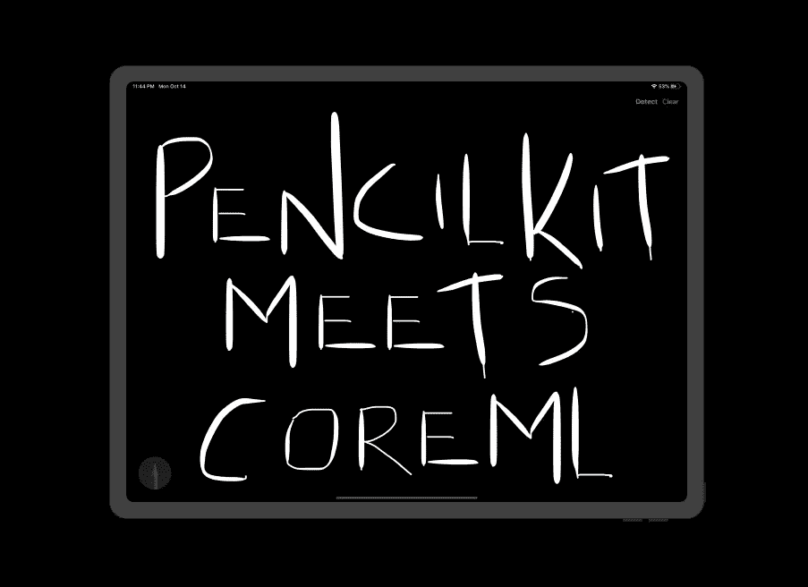
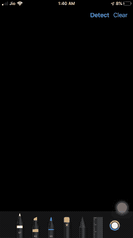

# PencilKit 遇上 Core ML

> 原文：<https://betterprogramming.pub/pencilkit-meets-core-ml-aefe3cde6a96>

## 用 MNIST 识别图形中的数字



来自我们的 iOS 应用程序的草图

在 WWDC 19 期间引入的 [PencilKit](https://medium.com/better-programming/an-introduction-to-pencilkit-in-ios-4d40aa62ba5b) 框架对于希望在 iOS 和 iPadOS 13 应用中利用绘图框架的开发人员来说是一个福音。在我们的应用程序中，三个角色在设置 PencilKit 框架中扮演着重要的角色。它们是:

*   `PKCanvasView`
*   `PKDrawingView`
*   `PKToolPicker`

在下面的部分中，我们将一起使用 PencilKit 框架和 Core ML 框架来识别绘图中的数字。

# 我们的目标

*   设置基于 PencilKit 框架的 iOS 应用程序。
*   使用著名的 MNIST 数据集来识别在 PencilKit 画布上绘制的数字。
*   利用核心 ML 框架来预测和显示抽取的数字。

# 一句简短的话

MNIST 数据集是一个图像数据集，由大约 60，000 个尺寸为 28 x 28 的灰度手写数字图像组成。

这些图像的大小为 20 x 20，并且被标准化以适合盒子的中心。当数字在输入图像中居中时，精确度最好。

在本文中，我们不会深入研究模型层和训练数据集。假设我们得到了一个现成的核心 ML MNSIT 模型。

# 我们的最终目的地

一幅图像胜过千言万语。GIF 由成千上万的图片组成。这是你在这篇文章结束时得到的最终结果。



最后结局

# 安装

在 Core ML 与 PencilKit 框架约会之前，让我们穿上 PencilKit 框架。

## 搭建画布

在我们的应用程序中设置`PKCanvasView`非常容易，如下面的代码所示:

```
let canvasView = PKCanvasView(frame: .zero)
canvasView.backgroundColor = .black
canvasView.translatesAutoresizingMaskIntoConstraints = false
view.addSubview(canvasView)
NSLayoutConstraint.activate([
   canvasView.topAnchor.constraint(equalTo: navigationBar.bottomAnchor),
   canvasView.bottomAnchor.constraint(equalTo: view.bottomAnchor),
   canvasView.leadingAnchor.constraint(equalTo: view.leadingAnchor),
   canvasView.trailingAnchor.constraint(equalTo: view.trailingAnchor),
])
```

## 设置我们的工具选择器

ToolPicker 负责在我们的应用程序中显示各种画笔。它提供了墨水、铅笔、选区、橡皮擦工具以及撤销和重做选项(由于屏幕尺寸的原因，这仅在 iPadOS 上可用)。

以下代码显示了如何在我们的应用程序中设置 ToolPicker UI:

```
override func viewDidAppear(_ animated: Bool) {
    super.viewDidAppear(animated)guard
     let window = view.window,
     let toolPicker = PKToolPicker.shared(for: window) else {return}toolPicker.setVisible(true, forFirstResponder: canvasView)
    toolPicker.addObserver(canvasView)
    canvasView.becomeFirstResponder()
}
```

## 设置我们的导航栏按钮

导航栏已经添加到情节提要中。在下面的代码中，我们添加了几个动作按钮。

```
func setNavigationBar() {
        if let navItem = navigationBar.topItem{

            let detectItem = UIBarButtonItem(title: "Detect", style: .done, target: self, action: #selector(detectImage))
            let clearItem = UIBarButtonItem(title: "Clear", style: .plain, target: self, action: #selector(clear))navItem.rightBarButtonItems = [clearItem,detectItem]
            navItem.leftBarButtonItem = UIBarButtonItem(title: "", style: .plain, target: self, action: nil)

        }
}
```

左栏按钮是显示最终预测输出的地方。

# 预处理绘图输入

以便将 PencilKit 绘图提供给 CoreML 框架。我们首先需要从画布中提取图像。让我们看看这是怎么做到的。

*   将`PKDrawing`实例转换成`UIImage`很简单。真正的挑战是为核心 ML 模型进行预处理。
*   我们从 PKDrawing 获得的 UIImage 只包含绘制的图像，没有填充。
*   我们需要创建一个具有视图大小的图像，并将中心的`PKDrawing`叠加到`UIImage`上。基本上是 UIImage 中的 UIImage。

以下代码为您完成了这项工作:

```
func preprocessImage() -> UIImage{
        var image = canvasView.drawing.image(from: canvasView.drawing.bounds, scale: 10.0)
        if let newImage = UIImage(color: .black, size: CGSize(width: view.frame.width, height: view.frame.height)){if let overlayedImage = newImage.image(byDrawingImage: image, inRect: CGRect(x: view.center.x, y: view.center.y, width: view.frame.width, height: view.frame.height)){
                image = overlayedImage
            }
        }
}
```

上述代码中使用了以下助手扩展函数:

```
extension UIImage {

    public convenience init?(color: UIColor, size: CGSize = CGSize(width: 1, height: 1)) {
        let rect = CGRect(origin: .zero, size: size)
        UIGraphicsBeginImageContextWithOptions(rect.size, false, 0.0)
        color.setFill()
        UIRectFill(rect)
        let image = UIGraphicsGetImageFromCurrentImageContext()
        UIGraphicsEndImageContext()guard let cgImage = image?.cgImage else { return nil }
        self.init(cgImage: cgImage)
    }func image(byDrawingImage image: UIImage, inRect rect: CGRect) -> UIImage! {
        UIGraphicsBeginImageContext(size)draw(in: CGRect(x: 0, y: 0, width: size.width, height: size.height))
        image.draw(in: rect)
        let result = UIGraphicsGetImageFromCurrentImageContext()
        UIGraphicsEndImageContext()
        return result
    }
}extension CGRect {
    var center: CGPoint { return CGPoint(x: midX, y: midY) }
}
```

# 使用核心 ML 进行预测

既然映像已经可以输入了，我们需要做以下三件事:

1.  将其调整为输入尺寸 28 x 28。
2.  将其转换成灰度色彩空间中的`CVPixelBuffer`。
3.  喂给核心 ML 模型。

```
private let trainedImageSize = CGSize(width: 28, height: 28)func predictImage(image: UIImage){
        if let resizedImage = image.resize(newSize: trainedImageSize), let pixelBuffer = resizedImage.toCVPixelBuffer(){guard let result = try? MNIST().prediction(image: pixelBuffer) else {
            return
        }
            navigationBar.topItem?.leftBarButtonItem?.title = "Predicted: \(result.classLabel)"
            print("result is \(result.classLabel)")
        }
}
```

上述代码使用了以下扩展函数:

```
extension UIImage{
func resize(newSize: CGSize) -> UIImage? {
        UIGraphicsBeginImageContextWithOptions(newSize, false, 0.0)
        self.draw(in: CGRect(x: 0, y: 0, width: newSize.width, height: newSize.height))
        let newImage = UIGraphicsGetImageFromCurrentImageContext()
        UIGraphicsEndImageContext()
        return newImage
    }

    func toCVPixelBuffer() -> CVPixelBuffer? {
       var pixelBuffer: CVPixelBuffer? = nillet attr = [kCVPixelBufferCGImageCompatibilityKey: kCFBooleanTrue,
        kCVPixelBufferCGBitmapContextCompatibilityKey: kCFBooleanTrue] as CFDictionary

       let width = Int(self.size.width)
       let height = Int(self.size.height)CVPixelBufferCreate(kCFAllocatorDefault, width, height, kCVPixelFormatType_OneComponent8, attr, &pixelBuffer)
       CVPixelBufferLockBaseAddress(pixelBuffer!, CVPixelBufferLockFlags(rawValue:0))let colorspace = CGColorSpaceCreateDeviceGray()
       let bitmapContext = CGContext(data: CVPixelBufferGetBaseAddress(pixelBuffer!), width: width, height: height, bitsPerComponent: 8, bytesPerRow: CVPixelBufferGetBytesPerRow(pixelBuffer!), space: colorspace, bitmapInfo: 0)!guard let cg = self.cgImage else {
           return nil
       }bitmapContext.draw(cg, in: CGRect(x: 0, y: 0, width: width, height: height))return pixelBuffer
    }
}
```

# 结论

所以我们设法使用 CoreML 和 PencilKit 框架来确定使用 MNIST 数据集绘制的草图。设备上的机器学习有大量的用例，推断图纸只是其中之一。你可以在 [Github 库](https://github.com/anupamchugh/iowncode/tree/master/iOSPencilKitCoreMLMNIST)中找到完整的源代码。

这一次到此为止。我希望你喜欢阅读。