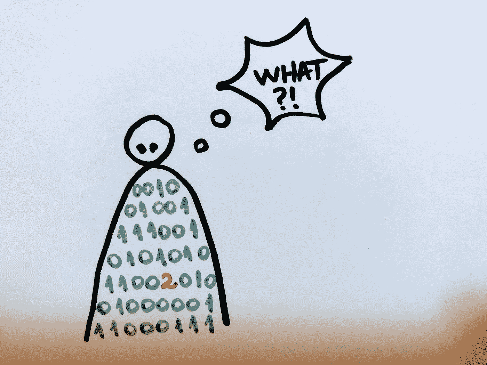
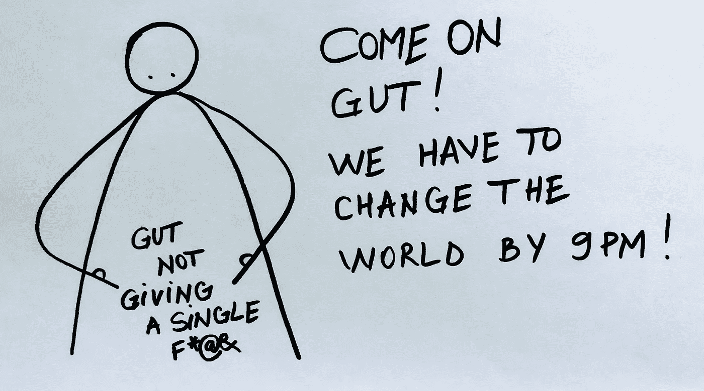
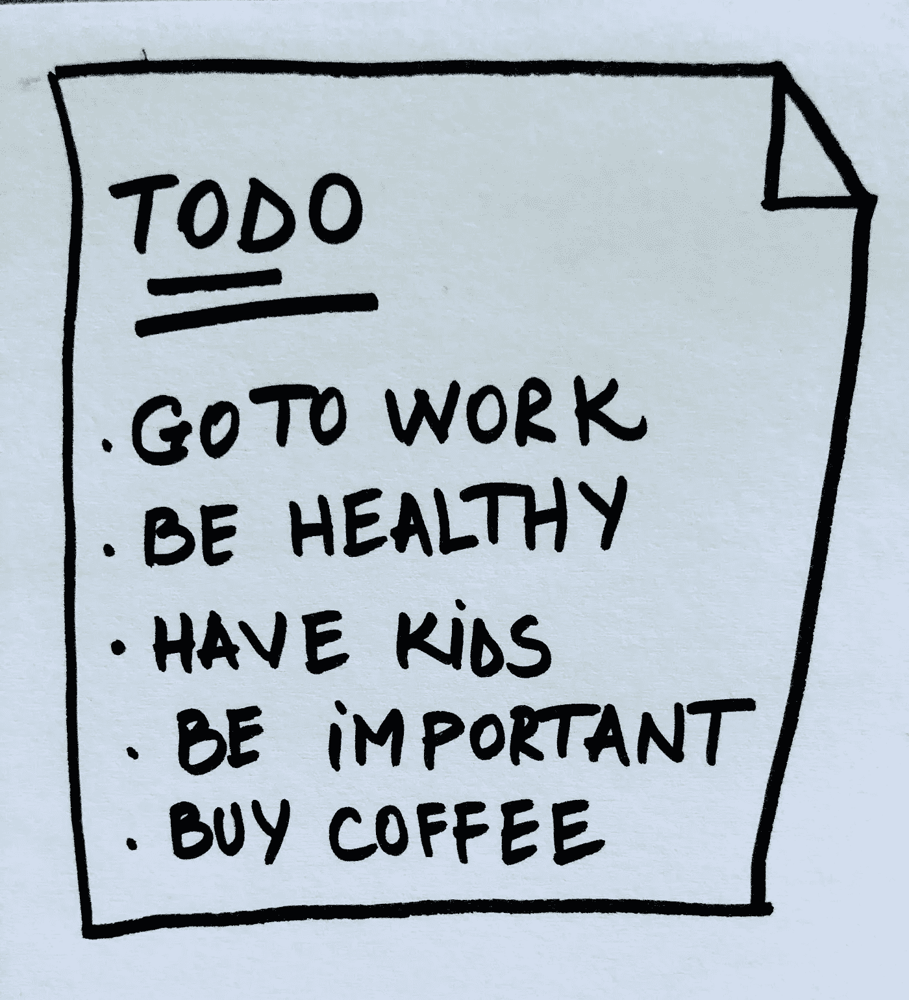

# 人员和代码

> 原文：<https://betterprogramming.pub/people-and-code-edce63291010>

## 我们有错误，有时我们会失败



我开始阅读一些关于教练的书籍，这个想法开始在我的脑海中成长，人和代码是相似的。比如:

1.  人们的大脑和身体里也安装了代码
2.  我们认为自己的一些特征是缺陷，但实际上是特征
3.  我们对自己和我们生活的世界有着强烈的核心信念，很难改变
4.  我们对人的典型反应是:2xx——我猜你还好，4xx——是你，不是我，5xx——是我，不是你
5.  我们有时会失败

# 1.我们靠代码(和咖啡)运行

新年来了。随之而来的是新年决心。又是一年，又是一个减掉多余体重的机会，努力实现你的梦想，参加那个创意班。当然，还有一个不做任何事情，沉浸在失望中的机会。你意识到改变有多难吗？即使你可能在理论上理解一些概念，但你的直觉就是无法理解。你的直觉需要理解。



为什么这么难？因为我们运行程序。在我们的日常生活中变得更有效率，在某些情况下(戏剧女王警告！)为了生存，我们已经预先学会了当一些事情发生时如何表现和对世界做出反应。所以当某天有人行为怪异时，记住，他们有自己的代码在运行；这与你无关。我们是**反应型**系统。以及它困扰你的事实→那是你自己的程序反应。

代码是遗产。是你的曾曾曾曾祖父母送的。你不能进去，因为它就是这样运作的。当你试图改变它的时候，感觉非常不舒服，什么都不管用。所以你写了一行注释:

```
// @aprav 12.12.2019 never change this!
```

这将很快成为新的遗产。

# 2.是功能，不是 Bug！

我们专注于 bug。不知道为什么；也许是这个世界，也许是我们生活的这个社会，也许是我们学会了这样。事实是，为什么并不重要。我们太关注那些不起作用的东西了。我们不断尝试改变。变得更好。太棒了。

我们成长，发展，进化。问题是，在这种无休止的增长中，我们忘记了一件重要的事情。一切“坏”的东西也有好的一面。直到你‘改变’它，‘解决’它，‘修复’它，为什么不享受好处呢？大多数 bug 也是特性！大多数错误都是从美好的事物开始的，比如技能或品质。例如，一个好帮手可能会在过分的时候变成一个爱管闲事的人。


如果你真的想改变，就去改变。如果你这样做了，第一步就是接受你就是你的事实。接下来的步骤主要是享受这个过程。也许你会到达那里，也许你不会。有关系吗？是功能，不是 bug！尽情享受吧！

# 3.你试图改变，事情可能会崩溃

现在你说:“安德拉，每个人都可以改变。我在一个迷因里看到的，所以肯定是真的”。确实如此。你可以改变你的习惯，搬到另一个国家，改变你的朋友，再找一个丈夫。你真的变了吗？我看到这些东西就像手机上的应用程序。你安装一个更好的打车 app，新的，换旧的，去掉一部分。同时，你的操作系统保持不变。你还是老样子，没动过。你的生活改变了，但你没有。你的环境改变了，你没有。

也许你喜欢你的核心信念，你的核心价值观和技能。你也看到了一些你并不特别喜欢的东西，认为它们需要一点亮点。发生了一点变化，一切都开始崩溃。你吓坏了，再也不回去，你向自己保证。房间被锁上了，钥匙被扔给了狗。



我们对自己和我们生活的世界有很强的信念，很难改变。

是的，我们有。尽管我们认为自己灵活敏捷，但事实并非如此。

也许你自己也有一些。试着询问他们。只是提问。就一秒钟，假装它们不是真的。感觉如何？啊哈！明白我的意思吗？

我们就像代码，难以维护，有可疑的架构，需要电力来运行，有故障。

# 4.我们用状态码来回应这个世界

每个网站都有一个客户端(例如浏览器)和一个服务器(所有的语义处理都在这里进行)。它们通过请求相互通信。为了相互理解，他们需要一个协议。这个协议就是 HTTP。在 HTTP 中，我们有服务器响应的状态码。我们作为人类，也有对世界的反应。以及其他人。当有事发生时，我会这样做:

**1xx** : **信息**，为了相互理解，我们需要这样做(使用英语，打电话，见面)。

**2xx:** **成功**，我明白你的意思→这些是我们实际上可能喜欢的人/事。或者，至少有时候。

**3xx** : **重定向**，我们不在同一个页面上，当你有更多的细节时再谈，我不知道，我需要更多的时间。


**4xx:** **客户端错误**，我们并不真正喜欢的人。还有，是你，不是我。一些例子:

*   400 错误请求
*   402 要求付款😂
*   403 禁止
*   不可接受
*   409 冲突
*   418 我是茶壶
*   429 请求太多

**5xx:服务器错误，**我们并不真正喜欢的人。还有，是我，不是你。

*   500 内部服务器错误
*   503 服务不可用—我是。
*   505 不支持 HTTP 版本🙂
*   507 存储不足

有趣的是，我们对待这个世界就像所有的 4xx 一样。事实上，如果我们对自己诚实，就有 5xx。从我们的遗留代码和内部操作系统。很难承认你有问题而不是这个世界。因为接下来会发生两件事:

1.  你对自己的回答负全责，尽量做到 2xx。你意识到没有人会来修复你的代码。
2.  你没有人可以责怪。你要么抱怨一辈子，要么开始承认是你，不是他们。

每次它实际上是一个 5xx 时，你可以尝试返回一个 4xx。没有人阻止你；这是你内在的化学反应。你可以告诉人们:“我不喜欢这样，请停下来”。即使他们这样做了，bug 仍然在你身边，并且永远保持那样，不管你回到什么世界。

# 5.我们有时会失败

是的，我们有。像系统一样，没有什么是可预测的，即使代码已经存在。输入是不可靠的，结果大多是不确定的。有一点是肯定的:失败终将到来。伟大的系统是做什么的？他们能抵御失败。所以不要害怕失败，要确保你把它融入你的生活。确定它什么时候会发生，你有处理它的工具。

好吧，那现在怎么办？有什么可做的？更准确地说是如何做到的？那，我的朋友，只有你能知道。

我将把启发我写这篇文章的书留在这里:

1.  Michael Bungay Stanier 的《教练习惯》 →这是一本关于如何在日常工作中培养教练态度的快速实践书。你可以在 YouTube 上找到一个 3 分钟的可爱的[图解摘要。此外，作者有一些应用这些概念的工作室，这些工作室也可以在 youtube 上免费获得，非常棒。是的，我都看了。](https://www.youtube.com/watch?v=QCwFdgbSeMY)
2.  **Manfred Kets de Vries 的《正念领导力辅导》→** 这是一种更深入的辅导方法，通常指临床方法，以更好地理解我们领导行为背后的原因。我个人更喜欢这本书，尤其是第四章，它揭示了伟大的变革型领导者如何将他们的统治建立在宽恕的基础上。