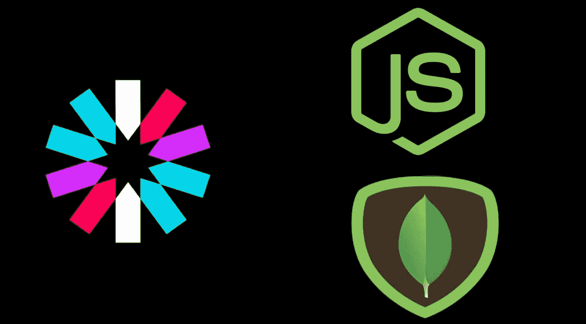
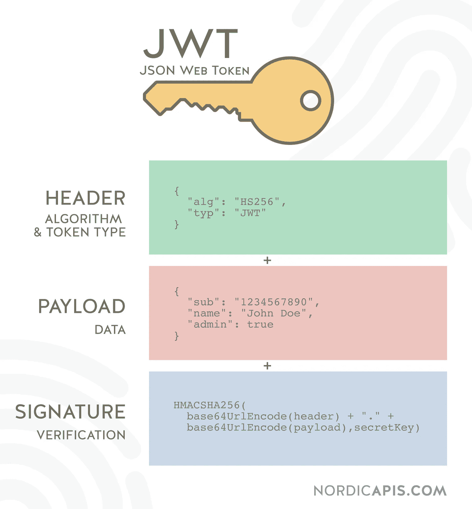
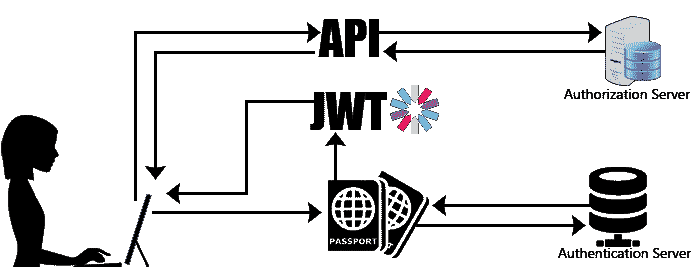
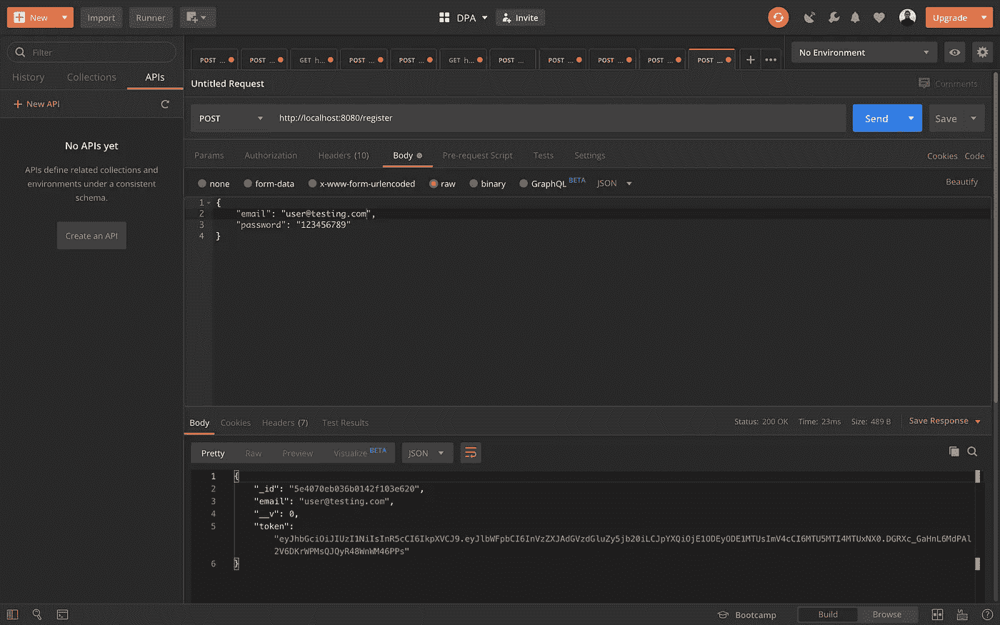
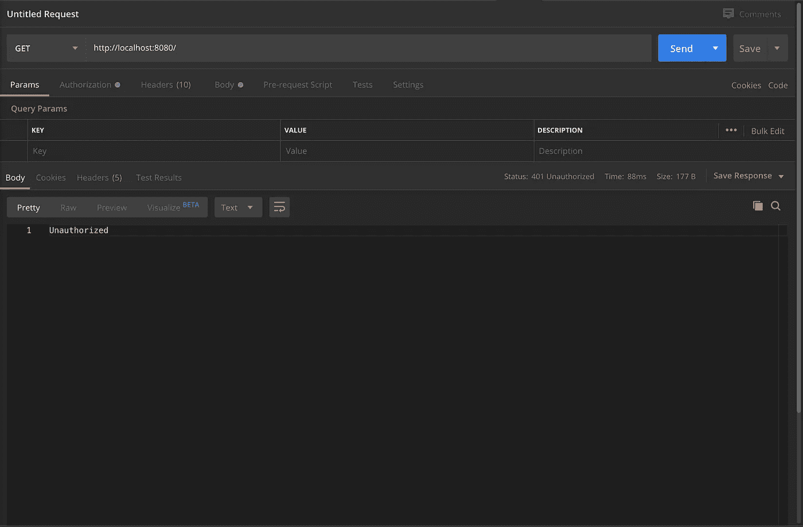
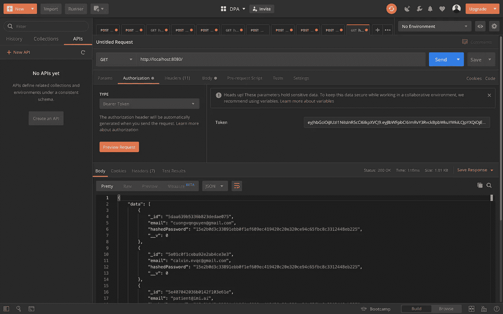

# 使用 Passport-JWT 设置 Node.js API 的分步指南

> 原文：<https://betterprogramming.pub/perfect-structure-to-authenticate-authorize-api-with-node-js-and-passport-jwt-d529b1a618ba>

## 提高你的应用或网站的安全性

# **作者注**

问候读者，

本文是“*系列文章的一部分，该系列文章由各种软件开发的*技术教程、新闻和技巧*组成:*

1.  *[用 Node.js(第 1 部分)— ES6](https://medium.com/swlh/a-complete-guide-build-a-scalable-3-tier-architecture-with-mern-stack-es6-ca129d7df805) 构建一个结构良好的三层架构*
2.  *[提高团队代码质量的两个简单技巧](https://medium.com/swlh/2-simple-tips-to-increase-your-team-code-quality-143b879ae2f7)*
3.  ***认证的完美结构&用 Node.js 授权你的 API***
4.  *[我在一个小时内构建了一个 M.E.R.N 代码库](https://medium.com/swlh/i-built-a-m-e-r-n-codebase-in-an-hour-742acd71ed7e)(第 2 部分)*
5.  *[如何用 Java 构建 REST API&MySQL 使用 Tomcat](https://medium.com/@calvinqc/build-a-simple-rest-apis-with-java-8-tomcat-jsp-mysql-intellij-on-mac-3308f4e59a03)*
6.  *[使用 Nodemailer、Gmail & Google OAuth2](https://medium.com/swlh/multi-purposes-mailing-api-using-nodemailer-gmail-google-oauth-28de49118d77) 构建自己的邮件 API*
7.  *[WebRTC——支持 Google Meet、Facebook Messenger 的技术](https://medium.com/swlh/webrtc-the-technology-that-powers-google-meet-hangout-facebook-messenger-and-discord-cb926973d786)*
8.  *[向新的 Github CLIs 问好](https://medium.com/@calvinqc/say-hello-to-the-new-github-clis-7e2612fb3918)*
9.  *[使用 Java、Springboot、Kafka 进行简单设置](https://levelup.gitconnected.com/easy-java-springboot-apache-kafka-setup-on-macos-ceb481e167f8)*
10.  *[成功的团队合作需要什么](https://levelup.gitconnected.com/what-it-takes-to-have-a-successful-team-cooperation-bc21b82e9f3)*
11.  *[如何使用 Docker、EC2、ECS 和 ECR 将应用程序部署到 AWS](https://medium.com/swlh/how-to-deploy-an-application-to-aws-using-docker-ecs-and-ecr-aa7785fc9667)*
12.  *[通过将我们的客户端托管到云存储，我们节省了 45%的总成本](https://medium.com/@calvinqc/we-cut-down-45-of-our-budget-by-switching-to-google-cloud-storage-7e5a6a10542)*

*感谢访问这个系列，并享受阅读！*

**

*Node.js、MongoDB 和 JWT*

*身份验证和授权是应用程序的重要组成部分。每当有一个没有保护或检查的 API 路径时，应用程序就很容易成为黑客的目标。这就是为什么我们需要一个安全令牌——[JSON Web 令牌(JWT)](https://jwt.io/) 。*

# *JWT 的基本情况*

**我不会深入 JWT，但这里是所有的基本情况。**

**

> *JSON Web Token (JWT)是一个开放标准( [RFC 7519](https://tools.ietf.org/html/rfc7519) )，它定义了一种紧凑且独立的方式，以 JSON 对象的形式在各方之间安全地传输信息。该信息可以被验证和信任，因为它是数字签名的。jwt 可以使用秘密(使用 **HMAC** 算法)或使用 **RSA** 或 **ECDSA** 的公钥/私钥对进行签名。*
> 
> *—[JSON Web 令牌简介](https://jwt.io/introduction/)*

*JSON web 令牌对用户信息进行编码和解码。它们用于授权和信息交换。*

*它们由三部分组成——报头、有效载荷和签名——由点(`.`)分隔，如下所示:`xxxxx.yyyyy.zzzzz`*

*点击阅读更多关于 JSON web 令牌[的信息。](https://jwt.io/introduction/)*

# *开始之前*

*我会假设你的电脑已经有了 npm 和测试，如果没有看这个视频的话。*

*这是[代码](https://github.com/calvinqc/trivin/tree/master/templates/node-passport-jwt)如果你在这个过程中有任何问题，如果你需要问任何问题，请加入 Trivin 的 [slack](https://trivin.slack.com/) 。*

# *服务器设置*

*如果您喜欢使用自己的服务器，请跳过这一步。*

*如果您没有项目，我们将使用 [Trivin](https://github.com/calvinqc/trivin) 来设置项目模板。在本文中，我们将使用它来创建一个简单节点服务器。*

```
*$ npm i trivin -g
$ trivin server simple-node-server -g -i*
```

*这将创建[一个简单但结构良好的节点服务器](https://medium.com/swlh/a-complete-guide-build-a-scalable-3-tier-architecture-with-mern-stack-es6-ca129d7df805)，初始化 Git，并安装所有的项目依赖项。*

# *装置*

```
*$ npm i passport passport-jwt winston cors express-validator jsonwebtoken*
```

# *支持文件设置*

```
*$ mkdir store/ 
$ touch store/passport.js store/config.js store/utils.js controller/constant.js*
```

## *常数. js*

*   *首先，在 constant.js 文件中有一些我非常喜欢做的事情。我没有写很多字符串，而是为我可能重用的字符串创建了*变量*。*
*   *允许`TextEditor`自动完成并减少字符串中的错别字。*
*   *将这些添加到`constant.js`文件中:*

## *实用工具*

*   *存储整个项目中使用的所有功能和验证的文件。*
*   *这使得 API 控制器文件中的代码更加清晰。*

# ***Passport.js 设置***

*   *node.js 库可以帮助您进行身份验证。*
*   *将此添加到您的`store/passport.js`:*

*`store/config.js` 是我保存应用程序所有配置的地方:*

*修改`app.js` 与护照一起使用:*

# *运行您的应用*

```
*$ npm start*
```

*现在让我们回过头来，通过将`Passport-jwt`应用到我们的 API 来改进`user.controller.js`。*

# ***将 Passport-jwt 应用于注册/登录 API***

**

*图片来源:dotnettricks.com*

*   *而不是使用用户的电子邮件和散列密码进行授权，这在客户端和服务器之间的通信期间可能是不安全的。*
*   *我们使用 JWT 令牌进行授权。这样，我们可以确保密码和用户的电子邮件被加密的安全性。*

# *测试*

*   *此时，我假设您知道如何使用 Postman。*
*   *使用`POST/`方法，输入`localhost:8080/register`和`localhost:8080/login`。*
*   *在您测试您的注册 API 之后，您将成功地获得类似下面的结果。将令牌复制到剪贴板。*

**

*注册 API 成功返回一个令牌和用户的电子邮件+ id*

# *批准*

*让我们看看您是否想转到需要用户登录的特定链接。然后，您可以简单地在 API 中添加一个授权。*

*让我们看一个例子。*

*   *在`user.controller.js`中，我包含了一个简单的`'/'` API 来检索所有用户的列表——但是我不想检索所有用户，除非我以用户身份登录。*
*   *另一个例子是脸书。如果您想进入新闻提要并检索您的所有帖子，您需要登录。*
*   *下面是一个在没有 JWT 令牌的情况下(也就是说，您还没有登录)访问安全 API 路由的例子:*

**

*API 未附带 JWT 的示例*

# ***JWT 护照授权***

*将这些亮点添加到 user.controller.js 中:*

*现在，用 Postman 测试 API。点击“授权”，并选择“不记名令牌”类型然后，将您的令牌粘贴到令牌字段中，并运行:*

**

*使用 JWT，您将能够检索所有用户*

# *干得好！*

*现在，您可以授权和保护所有其他需要用户在使用 API 之前登录的路由。*

***跟进***

*   *如果你喜欢阅读 ***《我与创业公司一起成长》*** ，并希望在未来阅读更多。请在此订阅[。](http://eepurl.com/g5qIBf)*
*   *在 [Github](https://github.com/calvinqc) 、 [LinkedIn](https://www.linkedin.com/in/calvinqc/) 上与我联系*