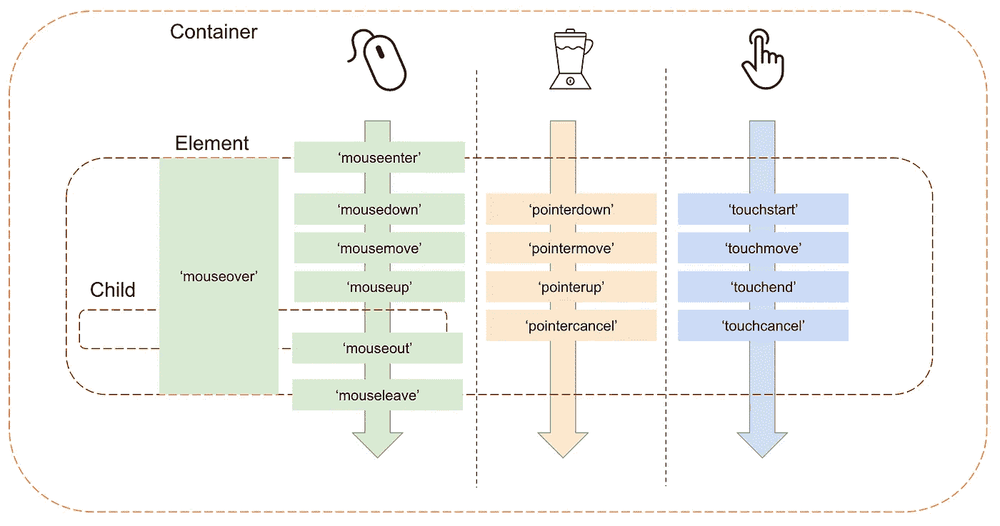

# 在纯普通 JavaScript 中完善拖放

> 原文：<https://betterprogramming.pub/perfecting-drag-and-drop-in-pure-vanilla-javascript-a761184b797a>

## 无需库或框架的高效拖放功能

[阿兰·琼斯](https://unsplash.com/@alanrobertjones?utm_source=medium&utm_medium=referral)在 [Unsplash](https://unsplash.com?utm_source=medium&utm_medium=referral) 上拍照

拖放功能是现代网络 UX 的基础。这是 API 的一个方面，也是 HTML 标准的一部分。许多 UI 库都提供了开箱即用的功能。

但是，有时我们不得不处理标准 API 或库都无法提供帮助的情况，我们必须自己实现功能。在本文中，我们将做到这一点—我们将实现:

*   交叉输入(支持混合鼠标和触摸事件)
*   跨浏览器友好
*   高性能(60 帧/秒)
*   高效(没有浪费 JavaScript 处理)

# 1.先决条件

就本文而言，我们将在一个简单的 HTML 页面中的容器(div)元素周围拖动几个黑色方框(div ):

初始 HTML

初始 CSS

这里没有什么特别的，但是请注意，我们应用了`[touch-action: none;](https://developer.mozilla.org/en-US/docs/Web/CSS/touch-action)` [CSS 规则](https://developer.mozilla.org/en-US/docs/Web/CSS/touch-action)来防止容器内事件的任何浏览器级别的操作(比如滚动或缩放)。

# 2.添加输入侦听器

指针事件提供了支持两种输入类型的混合器

既然我们想要支持交叉输入，我们可以编写一些检测机制来检测用户是使用触摸输入还是鼠标输入，但是在现代世界中，用户可能会同时使用两种输入类型(触摸屏笔记本电脑，有人吗？).

因此，我们应该致力于支持这两者。一种方法是附加两种类型的监听器，但是更好的方法是利用指针事件 API ()——两种输入类型的混合体，现在得到了所有主流浏览器的支持。

我们的拖放用户体验可以这样映射:

*   用户指向一个框，按下鼠标键/屏幕(`pointerdown`)
*   用户通过在屏幕上移动鼠标/手指来拖动方框(`pointermove`)
*   用户通过从屏幕上释放鼠标/手指来放下盒子(`pointerup` / `pointercancel` *)

*触摸设备具有一个额外的`[touchcancel](https://developer.mozilla.org/en-US/docs/Web/API/Element/touchcancel_event)`事件，用于触摸事件被中断的情况(例如，当屏幕上有太多触摸点时)。

因此，让我们编写一些 JavaScript 并添加我们的事件侦听器:

监听框元素的输入事件

## 几个音符

*   我们只是将`pointerdown`事件附加到容器上，并动态地添加/移除其他侦听器，以防止事件污染——我们根据需要使用侦听器，以保持严密。
*   事件被附加到容器中，正如我们使用 [*事件委托*](https://javascript.info/event-delegation) *。*
*   我们还使用了`passive`标志来确保我们的事件不会干扰我们的滚动事件。

# 3.让箱子动起来

我们的盒子以`absolute`定位为特色，并依靠`left` / `top`属性定位在容器内部。让我们添加实际移动盒子的功能:

现在我们可以移动箱子了

现在这里发生了更多的事情:

*   在`userPressed`事件处理程序中，我们捕获移动起点的坐标以及 box 元素的`[BoundingClientRect](https://developer.mozilla.org/en-US/docs/Web/API/Element/getBoundingClientRect)`；这两者都将有助于根据移动过程中指针经过的距离来计算我们需要应用于盒子的移动量。
*   在`userMoved`处理器中，我们利用`startX`和`startY`数据来计算盒子相对于其先前位置应该移动的`delta`。

事实上，现在用户可以通过触摸或鼠标输入来移动盒子。

# 4.调谐性能

我们可以采用一些已知的方法来提高性能。在这个简单的例子中，我们不执行任何繁重的计算；因此，即使这样，性能看起来很好。但是我们可以考虑以下选择:

## **‘变形 3d’**

这个技巧现在可能已经过时了，因为现代浏览器学会了优化布局变化，但是知道我们可以在`pointermove`期间应用`transform`，并且只在`pointerup`上应用实际的样式变化，而不是直接修改我们的盒子的`left`和`top`位置，这仍然是有用的:

## **' RequestAnimationFrame '**

我们还可以通过使用[requestAnimationFrame API](https://developer.mozilla.org/en-US/docs/Web/API/window/requestAnimationFrame)在拖动时实现更平滑的动画(大约 60 FPS):

使用 requestAnimationFrame API 进行拖动

## 这里有一些注释

*   我们添加了`raf`变量来帮助我们在`requestAnimationFrame`定时器的帮助下去抖`pointermove`事件，因为我们不希望 JavaScript 执行不会被使用的计算，因为动画帧已经被调度并且还没有完成。
*   我们确保每秒触发多次的`pointermove`事件是轻量级的，只包含获取坐标信息和触发样式改变所必需的逻辑。
*   更新:正如 Daniel Faure 指出的，在用户释放指针后重置 deltaX/deltaY 以确保任何新的移动从新的值开始是很重要的。

# 3.CSS 规则:“将改变”和“包含”

除了上述内容，您还可以探索 CSS 规则来进一步优化性能。

`[will-change](https://developer.mozilla.org/en-US/docs/Web/CSS/will-change)`[CSS 规则](https://developer.mozilla.org/en-US/docs/Web/CSS/will-change)向您的浏览器指示元素的属性将会改变，并允许浏览器执行额外的优化。但是正如文档所说——小心使用:

> **“重要:** `will-change`意在作为最后手段使用，以便尝试处理现有的性能问题。它不应该用于预测性能问题。

有助于优化性能的其他 CSS 规则

`[contain](https://developer.mozilla.org/en-US/docs/Web/CSS/CSS_Containment)`[CSS 规则](https://developer.mozilla.org/en-US/docs/Web/CSS/CSS_Containment)并不是所有浏览器都完全支持的，但是它可以帮助表明特定 DOM 的元素样式或布局变化不会影响另一个页面的元素，因此不会触发潜在的昂贵的重排版。

在我们简单的例子中，它并没有增加任何价值(假设我们的盒子被定位为`absolute`，但是在更复杂的 UI 和拖动情况下，它是一个有用的技巧。你可以观看[这个惊人的视频](https://www.youtube.com/watch?v=iqcO-5_KkJ4&t=983s)了解更多细节。

# 结论

我们讨论了如何在纯 JavaScript 中实现拖放功能的基础知识，并概述了一些性能优化的技术和方向。需要记住的主要事项:

*   利用混合输入事件确保混合设备被覆盖。
*   动态附加/分离`move` / `up` / `cancel`事件。
*   尽可能多地在`down`和`up`处理器的前面或内部提升重物，但保持`move`处理器轻便。
*   拖动时利用`requestAnimationFrame`进行去抖动和平滑动画。
*   探索有助于获得额外性能的 CSS 规则。

在此全面实施:

感谢您阅读文章，祝您编码愉快！