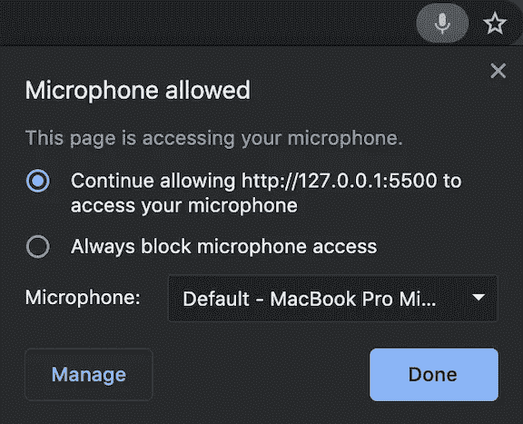
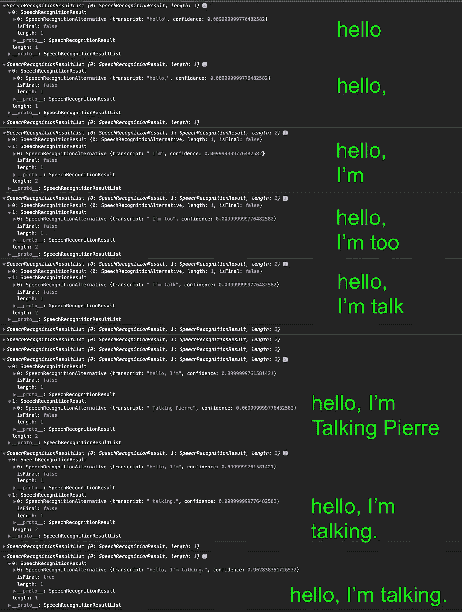
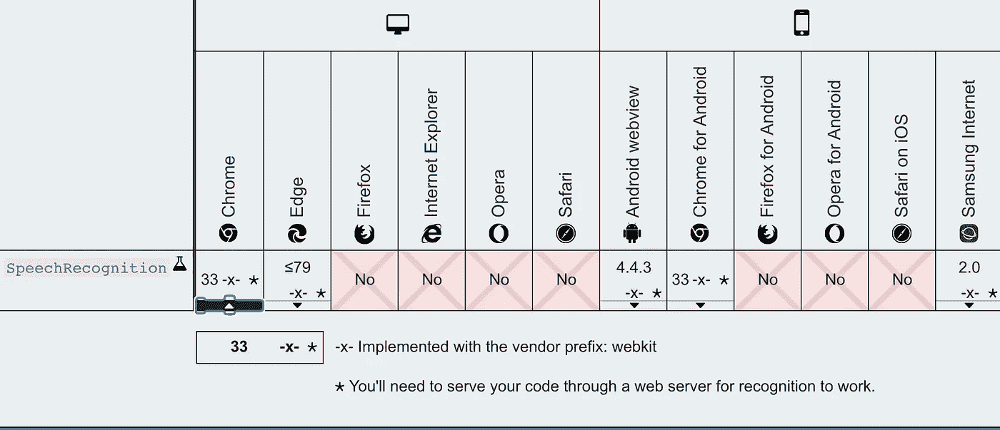
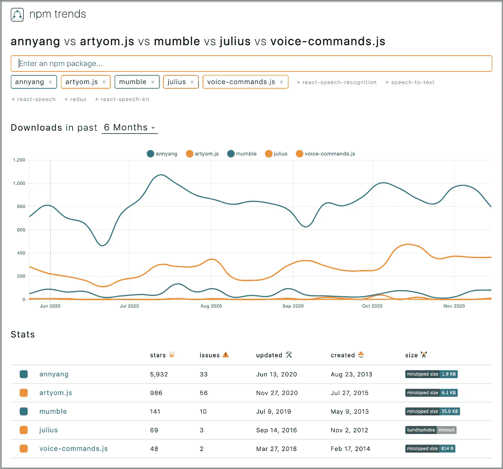

# 在您的 Javascript 应用程序中执行语音识别

> 原文：<https://betterprogramming.pub/perform-speech-recognition-in-your-javascript-applications-91367b0d0>

## Web 语音识别 API 简介


图片来源:作者

[语音识别](https://en.wikipedia.org/wiki/Speech_recognition)是计算机科学和计算语言学的交叉子领域。它识别口语并将其翻译成文本。它也被称为自动语音识别(ASR)，计算机语音识别，或语音到文本(STT)。

机器学习(ML)是人工智能(AI)的一种应用，它为系统提供了自动学习和根据经验进行改进的能力，而无需显式编程。机器学习为本世纪的大部分语音识别突破做出了贡献。如今，语音识别技术无处不在，比如[苹果 Siri](https://en.wikipedia.org/wiki/Siri) 、[亚马逊 Echo](https://en.wikipedia.org/wiki/Amazon_Echo) 、[谷歌 Nest](https://en.wikipedia.org/wiki/Google_Nest_(smart_speakers)) 。

语音识别和语音响应(也称为语音合成或文本到语音(TTS))都是由 Web 语音 API 支持的。

在本文中，我们主要关注 JavaScript 应用程序中的语音识别。另一篇文章中的[描述了语音合成。](https://medium.com/better-programming/perform-speech-synthesis-in-your-javascript-applications-ac3efa1eb6fa)

# 语音识别界面

`SpeechRecognition`是识别服务的控制器接口。在 Chrome 中被称为`webkitSpeechRecognition`。`SpeechRecognition`处理识别服务发送的`SpeechRecognitionEvent`。`SpeechRecognitionEvent.results`返回一个`SpeechRecognitionResultList`对象，代表当前会话的所有语音识别结果。

`SpeechRecognition`可以用几行代码进行初始化:

`recognition.start()`开始语音识别，`recognition.stop()`停止语音识别。也可以中止(`recognition.abort)`)。

当页面访问您的麦克风时，地址栏中会出现一个麦克风图标，表示麦克风已打开并在工作。



我们对着这一页说:“你好，逗号，我说的是句号。”`onresult`显示我们所说的所有中期结果。



以下是该示例的 HTML 代码:

第 25 行创建了一个`SpeechRecognition`对象。第 26 行和第 27 行配置了`SpeechRecognition`对象。

第 28 - 34 行设置了一个当单词或短语被正确识别时的事件处理程序。

第 19 行开始语音识别，第 12 行停止语音识别。

在第 12 行，单击按钮后，它可能仍然会打印出一些消息。这是因为`recognition.stop()`试图归还一只迄今为止捕获的`SpeechRecognitionResult`。如果你想完全停止，使用`recognition.abort()`代替。

您可以看到动画按钮的代码(第 38 - 51 行)比语音识别代码长。这是一个例子的视频剪辑。

以下是浏览器兼容性表:



Web 语音识别依赖于浏览器自带的语音识别引擎。在 Chrome 中，该引擎在云端执行识别。因此，它只在网上有效。

# 语音识别库

有一些开源的语音识别库。以下是基于 npm 趋势的这些库的列表:



## 1.安阳

[Annyang](https://github.com/TalAter/annyang) 是一个 JavaScript 语音识别库，用语音命令控制网站。它构建在`SpeechRecognition`Web API 之上。在下一节中，我们将举例说明 annyang 是如何工作的。

## 2.artyom.js

[artyom.js](https://github.com/sdkcarlos/artyom.js) 是一个 JavaScript 语音识别和语音合成库。它建立在 Web 语音 API 之上。除了语音命令，它还提供语音响应。

## 3.咕哝

[Mumble](https://github.com/jrunestone/mumble) 是一个 JavaScript 语音识别库，用语音命令控制网站。它构建在`SpeechRecognition`Web API 之上。这与 annyang 的工作方式类似。

## 4.朱利叶斯

[Julius](https://github.com/julius-speech/julius) 是一款面向语音相关研究人员和开发人员的高性能、小尺寸、大词汇量连续语音识别(LVCSR)解码器软件。它可以在从微型计算机到云服务器的各种计算机和设备上进行实时解码。朱利斯是用 C 语言构建的，而 julius.js 是 julius 到 JavaScript 的自以为是的移植。

## 5.语音命令. js

[voice-commands.js](https://github.com/jimmybyrum/voice-commands.js) 是一个 JavaScript 语音识别库，通过语音命令来控制网站。它构建在`SpeechRecognition`Web API 之上。这与 annyang 的工作方式类似。

# 安阳

Annyang 初始化一个`SpeechRecognition`对象，定义如下:

```
var SpeechRecognition = root.SpeechRecognition ||                                     
                        root.webkitSpeechRecognition ||                          
                        root.mozSpeechRecognition ||                          
                        root.msSpeechRecognition ||                          
                        root.oSpeechRecognition;
```

有几个 API 可以启动或停止 annyang:

*   `annyang.start`:从`options` ( `autoRestart`、`continuous`或`paused`)开始听，如`annyang.start({ autoRestart: true, continuous: false })`。
*   `annyang.abort`:停止收听(停止语音识别引擎或关闭麦克风)。
*   `annyang.pause`:停止收听(不停止语音识别引擎或关闭麦克风)。
*   `annyang.resume`:开始监听，没有选项。

以下是该示例的 HTML 代码:

第 7 行添加 annyang 源代码。

第 20 行开始 annyang，第 13 行暂停 annyang。

Annyang 提供语音命令来控制网页(第 26 - 42 行)。

第 27 行是一个简单的命令。如果用户说`hello`，页面会回应“你说了‘你好’。”"

第 30 行是一个带`splats`的命令，贪婪地捕捉命令末尾的多词文本。如果你说，“`hi`，爱丽丝，”它会回答“你向爱丽丝打招呼了。”如果你说，“`hi`，爱丽丝和约翰，”它会回答“你问候了爱丽丝和约翰。”

第 33 行是带有`named variable`的命令。一周中的某一天被捕获为`day`，它在响应中被回显。

第 36 行是带有`optional words`的命令。如果你说“黄色”，它被忽略。如果你提到任何一种原色，它会回答“你说了一个原色名称。”

从第 26 行到第 39 行定义的所有命令都被添加到第 41 行的 annyang 中。

这里有一个视频片段作为例子。

语音识别几乎是正确的，只是把“约翰”当成了“乔”。

Annyang 回调对于理解听错非常有用。

以下是“`hi`，John”的输出，显示了引擎如何选择“Joe”而不是“John”

```
hi Joe
hi *splats
(5) [" hi Joe", " hi John", " hi Jo", " High John", " hi JoJo"]
```

以下为“`I’m saying things to randomly`”的输出，相当准确。

```
I think the user said:  I'm saying things to randomly
But then again, it could be any of the following:  
(5) ["I'm saying things to randomly", "I'm seeing things to randomly", "I'm saying things the randomly", "I'm saying things randomly", "I'm saying things that are randomly"]
```

# 结论

我们已经讨论了 JavaScript 应用程序中的语音识别。Chrome 对 Web 语音 API 的支持最好。我们所有的例子都是在 Chrome 浏览器上实现和测试的。

当你探索网络语音 API 时，这里有一个小提示:

如果您不希望在日常生活中听到声音，请记得关闭语音识别应用程序。

谢谢什拉达查达和乔纳森马，让我对这个领域感兴趣。

这项工作的一部分是由乔纳森马贡献。

感谢阅读。我希望这有所帮助。你可以在这里看到我的其他媒体出版物。