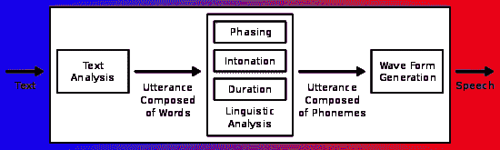
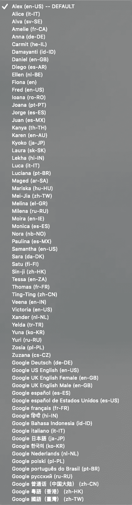
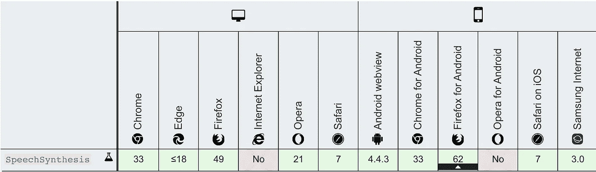
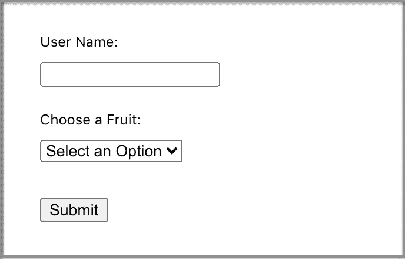
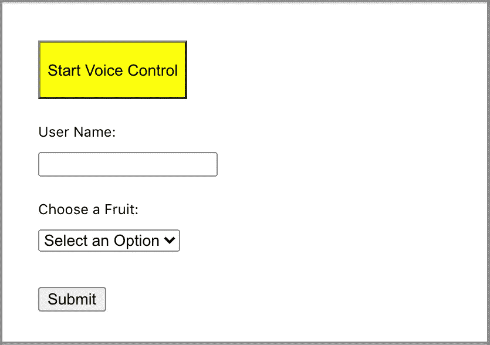

# 在您的 JavaScript 应用程序中执行语音合成

> 原文：<https://betterprogramming.pub/perform-speech-synthesis-in-your-javascript-applications-ac3efa1eb6fa>

## web 语音合成 API 的研究


图片来源:作者

[语音合成](https://en.wikipedia.org/wiki/Speech_synthesis)是人类语音的人工制作。用于此目的的计算机系统称为语音计算机、语音合成器或文本到语音(TTS)系统。语音合成通过连接保存在数据库中的预先录制的单词来组织句子。下图是典型 TTS 系统的概述:



图片来源:维基百科

Web 语音 API 使 web 应用程序能够处理语音数据。它们由用于语音识别和语音合成的 API 组成。在我们之前的文章中，我们介绍了语音识别。在这里，我们将深入研究语音合成，并给出几个将它们结合在一起的例子。

# 语音合成界面

`SpeechSynthesis`是语音服务的控制器接口。它是一个文本到语音的组件，允许程序读出它们的文本内容。

打开浏览器控制台，运行下面的 JavaScript 代码。它需要一行代码来说话。

```
speechSynthesis.speak(new SpeechSynthesisUtterance('Currently it is 3 o\'clock in the afternoon.'));
```

这一行代码中有三点:

*   `speechSynthesis`:返回`[SpeechSynthesis](https://developer.mozilla.org/en-US/docs/Web/API/SpeechSynthesis)`对象的`window`对象的只读属性。
*   `SpeechSynthesisUtterance`:代表一个语音请求，包含内容和其他可配置的设置。
*   `[SpeechSynthesis.speak()](https://developer.mozilla.org/en-US/docs/Web/API/SpeechSynthesis/speak)`:将话语添加到话语队列的功能。新添加的话语将在任何其他话语在它被说出之前排队时被说出。发言队列中的所有发言都可以暂停、继续或取消。

为什么我们需要做一个`SpeechSynthesisUtterance`对象而不是直接取一个字符串？

因为这个语音发声对象可以被配置:

*   `utterance.rate`:设定速度，接受 0.1-10 之间的值。默认值为 1。
*   `utterance.pitch`:设置螺距，接受 0-2 之间的值。默认值为 1。
*   `utterance.volume`:设置音量，接受 0-1 之间的值。默认值为 1。
*   `utterance.lang`:设置语言，接受 [BCP 47 语言标签](https://tools.ietf.org/html/bcp47)的值。默认值为`en-US.`
*   `utterance.text`:设置要说的文本，接受最多 32，767 个字符的字符串。如果没有在构造函数中设置文本，这是设置文本的另一种方法。
*   `utterance.voice`:从预定义列表中设置声音。



这里有一段不同声音的视频剪辑:

这里有一个不同速率和音高的视频剪辑:

您可以在浏览器控制台上尝试这段 JavaScript 代码:

如本页[所述](https://stackoverflow.com/questions/49506716/speechsynthesis-getvoices-returns-empty-array-on-windows)，语音加载是异步执行的。当一个页面被加载时，需要一些时间来填充声音数组。我们可以使用一个拉环来确保声音在分配前被加载。

以下是浏览器兼容性表:



# 互动对话

在我们的上一篇文章中，我们用 web 语音 API 尝试了语音识别。通过在语音识别程序中加入`SpeechSynthesis`，我们就可以组织一次对话，重复程序听到的任何内容。

在第 12 行，`recognition.abort()`代替`recognition.stop()`用于立即停止。

在第 27 行，`recognition.interimResults`被设置为`false`。我们不希望公布中期结果。

在第 34 行，`SpeechSynthesis`重复它识别的任何内容。

以下是示例的视频剪辑:

发生了什么事？为什么节目一直说“今天是星期天”？事情是这样的:

我们说了第一句话，然后程序重复了一遍。然后，它听到了自己的声音，又重复了一遍。

为了进行对话，我们需要非常小心。

在[上一篇文章](https://medium.com/better-programming/perform-speech-recognition-in-your-javascript-applications-91367b0d0)中，我们也用 [annyang](https://github.com/TalAter/annyang) 尝试过语音识别。我们使用了`SpeechSynthesis`来添加[中的回应对话。](https://gist.github.com/JenniferFuBook/7a40b04c9b7e13ea976988bd2c9403fe)

函数表达式`setContent`创建于第 25-28 行。它设置显示文本并朗读文本。

第 30-43 行的命令旨在避免自反馈循环:

1.  它只听定义好的命令(annyang 的特性)。
2.  响应消息不匹配任何命令(开发人员的选择)。

以下是示例的视频剪辑:

# 反应语音项目

有了语音识别和语音合成，我们就可以开始构建 React voice 项目了——程序和用户之间的语音交互。

## Artyom.js

我们提到过, [Artyom](https://github.com/sdkcarlos/artyom.js) 是另一个流行的语音库，建立在 web 语音 API 之上。它处理 JavaScript 语音识别和语音合成库。我们的第一次尝试是 Artyom。

和往常一样，我们从[创建 React 应用](https://medium.com/better-programming/10-fun-facts-about-create-react-app-eb7124aa3785)开始。

```
npx create-react-app my-app
```

然后，安装 Artyom:

```
npm i artyom.js
```

我们可以在`package.json`的`[dependencies](https://medium.com/better-programming/package-jsons-dependencies-in-depth-a1f0637a3129)`中看到新的包:

```
"dependencies": {
  "artyom.js": "^1.0.6"
}
```

用这个包，我们为下面的形式建立一个语音系统:



下面是我们修改过的`src/App.js`中的代码:

在第 5 行，创建了 Artyom 对象。

第 14-24 行构建了`onSubmit`回调。

提交后，第 15 行检查是否有名字。如果没有名字，就写`‘Username is required.’`。提交被中止。

第 18 行检查是否有水果被选中。如果没有选择，它会显示`‘Please select a fruit.’`。提交被中止。

否则，提交数据。程序确认`‘Your data have been submitted. Thank you!’`。

下面是我们修改过的`src/App.css`中的代码:

这是语音交谈项目的视频剪辑:

在我们给程序增加语音控制之前，它工作得很好。它经常失声。不知何故，发言队列被卡住了。调用`speechSynthesis.cancel()`可以解决这个问题，重启浏览器窗口或标签也可以。然而，这对于一个项目来说是不够的。我们在等待这个问题得到解决。

## 安阳

让我们尝试使用 Annyang 和`SpeechSynthesis`构建同一个项目。

安装`annyang.js`:

```
npm i annyang.js
```

我们可以在`package.json`的`[dependencies](https://medium.com/better-programming/package-jsons-dependencies-in-depth-a1f0637a3129)`中看到新的包装:

```
"dependencies": {
  "annyang": "^2.6.1"
}
```

因为我们正在构建一个语音控制和说话系统，所以在 UI 中添加了一个控制按钮，用于启动或停止语音控制。



下面是我们修改过的`src/App.js`中的代码:

在第 5 行，创建了一个函数表达式`say`。

第 8 行引入了一个状态`voiceOn`，用于启动(第 41 行)或停止(第 43 行)语音控制。

第 11 行是控制水果选择的`ref`(第 19、24 和 82 行)。

第 12 行是控制提交按钮的`ref`(第 29 和 92 行)。

第 14-32 行运行一次性`useEffect`来创建 Annyang 中的语音命令。

第 34-45 行运行`useEffect`来处理`voiceOn`状态变化。

第 49-52 行构建了语音开关按钮。

第 59 行将错误响应从`‘Username is required.’`更改为`‘First field is required.’`。我们必须对将要说的话非常小心。否则，程序会根据第 16 行的规则将`required`识别为用户名。

类似地，第 62 行将错误响应从`‘Please select a fruit.’`更改为`‘Second field is required.’`。

正如我们所见，`ref`可以方便地手动触发事件，比如单击提交按钮。然而，手动触发选择的下拉菜单有点棘手。我们使用了一个黑客来设置`choiceRef.current.size`。很管用，虽然风格有点不一样。下拉样式可以通过 CSS 修复，但是我们的建议是使用 [React-Select](https://medium.com/better-programming/react-select-makes-creating-selectable-menus-easy-5d9dffc7e0d9) 。

下面是我们修改过的`src/App.css`中的代码:

这是语音控制和语音通话体验的视频剪辑:

# 结论

之前，我们探讨了语音识别。在本文中，我们讨论了语音合成，并构建了语音控制和说话系统的例子。Chrome 对 web 语音 API 的支持最好。我们所有的例子都是在 Chrome 浏览器上实现和测试的。

有时，语音识别程序可能不理解我们的语言。再说一遍，慢慢地，清楚地。耐心点，网络之声正在成长，一天比一天好。

感谢 Shraddha Chadha 和 Jonathan Ma 让我对这个领域感兴趣。这项工作的一部分包括乔纳森马的贡献。

感谢阅读。我希望这有所帮助。你可以在这里看到我的其他媒体出版物[。](https://medium.com/@jenniferfubook/jennifer-fus-web-development-publications-1a887e4454af)