# 使用降维技术执行 XGBoost、KNN 建模

> 原文：<https://betterprogramming.pub/perform-xgboost-knn-modeling-with-dimension-reduction-technique-9f4ca52feeaf>

## 基于 MNIST 数据集的机器学习算法建模

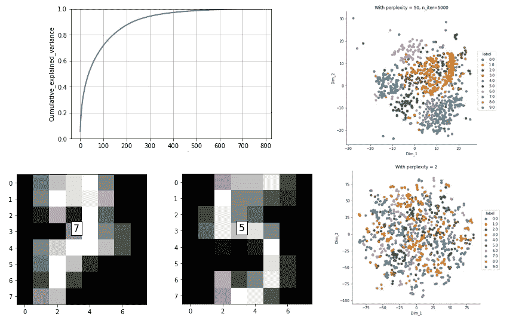

作者图片

在本文中，我们将在 MNIST 数据集(手写数字图像)上建立一个分类机器学习算法模型。数据集包含灰度格式的从 0 到 9 的图像。每个图像的大小为 28 x 28，总共 784 个像素。数据集已经被分成训练和测试 CSV 文件。

你可以从 Kaggle 下载数据集。

# 简要定义

*   [**XGBoost**](https://xgboost.readthedocs.io/en/latest/) **:** 用于实现梯度增强技术下的 ML 算法。梯度推进决策树(GBDT)是一种精确有效的并行树推进，可用于分类和回归问题。
*   **KNN:** 这是一种有监督和无监督的算法。在监督学习中，它可以用于离散和连续标签的分类和回归。在分类问题中，当决策边界不规则时，经常使用这种方法。在这篇[文章](https://pub.towardsai.net/fully-explained-k-nearest-neighbors-with-python-ebbe27f93ba9)中阅读更多关于 KNN 的信息。
*   **SVM:** 这是一种机器学习分类以及基于区分类别的支持向量和超线的回归算法。当数据中有噪音或异常值时，这非常有用。当数据集的维度被很好地定义时，它是非常有效的。你可以在这篇[文章](https://pub.towardsai.net/fully-explained-svm-classification-with-python-eda124997bcd)中了解更多关于 SVM 的信息。
*   **PCA:** 用于减少数据集中的维度或列特征，这样就不会出现多重共线性问题。LDA 和 t-SNE 也用于降维技术。你可以在这篇[文章](https://pub.towardsai.net/principal-component-analysis-in-dimensionality-reduction-with-python-1a613006d531)中找到更多关于 PCA 的信息。

# 用 Python 实现 XGBoost

首先，我们需要导入库。

现在我们将在 pandas `read_csv`函数的帮助下读取训练和测试 CSV 文件。

```
d0 = pd.read_csv('train.csv')l = d0['label']
d = d0.drop("label",axis=1)
```

我们在 *d* 和 *l* 变量中分别分配了特征和标签，即数据和标签。检查数据和标签的形状:

```
print(d.shape)
print(l.shape)#output:
(42000, 784)
(42000,)
```

要打印数字图像:

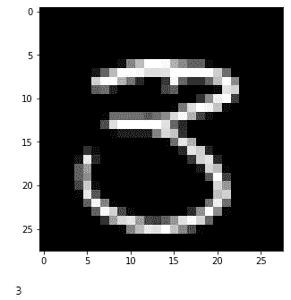

作者图片

我们会从数据和标签中的数据中抽取一个样本，因为数据非常庞大。

计算数据中的位数:

```
count_table = d0.label.value_counts()
count_table = count_table.reset_index().sort_values(by='index')
count_table
```

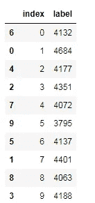

作者图片

用条形图可视化计数:

```
plt.figure(figsize=(10, 5))
sns.barplot(x='index', y='label', data=count_table)
```


作者图片

现在我们将对 XGBoost 算法进行建模:

现在我们将拟合 XGBoost 模型:

```
clftre = XGBClassifier()
clftre.fit(X_train,y_train)
```

检查分类报告:

```
from sklearn.metrics import classification_report
print(classification_report(y_test, clftre.predict(X_test)))
```

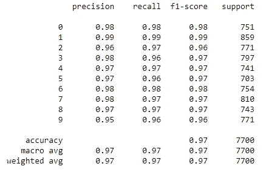

无 PCA 数据的分类报告。(图片由作者提供)

现在，我们将尝试借助 PCA 技术来降低维度:

```
#Using PCA technique
pca = PCA(svd_solver='randomized', random_state=42)
pca.fit(X_train)
```

制作屏幕图—绘制相对于组件数量的累积方差:

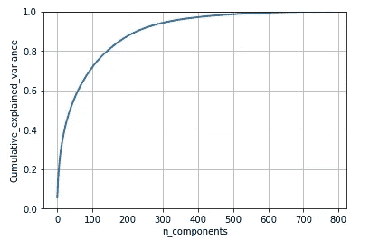

从上面的图中，我们可以得到大约 100 个维度，解释了 70%的差异。

现在我们可以看到特征维数从 784 减少到 100。是时候用 PCA 数据重新训练 XGBoost 模型了。

```
X_train, X_test, y_train, y_test = train_test_split(pca_data, labels, stratify=labels, test_size=0.22, random_state=42)clftre = XGBClassifier()
clftre.fit(X_train,y_train)
```

检查分类报告:

```
print(classification_report(y_test, clftre.predict(X_test)))
```

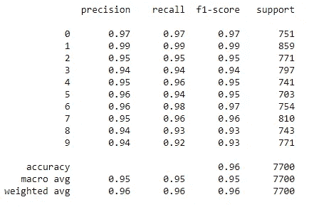

含五氯苯甲醚数据的分类报告(图片由作者提供)

如果我们比较不使用和使用 PCA 的准确度，使用 PCA 数据的准确度降低到 95%。我们选择`n_components` 10 后，准确率下降到 90%。

# XGBoost 的比较

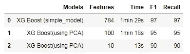

XGBoost(图片由作者提供)对比

使用 t-SNE 技术可视化数据:

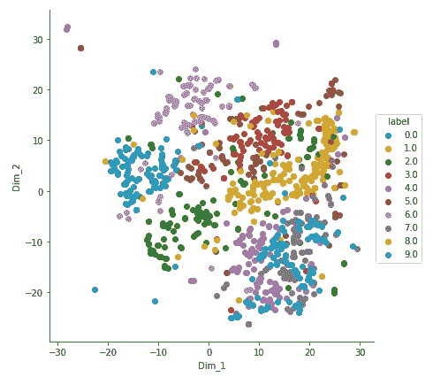

作者图片

在 t-SNE 中使用更多参数进行可视化:

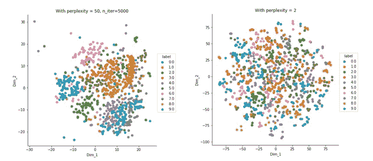

作者图片

# 用 Python 实现 KNN

一切都和 XGBoost 中一样。用一个`for`回路精确地知道 *k* 的值:

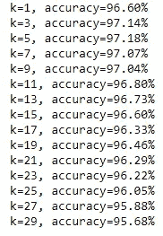

作者图片

现在用 k=5 的值重新训练模型，得到没有 PCA 的分类报告。

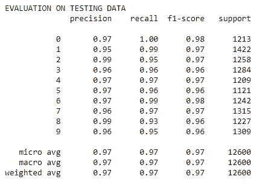

不含五氯苯甲醚的 KNN 分类报告(图片由作者提供)

现在，我们将找到 400 个 PCA 组件的精度。

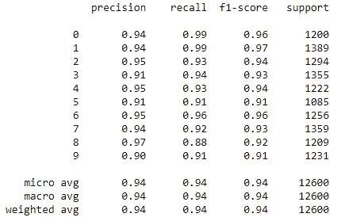

KNN 的五氯苯甲醚分类报告(图片由作者提供)

# 结论**融合**

正如我们比较的那样，当我们使用任何维数约减技术时，准确性总是下降，因为我们在约减过程中丢失了一些信息。

我希望你喜欢这篇文章。通过我的 [LinkedIn](https://www.linkedin.com/in/data-scientist-95040a1ab/) 和 [twitter](https://twitter.com/amitprius) 联系我。

# 推荐文章

[1。NLP —零到英雄与 Python](https://medium.com/towards-artificial-intelligence/nlp-zero-to-hero-with-python-2df6fcebff6e?sk=2231d868766e96b13d1e9d7db6064df1)
2。 [Python 数据结构数据类型和对象](https://medium.com/towards-artificial-intelligence/python-data-structures-data-types-and-objects-244d0a86c3cf?sk=42f4b462499f3fc3a160b21e2c94dba6)3 .[Python 中的异常处理概念](https://pub.towardsai.net/exception-handling-concepts-in-python-4d5116decac3?source=friends_link&sk=a0ed49d9fdeaa67925eac34ecb55ea30)
4。[为什么 LSTM 在深度学习方面比 RNN 更有用？](https://pub.towardsai.net/deep-learning-88e218b74a14?source=friends_link&sk=540bf9088d31859d50dbddab7524ba35)
5。[神经网络:递归神经网络的兴起](https://pub.towardsai.net/neural-networks-the-rise-of-recurrent-neural-networks-df740252da88?source=friends_link&sk=6844935e3de14e478ce00f0b22e419eb)
6。[用 Python](https://medium.com/towards-artificial-intelligence/fully-explained-linear-regression-with-python-fe2b313f32f3?source=friends_link&sk=53c91a2a51347ec2d93f8222c0e06402)
7 全面讲解了线性回归。[用 Python](https://medium.com/towards-artificial-intelligence/fully-explained-logistic-regression-with-python-f4a16413ddcd?source=friends_link&sk=528181f15a44e48ea38fdd9579241a78)
充分解释了 Logistic 回归 8。[concat()、merge()和 join()与 Python](https://pub.towardsai.net/differences-between-concat-merge-and-join-with-python-1a6541abc08d?source=friends_link&sk=3b37b694fb90db16275059ea752fc16a)
的区别 9。[与 Python 的数据角力—第一部分](https://pub.towardsai.net/data-wrangling-with-python-part-1-969e3cc81d69?source=friends_link&sk=9c3649cf20f31a5c9ead51c50c89ba0b)
10。[机器学习中的混淆矩阵](https://medium.com/analytics-vidhya/confusion-matrix-in-machine-learning-91b6e2b3f9af?source=friends_link&sk=11c6531da0bab7b504d518d02746d4cc)