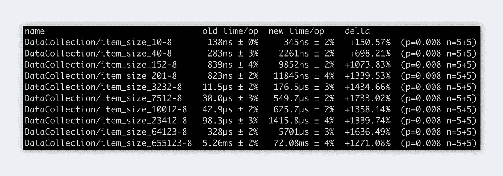
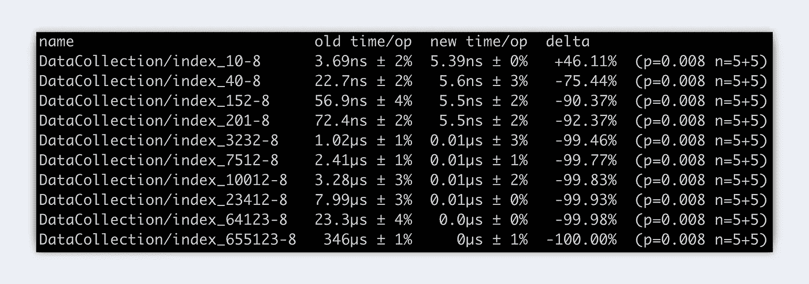

# 与 Go 1.18 中的切片相比，地图对性能的影响

> 原文：<https://betterprogramming.pub/performance-impact-of-maps-compared-to-slices-in-go-1-18-15352fbd6010>

## 使用自定义键会影响性能吗？


地鼠是由[埃贡·厄尔布尔](https://egonelbre.com/)画的。

正如我在第一部分中提到的，您可以使用固定大小和动态大小的数据集。上次我们比较了阵列和存储片之间的性能差异。结果相当惊人。如果你还没看过，我推荐你先看。然而，对于本文来说，这不是强制性的。今天，我们要看地图。或者，更具体地说，我们将检查与切片相比，使用自定义键是否会影响性能。

# 介绍

在第一部分，我们提出了我们的主要问题。我们在上一篇文章中已经回答了第一个。但是，第二个仍然是开放的。

*   ̶s̶̶̶l̶̶̶i̶̶̶c̶̶̶e̶̶̶s̶̶̶̶̶̶v̶̶̶s̶̶̶.̶̶̶ ̶̶̶A̶̶̶r̶̶̶r̶̶̶a̶̶̶y̶̶̶s̶̶̶.̶̶̶̶̶̶w̶̶̶h̶̶̶i̶̶̶c̶̶̶h̶̶̶̶̶̶p̶e̶r̶f̶o̶r̶m̶s̶̶̶̶b̶e̶t̶t̶e̶r̶？̶̶̶
*   切片 vs 贴图！使用自定义键会影响性能吗？

# 地图与切片

我为每种情况创建了两个基准测试，以获得更详细的视图。一个用于追加值，一个用于检索其中的一些值。我们现在所做的与第一部分非常相似。我们运行基准测试，将结果保存到一个文件中，并与 benchstat 进行比较。下面你可以看到它们是如何构成的。

## 地图基准测试

## 切片基准测试

**丰富数据采集:**因此，我们有两个功能。首先，根据传递给函数的数字，我在我的地图/切片上附加了许多数字。第二个是我实际的基准测试。在这里，我调用第一个函数，并测试用所有数字填充我们的地图/切片需要多长时间。

**从数据集合中检索值:**在我们的第二个基准测试中，我们希望从切片/映射中检索值。因此，正如您在上面看到的，我们有一个数组，其中包含了我们想要检索的所有值。现在我们迭代这个数组，并测量从两个不同的数据集中检索值所需的时间。对于我们的切片，我们迭代我们的数据集，直到找到我们的值。对于我们的地图，我们只需要通过特定的键来访问我们的值。

# 比较

现在最激动人心的部分来了。我们运行、存储和比较基准。在上一篇文章中，我们看到了数组与切片之间的显著差异。但这次会一样吗？我们会看到的。首先，我们需要运行基准测试。为此，Go 为我们提供了一个非常简单的开箱即用的命令。

```
go test -bench="BenchmarkName" -run=^# -count=x | tee filename.txt
```

## 丰富数据集

存储结果后，我们可以相互比较。我们从我们的基准开始，在那里我们附加新的值。

```
benchstat slice.txt map.txt
```

你可能已经预料到地图会比切片版本慢很多。但是你意识到区别了吗？如下图所示。对于小数据集来说，它相对来说很小。但是随着数字越来越大，差距会迅速扩大。

在我们的例子中，这种差异在大约 **1630%** 的峰值。当然，我运行了几次测试，结果几乎相同。



基准-丰富-地图与切片

## 从数据集中检索值

现在是我们第二次基准测试的时候了。请记住，在这种情况下，我们从地图/切片中检索值。下面我们看到的可能是你们大多数人已经预料到的。我们的地图复杂度为 O(1)，而我们的切片复杂度为 O(n)。这意味着，在这种情况下，映射总是花费相同的时间，而从我们的切片中检索值的时间取决于需要首先迭代的数字的数量。



基准—检索—映射与切片

# 外卖食品

我知道。往往使用贴图或者切片只是必要或者更干净。但是如果你有选择的话，要意识到性能差异。一般来说:*“你的数据集越大，在添加或检索新值时性能差异就越大。”*

# 最后的想法

这是“固定大小与动态大小的数据收集”的第二部分我希望这个比较是有趣的，并且你学到了一些新的东西。如果你有什么要提的或者有什么问题，如果你能在评论里留下来，那就太好了。回头见。

**附言**本文是我当前系列的一部分。在接下来的时间里，我将介绍各种通用的助手函数、有趣的基准和有用的特性。

如果你和我一样兴奋，敬请期待！