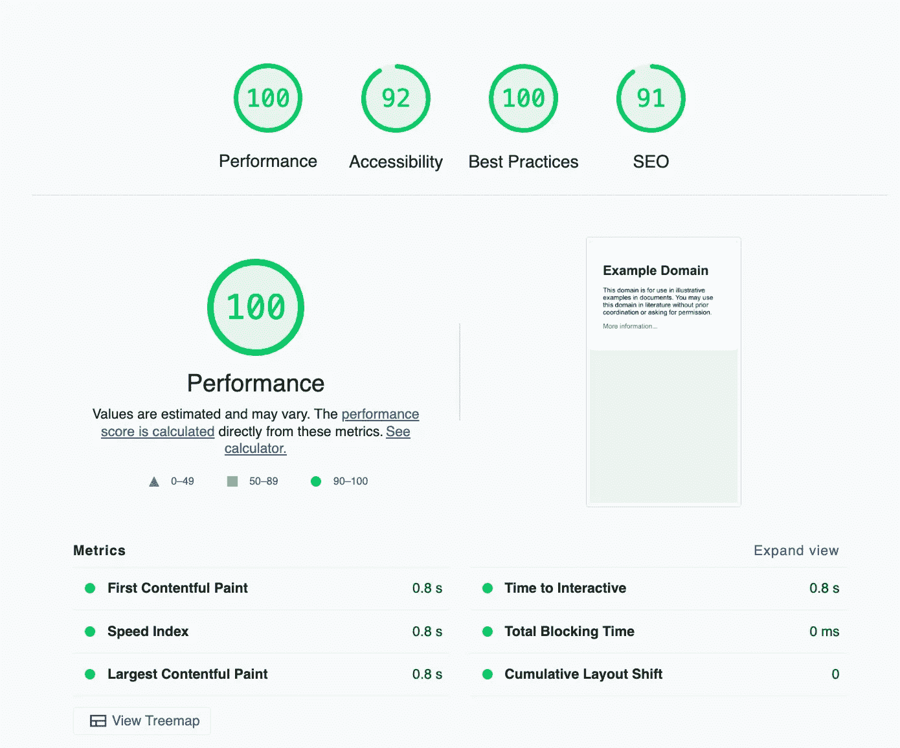
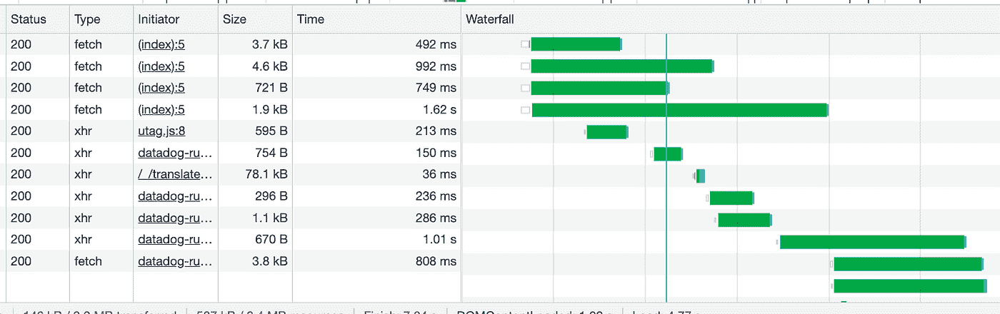

# 你的 JavaScript 应用真的够快吗？

> 原文：<https://betterprogramming.pub/performance-improvement-of-full-stack-javascript-applications-2b5f631a562c>

## 如何衡量应用程序性能

[Kai Dahms](https://unsplash.com/@dilucidus?utm_source=medium&utm_medium=referral) 在 [Unsplash](https://unsplash.com?utm_source=medium&utm_medium=referral) 上的照片

你知道你的应用是否足够快吗？更重要的是，你知道你的应用程序中最慢的部分是什么，或者如何找到它吗？

这种结构化的性能测量方法可以帮助您改善用户体验。

# 测量什么以及如何测量

现代 web 应用程序由许多层组成，从数据库到遗留系统、现代前端、认证系统，有时还有各种各样的微服务。

如果用户体验很慢，我们知道问题出在这许多层中的一层。知道从哪里开始让你的应用程序快得惊人可能很复杂。在本文中，我们将探讨一些测量和监控的方法。你应该牢记的一个教训是记录你的绩效指标。

负责任是好的，这也是学习过程的一部分，看看什么有效。在接下来的文章中，我将介绍一些处理我们可能遇到的常见性能问题的方法。

# 衡量以用户为中心的绩效。

2018 年，谷歌开始推动开发者的性能意识。当然，10 年前，随着 2008 年 Chrome 浏览器和 javascript V8 引擎的推出，他们开始提高网络速度。

但在 2018 年的谷歌 I/O 大会上，他们为开发者推出了一系列工具。他们在 2018 年推出了 [http://web.dev](http://web.dev) 。2020 年，他们推出了 [Web Vitals](https://blog.chromium.org/2020/05/introducing-web-vitals-essential-metrics.html) ，这是一种衡量用户体验的客观方法，涉及页面内容的加载体验、交互性和视觉稳定性。它是一个度量的集合，也可以作为一个[浏览器包](https://www.npmjs.com/package/web-vitals)来测量和存储这些度量。

网络的核心要素是:

*   LCP 或 maximum contentful paint 衡量应用程序从服务器加载的速度。该值应在 2.5 秒内。
*   FID 或首次输入延迟测量页面上是否有任何延迟。用户能无延迟地与屏幕交互吗？
*   CLS 或累积布局偏移显示了页面的稳定性。页面上的元素是在移动位置还是改变大小？

 [## 我如何在 Node.js 中编写一个闪电般快速的图像服务器

### 利用 Node.js、C 代码和数据流构建闪电般快速的图像服务器

blog.bitsrc.io](https://blog.bitsrc.io/how-i-wrote-a-lightning-fast-image-server-in-node-js-f2402091e05c) 

Lighthouse 是现代 WebKit 浏览器免费提供的工具，是衡量性能和获得改进技巧的好方法。

它从以用户为中心的角度执行一系列性能和内容测量。Lighthouse 也可以从[https://web.dev/measure](https://web.dev/measure)运行，以获取关于您网站的性能数据，或者可以使用[独立 CLI 版本](https://web.dev/lighthouse-ci/)集成到连续测量系统中。

http://example.com 得到了完美的灯塔分数

# 总应用程序大小

尺寸很重要，尤其是对于移动设备。您的应用程序的大小大约超过了您的主 JavaScript 文件和加载它所花费的时间。它还与 CSS 文件、分析库、广告以及你使用的任何其他营销或监控工具的大小有关。

需要加载 JavaScript 文件，但是设备也需要将它们从文本编译成机器代码。虽然 V8 引擎非常快，而且经过优化，但移动设备的平均成本不到 200 美元。

如果您在顶级设备上没有发现任何解析和编译延迟，那么对于拥有廉价手机的人来说，体验可能会非常不同。确保总是在真实设备上测试您的应用程序。

我们应该注意我们的应用程序的总大小。我们面对的是一个加载 1Mb 的快速灵活的<100Kb JavaScript app, or do we have a behemoth that requires >吗？获取应用程序大小的方法有很多种，但不幸的是，我们不得不混合使用它们:

*   在开发者工具中查看从网络选项卡下载的总字节数。记下请求总数和总大小。
*   查看 Webpack 构建脚本的输出文件。安装`[webpackBundleAnalyzer](https://www.npmjs.com/package/webpack-bundle-analyzer)`以获得 JavaScript 输出的树形视图
*   lighthouse 报告有一个*视图树形图*按钮，显示所有 javascript 文件、所有包，甚至启动阶段使用的代码百分比的书签概述。

# 浏览器请求/性能洞察

现在我们已经对应用程序的性能有了一个基本的概念，是时候更深入地挖掘一下，找出瓶颈在哪里了。

打开开发者工具中的网络选项卡，在我们正在查看的页面上获得请求和请求定时的概述。

我们对以下指标最感兴趣:

*   等待或首字节时间度量
*   内容下载时间
*   当请求相对于初始页面加载开始时

浏览器只能在收到初始 HTML 时开始显示任何内容。装载这个需要多长时间？如果等待时间很长，我们应该看看我们的服务器。服务器在发送 HTML 之前是否执行身份验证？服务器是否呈现页面，但必须等待缓慢的后端服务？对于初始页面负载所依赖的每个请求，我们应该以非常短的等待时间为目标。

如果内容下载时间很长，这意味着请求的内容太大。想象一下在慢速移动网络上会有多糟糕。我们真的需要那么多数据吗？还是把数据分成更小的请求，让我们可以在一段时间内分散处理？

Chrome 浏览器中的瀑布图显示了请求何时开始以及需要多长时间。

获取/数据请求的相对开始时间为我们提供了关于请求之间依赖关系的信息。第一个数据请求是否需要等待 2 秒才能加载整个应用程序？是只能在请求 B 完成后才开始请求 A，还是可以并行完成？这是为应用程序中的数据请求创建序列图的好时机。

web 开发人员工具中的 performance insights 选项卡对应用程序中的计时进行了更广泛的概述。它将 HTTP 请求与 web 重要信息和屏幕截图结合起来，因此您可以在一个地方获得完整的概述。它有类似于 Lighthouse 的可操作建议来提高性能。缺点是解释起来有些复杂和有挑战性。

如果你对完整的用户旅程比对初始加载时间更感兴趣，chromium 浏览器有记录器特性。它允许您记录和重放用户操作，然后可以将其导出到 performance insights 工具。如果你想提高你在复杂场景中的表现，这可能是一个不错的选择。我希望将来能写一篇关于这个主题的文章。

# 测量和监控您的微服务

我们喜欢看到瞬间加载的服务。但是，如果在前面的步骤中，我们看到数据端点的性能低于光速，该怎么办呢？我们如何度量和理解 Node.js 服务的性能？

假设我们发现某个请求很容易就需要 1000 毫秒，我们认为这太长了。如果对我们的应用程序的理解有限，我们应该先做一个架构图，并回答以下问题。

服务是做什么的？它连接到哪些服务或数据库？它服务于哪些数据，有多少数据？

在我们的 Node.js 服务中有三种主要的度量类型。我们可以通过`console.time()`使用微基准测试，使用基准测试工具测量端到端性能，如*[*wrk*](https://github.com/wg/wrk)*auto cannon、*或更复杂的基于场景的工具，如[*cannon*](https://www.npmjs.com/package/artillery)或 JMeter。我们运行的 Node.js 服务的类型在一定程度上决定了基准测试的类型和有用性。如果我们有一个完全弹性的设置，比如 AWS lambdas，我们可能不会对我们的服务进行基准测试，因为它们只会不断扩展。在开始之前，我们必须考虑我们的方法。*

*在 JavaScript 中很容易使用`console.time(‘myMeasurement’)`和`console.timeEnd(‘myMeasurement’)`。这些基本上运行一个微基准，并输出一个日志条目。这使我们能够测量应用程序的特定部分，可能是完成身份验证所需的时间、数据库请求的速度，或者密集计算的阻塞时间。在开发过程中，我们可以使用这些微基准来优化代码。*

*更高级的 web API 可用于定制测量和报告。性能 API 记录在它自己的 [MDN 页面](https://developer.mozilla.org/en-US/docs/Web/API/Performance_API)上。当我们想进一步优化时，我们不得不去别处寻找。当我们只运行几次计时器时，它不会给出有统计学意义的结果。像[https://jsbench.me/](https://jsbench.me/)或者[基准 NPM 包](https://www.npmjs.com/package/benchmark)这样的服务都适合于对(同步)代码的小段进行基准测试。*

*Datadog、X-Ray 或 Newrelic 等服务器监控服务(另见[这份 2022 年的 Gartner 报告](https://www.gartner.com/reviews/market/it-infrastructure-monitoring-tools))提供了总请求时间以及每个上游 HTTP 请求的计时的概览。这些服务显示服务请求的平均持续时间，但也包括火焰图。*

*火焰图显示了应用程序流的分层表示。每个操作都有一个显示深度和持续时间的堆栈。这使您能够真正理解为什么长时间运行的请求需要很长时间。*

*Node.js 服务的应用程序架构应该相当简单和标准。如果您坚持最佳实践，您应该不会遇到任何内存泄漏或大量内存使用问题。如果遇到这些问题，最好的方法是使用 Node.js 调试器并分析应用程序。*

*分析超出了本文的范围，但是要获得更深入的信息，请参阅本文“[node . js 应用程序的简单分析](https://nodejs.org/en/docs/guides/simple-profiling/)”。内存泄漏大多是由开发人员重新发明轮子的非常规设置引起的，重写通常是最好的补救措施。*

# *监控您的数据库*

*无论您使用哪种数据库，Postgres、MySQL、DynamoDB、graph DB 或其他什么，您都必须确保有一些监控。大多数情况下，这由您的云提供商负责。这将是另一篇文章的好材料。*

*当您的数据库高度规范化并使用非常复杂的查询或包含大量数据时，您必须确保单个查询不是瓶颈。针对查询运行微基准测试，看看是否可以与第三方监控服务集成。*

# *下一步是什么*

*在本系列的下一篇文章中，我们将重点解决最常见的性能问题。*

*感谢您的阅读，希望您对这篇文章感兴趣。我很乐意帮助团队解决围绕 Javascript 和 Node.js 的性能和架构问题，如果你想了解更多，可以在这里预约[。如果你正在寻找教练或指导，使用相同的链接。](https://calendly.com/laurent-zuijdwijk/15min)*

## *资源*

*   *[网络表演资源](https://blog.chromium.org/2020/05/introducing-web-vitals-essential-metrics.html)*
*   *[网络生命体征介绍](https://blog.chromium.org/2020/05/introducing-web-vitals-essential-metrics.html)*
*   *[web-vitals NPM 套装](https://www.npmjs.com/package/web-vitals)*
*   *[灯塔网络版](https://web.dev/measure/)*
*   *[灯塔 CLI 版本](https://web.dev/lighthouse-ci/)*
*   *[Webpack 捆绑包分析器包](https://www.npmjs.com/package/webpack-bundle-analyzer)*
*   *[V8 博客文章，javascript 的成本](https://v8.dev/blog/cost-of-javascript-2019)*
*   *[Plow github repo](github.com/six-ddc/plow)*
*   *[Wrk github repo](https://github.com/wg/wrk)*
*   *[火炮 NPM 包](https://www.npmjs.com/package/artillery)*
*   *[MDN 性能 API 页面](https://developer.mozilla.org/en-US/docs/Web/API/Performance_API)*
*   *[jsbench 基准测试工具](https://jsbench.me/)*
*   *[benchmark.js npm 包](https://www.npmjs.com/package/benchmark)*
*   *[Gartner 基础设施监控工具概述](https://www.gartner.com/reviews/market/it-infrastructure-monitoring-tools)*
*   *[Node.js 剖析指南](https://nodejs.org/en/docs/guides/simple-profiling/)*