# 使用 React 挂钩和备忘录进行性能优化

> 原文：<https://betterprogramming.pub/performance-optimization-with-react-hooks-and-memo-e3186f7ff9ab>

## 利用功能组件提高应用程序性能

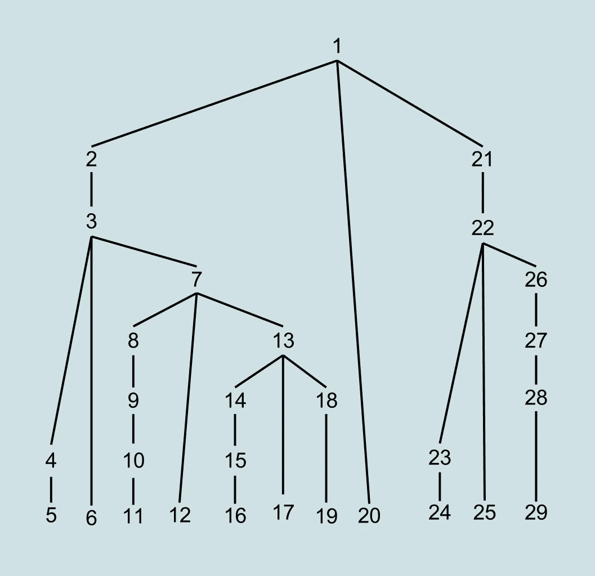

由 [DBSand](https://en.wikipedia.org/w/index.php?title=User:DBSand&action=edit&redlink=1) 在[维基共享资源](https://en.wikipedia.org/wiki/Bottom-up_parsing#/media/File:Bottom-up_Parse_Tree_Order.svg)上的插图

构建一个有用的应用程序是一回事，让应用程序平稳快速地加载是完全不同的另一回事——而且，可以说，同样重要。

有许多方法可以优化 React 中应用程序以提高其性能。

在我们开始研究如何通过构建一个简单的应用程序并实现 React Memo 中包含的记忆技术来做到这一点之前，让我们回顾一下优化的过程。

*优化*是根据初始模型衡量时最有效的过程。如果我们在没有初始测量进行比较的情况下，通过实施 React Memo 等工具过度抢先进行优化，我们就不再为自己提供所需的上下文来正确评估我们如何、何时以及在何处进行改进，从而无法提供正确的优化。

耐心和让流程流动是成功优化和平稳运行应用程序的关键，年轻的学徒。

因此，对我们来说，比较性能测量的差异是很重要的。

在下面的例子中，我们将看一个利用 React 钩子的简单应用程序，并测量使用和不使用 React Memo 时的性能差异。

请随意编码，甚至跟随底部的视频演示，或者只是观察下面文档中的差异。但首先，让我们进一步定义 React Memo。

# 反应备忘录与纯组件

React Memo 是一个高阶组件，它包装了功能组件，并通过记忆它们来提高它们的性能。

从这个意义上说，`React.PureComponent` 为基于类的组件提供的是功能组件的解决方案。

相比之下，每个功能都只是简单地介绍给它们的组件，如下所示:

```
// PureComponent Class Based:
class Count extends React.PureComponent { }
```

对比:

```
// React.Memo Functional Component:
const App = ({}) => {}export default React.memo(App)
```

# React Memo 如何工作

React Memo 通过仅在属性发生变化时渲染其包装组件来提高性能。但是，需要注意的是，默认情况下，React Memo 只会浅浅地比较 props 对象中的复杂对象。

我们可以通过查看生命周期方法`shouldComponentUpdate(nextProps, nextState)`的一个示例来进一步比较这是如何工作的。

我们可以利用`shouldComponentUpdate`来决定一个组件是否应该在渲染时更新，这是基于检查正在更新的`nextProps`是否等于当前的道具。

虽然这个实现实际上和 React Memo 的工作原理相似，但是官方的 reactor 文档建议不要使用它来防止重新渲染——因为它可能会导致错误。相反，他们建议使用旨在更全面的功能，确保跳过的潜在必要步骤更少。

# 反应应用示例

现在，让我们检查一个基本的应用程序，并使用 React Dev 工具在使用`React.Memo`进行表情符号化之前和之后测量其性能。

假设我们有一个应用程序，它有两个基本组件:一个按钮，每次点击都会连续增加一个；一个天气组件，显示一个城市和该城市的天气。

首先，用下面的代码检查一个包含我们的`Weather`子组件的 JavaScript 文件:

我们的简单功能组件以被破坏的`weather`属性为道具，返回两个`p`标签，显示访问`city`和`temperature`的进一步点标记。

我们在即将到来的测试中加入了一个`console.log(‘Render’)`来演示我们的应用程序渲染天气应用程序的次数。

很简单。好了，现在观察另一个 JavaScript 文件，它包含我们的按钮应用程序并保存我们的父状态，它将道具传递给我们的子`Weather`组件。我们将实现反作用钩子来存储我们的计数器并设置增量。

现在，当我们加载开发服务器并编译应用程序时，我们会显示一个按钮和一个`0`——以及`Miami`的城市和它在`80F`的温度。

我们还在 Chrome DevTools 控制台中注意到，我们从我们的`Weather`组件接收渲染的初始`console.log`。

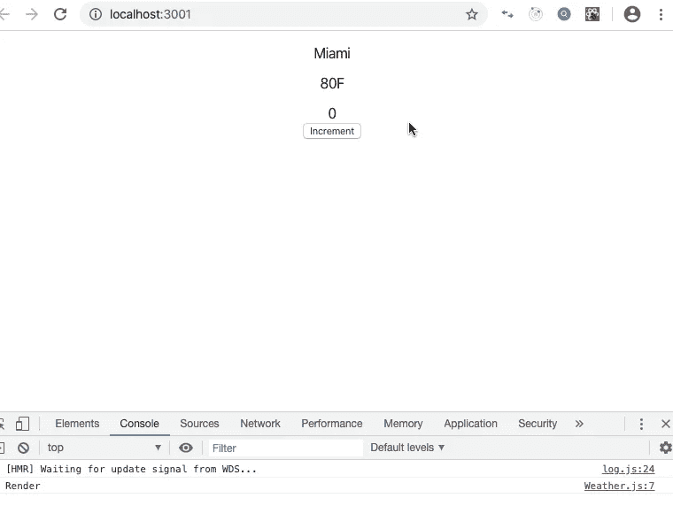

每当我们单击增量按钮时，此处的问题就会变得明显。

单击增量按钮七次将返回以下结果:

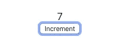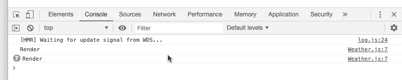

# 实施反应。备忘录

虽然我们的按钮正在工作，我们的状态也在相应地更新和显示，但是我们的控制台现在显示我们的`Weather`组件已经被渲染了七次。

这些都是无用的渲染发生在我们每次点击按钮的时候，因为我们的`Weather`组件的属性不需要在我们每次改变按钮状态的时候都改变，这就要花费我们额外的不必要的计算。

那么，我们如何解决这个问题呢？好吧，你猜对了……`React.memo`来解救！

回到我们的天气应用程序，我们可以将`React.memo`包装在导出的`Weather`周围，就像这样:

```
export default React.memo(Weather)
```

就这么简单。现在，当我们刷新应用程序并再次单击增量按钮七次时。我们会注意到下面的重要变化。

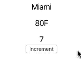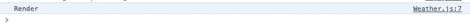

虽然我们的按钮已经被渲染了七次，但是我们的`Weather`组件只被渲染了一次。通过成功实现记忆化，我们有效地增强了应用程序的性能。

让我们进一步展示我们使用 React 开发工具进行优化的测量差异。

# React 开发人员工具分析器

如果你还没有安装 React 开发者工具，你可以点击这里提供的链接。

点击右上角的蓝色按钮，将扩展添加到 Chrome。

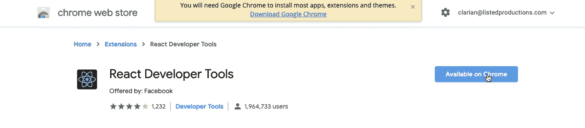

一旦添加了扩展，您现在就已经将 React 组件(包括 Profiler)添加到控制台开发人员工具带上了。

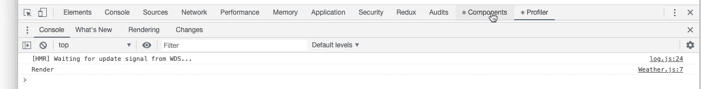

Components 选项将打开一个选项卡，我们可以在其中检查 React 应用程序中呈现在浏览器上的各个组件，就像 Elements 选项卡检查元素一样。

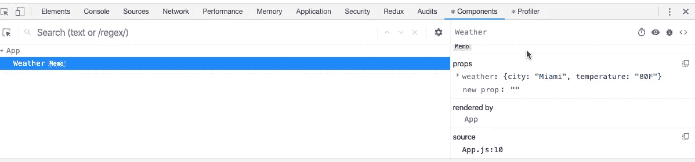

我们的`Weather`组件现在在应用程序中向我们显示天气的属性。太好了。然而，出于演示的目的，让我们转到分析器来测量我们的渲染时间的性能。

让我们在浏览器中刷新应用程序。然后，在我们的 Profiler 选项卡中，如果我们单击 record circle，我们现在正在记录组件的渲染时间。让我们点击增量按钮六次，然后再次点击记录按钮来记录我们的测量值。

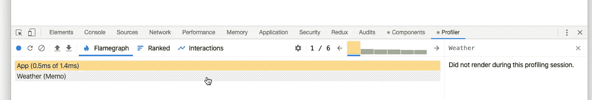

我们现在看到我们的`Weather`组件，包装在`(Memo)`中，显示状态为“在概要文件会话期间没有呈现”

现在，让我们再次重复同样的过程——只是这一次，我们将从子组件`Weather`中移除`React.memo`高阶组件。

我们现在将看到我们的`Weather`组件在每个应用程序渲染中的六次新渲染，平均每次渲染多一毫秒。

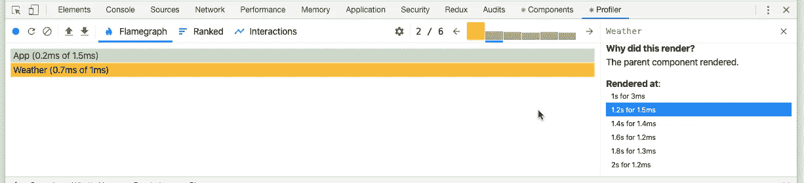

通过用 React Developer Tools GUI 测量我们的渲染差异，我们能够更深入地看到不同的结果。我们保留无用的渲染，利用`React.memo`进入我们的应用程序。

# 结论

通过首先构建我们的应用程序，而不是先发制人地应用优化，而是有一个初始比较值，我们能够用我们自己的测试实现来测量我们的性能——以及引入有用的扩展，如 React 开发人员工具。

有了这些结果，我们就可以检查我们的应用程序的性能，并设计增强和优化的方法和功能。对照之前的结果进行测量，将引导我们更深入地研究我们的应用，并找到我们优化所需的最佳解决方案。

如需更多资源，请查看 React Dev 2020 上的性能优化部分，该部分激发了我将在下面链接的文档。

要了解更多关于记忆化的信息，你可以看看我之前写的一篇文章和例子，也是关于用 Javascript 回顾记忆化的。

最后，我还将链接到一个视频教程以及源代码。

仅此而已。感谢您查看这篇文章，我希望您能从中得到一些帮助！

## 资源

*   [视频教程](https://www.youtube.com/watch?v=MQSav554YOQ&feature=youtu.be)
*   [源代码](https://github.com/01Clarian/react-memo-example)
*   [2020 年的完全网络开发者:零到精通](https://www.udemy.com/course/the-complete-web-developer-zero-to-mastery/)
*   [“JavaScript 记忆化和昂贵的代码”](http://JavaScript Memoization and Expensive Code)