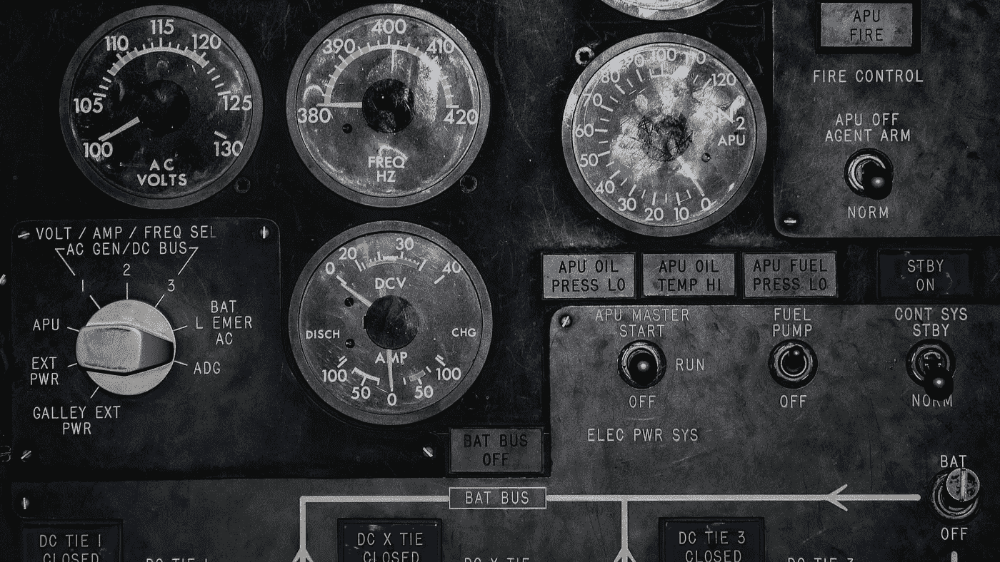
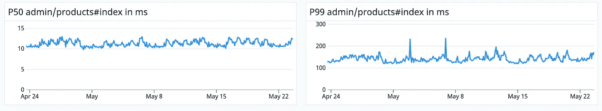
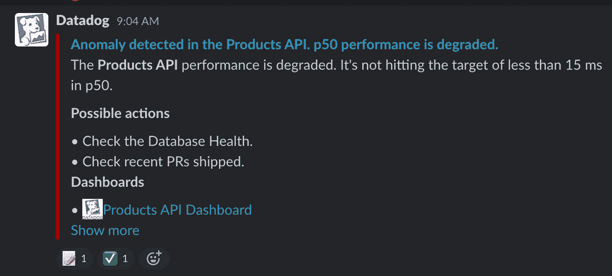
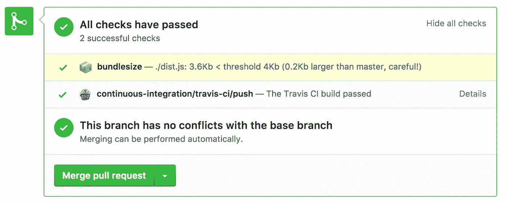

# 软件工程中的性能测量

> 原文：<https://betterprogramming.pub/performance-part-iii-measuring-performance-improvement-301985484855>

## 总是添加措施来防止系统降级

在我以前的文章中，我描述了两种类型的性能优化:[宏和微优化](https://medium.com/p/128269484932)和[提高性能所需的 6 个步骤](https://medium.com/p/7d5346313807)。该过程中的一个基本步骤是防止将来发生性能下降。在本帖中，我们将深入探讨这一重要步骤。

您是否经常看到性能显著提高，但几个月或几年后，性能却比优化前更差？

这个团队通过实现一个新的缓存系统来改进系统。该团队将平均延迟从 40 毫秒提高到 20 毫秒，并添加了出色的仪表盘。两年后，延迟为 50 毫秒。是什么阻止了这种情况的发生？团队知道业绩比两年前差吗？他们知道添加的修复吗？大概不会。该团队可能是一个全新的团队，或者更糟，可能没有该区域的所有者。

这是一个普遍的问题。作为开发人员，我们必须确保我们添加的措施不会降低性能。在这篇文章中，你会学到我们可以采取的措施来防止这种情况。我将使用 Ruby 中的例子，但这同样适用于大多数语言。

# **衡量业绩**

开发者应该知道区域/软件有多快(延迟)以及它能支持多少流量(吞吐量)。这可能需要监控跟踪应用程序，如 Datadog、Rollbar、Splunk 或 Sentry。

图一。产品 API 延迟的数据狗仪表板示例。

上图显示了个人项目 API 延迟的数据狗仪表板，特别是 *p50* 和 *p95* 。记住[千万不要用平均值；使用百分点](https://medium.com/@magalhini/stop-using-averages-use-percentiles-instead-621598e6b53f)。

# **添加监视器和警报**

仪表板是必不可少的，但有了显示器，它变得更有价值。当性能超过阈值或出现异常时，警报会通知开发人员。它可以通过电子邮件或 slack 提醒开发人员，如下例所示:

图二。Datadog 警报已发送至 Slack 示例。

**向所有仪表板添加基线**，以便开发人员了解预期的延迟窗口。

# **测试是关键**

每个性能优化变化都应该有测试。为了说明这一点，我们来看一些最常见的性能变化示例，以及我们可以采取的防止性能下降的措施:

性能变化:减少了热路径函数的对象分配。

**测试:**添加对对象的功能分配进行计数的测试，并将其与阈值进行比较。许多库提供测试助手。

断言分配数量低于阈值的函数 *memory_allocations* 的示例。

性能变化:减少了数据库查询的执行次数。

**测试:**添加断言预期查询数量或查询本身的测试(小心[古怪测试](https://www.techtarget.com/whatis/definition/flaky-test)！)

断言数据库查询执行次数的函数示例。

性能变化:使用了更好的数据库查询(例如，添加了一个[数据库索引提示)](https://dev.mysql.com/doc/refman/8.0/en/index-hints.html)。

**测试:**添加断言所执行查询的测试。

使用断言 MySQL 数据库提示的测试示例。

性能变化:通过批处理查询减少了对缓存的调用次数

**测试:**添加测试，证明在单个缓存调用中使用多个键调用缓存。

执行 fetch_multi cache 调用而不是单次提取的函数示例。

性能变化:通过引入缓存减少了数据库查询的数量。

测试:添加测试以证明何时存在缓存命中和/或未命中。

使用缓存而不是关系数据库的函数示例

性能变化:不要通过将负载推给后台作业来阻塞主线程。

**Test:** 添加一个单元测试，检查预期的任务是否排队。

性能变化:减少前端[捆绑尺寸](https://blog.logrocket.com/slimming-down-your-bundle-size/):

**测试:**添加测量包大小的工具，并添加当大小大于基线时失败的测试。

使用 [Bundlesize](https://github.com/siddharthkp/bundlesize) 库在 Github 上检查包大小。

性能变化:(前端)通过加载更少的数据/UI 和引用查询来减少页面负载:

**测试:**添加单元测试，检查加载的 DOM 中的数据和对象。

性能变化:通过添加更多缓存提高了吞吐量:

**测试:**定期进行压力测试，确保测试数量与设定的基线相符。

# 结论

始终添加措施以防止系统降级。确保您拥有具有预期性能的仪表板和正确的工具，并考虑添加测试。

实施这些策略将节省您的时间，并确保永远达到绩效目标或相应地调整基线。如果没有防止性能下降的工具和措施，性能改进是不完整的。

感谢亚历克斯·瓦特和 T2 审阅这篇文章。