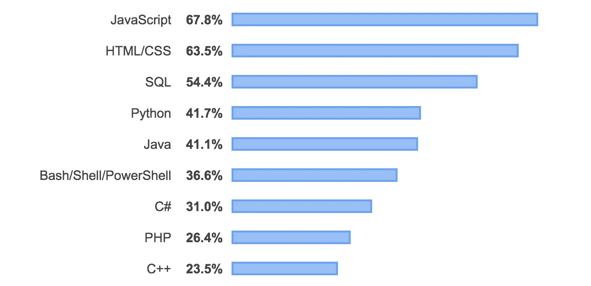
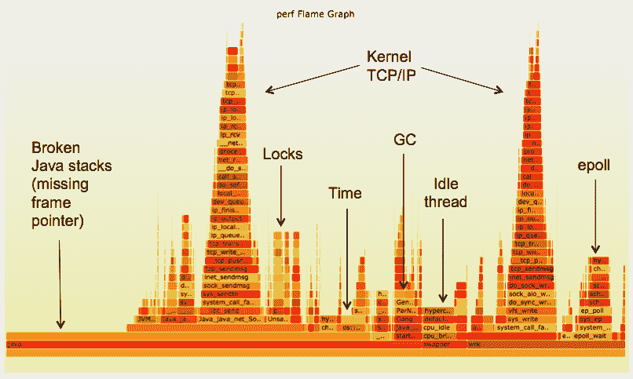
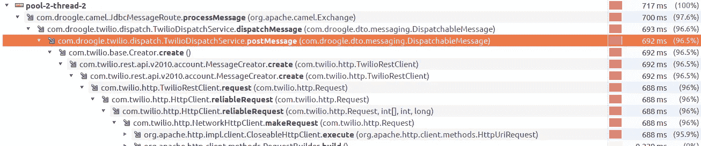

# 开发期间的性能分析

> 原文：<https://betterprogramming.pub/performance-profiling-during-your-development-workflow-ebff78afb71c>

## 用 Java VisualVM 抛弃关于性能的主观性

照片由[像素](https://www.pexels.com/)上的 [Hitesh Choudhary](https://www.pexels.com/@hiteshchoudhary) 拍摄

性能分析不仅仅是运营团队在生产环境中监控应用程序的专有活动。在我看来，*这是一项应该成为每个优秀软件开发者/工程师开发工作流程的一部分的技能*。

这不仅仅是为了排除故障——在故障开始之前，积极主动地看一看发动机罩(或美国的引擎盖)下面。

我要问你两个问题:

*   您想成为提交两行代码使生产陷入瘫痪并停止的团队成员吗？

或者:

*   你想成为**在第一时间拯救团队**合并缺陷代码的光荣团队成员吗？

除非你讨厌你的团队和你的公司，我很确定你想成为后一种团队成员。这就是我整理这个快速指南的原因，这样你就可以开始将性能分析融入到你所做的每一件事情中。

“打住，你为什么只说 Java？”

有一点需要注意——显然，我知道还有其他编程语言存在:

[Stack Overflow Developer Survey 2019](https://insights.stackoverflow.com/survey/2019)—最流行的编程、脚本和标记语言

我选择关注 Java 应用程序概要分析有几个原因。这主要是因为我不想让这篇文章太长——为每一种语言描述一个分析工具需要很长时间。但是我也选择关注 Java，因为它仍然是核心后端服务非常流行的选择。

这并不意味着您不应该关注您前端的性能，事实上，[您完全应该关注。](https://codeburst.io/the-front-end-performance-checklist-speeds-up-your-web-developments-b68e1c7a0276)

# 什么是剖析？

概要分析(就软件应用程序而言)是在不同的运行级别监控应用程序的行为，以了解和查看时间在哪里被花费，资源在哪里被利用。

来源:[网飞科技博客](https://medium.com/netflix-techblog/java-in-flames-e763b3d32166)

为了实现这一点，大多数分析通常使用某种连接到您的应用程序和*工具*您的方法的代理。

这种方法的插装/标记允许分析器确定一个方法何时被执行，并且还可以查看该方法做一件特定的事情需要多长时间。

你可以在[dispatch message方法中:](https://medium.com/u/e2798c415ca9#</strong><em class=)

[这里我用](https://medium.com/u/e2798c415ca9#</strong><em class=) [Twilio 的官方 Java SDK](https://www.twilio.com/docs/libraries/java) 打一个 REST 回电给 Twilio 发送短信。

老实说，这并不是特别慢的性能，所以这里没有太多的性能优化空间。

不过，这个例子强调了一件事，那就是我们可以用剖析进行多精细的分析。**我们可以** **用它来发现性能瓶颈，甚至深入到我们项目的依赖关系中**。

# 摘要

我希望你发现这是有用的！

开始进行概要分析很容易，并且完全值得花力气去掌握。

这项技术提供的是**客观的性能数据。**给定足够多的相似测试运行，我们可以客观地推断出应用程序代码中较慢的部分驻留在哪里*(而不是猜测、辩论或意见)。*

尝试一下，在提出拉取请求之前，考虑将性能分析作为开发工作流中的一个步骤来实现！

感谢阅读！