# 性能测试 AWS 部署

> 原文：<https://betterprogramming.pub/performance-testing-aws-deployments-4ca383afce70>

印度马哈拉施特拉邦穆鲁德镇詹吉拉堡。建于 15 世纪。

我们产品的整体架构就像上面这张照片。

# **目标**

1.  访问应用程序的用户 99%的页面加载时间应该小于或等于两秒。
2.  用户遍布各大洲——北美(纽约)、欧洲(伦敦)、亚洲(新加坡)。
3.  n '并发用户应该能够在没有任何页面加载延迟的情况下使用应用程序。

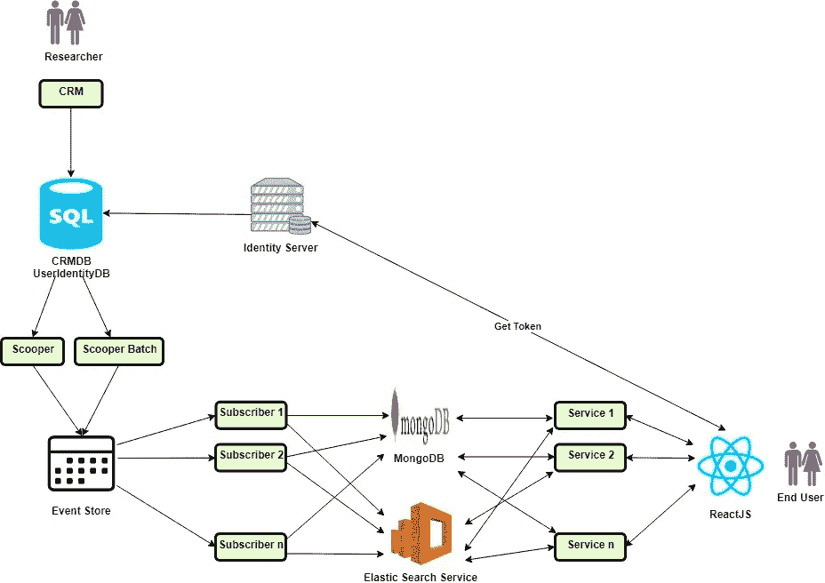

**建筑**

# **组件**

1.CRM——研究人员输入数据。

2.Microsoft SQL Server —两个数据库

a.CRMDB

b.用户标识数据库

3.Scooper —从 CRMDB 获取数据并将其放入事件存储中的组件。

4.订阅者——监听事件存储的组件，它们从事件存储中获取数据并将其推送到 MongoDB 和弹性搜索中。

5.中间层——从 MongoDB 和弹性搜索中提取数据并以 REST APIs 的形式发送到前端的服务。

6.前端——研究人员输入的要显示的数据。

# **架构**

1.研究人员将数据输入客户关系管理系统。

2.因此，数据存储在 Microsoft SQL Server 数据库— CRMDB 中。

3.在步骤 2 中提到的 CRMDB 中创建一个专用表，其中在 CRMDB 的原始模式中输入的数据以事件源的格式存储。

4.Scooper/Batch Scooper 在步骤 3 中从 CRMDB 的专用表中提取数据，并将其推送到事件存储。

5.订阅者从事件存储中获取数据，并将其推送到 MongoDB 和 Elastic Search。

6.另一端是面向服务的架构，其中每个服务从弹性搜索中获取数据，并以 REST APIs 的形式将数据提供给前端。

7.前端是一个单页面应用程序，它使用 REST APIs 发送的数据并呈现页面。

8.有一个专用的身份服务器，它管理用户作为订阅的一部分可以访问的所有应用程序的用户身份。保存与用户身份相关的详细信息的数据库存在于步骤 2 中提到的 Microsoft SQL Server 数据库中。

# **技术堆栈**

1.独家新闻/订户/服务-。网络核心

2.[事件存储](https://eventstore.org/)

3. [MongoDB](https://www.mongodb.com/)

4.[弹性搜索](https://www.elastic.co)

5.[亚马逊弹性搜索服务](https://aws.amazon.com/marketplace/pp/B01N6YCISK?ref=_ptnr_elastic_ggl_ppc_aws&camp=branded-aws-es-us-ggl-bmm&src=adwords&mdm=cpc&trm=%2Belastic%20%2Baws&gclid=EAIaIQobChMI7JDFkOL84QIVzRErCh2o7AveEAAYASAAEgLQ1PD_BwE)

6.[反应堆](https://reactjs.org/)

7.[亚马逊 EC2](https://aws.amazon.com/ec2/)

8.[团队合作](https://www.jetbrains.com/teamcity/)

# **测试环境配置**

我们用于运行性能测试的类似生产环境的配置如下表所示。关于每个实例类型的细节可以在[这里](https://aws.amazon.com/ec2/instance-types/)找到。

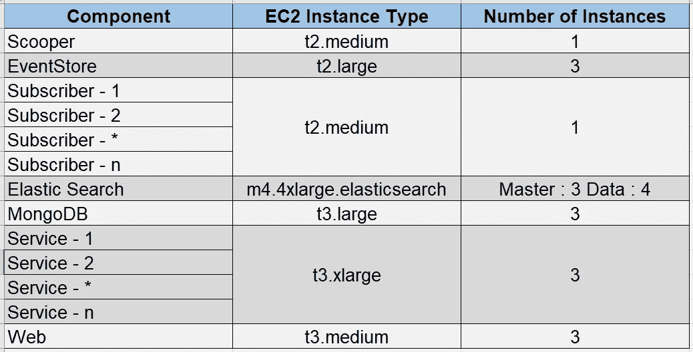

**AWS EC2 实例配置**

# **性能测试工具**

1.  [JMeter](https://jmeter.apache.org/)
2.  [火焰测量器](https://www.blazemeter.com/)
3.  [硒网驱动](https://www.seleniumhq.org)

# **性能测试类型**

1.  **负载测试** —用于验证系统在生产负载期间预期的工作负载/负载量下的性能特征。在向市场发布系统之前进行这种类型的测试可以增强信心，降低因性能问题而失去业务的风险。
2.  **峰值测试** —用于检测系统在很短时间内承受突发负载，快速释放负载时的稳定性。
3.  **耐久性测试** —该测试旨在了解系统在长时间运行后，是否能够处理预期的负载，而不会降低响应时间/吞吐量。在发布到市场之前进行这种类型的测试可以增强对系统可用性和稳定性的信心。
4.  **页面负载测试** —当期望数量的并发用户产生特定数量的负载时，根据最终用户体验计算页面加载时间。

# **策略**

为“n”个并发用户复制负载是首要任务，尤其是在并发用户数量较多的情况下。有两种方法可以实现这一点:

1.  通过自动化的 UI 测试来复制终端用户的行为，这些测试像真实世界的用户一样对应用程序执行操作。使用像 Selenium Web Driver 这样的浏览器自动化库来编写 UI 自动化是一种选择，这反过来会模仿最终用户的行为。这可以是 Selenium 网格设置，它将在多台机器上驱动用户流。
2.  第二种方法是使用 REST APIs 在服务器上为“n-1”个并发用户生成负载。然后只让一个用户执行 UI 测试流，从而计算页面加载时间。

采用这两种方法各有利弊。然而，我们选择了后者。

# **JMeter 测试—REST API**

让我们以特定页面加载时所有 REST API 调用为例，如下图所示。

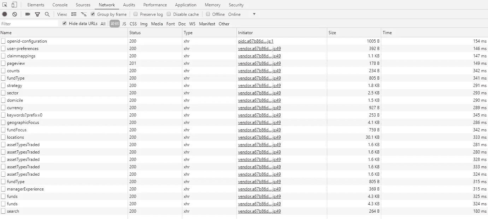

相应页面的 JMeter 脚本将如下面的快照所示。当加载特定页面时，它由所有链接在一起的 REST APIs 组成。

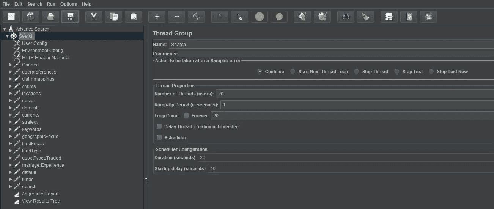

上面快照中的 JMX 文件是对应页面加载的 network 选项卡中每个 API 调用的一对一映射。创建了多个这样的 JMX 文件，这些文件由加载特定页面时链接的 REST APIs 组成。

# **Selenium Web 驱动—页面负载测试**

UI 测试将导航到应用程序中的特定页面；在单击页面之前记下时间戳，然后单击链接，并在页面加载完成时记下时间戳。这个脚本曾经等待整个页面被加载——从左到右，从上到下。

总体性能测试设置如下图所示:

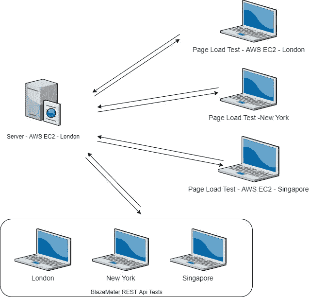

性能测试设置由模拟“n-1”用户行为的 BlazeMeter REST API 测试组成。用户平均分布在伦敦、纽约和新加坡。同时，在相同的三个位置产生了 AWS EC2 实例。在每个 EC2 实例上都执行了 Selenium Web 驱动程序测试，这将有助于计算页面加载时间。Selenium Web 驱动程序测试将执行以下步骤:

1.  启动应用程序 URL 并登录。
2.  导航到要单击的链接所在的页面。
3.  注意时间戳(T1)。
4.  点击链接。
5.  请注意时间戳(T2)。

**实际页面加载时间= T2 — T1。**

# **BlazeMeter 耐力测试**

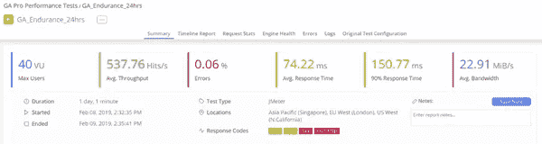

为了跟踪 AWS 基础设施的性能，在 AWS 控制台上记录了以下参数。

# **弹性搜索—集群状态**

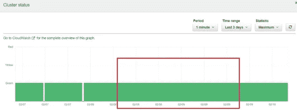

# **弹性搜索—搜索率**

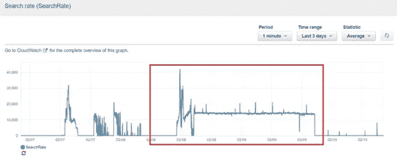

# **弹性搜索—HTTP _ Requests _ By _ Response _ Codes**

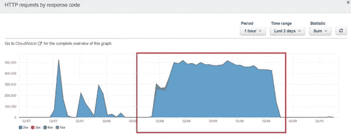

# **弹性搜索—索引延迟**

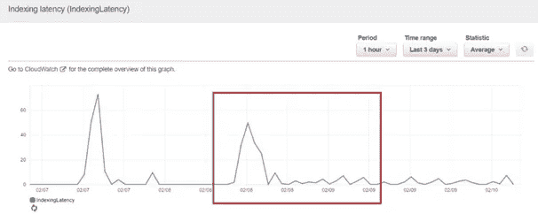

# **弹性搜索—主 CPU 利用率**

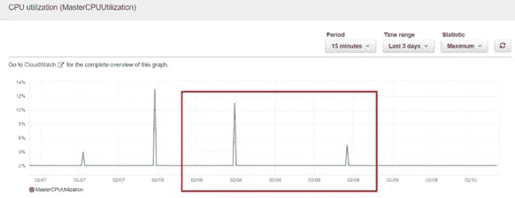

# **弹性搜索—主 JVM 内存压力**

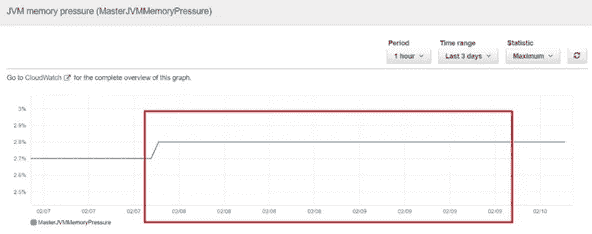

# **弹性搜索—数据最大 CPU 利用率**

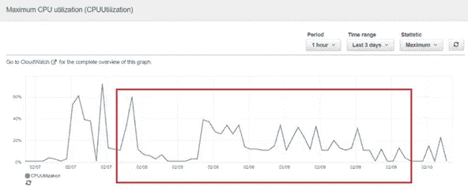

# **弹性搜索—数据最大 JVM 内存压力**

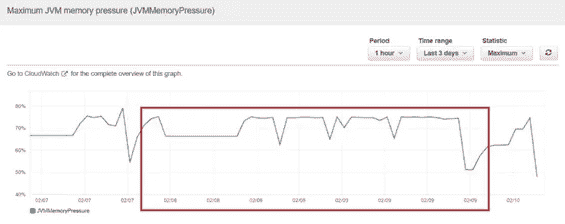

# **MongoDB — CPU 利用率**

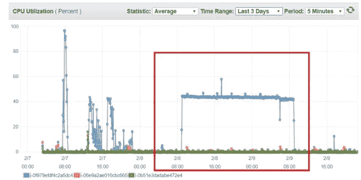

# **公共 API— CPU 利用率**

使用上述设置，我们能够对我们的 AWS 部署进行性能调优，发现性能漏洞，并更好地优化我们的基础设施。