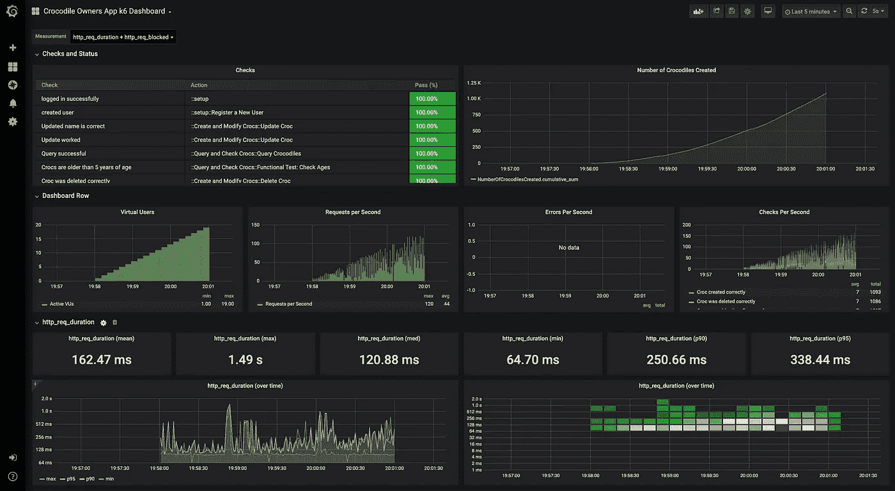
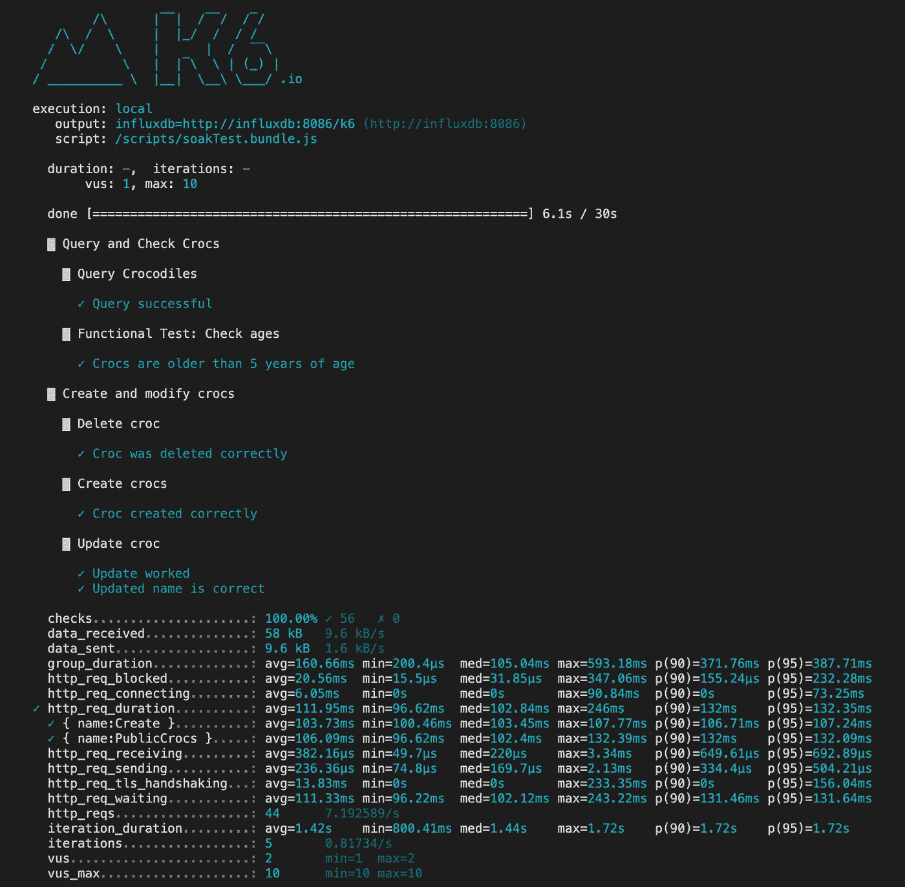
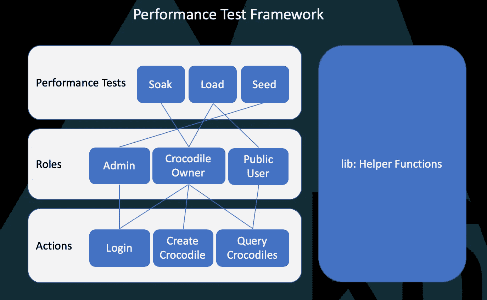

# TypeScript 中的性能测试

> 原文：<https://betterprogramming.pub/performance-testing-in-typescript-5b5444510b83>

## k6 ️loves 打字稿


Max van den Oetelaar 在 [Unsplash](https://unsplash.com/s/photos/calm?utm_source=unsplash&utm_medium=referral&utm_content=creditCopyText) 上拍摄的照片

RIP [JMeter](https://jmeter.apache.org/) 。切换到数千名欢呼庆祝的性能测试工程师。我不知道在性能测试领域还有谁支持它(除非被一个虐待狂经理强迫)。

幸运的是，现在有一系列优秀的开源替代品可供使用。它们都有自己的问题和最终的云托管成本；然而，有一辆车与众不同，因为它实际上是按照性能测试工程师的想法制造的。叫 [k6](https://k6.io/) 。有了它，你可以构建超级快速、超级灵活、用[类型脚本](https://www.typescriptlang.org/)编写的性能测试框架。

**TL；DR:** [k6](https://k6.io/) 和乐高一样，让你随心所欲的创造。它也是合作的，非常有益的，有趣的。我已经创建了一个[示例框架](https://github.com/go-automate/k6-typescript-framework)供您使用。

# 为什么打字稿？

因为性能测试就是要处理大量的测试数据。通常这些数据存储在 JSON 对象中。它是动态的，通过 HTTP 请求和响应来发送和接收。

现在，想象一下，对于这些 [JSON](https://www.w3schools.com/whatis/whatis_json.asp) 对象中的每一个，你都有[类型或接口](https://www.typescriptlang.org/docs/handbook/interfaces.html)。在您的测试框架中解析和处理这些数据不是容易 100 倍吗？如果我告诉你有[工具可以将 Swagger/OpenAPI 文档](https://www.npmjs.com/package/dtsgenerator)转换成这些类型，会怎么样？参数化您的性能测试将是琐碎的，没有压力的。

# 为什么是 k6？

与其他开源性能测试工具相比，使用该工具有很多原因:

1.  [可以用它写剧本](https://docs.k6.io/docs/modules)。每个被测试的应用程序都是独一无二的，所以测试框架也需要如此。
2.  它是[快速轻便](https://k6.io/blog/open-source-load-testing-tool-review)。它最终运行在 Golang 中，Golang 快速、稳定，并且是为并发性而设计的。它非常适合运行大量 vu，而不必选择昂贵的云选项。
3.  它与您的 [CI/CD 渠道](https://k6.io/blog/load-testing-using-github-actions)完美结合，使趋势分析变得容易。
4.  它插入到流行的[开源监控应用](https://docs.k6.io/docs/results-output)，比如 [InfluxDB 和 Grafana](https://k6.io/blog/k6-loves-grafana) 。
5.  它有一些我见过的最好的文档和支持。

但最终 k6 是一个工具包。与其他任何性能测试工具不同，定制的[度量](https://k6.io/docs/using-k6/metrics)、[标记](https://k6.io/docs/using-k6/tags-and-groups)、[检查](https://k6.io/docs/using-k6/checks)和[阈值](https://k6.io/docs/using-k6/thresholds)允许您以令人兴奋的细节监控应用程序状态。

在我的示例框架中，我监控在任一点有多少鳄鱼被创建，但这只是冰山一角。

您想知道当系统开始出现性能问题时，系统中有多少资产吗？或者有多少用户在执行特定的操作？发生了多少次上传？有多少人登录或退出？或者更多更多的东西？一切皆有可能。

学习 [InfluxDB](https://grafana.com/docs/grafana/latest/features/panels/panels/) 查询和 [Grafana 仪表板，](https://grafana.com/docs/grafana/latest/features/panels/panels/)您将拥有一个性能测试环境，看起来像是专门为您的应用程序构建的。



为您的应用量身定制的指标、检查和阈值

# 然而…

目前不支持 [socket.io](https://socket.io/) 。因此，如果您的测试应用程序正在使用这种技术，它可能值得到别处看看。它也在快速发展，所以有很多有用的功能正在开发中，包括[集群](https://docs.k6.io/docs/cloud-execution)执行模式。

k6 是如此的轻便，我们到目前为止还不需要它，但它确实感觉像是一个面向未来的必备产品。

# 入门指南

闲话少说——让我们做一些性能测试。为了帮助你开始，我用 k6 和 TypeScript 组装了一个[性能测试框架](https://github.com/go-automate/k6-typescript-framework)。让我们克隆回购，然后开始。

**注意:**大部分东西应该在 Windows 和 Linux(或者 Mac)上都可以用；不过，我会指出不同之处。

# 测试网站

我们将使用 [loadimpact 测试 API](https://test-api.loadimpact.com/) 作为我们将要测试的网站。这是一个虚拟的应用程序/API，供想要跟踪鳄鱼的鳄鱼主人使用。在测试中，我们将创建一个用户；查询一些鳄鱼；创建、更新和删除鳄鱼。


照片由 [Pixabay](https://www.pexels.com/@pixabay?utm_content=attributionCopyText&utm_medium=referral&utm_source=pexels) 从[像素](https://www.pexels.com/photo/amphibian-animal-close-up-color-207001/?utm_content=attributionCopyText&utm_medium=referral&utm_source=pexels)拍摄

# **依赖关系**

你需要在你的机器上安装 [k6](https://docs.k6.io/docs/installation) ，理想情况下 [Docker](https://www.docker.com/products/docker-desktop) 和 [Docker 组成](https://docs.docker.com/compose/install/)。以及[节点](https://nodejs.org/en/)，Y [arn](https://classic.yarnpkg.com/en/) ，和一个 [IDE，](https://code.visualstudio.com/)如果你还没有的话。

# 克隆和运行测试

使用以下命令克隆示例框架:

```
git clone [https://github.com/go-automate/k6-typescript-framework.git](https://github.com/go-automate/k6-typescript-framework.git)
```

然后，在您喜欢的 IDE 中打开框架，并通过运行以下命令安装所有框架依赖项:

```
yarn install
```

现在运行以下命令来运行您的第一个测试:

```
yarn go:k6
```

输出应该如下所示:



k6 的样本输出

一切都应该过去(除非你的网速很慢)。有关该输出的更多信息，请参见 [k6 文档](https://docs.k6.io/docs/results-output)。

要在打开监控的情况下运行脚本，首先启动 InfluxDB 和 Grafana Dockers:

```
yarn monitors
```

**注意:**如果你运行的是 Windows，你必须使用`[docker-compose.yaml](https://github.com/go-automate/k6-typescript-framework/blob/master/docker-compose.yml)`文件的`volumes`部分的完整路径，并实现一些变通方法。更多细节参见 [k6 文档](https://docs.k6.io/docs/docker-on-windows)。

在你的浏览器中进入`[localhost:3000](http://localhost:3000/)`，用用户名`admin`和密码`admin`登录 Grafana。

通过[按照这些说明](https://grafana.com/docs/grafana/latest/reference/export_import/)将 [k6 仪表板](https://grafana.com/grafana/dashboards/11837)添加到 Grafana，以导入仪表板(请注意:创建自己的仪表板比使用标准仪表板好得多)。

现在，使用以下命令运行测试:

```
yarn go:docker
```

看看 Grafana 中的输出(见下文)。


Grafana 的示例输出

这只是 k6 所能做到的冰山一角。在资源库的`[README.md](https://github.com/go-automate/k6-typescript-framework)`和 [k6 官方文档](https://docs.k6.io/docs)中有更多的信息。

最后，[示例 TypeScript k6 框架](https://github.com/go-automate/k6-typescript-framework)包含了很多内容，包括厨房水槽，所以我建议首先使用[官方 k6 文档](https://k6.io/docs/getting-started/running-k6)和[这个示例](https://test-api.loadimpact.com/)用 JavaScript 构建一个简单的框架。这将有助于你了解 k6 到底是如何工作的。然后返回到本文和 Git 资源库。

我希望这有所帮助——祝性能测试愉快！

另外，我忘了提到模块化的 k6 框架，它允许大量的代码重用——你可以从下面的架构图中看到(摘自 [TypeScript 示例](https://github.com/go-automate/k6-typescript-framework))。



示例性能测试框架的模块化高级架构图