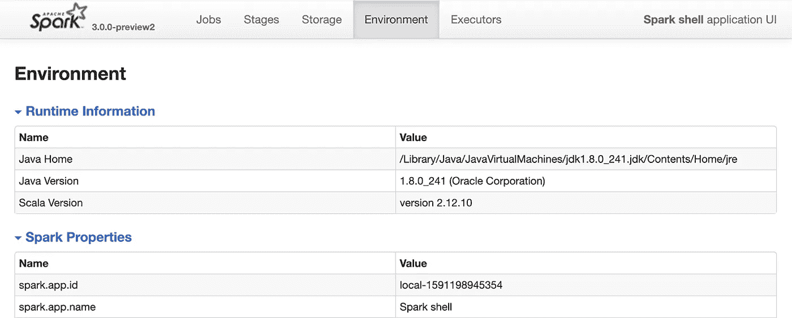
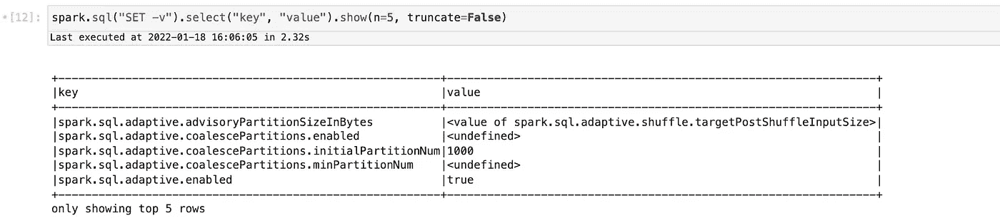
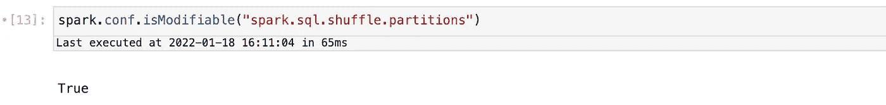
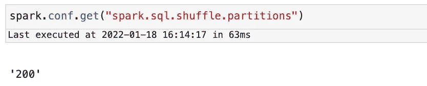
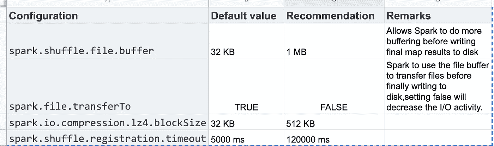

# AWS EMR Spark 作业的性能调整和实际操作演示

> 原文：<https://betterprogramming.pub/performance-tuning-of-aws-emr-spark-job-with-hands-on-demo-48469e139826>

## 当我们需要优化我们的 spark 工作时，我们经常会遇到这样的情况，这篇文章通过实际操作的例子深入探讨了细节


作者图片

# 我们将学到什么:

火花优化通过:

1.  识别和设置正确的 Apache Spark 配置
2.  执行人编号
3.  贮藏
4.  优化连接
5.  减少工作和阶段的数量

# 先决条件:

在 EMR 上设置一个快速笔记本。如果你不确定如何做，请点击下面的链接。

[](https://medium.com/@sumoaps/setup-jupyter-notebook-with-emr-to-run-spark-job-in-5-minutes-21c23de4fdf3) [## 用 EMR 设置 Jupyter 笔记本，在 5 分钟内运行 spark 作业

### 我们经常喜欢使用 spark 进行临时数据分析。本教程指导我们快速入门 Jupyter…

medium.com](https://medium.com/@sumoaps/setup-jupyter-notebook-with-emr-to-run-spark-job-in-5-minutes-21c23de4fdf3) 

# 查看和设置 Apache Spark 配置

让我们先看看如何设置查找，然后优化改变火花配置。了解如何找到 spark 作业的配置、理解它们并更改它们以实现最佳性能非常重要。

## 获取配置

我们可以通过 Spark UI 的环境选项卡访问 Spark 的当前配置:



您还可以只查看 Spark SQL 特定的 Spark 配置:

```
// In Scala
spark.sql("SET -v").select("key", "value").show(5, false)# In Python
spark.sql("SET -v").select("key", "value").show(n=5, truncate=False)
```

在我们的笔记本中，输出如下所示



> 若要以编程方式设置或修改现有配置，请首先检查属性是否可修改。`spark.conf.isModifiable("*<config_name>*")`将返回`true`或`false`

让我们试试我们的笔记本:



我们也可以通过 spark.conf.get(" <<configuration>> ")获得一个 conf。让我们在笔记本上找到随机分区</configuration>



## 要设置配置

设置配置最常见的方式是在 Spark 应用程序中直接指定 Spark 配置，或者在使用`spark-submit`提交应用程序时在命令行上指定，使用`--conf`标志:

```
spark-submit --conf spark.sql.shuffle.partitions=5 --conf
"spark.executor.memory=2g" --class com.spark.SparkConfig jars/my_spark.jar
```

另一种方法是在应用程序本身中指定。下面是一个代码示例:

注意:我们已经在笔记本电脑中开展了 spark 会议。以下代码更适合独立的 spark 应用程序

```
// In Scala

 val spark = SparkSession.builder
   .config("spark.sql.shuffle.partitions", 5)
   .config("spark.executor.memory", "2g")
   .master("local[*]")
   .appName("SparkConfig")
   .getOrCreate() 
```

## 好了，让我们来看看我们应该注意的配置:

## 动态资源分配

当我们将计算资源指定为`spark-submit`的命令行参数时，正如我们之前所做的，我们设置了上限。这意味着，如果由于工作负载超出预期，任务在驱动程序中排队时需要更多的资源，Spark 将无法容纳或分配额外的资源。

相反，如果您使用 Spark 的动态资源分配配置，Spark 驱动程序可以随着大型工作负载需求的增减而请求更多或更少的计算资源。在工作负载是动态的情况下，也就是说，它们对计算能力的需求是变化的，使用动态分配有助于适应突然出现的峰值。

这可能有所帮助的一个用例是流，其中数据流量可能不均匀。另一个是按需数据分析，在这种情况下，您可能会在高峰时段有大量的 SQL 查询

要启用和配置动态分配，我们可以使用如下设置。

注意:这里的数字是任意的；适当的设置将取决于您的工作负载的性质，并且应该相应地进行调整。

```
spark.dynamicAllocation.enabled true
spark.dynamicAllocation.minExecutors 2
spark.dynamicAllocation.schedulerBacklogTimeout 1m
spark.dynamicAllocation.maxExecutors 20
spark.dynamicAllocation.executorIdleTimeout 2min
```

默认情况下`spark.dynamicAllocation.enabled`被设置为`false`

## 配置 Spark 执行器的内存和 shuffle 服务

每个执行器可用的内存量由`spark.executor.memory`控制。这分为三个部分:执行内存、存储内存和保留内存。

> 默认的 spark 内存划分是 60%用于执行内存，40%用于存储，并预留了 300 MB 的保留内存，以防止 OOM 错误。

在 map 和 shuffle 操作期间，Spark 写入和读取本地磁盘的 shuffle 文件，因此存在大量 I/O 活动。这可能会导致瓶颈，因为默认配置对于大规模 Spark 作业来说不是最佳的。在 Spark 工作的这个阶段，知道调整什么配置可以减轻这种风险。



Apache spark 的推荐设置

[电子表格链接](https://docs.google.com/spreadsheets/d/1BymTmfhUK8zAlP8KEiNK0PMu3LwLBxSUMSiHxuB_uVM/edit?usp=sharing)

# 有多少遗嘱执行人

这是一个很普通却很重要的问题。

Spark 在并行处理任务方面非常高效。对于大规模工作负载，Spark 作业将有许多阶段，并且在每个阶段中，将有许多任务。Spark 最多为每个内核的每个任务调度一个线程，每个任务处理一个不同的分区。

> 为了优化资源利用和最大化并行性，理想的情况是至少要有与执行器上的内核一样多的分区。
> 
> 如果每个执行器上的分区数量多于核心数量，那么所有的核心都会保持忙碌状态。您可以将分区视为并行性的原子单位:在单个内核上运行的单个线程可以在单个分区上工作。

# 缓存怎么样

## 何时缓存

缓存的常见用例是您希望重复访问大型数据集以进行查询或转换的场景。一些例子包括:

*   迭代机器学习训练中常用的数据帧
*   在 ETL 或构建数据管道期间，经常访问数据帧以进行频繁转换

## 何时不缓存:

*   数据帧 ***太大，无法在内存中容纳***
*   一种不需要频繁使用的廉价的数据帧变换，无论大小如何

# 优化连接

连接操作是大数据分析中一种常见的转换类型，在这种转换中，表或数据帧形式的两个数据集通过一个通用匹配键进行合并。与关系数据库类似，Spark DataFrame 和 Dataset APIs 以及 Spark SQL 提供了一系列连接转换:内部连接、外部连接、左连接、右连接等。所有这些操作都会触发 Spark 执行器之间的大量数据移动。

Spark 有五种不同的连接策略，通过这五种策略，它可以跨执行器交换*、*移动、排序、分组和合并数据:

广播散列连接(BHJ)、混洗散列连接(SHJ)、混洗排序合并连接(SMJ)、广播嵌套循环连接(BNLJ)以及混洗复制嵌套循环

## 使用广播散列连接优化查询:

> 当两个数据集，一个很小(适合驱动程序和执行程序的内存)，另一个足够大，理想情况下不会移动，需要在某些条件或列上连接时，使用广播散列连接。使用 Spark 广播变量，较小的数据集由驱动程序广播给所有 Spark 执行器，然后在每个执行器上与较大的数据集合并。这种策略避免了大量的交换。

默认情况下，如果较小的数据集小于 10 MB，Spark 将使用广播连接。该配置在`spark.sql.autoBroadcastJoinThreshold.`中设置

```
// In Scala 
import org.apache.spark.sql.functions.broadcast
val joinedDF = playersDF.join(broadcast(clubsDF), "key1 === key2")
```

BHJ 是 Spark 提供的最简单、最快速的连接，因为它不涉及数据集的任何洗牌；在广播之后，所有的数据都可以在本地提供给执行者。您只需要确保在 Spark 驱动程序和执行程序端都有足够的内存来保存较小的数据集。

在下列情况下使用这种类型的连接可以获得最大的好处:

*   当较小和较大数据集中的每个键被 Spark 散列到 ***的相同分区*** 时
*   当一个数据集 ***比另一个数据集*** 小得多时(在默认配置 10 MB 内，如果有足够的内存，也可以更大)

## 优化无序排序合并连接

> 排序-合并算法是一种有效的方法，可以通过一个可排序的、唯一的、可以分配或存储在同一分区中的公共键来合并两个大型数据集，也就是说，两个具有公共哈希键的数据集最终位于同一分区中。

从 Spark 的角度来看，这意味着每个数据集内具有相同键的所有行都在同一执行器的同一分区上进行散列。显然，这意味着数据必须 ***在同一地点*** 或在执行者之间交换。

顾名思义，这个连接方案有两个阶段:排序阶段和合并阶段。排序阶段根据所需的连接键对每个数据集进行排序；合并阶段遍历每个数据集的行中的每个键，如果两个键匹配，就合并这些行。

在下列情况下使用这种类型的连接可以获得最大的好处:

*   当两个大型数据集中的每个键都可以通过 Spark 排序和散列到同一个分区时
*   当您希望只执行等价连接来根据匹配的排序键组合两个数据集时

# 减少工作和阶段的数量

我们应该尽量减少应用程序使用的作业和阶段的数量。

让我们用一个例子来学习:思考一下

```
spark.read.parquet("abc.parquet").show()
```

和

```
spark.read.schema(StructType(List(StructField("id",IntType,false)))).parquet("abc.parquet")
```

我们来看看两者对应的 spark UI:

首先:


第二:


所以，你现在已经得到了答案，但只是重申:

> 总是在创建数据帧时提供模式，如果您不提供，spark 必须运行一个额外的作业来获取模式，如果数据集很大，性能会非常下降

# **结论**

因此，我们研究了可能的优化和推理。请在评论中告诉我你的反馈。

参考:

[](https://spark.apache.org/docs/latest/sql-performance-tuning.html) [## 性能调整

### 对于某些工作负载，可以通过在内存中缓存数据或打开某些…

spark.apache.org](https://spark.apache.org/docs/latest/sql-performance-tuning.html) [](https://spark.apache.org/) [## Apache Spark 用于大规模数据分析的统一引擎

### Apache Spark 是一个多语言引擎，用于执行数据工程、数据科学和机器学习

spark.apache.org](https://spark.apache.org/)